---
workflow:
  name: ChatGPT-Web-Course-Note-Workflow
  version: v4.9.4
course:
  name: "CS336: Language Modeling from Scratch"
  term: "Spring 2026"
  instructors:
    - Tatsunori Hashimoto
    - Percy Liang
chapter:
  local_chapter: P01
  official_unit: Lecture 1
  official_title: "Overview, tokenization"
  date: "2026-03-30"
  lecturer: "Percy Liang"
provenance:
  lecture_video_term: "Spring 2026"
  lecture_materials_term: "Spring 2026"
---

# Lecture 1 — Overview, tokenization

本讲既是 CS336 Spring 2026 的课程导论，也是第一单元 tokenization 的开端。Percy Liang 先解释这门课为什么强调 **from scratch**：语言模型研究越来越依赖高层 API，而底层训练、系统和数据决策仍会直接限制基础研究。随后他用整门课的五个 assignment 勾勒路线图，最后从 Unicode、byte、word tokenizer 一路推到 Byte Pair Encoding（BPE），并把 BPE 的实现性能问题直接连接到 Assignment 1。

## 1. 课程身份与本讲范围

- 本地章节：`P01`
- 官方映射：Spring 2026 **Lecture 1**
- 官方标题：**Overview, tokenization**
- 日期：2026-03-30
- 主讲：Percy Liang
- 同版本 executable lecture：`stanford-cs336/lectures/lecture_01.py`
- 本讲与 Assignment 1 直接关联：课程 Schedule 将 Assignment 1 标记为本日发布，`lecture_01.py` 也明确列出其 tokenizer、Transformer、optimizer、training loop 与 resource accounting 任务。

本地视频约 79 分 25 秒。前约 65 分钟主要完成课程动机、历史背景、作业与五个单元的路线图；约 `01:05:21` 起进入本讲真正的 tokenizer 深入内容。下一讲开始 resource accounting。

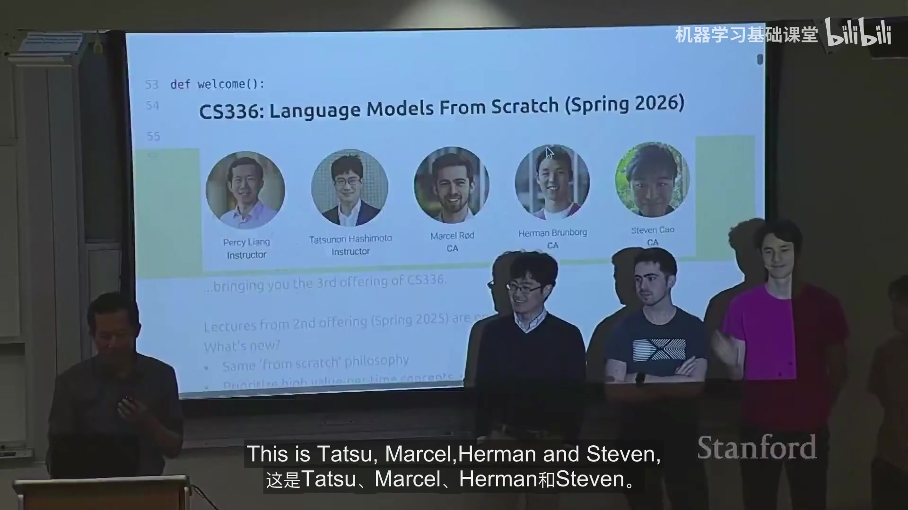

## 2. 为什么要“从头构建”语言模型

### 2.1 抽象层不断升高，但抽象是会漏的

Percy 用研究工作方式的变化解释课程动机：早期研究者往往亲自实现和训练模型；之后越来越多地下载 BERT 一类模型做 fine-tuning；今天则经常直接 prompt GPT、Claude、Gemini 一类 API 模型。更高层抽象显著提高生产力，但语言模型栈的抽象并不像成熟编程语言或操作系统那样可靠地屏蔽底层细节。

课程的核心方法因此是 **understanding via building**：亲自实现 tokenizer、Transformer、训练循环、GPU kernel、并行训练、数据管线和对齐算法，并从真实工程约束中建立可迁移的理解。

### 2.2 语言模型的“工业化”造成两个困难

一是 frontier model 的训练资源已经远超课堂环境。讲义引用的例子包括：GPT-4 的训练成本被报道为约 1 亿美元；xAI 在 2025 年建设了约 23 万 GPU 的训练集群。二是 frontier model 的实现细节并不完全公开，因此不能简单复制一个前沿系统来学习。

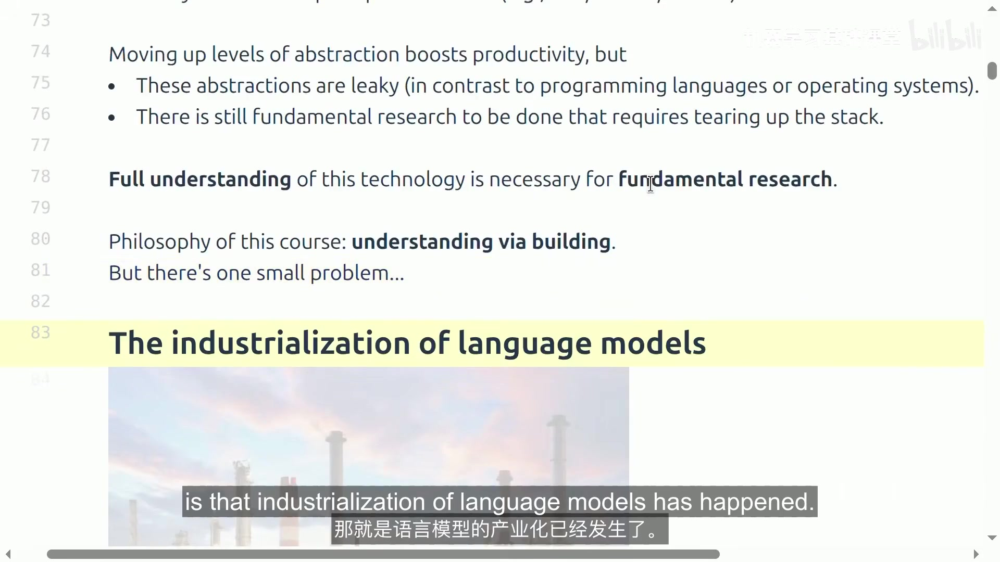

只训练小模型也有风险：某些系统比例会随规模改变，某些能力也可能只在更大规模出现。课程用 attention 与 MLP 的 FLOPs 占比变化，以及随 scale 出现的行为变化作为例子。

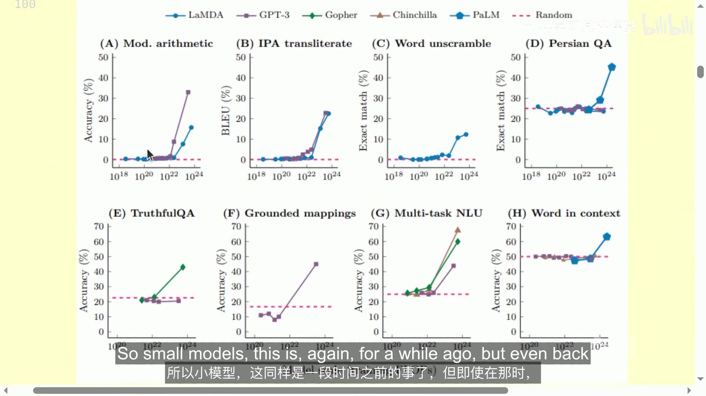

### 2.3 哪些知识更可能跨规模迁移

课程把可学习内容分为三类：

1. **Mechanics**：组件如何工作，例如 Transformer、model parallelism。
2. **Mindset**：如何充分利用硬件，如何严肃对待 scaling 和资源预算。
3. **Intuitions**：哪些数据与建模选择会带来更好的准确率。

前两类更容易迁移到 frontier scale；第三类往往受规模和实验条件影响，不能把小模型经验机械外推到大模型。

### 2.4 Bitter lesson 的课程解释：规模必须与算法效率结合

Percy 明确反对“只要 scale，算法不重要”的解读。他给出的框架是：

$$
\text{accuracy} = \text{efficiency} \times \text{resources}
$$

资源越昂贵，低效率决策的代价越高。讲义还引用 ImageNet 2012–2019 期间约 **44× algorithmic efficiency** 的结果，强调算法进步可以把同样资源转化为更高能力。因此课程始终围绕一个问题组织：**在固定 compute 与 data budget 下，如何得到尽可能好的模型？**

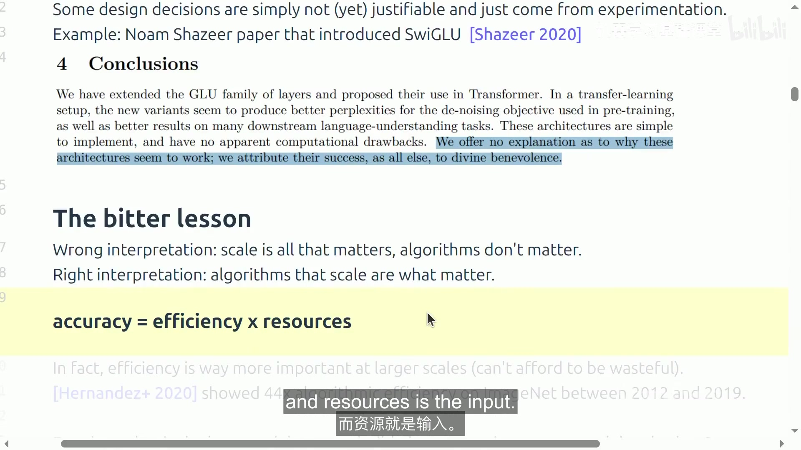

## 3. 语言模型技术栈的历史压缩图

本讲没有逐篇讲论文，而是用一条时间线说明今天的系统来自哪些累积组件。

### 3.1 Pre-neural 与 neural ingredients

Pre-neural 阶段包括 Shannon 对英语熵的研究和 n-gram language model。2010 年代逐渐形成神经语言模型的关键组件：LSTM、早期 neural LM、sequence-to-sequence、Adam、attention、Transformer、mixture of experts，以及后来的 model parallelism。

### 3.2 Foundation model 与 scaling

课程随后串起 ELMo、BERT、T5，再进入 GPT-2、scaling laws、GPT-3、PaLM 与 Chinchilla。这里的主线不是模型名称本身，而是三件事：预训练成为通用底座、scale 开始可预测、compute-optimal 训练逐渐成为一等设计问题。

### 3.3 Open models 让“从头理解”重新可行

讲义把开放生态分成早期 GPT-3 replication、credible open-weight models，以及开放程度更高的 open-source model 项目。列举的系列包括 Llama、Mistral、DeepSeek、Qwen、Kimi、GLM、MiniMax、MIMO，以及 OLMo、Nemotron、Marin 等。课程的判断是：开放模型提供了足够多可研究的技术细节，使 CS336 能够围绕真实现代 LM 组件教学。

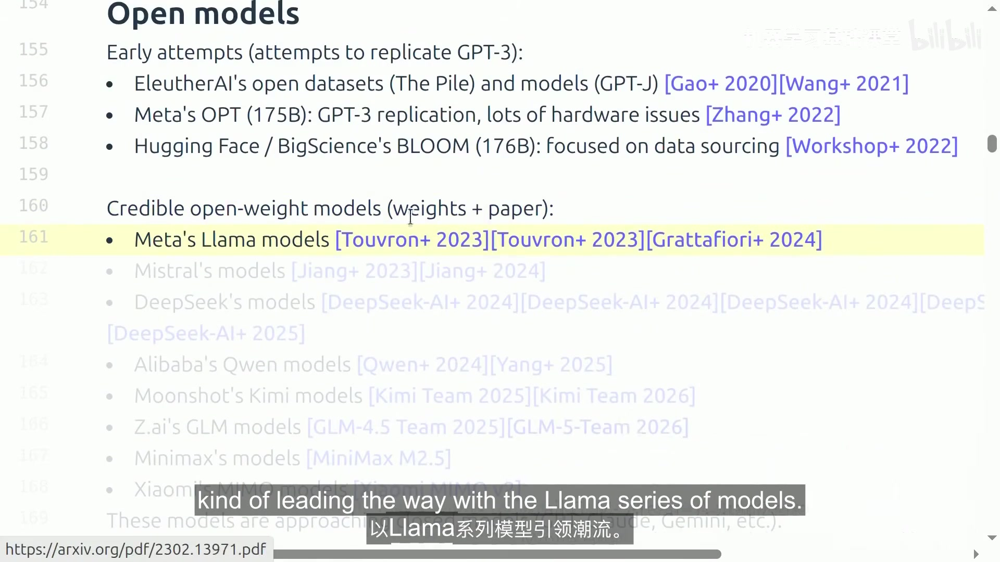

“language model”这个词的使用方式也在变化：2018 年更像是一个要 fine-tune 的模型；2020 年变成可以 prompt 的模型；2022 年变成可以对话的模型；到 2026 年，agent 又把它扩展为可以自主采取行动的系统。底层 fundamentals 仍是 attention、kernels、optimization 等，但规格已经变化，例如 context 更长、inference efficiency 更重要。

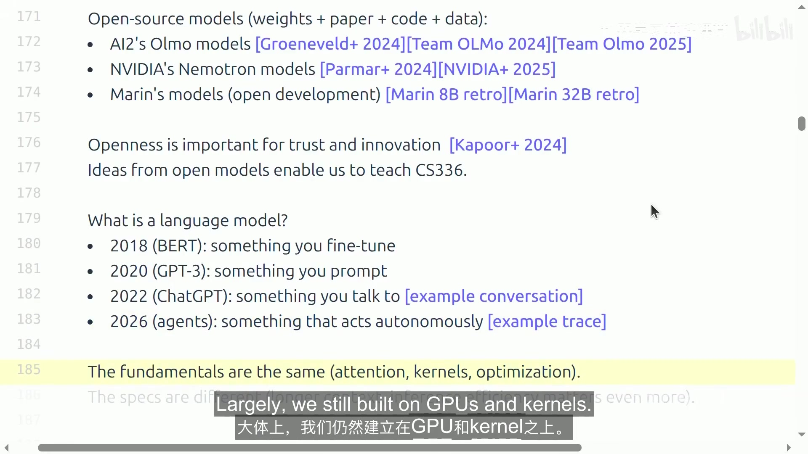

## 4. Executable lecture 与课程 logistics

Spring 2026 Lecture 1 本身就是一个 Python program。`lecture_01.py` 的执行过程产生文字、图片、代码和 inspectable state；这让“课件”和“可运行代码”合为一体。讲师可以在课堂中直接展开变量、单步运行 tokenizer/BPE，并把课程结构映射到函数调用。

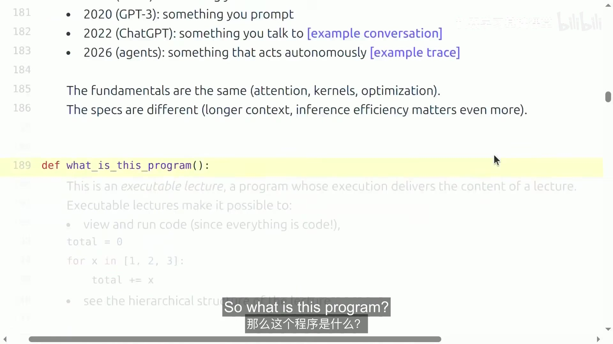

课程是 5-unit class，工作量很高。对校外学习者最重要的信息是：lecture materials 与 assignments 会公开，录像也会发布，因此课程可以自学。

### 4.1 Assignment 的共同形式

共有五个 assignment：

1. **Basics**：tokenization、model architecture、training。
2. **Systems**：kernels、parallelism、inference。
3. **Scaling laws**。
4. **Data**：evaluation、curation、transformation、filtering、deduplication、mixing。
5. **Alignment**：RLHF、RL algorithms、RL systems。

作业没有传统的完整 scaffolding code，但提供 unit tests 与 adapter interfaces。推荐先在本地调 correctness，再到集群做训练或 benchmark。部分任务有 leaderboard，目标不是单纯“能跑”，而是在资源预算内优化 accuracy 或 speed。

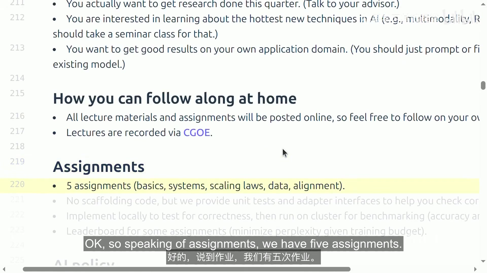

### 4.2 AI policy 与 compute

课堂强调：coding agent 已经可能完成这些作业，但把实现直接交给 agent 会削弱学习效果；课程提供 `AGENTS.md`，要求 AI 采用 pedagogical mode。计算资源由 Modal 支持，课程另有 compute 使用指南。

## 5. 五个单元的路线图：为什么整门课都在讨论 efficiency

讲义把资源写成 **data + hardware**，其中 hardware 进一步受 compute、memory 和 communication bandwidth 限制。当前许多设计首先是 compute-constrained，因此课程反复从 efficiency 视角解释技术选择。

### 5.1 Basics / Assignment 1

目标是训练一个基本语言模型，包含三块：tokenization、model architecture、training。

#### Tokenization

Tokenizer 在 raw bytes 与 integer token sequence 之间转换。高层动机是把输入压缩成更有用的 chunk：讲义给出一个数量级直觉，约 `1000 bytes -> ~250 tokens`。这可以缩短 context，也是一种 adaptive computation——把更多建模容量用在信息更丰富的 chunk 上。

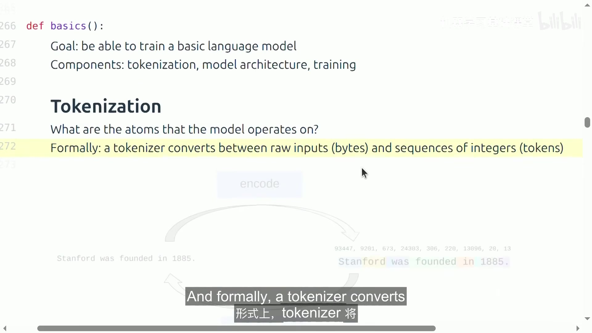

课程也提到 tokenizer-free 路线，例如直接在 bytes 上建模。这些方法很有前景，但按本讲的判断，还没有扩展到 frontier model 的主流规模。

#### Model architecture

起点是原始 Transformer，然后逐步关注 activation、position encoding、normalization、attention variants、state-space/linear-attention、dense/MoE MLP，以及 hidden size、depth、heads、experts 等 shape decisions。许多变化都可以重新解释为 memory/FLOPs/throughput 的折中。

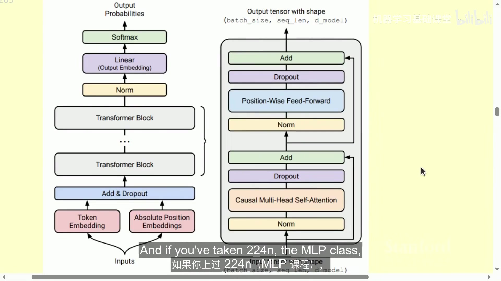

#### Training

训练部分包括 loss、optimizer、initialization、learning-rate schedule、regularization、batch size，以及 MoE load balancing 等。Assignment 1 要求实现：

- BPE tokenizer；
- Transformer；
- cross-entropy loss；
- AdamW optimizer；
- training loop；
- resource accounting；
- 在 TinyStories 与 OpenWebText 上训练；
- leaderboard 目标：在 **B200 上 45 分钟**的预算内尽量降低 OpenWebText perplexity。

讲义把基本模型设计归结为三项同时平衡：**expressivity、stability、efficiency**。

### 5.2 Systems / Assignment 2

目标是尽可能提高 GPU/TPU 的利用效率，包括 resource accounting、kernels、parallelism、inference。

一个示例计算是：训练 `70B` 参数、`1T` tokens 的模型，按近似 $6ND$ 计需要约 $4.2\times10^{23}$ FLOPs。讲义还以 B200 为例给出约 **2.25 PFLOP/s（bf16）** 与 **8 TB/s memory bandwidth**，引出 roofline analysis：判断 workload 是 compute-bound 还是 memory-bound。

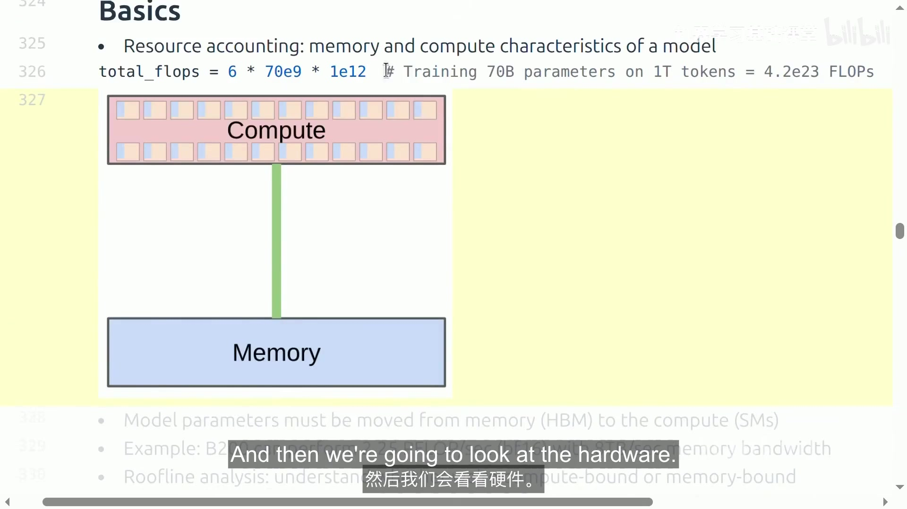

这一单元后续会深入 GPU kernel、PyTorch primitive 对 kernel launch 的映射、distributed parallelism，以及 inference 时 latency/throughput、KV cache、test-time compute 等问题。本讲只做路线图，不把这些预告当成本讲已经完整展开的知识。

### 5.3 Scaling laws / Assignment 3

核心问题是用小规模实验预测大规模训练结果。作业会提供类似“hyperparameters -> loss”的训练 API，让学生在 FLOPs budget 内提交训练 job、收集数据点、拟合 scaling law，再外推更大预算下的超参数与 loss。

讲师同时提醒：scaling law 是经验规律，不是自然定律；它们的价值来自可预测性和资源规划，而不是保证任意尺度都严格服从同一个公式。

### 5.4 Data / Assignment 4

Data 单元先问“希望模型具备什么能力”，再分别处理：

- **Evaluation**：内部评估用于平滑地指导开发，外部评估需要关注真实 use case 的 ecological validity；例子包括 perplexity、GPQA、HLE、SWE-Bench、Terminal-Bench。
- **Data sources**：网页、书籍、arXiv、GitHub code 等；原始输入往往是 HTML、PDF 或目录，不是干净文本。
- **Processing**：transformation、quality/harm filtering、deduplication、mixing、rewriting/synthetic data。
- **Dataset stages**：pretraining data 要大而多样；mid-training 更强调高质量和 long-context；post-training 包含 conversation、agentic traces 与 tool calling 等监督数据。

Assignment 4 会涉及 Common Crawl HTML 提取、质量/有害内容分类、MinHash deduplication，并在 token budget 下以 perplexity 做 leaderboard 指标。

### 5.5 Alignment / Assignment 5

当模型已经能进行 next-token prediction 后，可以利用 weak supervision 继续改进，因为很多任务“评价一个答案”比“从零生成一个好答案”容易。讲义给出统一模板：

1. 从模型生成多个 response；
2. 用 human、verifier 或 LM judge 打分；
3. 更新模型，使其偏好更高分 response。

随后点名 PPO、DPO、GRPO，并强调大规模 RL 的困难不仅是算法稳定性，还包括 async rollout 等基础设施，以及 systems efficiency 与 on-policyness 的持续折中。

## 6. Tokenization：从字符串到模型可处理的 token

约 `01:05:21`，课程正式进入第一个技术单元。

### 6.1 Tokenizer 的接口

原始文本通常表示为 Unicode string，而语言模型对 token sequence 上的概率分布建模，token 通常用整数 index 表示。因此 tokenizer 至少需要两个方向：

```text
encode: string -> list[int]
decode: list[int] -> string
```

最基本的正确性条件是 round trip：

```text
decode(encode(x)) == x
```

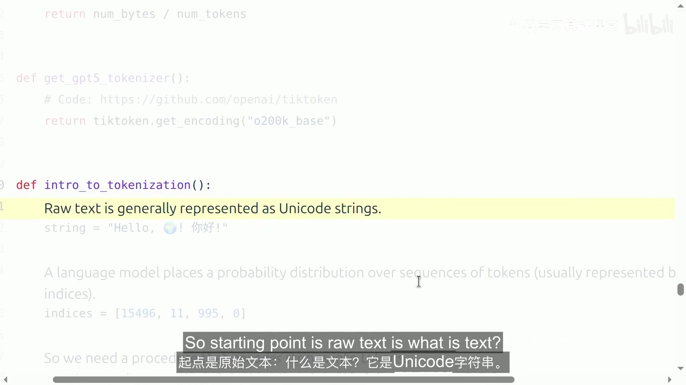

课程用字符串 `Hello, 🌍! 你好!` 演示现代 tokenizer。GPT-5 tokenizer 使用 `tiktoken` 的 `o200k_base` encoding；课堂实际演示中，该字符串有 **20 UTF-8 bytes、8 tokens**，所以 compression ratio 为：

$$
\text{compression ratio} = \frac{\text{number of UTF-8 bytes}}{\text{number of tokens}} = \frac{20}{8} = 2.5
$$

compression ratio 越高，token sequence 越短；这对标准 attention 尤其重要，因为其序列长度相关计算是二次的。但简单扩大 vocabulary 也会带来 sparsity，因此不能只追求更大的 ratio。讲师提到现代多语言 tokenizer 常见 vocabulary 大约在 100K–200K tokens 量级。

### 6.2 现代 tokenizer 的几个“不直观”现象

课堂从交互 tokenizer 观察到：

- 单词和它前面的空格经常属于同一个 token，例如 `" world"`；
- 同一个表面单词出现在字符串开头和中间时，可能得到完全不同的 index；
- 数字可能按若干位一组切分，不同 tokenizer 的规则也不同。

这些现象说明 tokenizer 是一种工程化编码，不等同于人类直觉中的“词”。

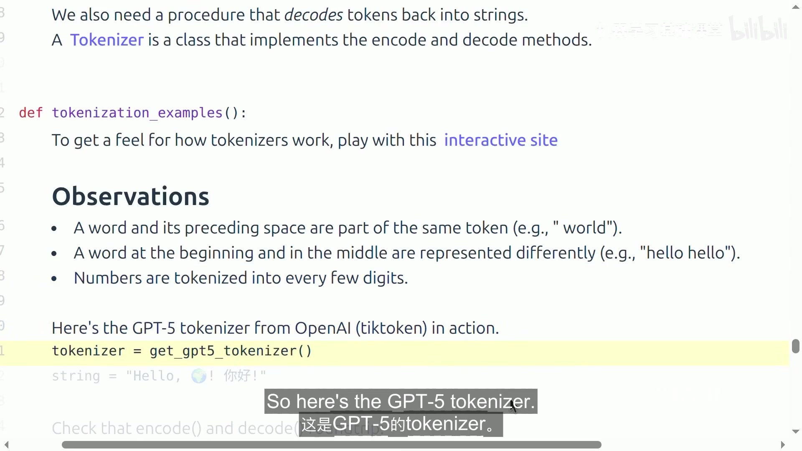

## 7. 三个朴素方案为什么都不理想

### 7.1 Character tokenizer

最直接的方法是把每个 Unicode character 通过 Python `ord` 映射到 code point，再用 `chr` 反向恢复。它天然可 round-trip，但有两个主要问题：

- Unicode character 约有 **150K**，vocabulary 很大；
- 很多字符极少出现，浪费 vocabulary capacity，同时 compression ratio 仍不理想。

因此它同时承受“大词表”和“序列仍然偏长”两种代价。

### 7.2 Byte tokenizer

UTF-8 把 Unicode string 表示成 byte sequence，每个 byte 只需要 `0..255`，所以 vocabulary 固定为 **256**。例如 ASCII `a` 只占一个 byte，而 `🌍` 需要多个 UTF-8 bytes。

好处是词表极小、任意字符串都可编码；问题是 compression ratio 恰好为 **1 byte/token**，序列非常长。对 context length 有限且 attention 代价随长度快速增长的 Transformer 来说，这个表示过细。

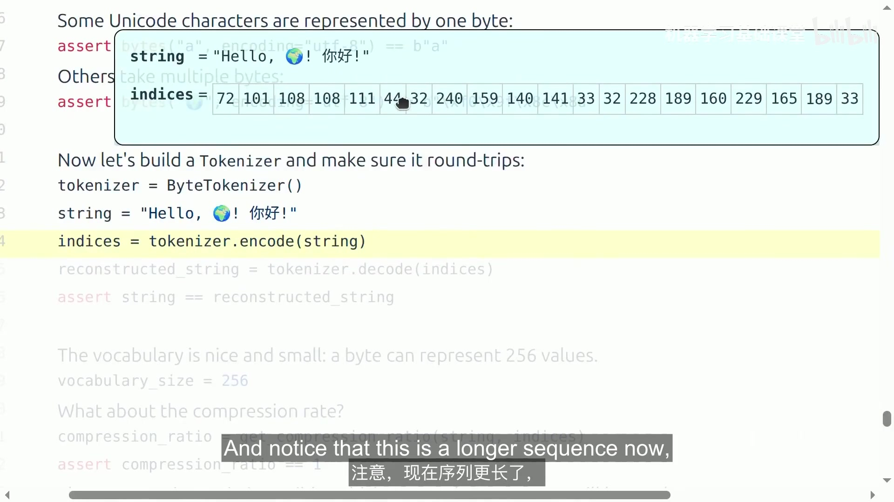

### 7.3 Word tokenizer

传统 NLP 常按空格或正则表达式切成 word/chunk。好处是 token 更接近人类语义单位，compression ratio 通常更好。但它的 vocabulary 是训练数据中 distinct chunks 的集合，可能非常大，甚至在 test time 遇到从未见过的新词。传统 `UNK` token 会丢信息，也会使 perplexity 等计算变得麻烦。

三者形成清晰的 trade-off：character/byte 太细，word 太粗；BPE 的目标是在固定词表规模下，通过数据驱动方式学习中间粒度。

## 8. Byte Pair Encoding（BPE）

BPE 最初由 Philip Gage 在 1994 年用于数据压缩，后来被用于 neural machine translation，并进入 GPT-2 一类语言模型。它的核心思想是：**从 bytes 出发，反复把最常见的相邻 token pair 合并成一个新 token。**

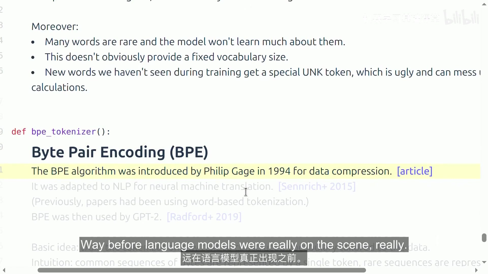

### 8.1 训练算法

初始化：

- 把训练 corpus 编码为 byte sequence；
- 初始 vocabulary 包含 `0..255` 共 256 个 byte token；
- `merges` 为空。

然后重复若干次：

```text
for each merge step:
    count all adjacent token pairs
    choose the most frequent pair
    assign a new token id
    replace every occurrence of that pair
    record the merge rule and the new token bytes
```

如果忽略 special tokens，做 $M$ 次 merge 后，词表大约是 $256+M$。随着 merge 增多，sequence 变短，vocabulary 变大。


### 8.2 `the cat in the hat` 的三次 merge

课堂用：

```text
the cat in the hat
```

并设置 `num_merges = 3`。第一轮统计相邻 pair 后，`(116, 104)` 即 bytes `t`,`h` 出现两次，被合并为 token `256 = "th"`。下一轮把 `(256, 101)` 合并为 `257 = "the"`；再下一轮继续得到 `258`，对应更长的高频 chunk。

这个 toy example 最终 compression ratio 为 **1.5**。它展示的不是某个特殊英文规则，而是 BPE 的一般机制：频繁序列逐步获得单独 token，罕见序列仍可以退回更细粒度 bytes，因此不需要 `UNK`。

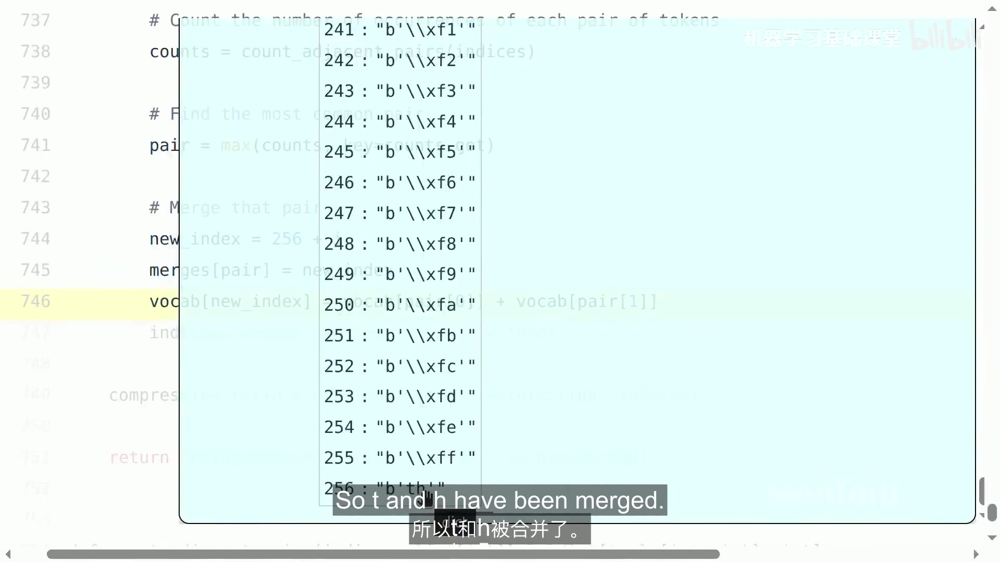

### 8.3 使用训练好的 BPE

训练完成后，encoder 对新字符串从 bytes 开始，按已学到的 merge 顺序应用规则。课堂用 `the quick brown fox` 演示 encode，再 decode 回原字符串，验证 round trip。

一个最朴素实现可以遍历所有 merge rule，但这会非常慢：merge 数量基本与 `vocab_size - 256` 同量级。现代 tokenizer 因此需要更有效的数据结构，只处理当前序列真正相关的 pair。

## 9. Assignment 1 对 tokenizer 的工程要求

课堂明确把 toy BPE 和 Assignment 1 连接起来。除了“算法正确”，还要处理四个实际问题：

1. **不要在 `encode()` 中无条件遍历所有 merge**：建立索引，让实现只关注可能发生的 merge。
2. **Special tokens**：例如 `<|endoftext|>`，需要识别并保持其语义边界。
3. **Pre-tokenization**：先用类似 GPT-2 tokenizer regex 的规则把大字符串切成 chunk，再分别执行 BPE，可显著缩小局部工作集。
4. **性能优化**：讲师明确表示 Python 可能成为瓶颈；若需要，可以用 Rust、C 等语言实现性能关键部分。

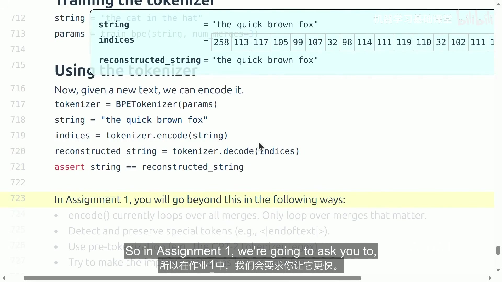

这里体现了 CS336 的教学重点：reference implementation 能工作还不够，还要理解瓶颈在哪里，并用更合适的数据结构和实现降低实际计算成本。

## 10. 本讲结论

Tokenizer 的职责可以压缩成：

```text
strings <-> token indices
```

character、byte、word 三种简单方案各自有明显缺陷；BPE 是目前实用而有效的数据驱动 heuristic。它并不是理论上最终的表示方式，未来可能出现真正 tokenizer-free 的模型。

但即使 tokenizer 本身消失，Percy 认为替代方案仍需要满足两个性质：

1. 模型需要在 sequence 的某种 **chunks / abstractions** 上工作；这一点不仅适用于 text，也适用于 video、DNA 等序列。
2. chunk 应该是 **variable** 的，使模型可以把更多 capacity 分配给更值得建模的部分。

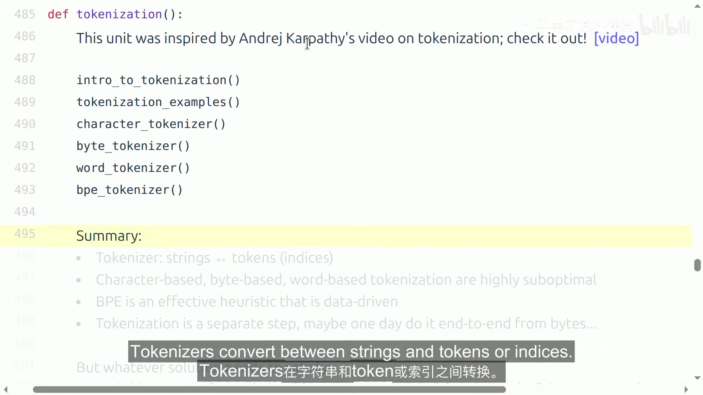

## 11. 学习检查点

学完本讲后，应能回答以下问题：

- 为什么小模型上的建模 intuition 不一定能直接迁移到 frontier scale，而 mechanics/mindset 更可迁移？
- 为什么课程把 `accuracy = efficiency × resources` 当作贯穿五个 assignment 的组织原则？
- 为什么 byte tokenizer 的 vocabulary 很小却仍不适合作为今天 Transformer 的默认输入？
- compression ratio 与 vocabulary size、sequence length 之间是什么关系？
- BPE 为什么既能覆盖任意 byte sequence，又能避免 word tokenizer 的 `UNK` 问题？
- 对 `the cat in the hat`，前三次 merge 如何让高频 `th`、`the` 等 chunk 获得新 token？
- 为什么“遍历全部 merge rules”的 BPE encoder 虽然正确却不够实用？Assignment 1 要如何改进？
- 下一讲的 resource accounting 为什么是理解后续 kernels、parallelism、architecture efficiency 的基础？

## 12. 本讲资料

- 官方课程网站与 Spring 2026 Schedule：<https://cs336.stanford.edu/>
- Spring 2026 lecture materials：<https://github.com/stanford-cs336/lectures>
- Lecture 1 executable lecture：<https://github.com/stanford-cs336/lectures/blob/main/lecture_01.py>
- Assignment 1 repository：<https://github.com/stanford-cs336/assignment1-basics>
- Assignment 1 handout（当前官方 Schedule 指向的文件）：<https://github.com/stanford-cs336/assignment1-basics/blob/main/cs336_assignment1_basics.pdf>

本笔记的讲授事实以本地 Spring 2026 视频/VTT 与上述同版本 first-party materials 交叉核验。课程路线图中对后续 systems、scaling、data、alignment 的内容只按本讲实际预览范围记录，没有把后续 Lecture 的细节反向写成本讲已讲内容。
