---
workflow:
  name: ChatGPT-Web-Course-Note-Workflow
  version: v4.9.4
course:
  name: "CS336: Language Modeling from Scratch"
  term: "Spring 2026"
  instructors:
    - "Tatsunori Hashimoto"
    - "Percy Liang"
chapter:
  index: 2
  local_label: "P02"
  official_unit_label: "Lecture"
  official_unit_number: 2
  official_title: "PyTorch (einops), resource accounting (FLOPs, memory, arithmetic intensity)"
  date: "2026-04-01"
  instructor: "Percy Liang"
provenance:
  lecture_video_term: "Spring 2026"
  official_materials_term: "Spring 2026"
  local_video_source: "Bilibili collection supplied by the user"
---

# Lecture 2 — PyTorch（einops）与资源核算

本讲建立训练语言模型时的“资源账本”，暂不进入新的模型结构：一个计算会占多少显存、需要多少 FLOPs、实际硬件能达到多少 FLOP/s，以及一个 workload 最终受算力还是内存带宽限制。课堂用 PyTorch 和 einops 把这些量落到具体 tensor 操作上，再把同一套核算方法扩展到前向、反向、optimizer state、gradient accumulation 和 activation checkpointing。

## 配套资料

- [Spring 2026 官方课程页面与 Schedule](https://cs336.stanford.edu/)
- [Spring 2026 官方 Lecture materials repository](https://github.com/stanford-cs336/lectures)
- [Lecture 2 executable lecture：`lecture_02.py`](https://github.com/stanford-cs336/lectures/blob/main/lecture_02.py)
- [Lecture 2 recording trace：`lecture_02_recording.json`](https://github.com/stanford-cs336/lectures/blob/main/var/traces/lecture_02_recording.json)

官方 Schedule 的 Lecture 2 行没有单独指定 paper / assigned reading / required reading，因此本讲 `papers/` 目录为空。

开场还有一条与课程 scaling 实验相关的更新：Marin 的 $10^{23}$ FLOPs run 已完成，结果与此前 forecast 相符。它是课程运行背景，不改变本讲后续的资源核算主线。

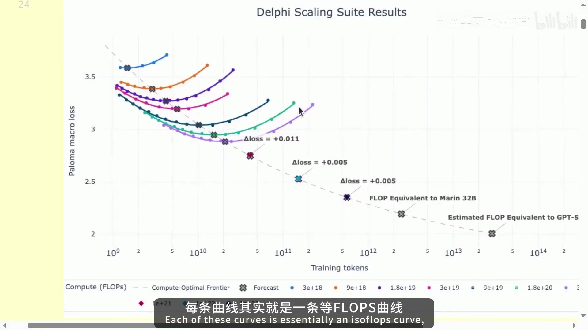

## 1. 先做数量级估算：训练到底有多贵？

课堂从两个 napkin math 问题开始。第一个问题是：一个 70B 参数模型在 15T tokens 上训练，使用 1024 张 H100，需要多久？录制画面里的题目一度写成 `1024 B100s`，Percy 在 02:12 立即口头纠正为 H100；后续计算也使用 H100 的性能数字，因此这里按 H100 记录。训练 Transformer 的常用近似是

$$
C \approx 6ND,
$$

其中 $N$ 是参数量，$D$ 是训练 token 数。代入课堂数字：

$$
C \approx 6\times 70\times 10^9\times 15\times 10^{12}
=6.3\times 10^{24}\ \text{FLOPs}.
$$

课堂按 H100 dense BF16 约 $1979/2=989.5$ TFLOP/s、MFU $=0.5$ 估算。1024 张卡持续运行时，得到约 144 天。这个结果用于快速判断资源数量级，不应当作精确训练计划。

第二个问题是：8 张 80 GB H100 使用 AdamW，最多能装下多大的模型？只核算参数、梯度和 optimizer state 时，每个参数约占

$$
2\ \text{B (parameter)}+2\ \text{B (gradient)}+4\ \text{B}+4\ \text{B (Adam states)}=12\ \text{B}.
$$

因此粗略上界是

$$
\frac{8\times 80\times 10^9}{12}\approx 5.33\times 10^{10},
$$

即约 53.3B 参数。这个数明确忽略 activations，所以只能看作显存上界。

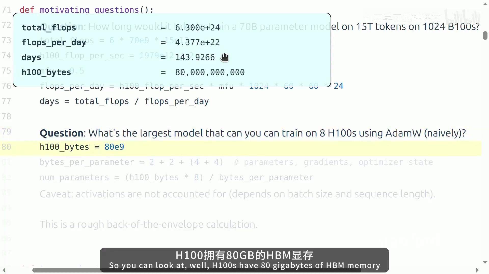

## 2. Tensor 是统一的存储单位

在 PyTorch 中，训练过程里的 data、parameters、gradients、optimizer states 和 activations 最终都存为 tensor。对一个 tensor，最基本的显存核算只有两项：元素个数和每个元素的字节数。

$$
\text{memory} = \text{numel}\times \text{element\_size}.
$$

例如 `torch.zeros(4, 8)` 默认是 fp32，共 $4\times 8=32$ 个元素，每个元素 4 bytes，因此占 128 bytes。课堂还用 GPT-3 feed-forward layer 中的一块大矩阵说明，单个矩阵本身就可以达到 GB 级别。

Transformer 中经常出现 rank-4 tensor。课堂用形状 $(B,S,H,D)$ 表示 batch size、sequence length、number of heads 和每个 head 的 hidden dimension。后续所有显存和 FLOPs 核算都依赖于先把这些维度写清楚。

### 2.1 fp32、fp16、bf16

fp32 每个数 4 bytes，数值范围和精度都较高。fp16 每个数 2 bytes，可以把存储量减半，但动态范围更窄；课堂用 `torch.tensor([1e-8], dtype=torch.float16)` 演示 underflow，结果变成 0。

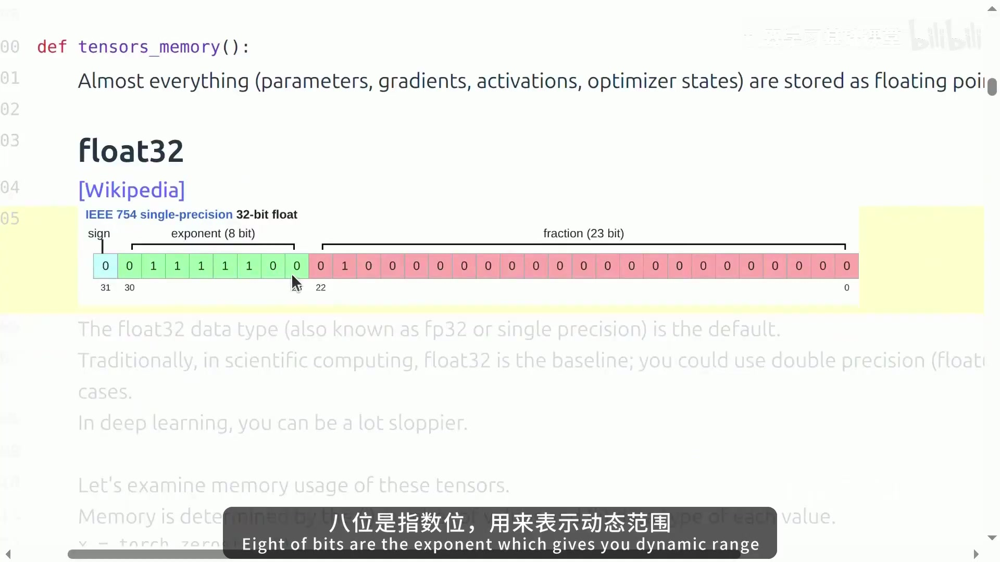

bf16 同样是 2 bytes，但保留了与 fp32 相同宽度的 exponent，因此动态范围接近 fp32，只是 fraction 更短、分辨率更低。对深度学习训练，这通常比 fp16 的窄动态范围更实用。课堂同样用 $10^{-8}$ 检查 bf16，值不会直接 underflow 到 0。

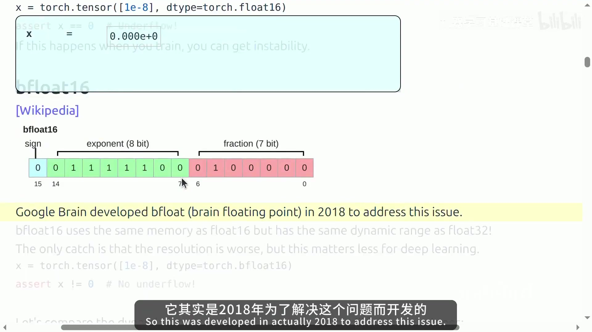

由此得到 mixed precision 的基本思路：参数、activations 和 gradients 可以使用 bf16，而需要更高数值稳定性的 optimizer states 使用 fp32。PyTorch 的 AMP 可以在适合的算子上自动使用低精度。

### 2.2 FP8 与 FP4

Lecture 2 继续向更低精度延伸。H100 支持两种 FP8 格式：E4M3 和 E5M2；前者分辨率更高、范围更小，后者牺牲更多 fraction bits 换取更大的范围。课堂还提到 NVIDIA 的 NVFP4：每个值只使用 4 bits，并通过 block-level scale factor 扩展可表示范围。这里需要把握的是：precision 会同时改变 memory footprint、硬件峰值 FLOP/s 和数值稳定性。

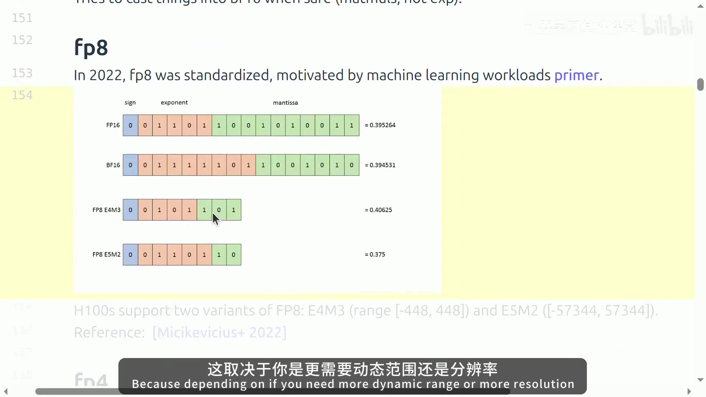

### 2.3 CPU memory 与 GPU memory

PyTorch tensor 默认创建在 CPU memory。要利用 GPU 的并行计算，需要把数据搬到 GPU memory，例如：

```python
x = torch.zeros(32, 32)
x = x.to(device)

with torch.device(device):
    x = torch.zeros(32, 32)
```

这一步把“计算量”与“数据搬运量”联系起来：后面讨论 arithmetic intensity 时，瓶颈恰恰取决于计算和 memory traffic 哪个更慢。

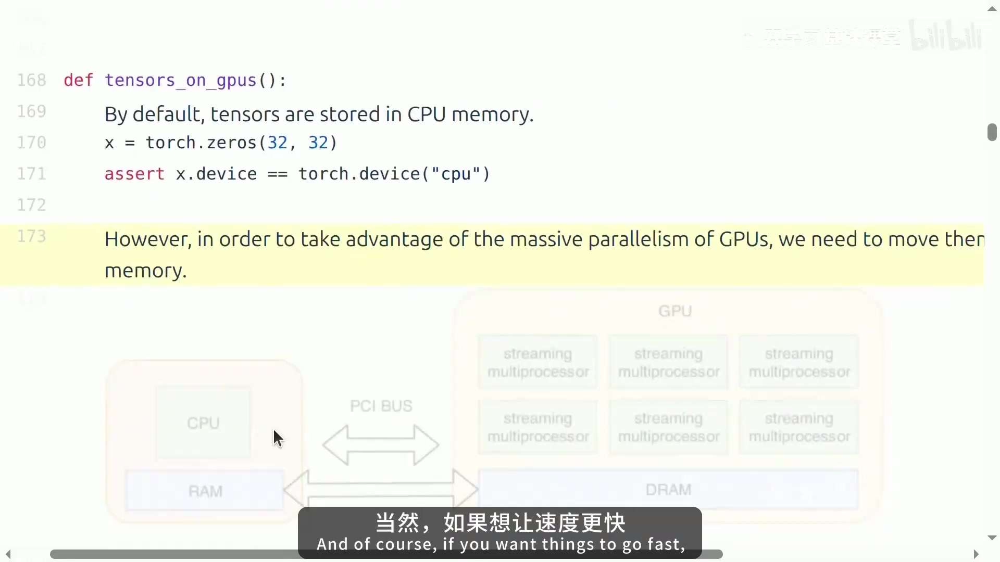

## 3. 用 einops 把 tensor 维度写清楚

传统 PyTorch 经常用 `transpose(-2, -1)` 或位置下标表达维度，代码短，但维度含义容易丢失。einops 的价值是给维度命名，让运算直接表达“哪些维度相乘、哪些维度被消去、哪些维度保留”。

### 3.1 `einsum`

普通矩阵乘法：

```python
z = x @ y
```

可以写成：

```python
z = einsum(x, y, "seq1 hidden, hidden seq2 -> seq1 seq2")
```

如果是 batched attention-style 乘法：

```python
z = einsum(
    x, y,
    "batch seq1 hidden, batch seq2 hidden -> batch seq1 seq2",
)
```

输出中没有出现的 `hidden` 维会被求和。`...` 则可用来表示需要广播的任意前导维度。

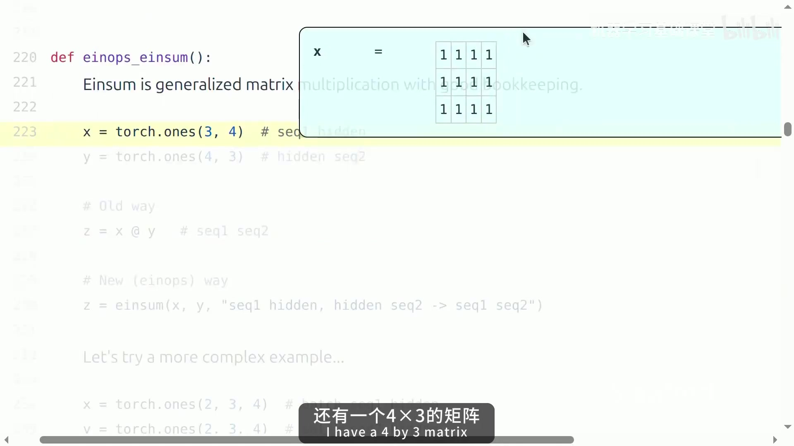

### 3.2 `reduce` 与 `rearrange`

`reduce` 把“沿哪个维度聚合”写进 pattern：

```python
y = reduce(x, "... hidden -> ...", "sum")
```

`rearrange` 适合拆分或合并维度。例如把展平的 `total_hidden` 拆成 `heads * hidden1`：

```python
x = rearrange(x, "... (heads hidden1) -> ... heads hidden1", heads=2)
x = einsum(x, w, "... hidden1, hidden1 hidden2 -> ... hidden2")
x = rearrange(x, "... heads hidden2 -> ... (heads hidden2)")
```

这套写法的主要收益是 bookkeeping：当模型进入 multi-head、batch、sequence 等多维场景时，维度语义仍然清楚。

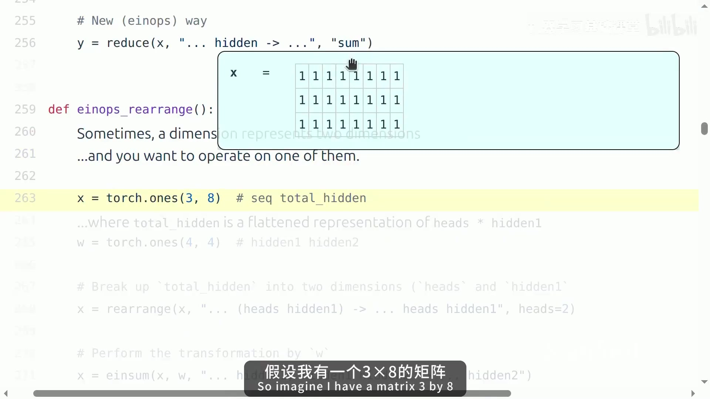

## 4. FLOPs、FLOP/s 与 MFU

FLOP 是一次 floating-point operation，例如一次加法或乘法；FLOP/s 是硬件每秒能执行多少 floating-point operations。两者读起来相近，但一个是“工作总量”，另一个是“速度”。

对矩阵乘法

$$
X\in\mathbb{R}^{B\times D},\qquad W\in\mathbb{R}^{D\times K},
$$

输出 $Y=XW$ 有 $B\times K$ 个元素。每个元素要沿 $D$ 做乘加，因此课堂采用

$$
\text{FLOPs}\approx 2BDK.
$$

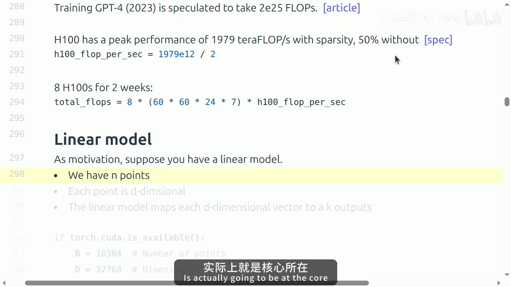

实际运行时可以计时，再计算

$$
\text{actual FLOP/s}=\frac{\text{FLOPs}}{\text{elapsed time}}.
$$

CUDA kernel 默认异步执行，因此课堂的 benchmark helper 会在计时前后调用 `torch.cuda.synchronize()`；否则 wall-clock measurement 可能只测到 kernel launch，而没有等 GPU 真正完成运算。

GPU datasheet 给出的 peak FLOP/s 会随 dtype 明显变化。于是得到 Model FLOPs Utilization（MFU）：

$$
\text{MFU}=\frac{\text{actual FLOP/s}}{\text{peak FLOP/s}}.
$$

课堂给出的经验判断是，现代大模型训练中 MFU 达到约 0.5 已经相当不错。MFU 为什么很难接近 1，需要继续看 memory bandwidth。

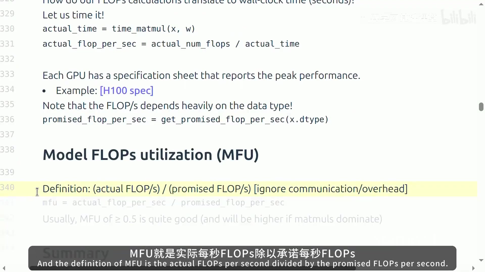

## 5. Arithmetic intensity：算得慢，还是搬得慢？

一个 accelerator 上的计算可以抽象成三步：从 memory 读入数据、执行计算、把结果写回 memory。总时间至少受到两种硬件能力限制：

- compute throughput，单位 FLOP/s；
- memory bandwidth，单位 bytes/s。

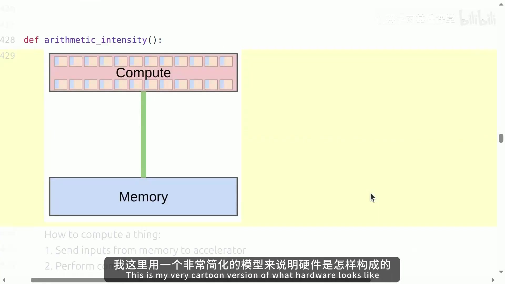

课堂定义两个强度：

$$
\text{accelerator intensity}
=\frac{\text{peak FLOP/s}}{\text{memory bandwidth}},
$$

$$
\text{arithmetic intensity}
=\frac{\text{workload FLOPs}}{\text{bytes moved}}.
$$

按课堂使用的 H100 数字，dense BF16 峰值约为 $989.5\times10^{12}$ FLOP/s，HBM bandwidth 约为 $3.35\times10^{12}$ bytes/s，因此 accelerator intensity 约为

$$
295\ \text{FLOP/byte}.
$$

如果 workload 的 arithmetic intensity 小于这个阈值，数据搬运先成为瓶颈，属于 memory-bound；如果高于阈值，计算单元先饱和，属于 compute-bound。

课堂逐个比较了几个算子：

| workload | 课堂近似 arithmetic intensity | 判断 |
| --- | ---: | --- |
| ReLU on bf16 | $\approx 0.25$ FLOP/byte | memory-bound |
| GeLU on bf16 | $\approx 5$ FLOP/byte | memory-bound |
| dot product | $\approx 0.5$ FLOP/byte | memory-bound |
| matrix-vector product | $\approx 1$ FLOP/byte | memory-bound |
| large square matrix multiplication | 随矩阵边长增长，约 $n/3$ | 足够大时 compute-bound |

这解释了一个重要现象：单独执行时，ReLU 即使“计算更简单”，也不一定明显快于 GeLU，因为两者都可能主要在等 memory。训练阶段的大矩阵乘法通常具有很高的 data reuse，因此更容易 compute-bound；逐 token inference 中常出现 matrix-vector-like 计算，通常更受 memory bandwidth 约束。

### 5.1 Roofline model

Roofline plot 把这两个区域画在同一张图里：低 arithmetic intensity 区域的性能随 intensity 线性上升，直到碰到 accelerator peak FLOP/s，之后进入水平平台。理想化地，可以把 MFU 看成

$$
\text{MFU}_{\text{ideal}}\approx
\min\left(1,\frac{\text{arithmetic intensity}}{\text{accelerator intensity}}\right).
$$

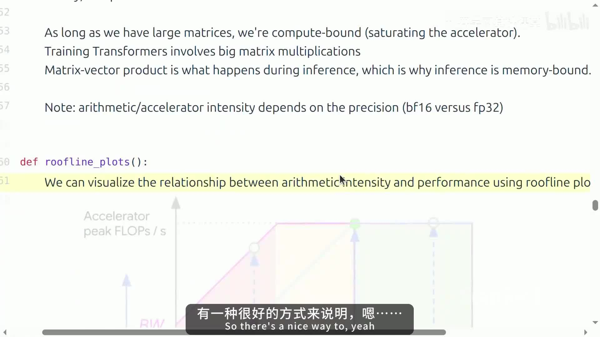

## 6. 从 autograd 推到训练 FLOPs：为什么是 $6ND$？

课堂接下来把资源核算放进一个深层线性网络。设 batch size 为 $B$、hidden dimension 为 $D$、层数为 $L$，每层主要是一个 $D\times D$ 的线性变换。

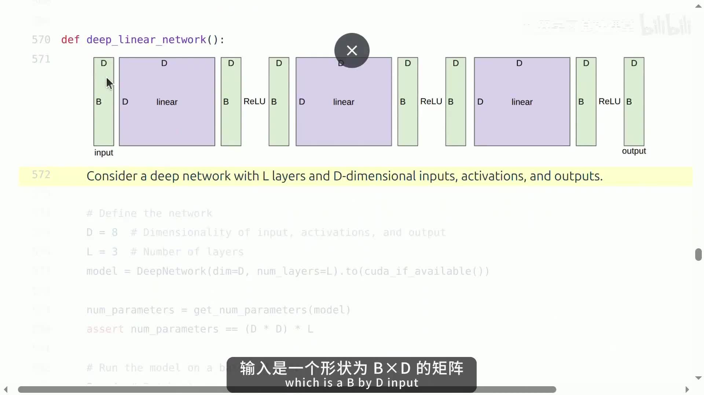

对一层线性变换，forward matmul 大约需要

$$
2BD^2
$$

FLOPs。反向传播要同时求 input gradient 和 weight gradient，相当于两个同量级 matmul，所以约为

$$
4BD^2.
$$

因此 backward 大约是 forward 的两倍。把所有层合并，并把 $LD^2$ 看作参数量 $N$，得到每个训练 batch 的近似：

$$
\text{forward}\approx 2BN,
$$

$$
\text{backward}\approx 4BN,
$$

$$
\text{total}\approx 6BN.
$$

把整个训练集 / token stream 的数据点总数写成 $D_{\text{data}}$，就是开头使用的

$$
C\approx 6N D_{\text{data}}.
$$

课堂强调：对 context 较短、matmul 主导的 Transformer，这个近似通常很好用；当 context 很长、attention 的 sequence-dependent 成本变得显著时，需要更细的核算。

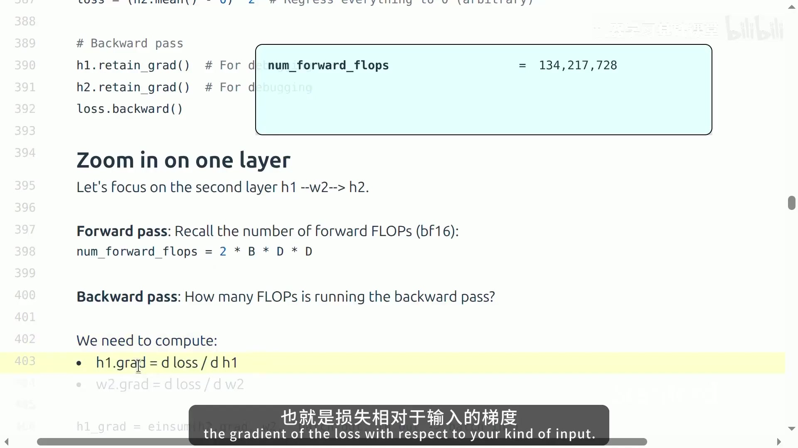

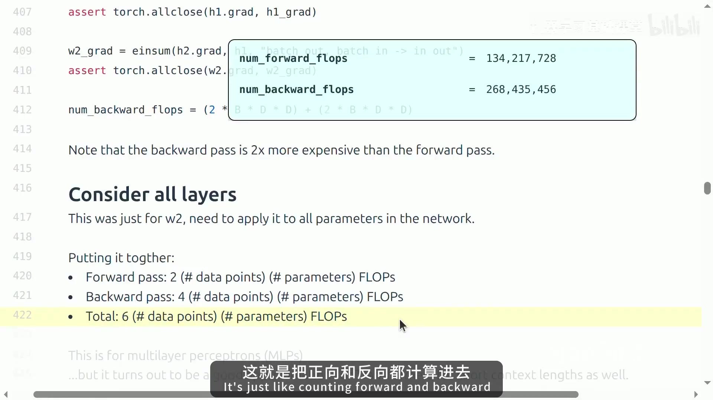

## 7. Optimizer state 与训练显存

训练显存不只是“模型权重有多大”。课堂把主要组成拆成：

- parameters；
- gradients；
- optimizer states；
- activations。

如果参数和梯度用 bf16，则各约 2 bytes/parameter。AdaGrad 需要一个 fp32 累积量，约 4 bytes/parameter；Adam 维护 first moment 和 second moment，通常需要两个 fp32 state，共约 8 bytes/parameter。因此前面的 12 bytes/parameter 正是 AdamW 的简化核算。

课堂还用一条演化链梳理 optimizer：Momentum 可以看作 SGD 加 gradient 的指数平均；AdaGrad 累积 gradient squared；RMSProp 对 gradient squared 做指数平均；Adam 再把 RMSProp 式的 second moment 与 Momentum 式的 first moment 结合起来。这里的目的仍是资源核算：每多维护一个 state，都要付出对应的显存。

activation memory 则随 batch size、hidden dimension 和层数增长。对课堂的简化深层网络，存下每层 activation 的量级是

$$
O(BDL).
$$

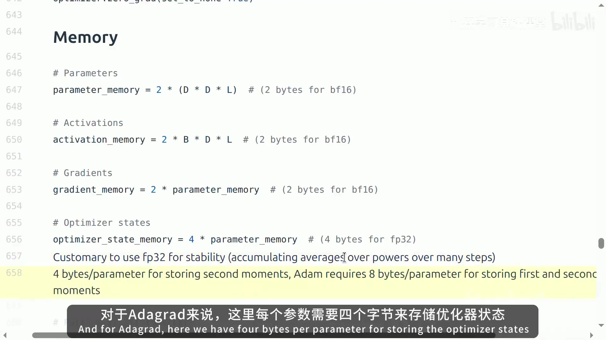

录制版本在这一段明确说会跳过 training loop 的详细 walkthrough，因此这里不把官方 executable lecture 中存在的训练循环代码描述成视频中逐行讲解过的内容。

## 8. 两种显存优化

### 8.1 Gradient accumulation

大 batch 往往有利于稳定训练，但 activation memory 会随 batch size 增长。Gradient accumulation 把一个大 batch 切成多个 microbatches：每个 microbatch 做 forward/backward，把 gradients 累积起来，达到目标 effective batch size 后再执行 optimizer update 和 `zero_grad()`。

它降低了单次 forward/backward 需要保存的 activations，却保留了大 effective batch 的梯度统计。

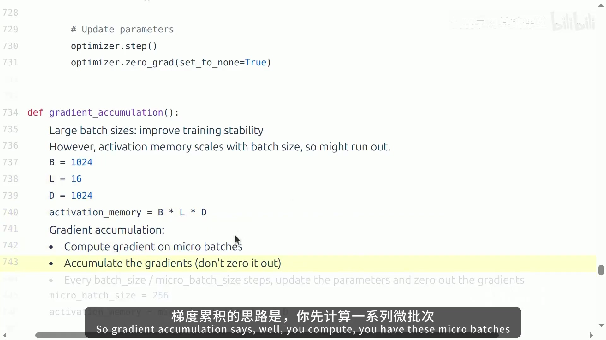

### 8.2 Activation checkpointing / rematerialization

标准 backprop 为了计算梯度，会保留 forward 的中间 activations。Activation checkpointing 只保存部分中间状态，backward 时重新执行缺失的 forward 片段，以额外计算换取更少显存。

对 $L$ 层网络，课堂给出三个直观端点：

- 每层都保存 activation：activation memory 为 $O(L)$，几乎不需要 recomputation；
- 几乎不保存：activation memory 可以接近 $O(1)$，但 naive recomputation 可能达到 $O(L^2)$；
- 每隔约 $\sqrt{L}$ 层保存一个 checkpoint：录制版本把 activation memory 和 recomputation 都记为 $O(\sqrt{L})$，作为两者之间的平衡点。

实现上，PyTorch 可以用 `torch.utils.checkpoint.checkpoint(layer, x)` 把某一层放进 checkpointed forward。这个机制不会消灭计算成本，只是改变 memory 与 compute 的交换方式。

来源说明：Spring 2026 repo 当前 `lecture_02.py` 已把最后一条写成 `O(L) recomputation`，而与录像绑定的 `lecture_02_recording.json` 以及本地录像画面仍是 `O(\sqrt{L}) recomputation`。本笔记以实际录像版本为准。

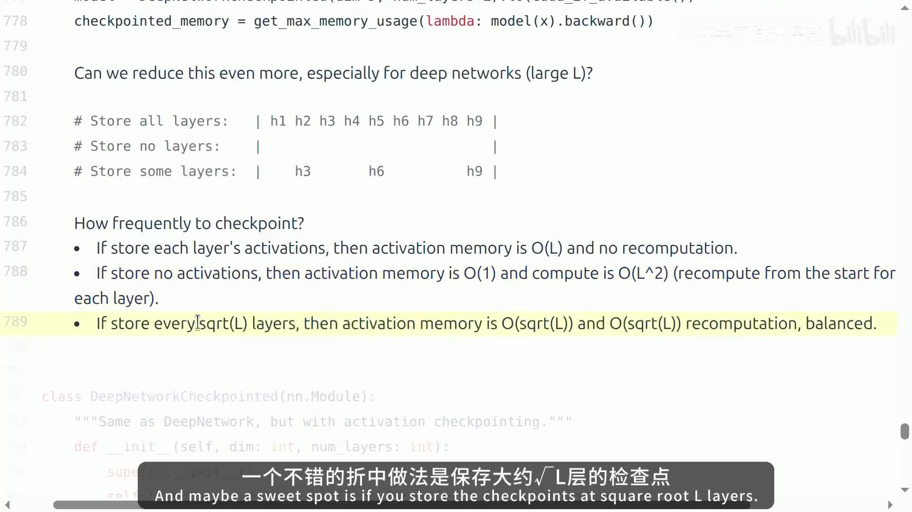

## 9. 本讲应带走的核算框架

到 Lecture 2 结束，可以把资源核算压缩成几条可复用规则：

1. 训练系统中的核心状态最终都表现为 tensors；先写清 shape 与 dtype，再算 memory。
2. einops 的具名维度让多维 tensor 的 bookkeeping 更直接，也更不容易写错维度。
3. 大矩阵乘法的 FLOPs 可以从乘加次数直接得到；训练 Transformer 的常用数量级近似是 $6ND$。
4. 实际速度不能只看 FLOPs，还要同时看 peak FLOP/s、memory bandwidth 与 MFU。
5. Arithmetic intensity / roofline model 用来判断 workload 是 compute-bound 还是 memory-bound；大 matmul 通常比 elementwise 或 matrix-vector 运算更容易吃满算力。
6. Gradient accumulation 和 activation checkpointing 都是在显存受限时扩大可训练规模的工具，但代价分别落在更多 microbatch steps 与额外 recomputation 上。

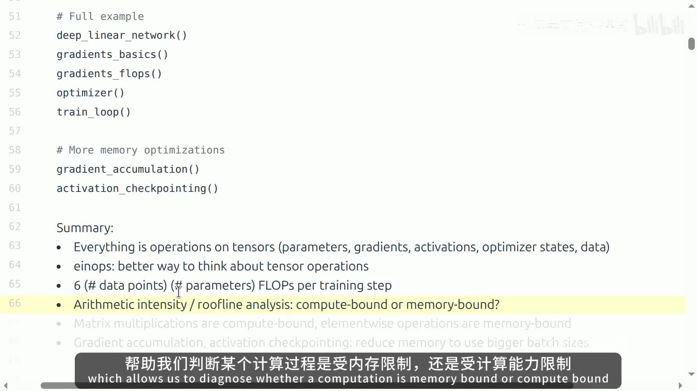

下一讲由 Tatsunori Hashimoto 进入 architectures 与 hyperparameters；这也与本地 P03 的主题顺序一致。
