---
workflow:
  name: ChatGPT-Web-Course-Note-Workflow
  version: v4.9.4
course: "CS336: Language Modeling from Scratch"
term: "Spring 2026"
local_chapter: "P03"
official_lecture: 3
title: "Architectures, hyperparameters"
date: "2026-04-06"
instructor: "Tatsunori Hashimoto"
provenance:
  official_schedule: "https://cs336.stanford.edu/"
  official_slides: "https://github.com/stanford-cs336/lectures/blob/main/lecture_03.pdf"
  official_video: "https://www.youtube.com/watch?v=lVynu4bo1rY"
  local_video: "P03 local course video, identity cross-checked against Spring 2026 first-party sources"
  subtitle: "local WebVTT; treated as subtitle evidence and cross-checked against visible slides for key formulas and quantities"
---

# Lecture 3 — Architectures, hyperparameters

本讲从一个很务实的视角研究 Transformer 架构：不先假定存在一套简洁的理论能直接推出“正确架构”，而是横向观察大量已经训练成功的语言模型，找出哪些设计已经形成稳定共识、哪些超参数处在宽容区间、哪些变化主要服务于硬件效率与训练稳定性，以及 2026 年的模型又在哪里继续变化。

官方课程 Schedule 将本讲标为 **Lecture 3, Mon April 6, “Architectures, hyperparameters [Tatsu]”**；本地 P03 的开头、中段、结尾内容与 Spring 2026 官方录像和 `lecture_03.pdf` 对齐，因此本笔记采用映射 **P03 → official Lecture 3**。

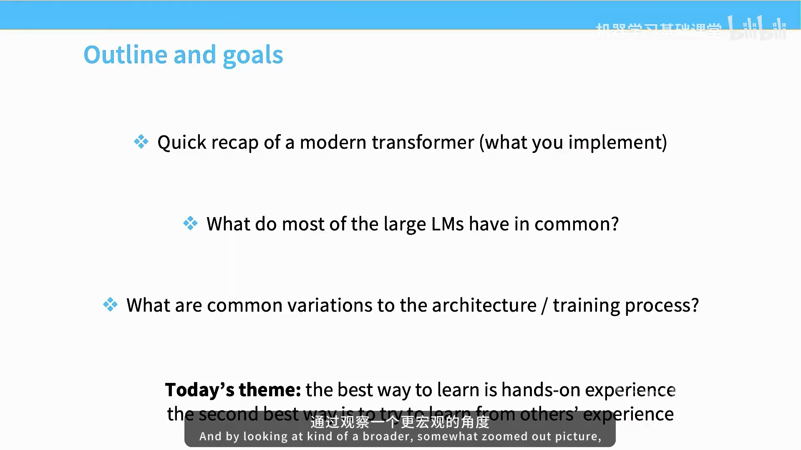

*01:10。讲师先给出本讲的目标与方法：通过现代模型的共同选择建立架构直觉。*

## 本讲主线：架构是多目标协同设计

一个语言模型架构至少同时承担几件事：

- **表达与泛化**：能从数据中学到有效模式；
- **系统效率**：矩阵规模、内存访问和 kernel 形态要适合 GPU；
- **训练稳定性**：长时间训练不能在中途出现不可恢复的 loss / gradient spike；
- **推理效率**：尤其在 autoregressive decode 中，KV cache 与 memory traffic 会成为主要成本；
- **长上下文**：如何在 context length 增长时控制 attention 的计算与内存开销。

因此，本讲很多看似“零散”的工程选择其实围绕同一问题：**怎样在模型质量、计算利用率、稳定性和部署成本之间找到可复用的折中。**

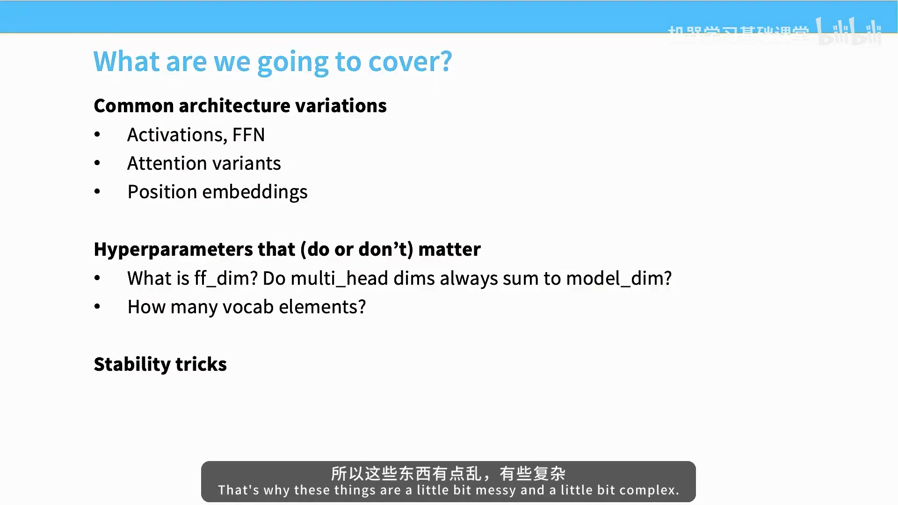

*06:08。核心主题包括常见 architecture variations、hyperparameters 与 stability tricks。*

一个值得记住的历史观察是：早期 Transformer 到 GPT-3 附近存在大量结构探索；Llama 2 之后，大量模型收敛到相似的 dense Transformer 主干；随后更明显的变化集中到 **稳定性** 和 **长上下文成本**。这解释了为什么现代模型仍然“像 Transformer”，但 Norm、FFN、位置编码、attention head 组织方式和局部/全局 attention 组合已经显著不同。

## 1. Normalization：先保护 residual stream

原始 Transformer 的典型 post-norm 形式把 LayerNorm 放在 residual 更新之后：

$$
x_{l+1}=\mathrm{LN}(x_l+F(x_l)).
$$

现代语言模型更常见的是把 Norm 移出 residual stream，让 residual 路径保留一条尽量干净的 identity path：

$$
x_{l+1}=x_l+F(\mathrm{Norm}(x_l)).
$$

这就是常说的 **pre-norm**。其核心直觉是：反向传播时，梯度可以沿 residual identity path 直接穿过很多层，而不必在每一层都经过归一化变换。讲师把这一经验概括为 **keep your residual stream clean**。

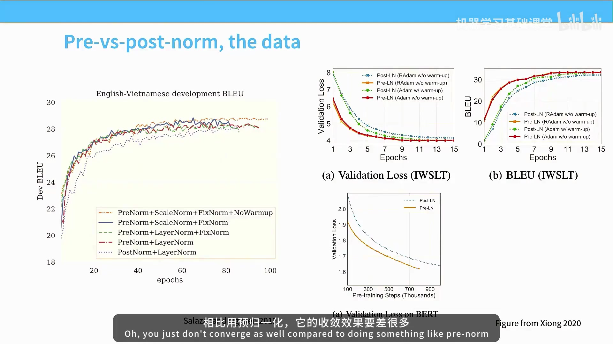

*10:24。原始 residual-norm/post-norm 与 pre-norm 的差异。*

pre-norm 的意义不只在“是否需要 warmup”。更重要的是它改善深层网络的 gradient propagation，并在实践中减少 gradient spike。现代模型也出现了把 Norm 放在子层计算之后、但仍留在 residual stream 外的变体，以及同时使用 pre/post Norm 的 double-norm 结构。共同点是：**不要让每次 residual 传播都强制穿过 Norm。**

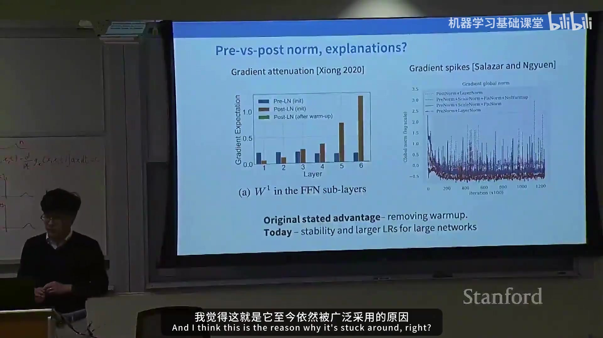

*12:24。pre-norm 提供更直接的 residual/gradient path。*

## 2. RMSNorm：少做低算术强度的数据搬运

LayerNorm 对一个 $d$ 维向量大致执行：

$$
\mathrm{LayerNorm}(x)
=\gamma\odot\frac{x-\mu}{\sqrt{\sigma^2+\epsilon}}+\beta.
$$

RMSNorm 去掉均值中心化和 bias，只按 root mean square 缩放：

$$
\mathrm{RMSNorm}(x)
=\gamma\odot\frac{x}{\sqrt{\frac{1}{d}\sum_{i=1}^{d}x_i^2+\epsilon}}.
$$

表示能力上，LayerNorm 并没有明显“错”；RMSNorm 的吸引力主要来自 **系统成本**。归一化属于低 arithmetic intensity 操作，需要读写大量 activation，却没有像 GEMM 那样做大量乘加。讲师借一组 workload 数据强调：统计归一化只占 **0.17% FLOPs**，却可占 **25.5% runtime**。因此仅用 FLOPs 推断实际速度会严重失真。

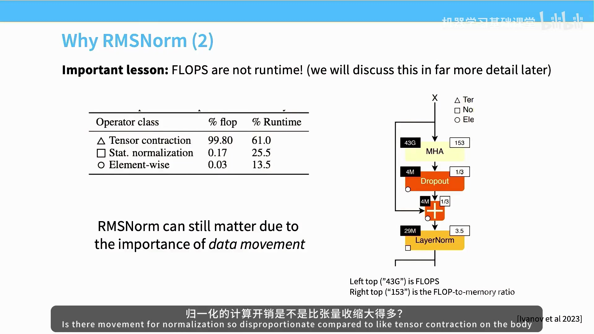

*16:48。课件中的示例数据：statistical normalization 约 0.17% FLOPs，却占 25.5% runtime。*

这也解释了另一个现代 Transformer 常见选择：**删掉很多 linear bias**。bias 往往带来额外 element-wise / memory movement，而对语言模型表达能力贡献有限；部分情况下还可能带来稳定性问题。整体趋势是，把硬件资源尽量留给高吞吐的 matrix multiplication。

## 3. 激活函数：GLU family 成为默认项

传统 FFN 可以写成：

$$
\mathrm{FFN}(x)=\phi(xW_1)W_2,
$$

其中 $\phi$ 可以是 ReLU、GeLU 等。现代 LLM 中更常见的是 **gated linear unit** 家族。例如简化后的 gated FFN：

$$
\mathrm{GLU}(x)=\bigl(\phi(xW_1)\odot xV\bigr)W_2.
$$

如果 $\phi$ 采用 Swish，就得到 SwiGLU；采用 GeLU，则得到 GeGLU。讲师的 survey 结论很明确：现代高性能语言模型几乎都会采用某种 gated FFN，SwiGLU 尤其常见于 Llama 系模型，Google 系模型中也常见 GeGLU。

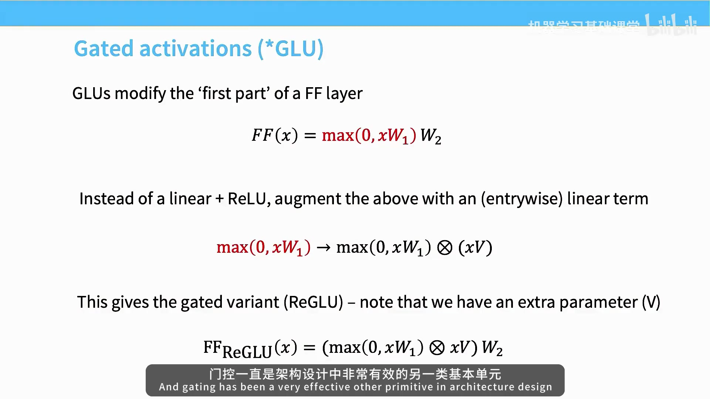

*23:12。gated FFN 用额外分支调制主 activation。*

但 gated FFN 多了一组 projection matrix。若保持 $d_{ff}$ 不变，参数量会上升。做 parameter-matched comparison 时，常把中间维度缩到原来的 $2/3$：

$$
d_{ff}^{\mathrm{gated}}\approx\frac{2}{3}d_{ff}^{\mathrm{plain}}.
$$

这条修正稍后会重新出现在“FFN/model dimension ratio”的讨论中。讲师引用的多组 controlled comparisons 都显示，GLU 变体通常能获得小但稳定的增益，因此它已经从“可选 trick”变成很可靠的默认项。

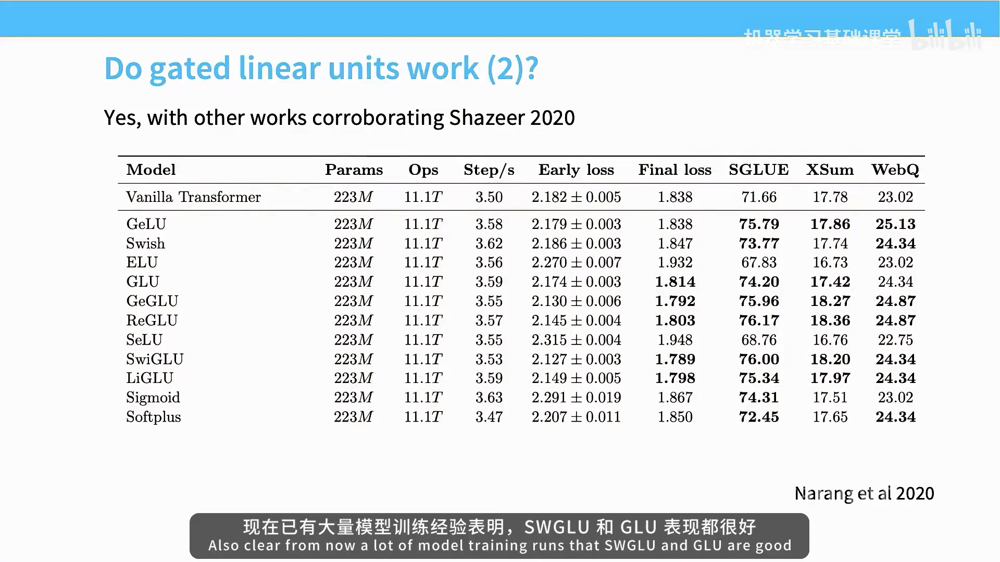

*26:18。参数匹配后，GLU family 仍呈现稳定优势。*

## 4. Serial vs. parallel layers

标准 Transformer block 依次执行 attention 与 MLP：

$$
x' = x + \mathrm{Attn}(\mathrm{Norm}(x)),
$$

$$
y = x' + \mathrm{MLP}(\mathrm{Norm}(x')).
$$

GPT-J、PaLM 等模型探索过 **parallel layers**：attention 和 MLP 从同一个输入并行计算，再一起加回 residual stream。这样可以共享部分 Norm，并有机会 fuse matrix multiplications，从系统角度很诱人。

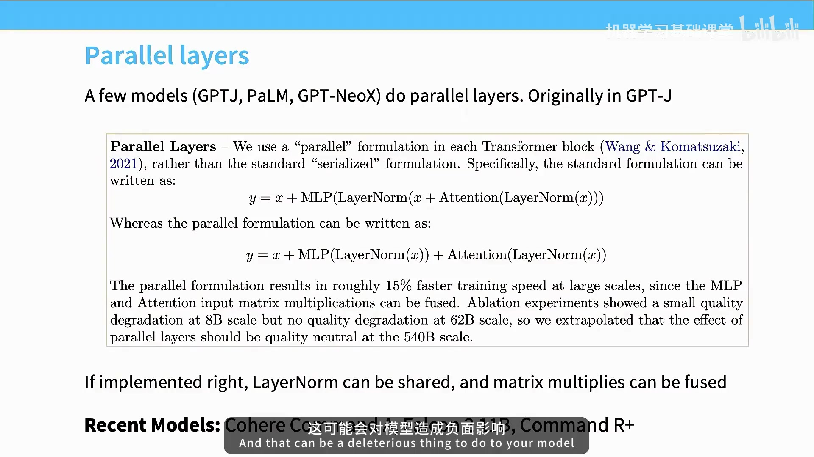

*29:20。parallel 结构试图把 attention 与 MLP 的依赖串行改成并行。*

但这条路线近年明显降温。随着 serial Transformer 的 kernel 与系统优化变好，parallel 结构的额外 systems gain 变小；同时它在表示上近似减少了有效顺序深度。讲师因此把现代默认概括为：**RMSNorm + residual-stream-outside normalization + gated FFN + serial layers**。

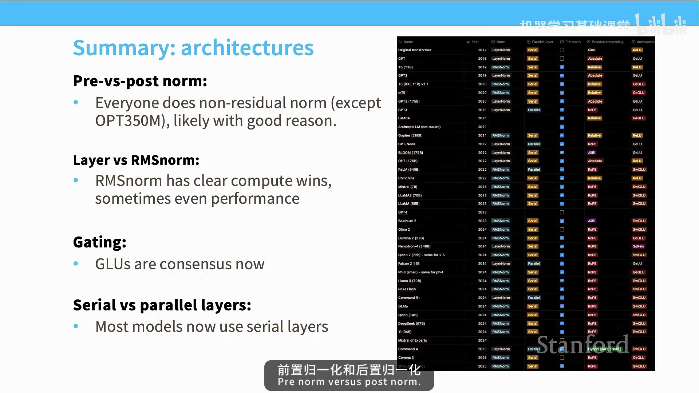

*30:34。现代 dense Transformer 的多项结构选择已经形成明显共识。*

## 5. RoPE：用旋转把绝对位置变成相对几何

早期位置编码主要包括：

- 固定 sinusoidal position embedding；
- learned absolute position embedding；
- 直接把 relative-position bias 加入 attention logits。

RoPE（Rotary Position Embedding）的目标更几何化：让 query/key 的相似度自然依赖 **相对位置**。把向量每两维看作一个二维平面，对位置 $m$ 施加旋转：

$$
R(m\theta)=
\begin{bmatrix}
\cos(m\theta) & -\sin(m\theta)\\
\sin(m\theta) & \cos(m\theta)
\end{bmatrix}.
$$

对于 query $q$ 和 key $k$：

$$
(R_mq)^\top(R_nk)=q^\top R_{n-m}k.
$$

右侧只依赖 $n-m$，因此 inner product 中自然出现 relative position。

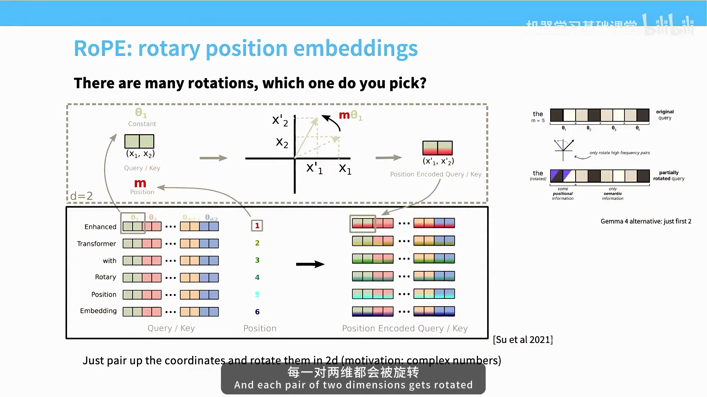

*36:28。两个词整体平移到新的绝对位置后，只要相对距离相同，旋转后的相对角度也保持一致。*

高维向量的做法很直接：把维度拆成二维 pair，每一对采用不同频率的旋转。高频 pair 对局部位置敏感，低频 pair 变化慢，可以携带更长距离的位置结构。

实现时通常对 attention 的 $Q$ 与 $K$ 应用预计算的 sin/cos：

1. 根据 position id 生成多频率角度；
2. 按二维 pair 对 $Q,K$ 做 rotation；
3. 再计算 attention logits。

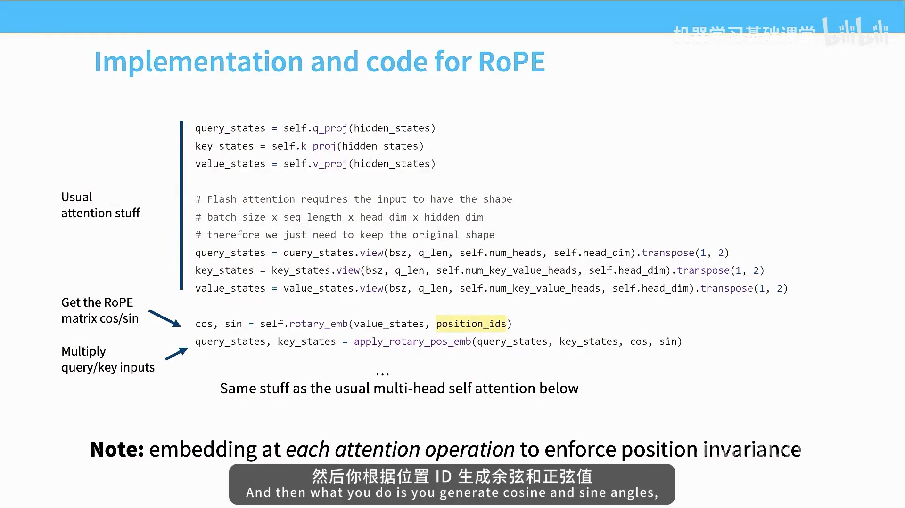

*38:22。RoPE 将高维向量拆成二维坐标对并分别旋转。*

讲师还强调，RoPE 成为主流并不意味着 position encoding 已经结束研究。长上下文模型正在重新组合 RoPE、NoPE、局部 attention 与全局 attention；后半讲会看到这些选择如何与 inference cost 直接耦合。

## 6. Hyperparameters：先从“宽容区间”的默认值开始

进入实际训练后，抽象的架构必须落到具体数字：FFN 多宽、head 多大、模型多深、词表多大、是否正则化。讲师的核心结论是：许多看起来很敏感的超参数其实存在 **相当宽的 forgiving basin**。因此合理策略通常是先用已经被大量模型验证过的默认值，再围绕硬件效率做局部调整。

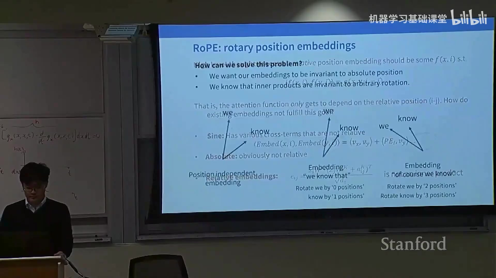

*43:30。问题从“用什么模块”下沉到“每个维度具体取多少”。*

### 6.1 FFN width：$d_{ff}\approx4d_{model}$

对于非 gated FFN，最经典的经验值是：

$$
d_{ff}\approx4d_{model}.
$$

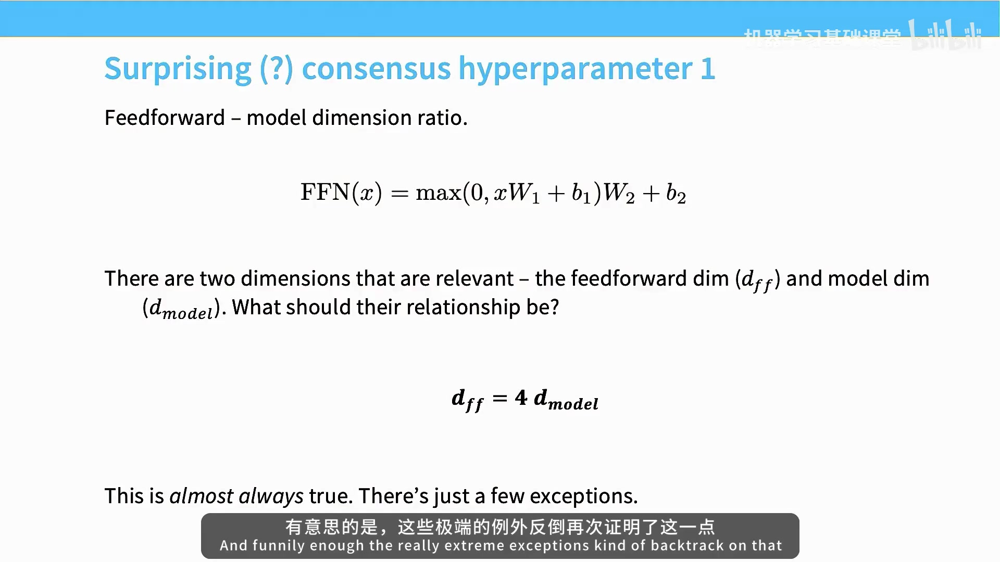

*45:16。课件把 $d_{ff}=4d_{model}$ 称为近乎共识的 hyperparameter。*

gated FFN 做 parameter matching 后，$4\times\frac{2}{3}\approx2.67$，所以很多 GLU 模型落在约 2.5–2.7；Llama 系也常采用约 3.5 左右的 MLP 比例。讲师还用 T5 的极端 **64×** 作为反例：极端选择仍可训练出好模型，但通常不是 compute-efficient default；后续 T5 v1.1 又回到了大约 2.5×。

更重要的经验是：controlled sweep 往往呈现一个很宽的低-loss basin。2.5、2.67、3.5、4 之间的差别，通常远没有“完全跑出合理区间”那么严重。

### 6.2 Attention heads：常见关系 $h\,d_{head}\approx d_{model}$

多头注意力最常见的做法是让所有 head 拼接后的总维度等于 model dimension：

$$
h\cdot d_{head}\approx d_{model}.
$$

这个比例也并非数学必需条件；它更像长期实践形成的稳健默认。讲师展示的模型 survey 与 ablation 都支持：ratio 附近存在较宽容的有效区域。

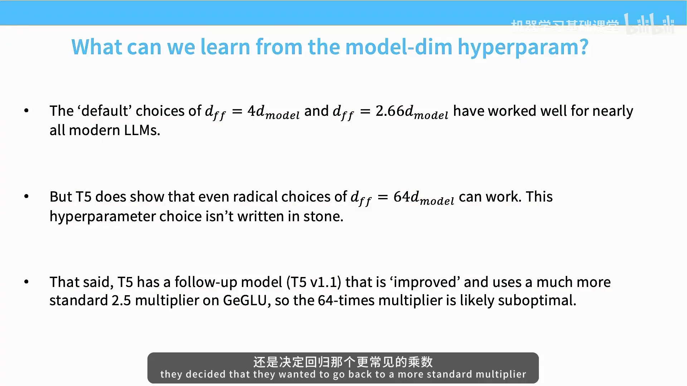

*49:36。现代模型大多在 head-size/model-size 比例附近形成聚类。*

### 6.3 Depth-width aspect ratio：约 $d_{model}/n_{layer}\sim100$

模型扩展时还要决定“更深还是更宽”。本讲把 aspect ratio 定义为：

$$
\mathrm{aspect\ ratio}=\frac{d_{model}}{n_{layer}}.
$$

很多现代模型大致落在 **100 左右**。原因既有建模因素，也有系统因素：非常深的网络更容易逼迫系统使用 pipeline parallel，而宽模型更容易用 tensor parallel 切分；过度偏向任一方向也会损害效率或效果。

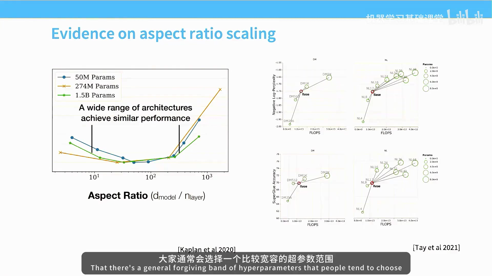

*54:52。多组模型规模下都能看到较宽的近最优区间。*

## 7. Vocabulary 与 regularization

### 7.1 Vocabulary size 反映任务覆盖面

讲师把词表规模大致分成两类趋势：

- 早期 English-centric / monolingual 模型常在 **约 30k tokens**；
- multilingual / production-oriented 模型更常见 **约 100k–200k tokens**，部分 Google 模型更大。

原因很直接：跨语言覆盖需要更多 subword inventory；同时现代模型规模更大，也能承受更大的 embedding/output vocabulary。

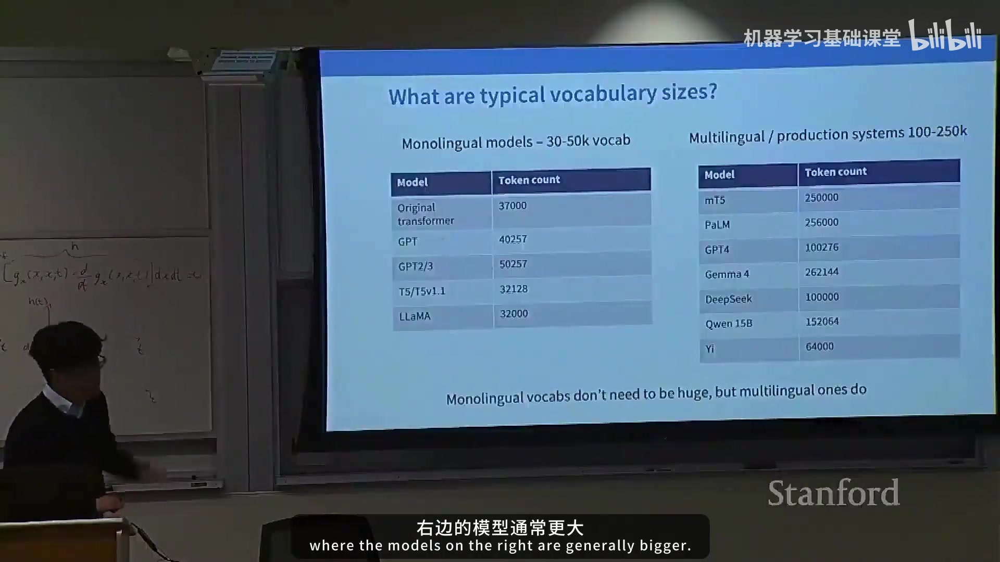

*56:22。课件对比了较小的 monolingual vocabulary 与明显更大的 multilingual/production vocabulary。*

### 7.2 Dropout 弱化，weight decay 仍然常见

大规模预训练往往是 single-pass 或接近 single-pass 的数据 regime，训练集本身极大，所以“经典过拟合”不像小数据监督学习那样突出。由此看，dropout 的必要性自然下降；讲师也指出现代 LLM 中 dropout 已明显不流行。

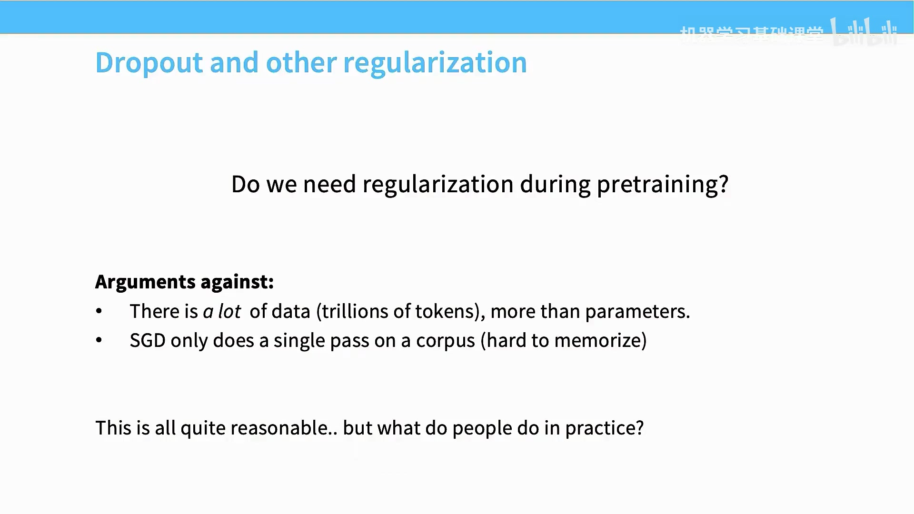

*60:38。大语料 single-pass training 让传统 overfitting 直觉发生变化。*

但 **weight decay 仍然广泛存在**。这不必解释为“模型在记忆训练集，所以要正则化”。本讲强调另一种机制：weight decay 会和 optimizer、learning-rate schedule 相互作用，改变优化轨迹。在一些实验中，训练/验证 loss 并没有出现典型 overfitting gap，但较强 weight decay 配合 learning-rate decay 可以得到更好的最终 minimum。

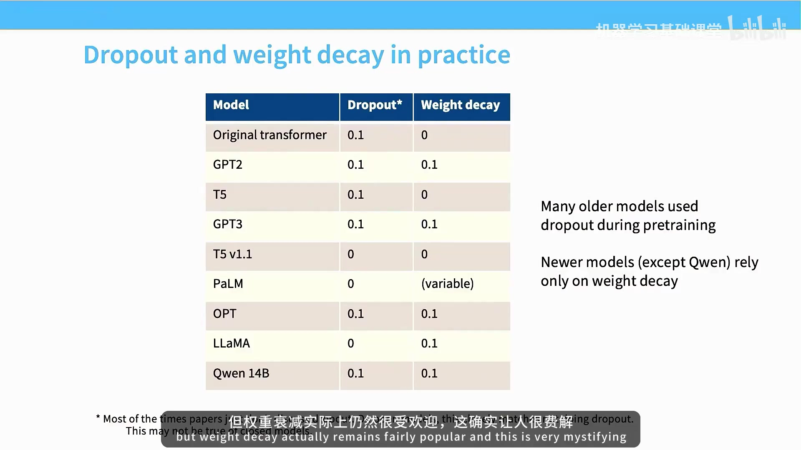

*61:16。现代模型仍常保留 weight decay，即使 dropout 已经减弱。*

因此，regularization hyperparameter 不宜孤立理解。对 LLM 训练而言，它们可能同时影响 optimization geometry、允许的 learning rate、decay trajectory 与最终稳定性。

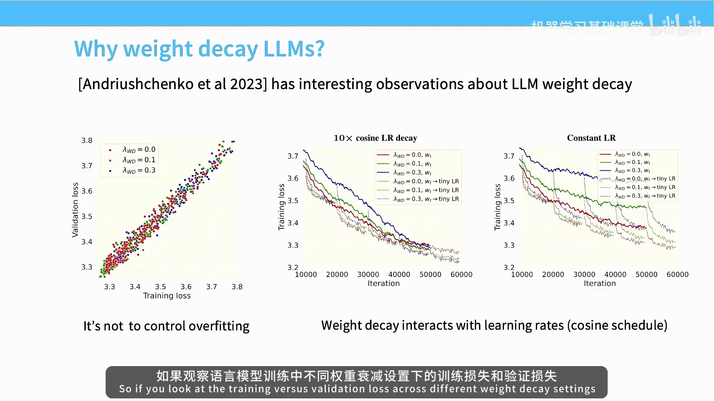

*61:50。课件展示 weight decay 与训练轨迹/学习率调度的相互作用。*

## 8. Stability：softmax 是高风险区

随着训练预算增长，“偶尔爆一次”会从小麻烦变成昂贵事故。讲师把 softmax 视为重点排查对象，因为它同时包含 exponential 和 normalization/division，数值尺度不受控时容易出现极端值。语言模型中有两个关键 softmax：

1. output vocabulary softmax；
2. attention softmax。

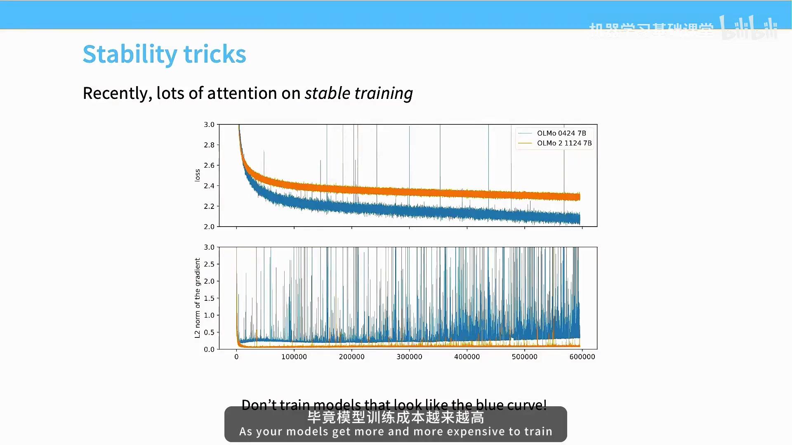

*65:20。稳定训练的目标是避免 loss/gradient spike 把长时间训练拖入不可恢复状态。*

### 8.1 Output softmax：z-loss

设输出 logits 为 $u_i$，softmax normalizer 为

$$
Z=\sum_i e^{u_i}.
$$

softmax 对整体平移 logits 不敏感，因此 $\log Z$ 存在一个可被利用的“自由度”。z-loss 通过额外惩罚：

$$
\mathcal{L}_{z}=\lambda\bigl(\log Z\bigr)^2
$$

把 $\log Z$ 拉向 0，避免 normalizer 走到极端尺度，同时尽量不改变模型要表达的相对概率。

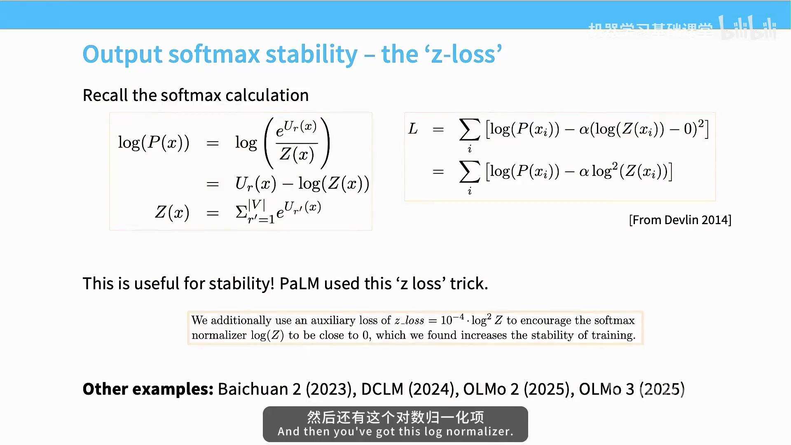

*67:26。z-loss 直接约束 log normalizer 的幅度。*

### 8.2 Attention softmax：QK norm

标准 attention logits 为：

$$
A=\frac{QK^\top}{\sqrt{d_h}}.
$$

如果 $Q$ 或 $K$ 的 norm 在训练过程中持续增大，softmax 会越来越尖锐并出现 instability。QK norm 在点积前分别归一化 $Q$ 与 $K$：

$$
A=\frac{\mathrm{Norm}(Q)\,\mathrm{Norm}(K)^\top}{\sqrt{d_h}}.
$$

这样直接控制进入 attention softmax 的尺度。讲师指出，QK norm 已经从早期 multimodal 模型经验扩散到大量 open language models，成为非常常见的稳定性措施。

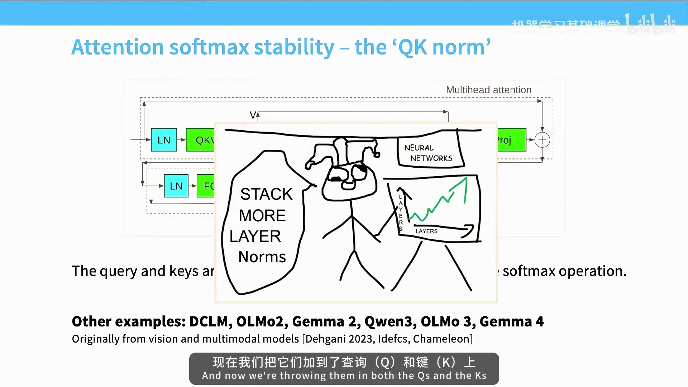

*71:50。QK norm 的核心是把稳定性约束放在 softmax 之前。*

另一种更强的办法是 **logit soft-capping**，例如用有界的 tanh 变换把 attention logits 限制在固定范围内。Gemma 系模型使用过这类方法。它能更强硬地阻止极端 logits，但代价也更明显：如果限制过强，会压制模型表达非常 confident attention 的能力，因此实验中可能出现 quality loss。

这里可以把三类稳定化方法看成从“较软”到“较硬”的层次：

- residual-path / extra Norm：改善信号传播；
- QK norm：控制 softmax 输入尺度；
- logit soft-cap：直接限制 logits 可达到的范围。

## 9. MQA / GQA：为 decode 的 memory traffic 重新设计 attention

训练或 prefill 时，矩阵乘法有较大的 batch / sequence 维度，往往能保持较高 arithmetic intensity。autoregressive decode 不同：每次只生成一个新 token，系统需要反复读取模型权重和历史 KV cache，计算量相对小，memory movement 反而变得突出。

标准 KV cache 保存过去各位置的 key/value：随着 sequence length、layer 数和 KV head 数增长，cache 也线性增长。于是 attention head 的组织方式直接影响 serving 成本。

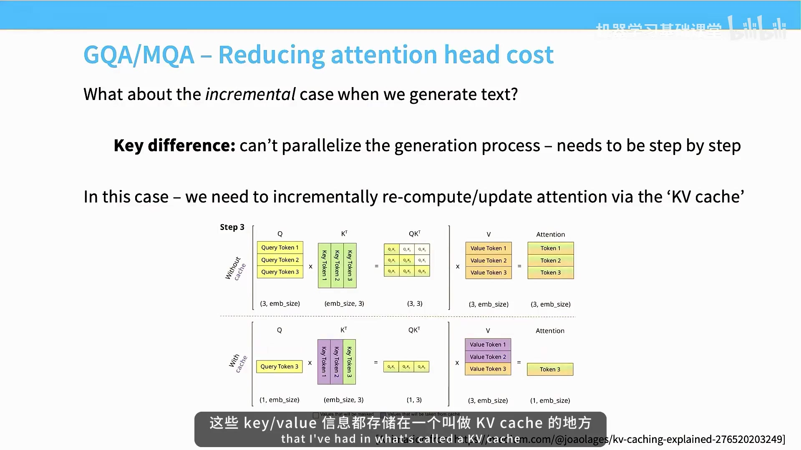

*77:26。decode 阶段的核心瓶颈逐渐从纯 FLOPs 转向 KV-cache 与参数读取。*

### 9.1 MQA：所有 query heads 共享一组 K/V

Multi-Query Attention（MQA）仍保留多个 query heads，但让它们共享 key/value head。这样 KV cache 显著缩小，memory traffic 也下降。

代价是表达能力下降：不同 query heads 无法拥有各自独立的 K/V representation。它把系统效率推得很远，但 quality trade-off 也更明显。

### 9.2 GQA：在质量与成本之间加一个连续旋钮

Grouped-Query Attention（GQA）保留多个 query heads，同时只使用较少数量的 K/V heads；每个 K/V head 服务一组 query heads。于是可以调节：

$$
1\le n_{kv\_heads}\le n_{q\_heads}.
$$

- $n_{kv\_heads}=n_{q\_heads}$：接近标准 multi-head attention；
- $n_{kv\_heads}=1$：退化为 MQA；
- 中间值：GQA。

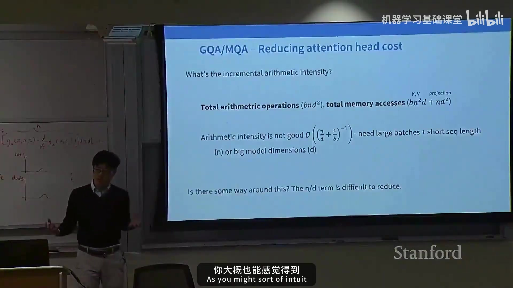

*78:04。减少 K/V heads 能直接降低 KV-cache 成本。*

实验上的 trade-off 往往很有利：GQA 能拿到大部分 multi-head quality，同时明显降低 decode 成本，因此被大量现代模型采用。

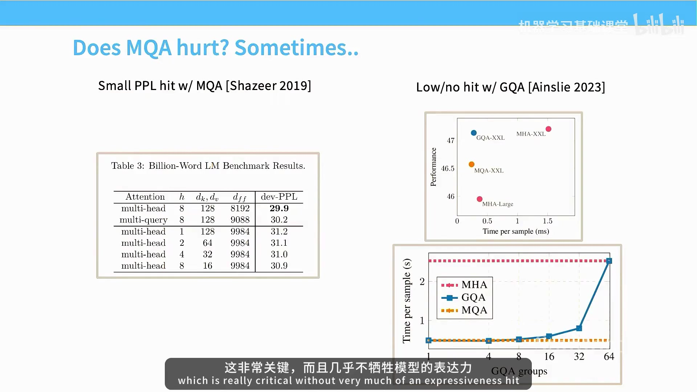

*83:06。GQA 通过分组控制 memory saving 与 model quality 的平衡。*

## 10. Sliding-window / hybrid attention

最后一部分把重点转到 long context。全局 attention 让每个 token 都能访问所有历史位置，能力强但成本随 context 增长很快。sliding-window attention 只允许每个 token 访问附近固定窗口：

$$
\mathrm{Attn}(i)\subseteq\{j\mid i-w<j\le i\}.
$$

单纯把所有层都变成 local attention 会丢失远距离通信。更常见的现代做法是 **interleaving**：多数层用便宜的 local/alternative layer，间隔若干层插入一次 full attention。

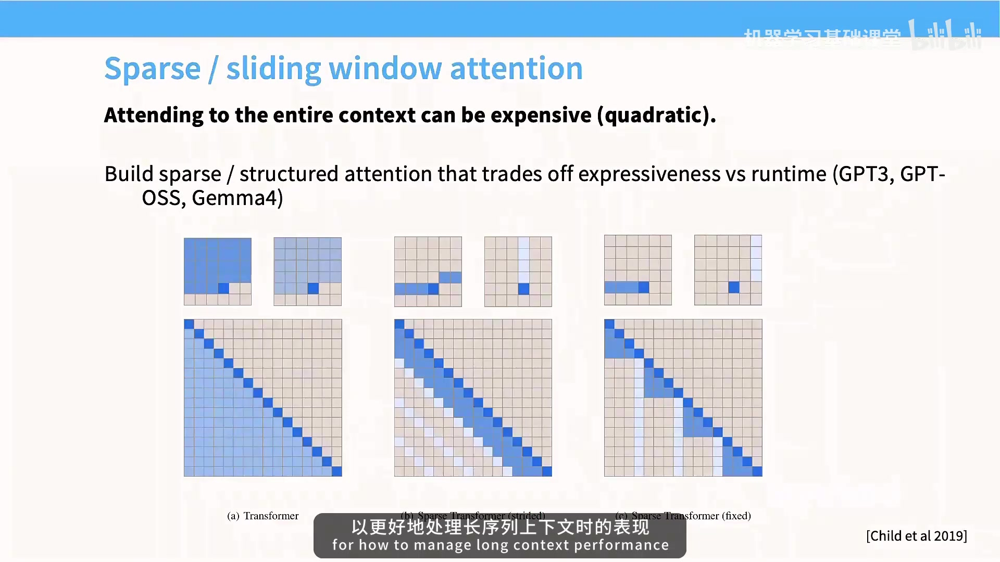

*85:46。局部窗口显著缩小注意力范围，周期性 full attention 负责重新建立全局通信。*

讲师列举的近期模式包括：Llama 4、Gemma 4、OLMo 3 等模型混合 local 与 full attention；Qwen3.5 则采用另一种 cheap layer——gated delta net，并周期性插入 full attention。共同思想是：**不要在每一层都为全局依赖支付同样的成本。**

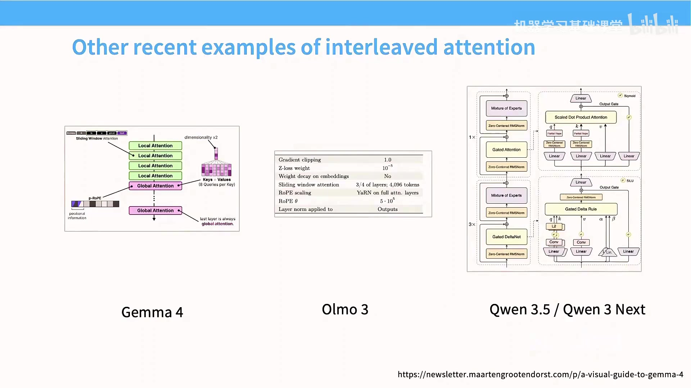

*88:30。不同模型采用不同 cheap layer，但“若干便宜层 + 周期性全局层”的结构逐渐形成共同模式。*

这部分仍然是活跃研究区。与 Norm、SwiGLU 等已经高度收敛的选择相比，**长上下文中的位置表示、local/global mixing、state-space/linear-attention 替代方案仍在快速变化**。

## 11. 把整讲压缩成一套可执行默认值

如果现在要从零实现一个现代 dense autoregressive Transformer，本讲给出的经验起点可以整理成下表。它们是已经被很多模型验证过的 default region，不是理论上唯一正确的配置。

| 设计点 | 实用默认 | 主要理由 | 需要继续调的地方 |
| --- | --- | --- | --- |
| Residual / Norm | Norm 放在 residual stream 外；pre-norm 是稳健起点 | 梯度传播、稳定性 | double norm / post-sub-layer norm 可用于进一步稳定 |
| Norm 类型 | RMSNorm | 较低 data-movement 成本，效果通常不差于 LayerNorm | kernel、硬件与训练稳定性 |
| FFN activation | SwiGLU / GeGLU | gated FFN 有稳定经验收益 | gate 类型本身通常没那么敏感 |
| FFN width | plain FFN 约 $4d_{model}$；GLU parameter-match 约 $2.67d_{model}$ | 大量模型与 sweep 的宽容区间 | 硬件矩阵形状、参数预算 |
| Attention head size | $h\,d_{head}\approx d_{model}$ | 广泛使用且较宽容 | serving kernel、GQA 设计 |
| Depth/width | $d_{model}/n_{layer}\sim100$ 为常见量级 | 表达能力与并行效率折中 | 具体模型规模与集群拓扑 |
| Position | RoPE 是成熟默认 | 相对位置几何、实现成熟 | 长上下文扩展仍在快速变化 |
| Regularization | dropout 通常较弱；weight decay 需要和 LR schedule 联调 | weight decay 可能主要影响优化轨迹 | optimizer 与 schedule 强耦合 |
| Stability | z-loss / QK norm 是常见工具；soft-cap 更强硬 | 控制 output/attention softmax 的危险尺度 | 过强约束会牺牲质量 |
| Decode efficiency | GQA 是常见折中 | 缩小 KV cache、降低 memory traffic | KV-head 数与质量/吞吐折中 |
| Long context | local/cheap layers 与 full attention 交错 | 控制长上下文成本 | 仍是活跃研究区 |

## 12. 最值得带走的三点

第一，**现代 Transformer 的主干其实非常稳定**。Norm 的位置、RMSNorm、gated FFN、serial blocks、RoPE 等已经形成高度可复用的经验组合。很多超参数也存在宽容 basin，没必要一开始就在巨大搜索空间里盲目 sweep。

第二，**系统约束已经进入架构本身**。RMSNorm、parallel/serial block 的讨论、GQA/MQA、sliding-window attention 都说明：实际 runtime、memory bandwidth、KV-cache size 和并行方式会反向决定模型结构。FLOPs 只是成本的一部分。

第三，**稳定性和长上下文是 2026 架构变化最活跃的两条线**。QK norm、z-loss、soft-capping 直接处理训练风险；local/global hybrid attention 则处理 context 扩展成本。下一讲继续讨论 attention alternatives 与 mixture of experts 时，这两条线会进一步展开。

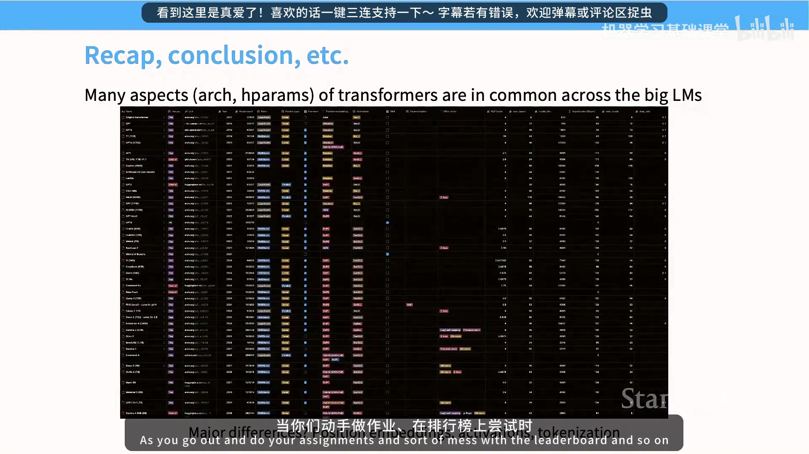

*89:02。本讲最后回到模型对照表，总结哪些设计已形成共识、哪些仍在快速变化。*

## 官方资料

- Spring 2026 course schedule: <https://cs336.stanford.edu/>
- Spring 2026 Lecture 3 slides: <https://github.com/stanford-cs336/lectures/blob/main/lecture_03.pdf>
- Stanford Online Spring 2026 Lecture 3 video: <https://www.youtube.com/watch?v=lVynu4bo1rY>
- Spring 2026 lecture materials repository: <https://github.com/stanford-cs336/lectures>

本讲官方 Schedule 没有单独关联 paper / assigned reading / required reading，因此 package 的 `papers/` 目录保持为空；未将 Assignment 1 handout 强行并入本讲正文。
