---
workflow:
  name: ChatGPT-Web-Course-Note-Workflow
  version: v4.9.4
course:
  name: "CS336: Language Modeling from Scratch"
  term: "Spring 2026"
  instructors:
    - "Tatsunori Hashimoto"
    - "Percy Liang"
chapter:
  index: 4
  local_label: "P04"
  official_unit_label: "Lecture"
  official_unit_number: 4
  official_title: "Attention alternatives and mixture of experts"
  lecturer: "Tatsunori Hashimoto"
  date: "2026-04-08"
provenance:
  lecture_video_term: "Spring 2026"
  official_materials_term: "Spring 2026"
  subtitle_origin: "unverified local WebVTT; used as a timing/text aid and cross-checked against the video"
---

# Lecture 4: Attention alternatives and mixture of experts

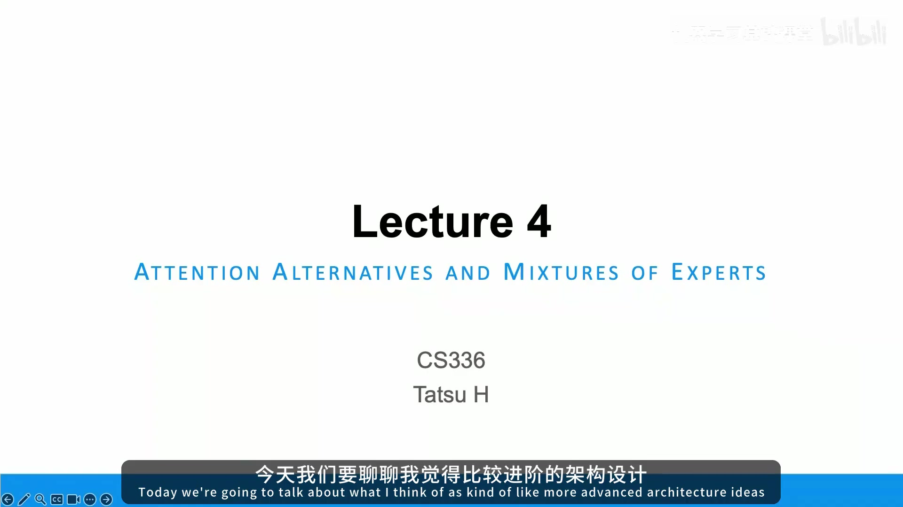

本讲讨论两类现代语言模型架构技术。第一类试图缓解标准 attention 随序列长度二次增长的问题，包括 linear attention、Mamba-2、Gated DeltaNet、hybrid attention 和 sparse attention。第二类是 Mixture of Experts（MoE）：让每个 token 只激活一小部分 FFN experts，从而把总参数量与单 token 的计算量部分解耦。

章节身份已与 Spring 2026 官方 Schedule 交叉核验：本地 `P04` 对应官方 Lecture 4，日期为 2026-04-08，授课教师为 Tatsunori Hashimoto（Tatsu）。官方 repository 中存在本讲 `lecture_04.pdf`；本次可确认其文件身份和元数据，但当前可用 connector 无法返回该 PDF 的二进制内容，因此正文没有把未实际读取的 PDF 内容作为独立证据。课堂视频及其可见课件是本文的主要视觉来源。

配套入口：

- [CS336 Spring 2026 course site](https://cs336.stanford.edu/)
- [Spring 2026 lecture materials repository](https://github.com/stanford-cs336/lectures)
- [Lecture 4 official PDF entry](https://github.com/stanford-cs336/lectures/blob/main/lecture_04.pdf)

## 1. 为什么需要 attention alternatives

标准 Transformer 的 attention 在长上下文下会逐渐成为主要瓶颈。若序列长度为 $n$，直接计算 $QK^\top$ 会生成 $n\times n$ 的 attention matrix，因此计算和中间状态都随 $n^2$ 增长。课程给出的思路大致分成三层：

1. **限制 attention 范围**：例如 local/window attention，只看附近 token。
2. **混合不同机制**：多数层使用便宜的线性或局部机制，间隔若干层再使用 full attention。
3. **改变机制本身**：linear attention、state-space / recurrent variants、sparse attention 等直接改变随序列长度增长的方式。

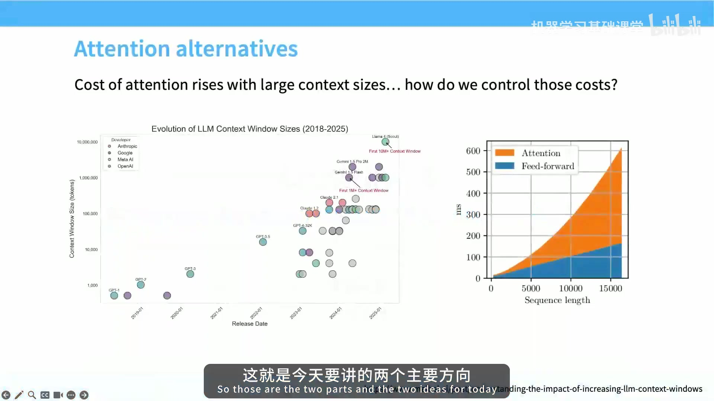

这里要区分两种优化。FlashAttention 一类系统优化主要改善常数项和 memory traffic，不改变标准 attention 的 $O(n^2)$ 依赖；而本讲的 architectural alternatives 试图改变长上下文下的计算结构。

## 2. Linear attention：先用结合律消掉 $n\times n$ 中间矩阵

课程先把 attention 写成

$$
\operatorname{Attn}(Q,K,V)=\rho(QK^\top)V.
$$

为了说明 linear attention 的核心代数结构，先把 $\rho$ 看成 identity。此时可利用矩阵乘法结合律：

$$
(QK^\top)V = Q(K^\top V).
$$

标准顺序先形成 $QK^\top\in\mathbb{R}^{n\times n}$，主要工作量约为

$$
n^2d_k+n^2d_v.
$$

改成先计算 $K^\top V$ 后，课件给出的主要工作量为

$$
2nd_vd_k,
$$

因此在 $d_k,d_v$ 固定时对序列长度 $n$ 呈线性增长。这里的关键不是把普通 softmax attention 直接交换括号；softmax 这类非线性 $\rho$ 会破坏这个简单的结合律。Linear-attention 方法需要重新设计可分解的 weighting / feature map，使计算具有类似结构。

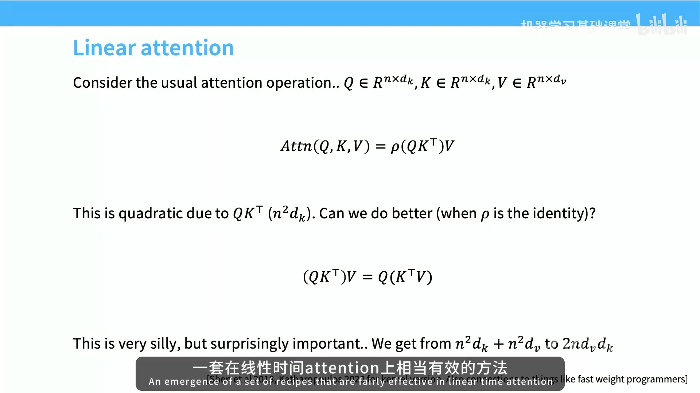

### Recurrent form 与 duality

同一计算还能改写成逐 token 的 recurrent state：

$$
S_t=S_{t-1}+k_tv_t^\top,
$$

$$
y_t=q_t^\top S_t.
$$

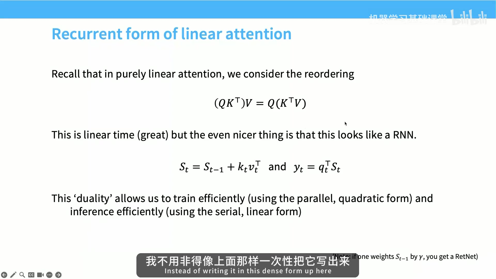

这个改写给出本讲反复出现的一个思路：

- **训练时**可以用 dense/parallel form，一次处理整个序列；
- **自回归推理时**可以维护固定尺寸的状态 $S_t$，每步增量更新。

课程把这种训练并行形式与推理 recurrent 形式之间的对应称为 duality。它也是后面 Mamba-2、Gated DeltaNet 等方法的重要背景。

## 3. 从 linear attention 到 Mamba-2

基础 linear recurrence 是

$$
S_t=S_{t-1}+k_tv_t^\top,
\qquad
y_t=q_t^\top S_t.
$$

Mamba-2 在状态更新里加入依赖输入的 gate：

$$
S_t=\gamma_tS_{t-1}+k_tv_t^\top,
$$

$$
y_t=q_t^\top S_t+v_t^\top D,
\qquad \gamma_t=f(x_t).
$$

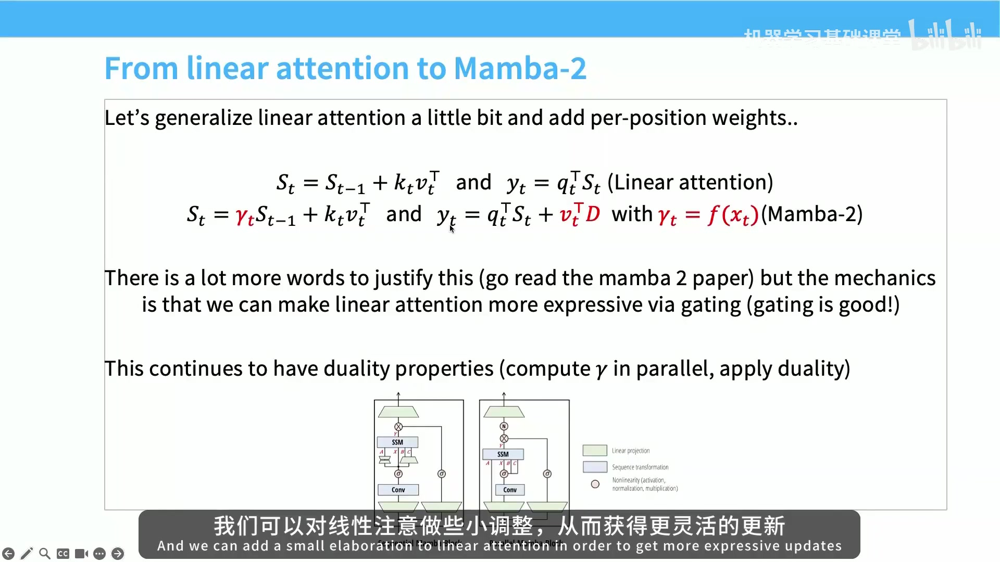

$\gamma_t$ 控制旧状态保留多少。相比始终把历史等权累积进 $S_t$，模型获得了输入相关的 forgetting / gating 能力。课程强调，这种扩展仍保留 parallel form 与 recurrent form 之间的 duality，因此既能追求训练并行性，也能在推理时使用紧凑状态。

## 4. Gated DeltaNet：不仅 gate，还选择性擦除状态

Gated DeltaNet 进一步把 update 写成

$$
S_t=\gamma_t\left(I-\beta_tk_tk_t^\top\right)S_{t-1}+\beta_tk_tv_t^\top,
$$

$$
y_t=q_t^\top S_t,
\qquad \gamma_t=f(x_t),\quad \beta_t=f(x_t).
$$

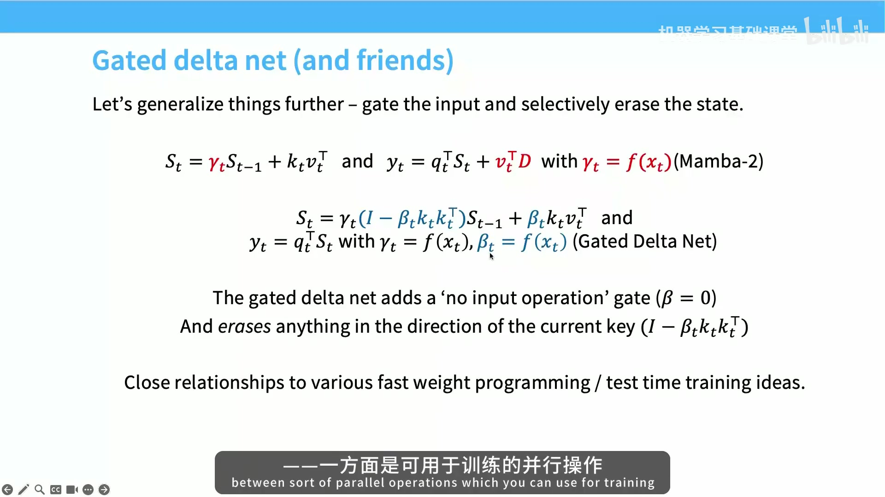

这里有两个重要机制：

- $\beta_t=0$ 时相当于一个“no input operation” gate，本步不写入新的 $k_tv_t^\top$；
- $I-\beta_tk_tk_t^\top$ 会沿当前 key 对应的方向调整、擦除旧状态，因此 update 不再只是“不断累加”。

这使 recurrence 更像一个可学习的 fast-weight memory。课程也把它与 fast weight programming / test-time training 一类思想联系起来。

## 5. Hybrid attention：线性机制负责大部分层，full attention 定期校正

完全抛弃 full attention 并不是唯一选择。实际模型常把便宜机制和标准 attention 混合使用。

课程给出的两个代表例子：

- **MiniMax M1**：7 个 linear-attention layer 配 1 个 full softmax-attention layer，即 7:1 hybrid。
- **Qwen 3.5 / Qwen Next**：课上展示为 3:1 的 Gated DeltaNet / attention hybrid。

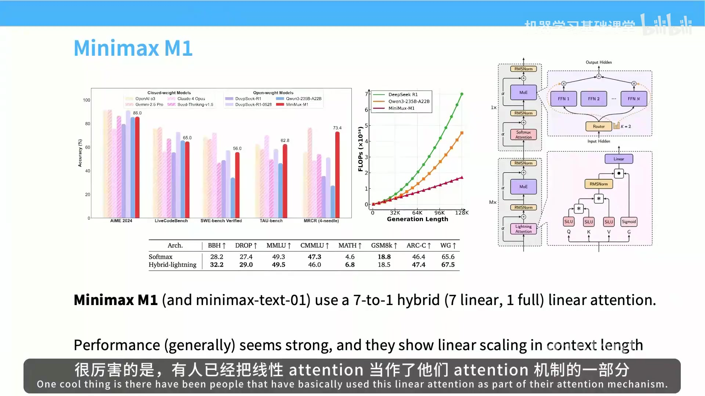

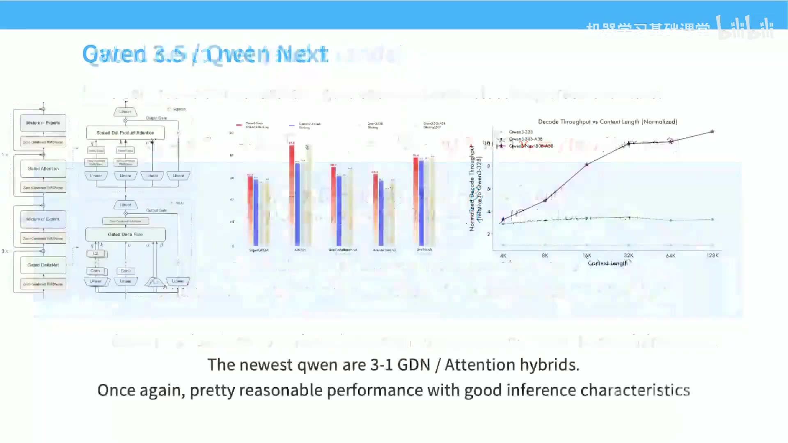

这种设计保留少量 full attention 的全局交互能力，同时让大部分层避免二次 attention cost。课程展示的 Qwen Next 对比强调：随着 context length 增长，这类 hybrid 的 decoding throughput 下降得更慢，而模型能力并未因为减少 full-attention 层而明显崩溃。

## 6. Sparse attention 与 DSA：不必让每个 query 看所有位置

另一条路线不是把 attention 换成 recurrence，而是保留 attention 形式，但只对选中的位置计算。

DeepSeek Sparse Attention（DSA）的课堂示意可以概括成两步：

1. 使用一个轻量 indexer 为历史位置打分，挑出 Top-K 候选；
2. 只在这些候选位置上执行常规 attention。

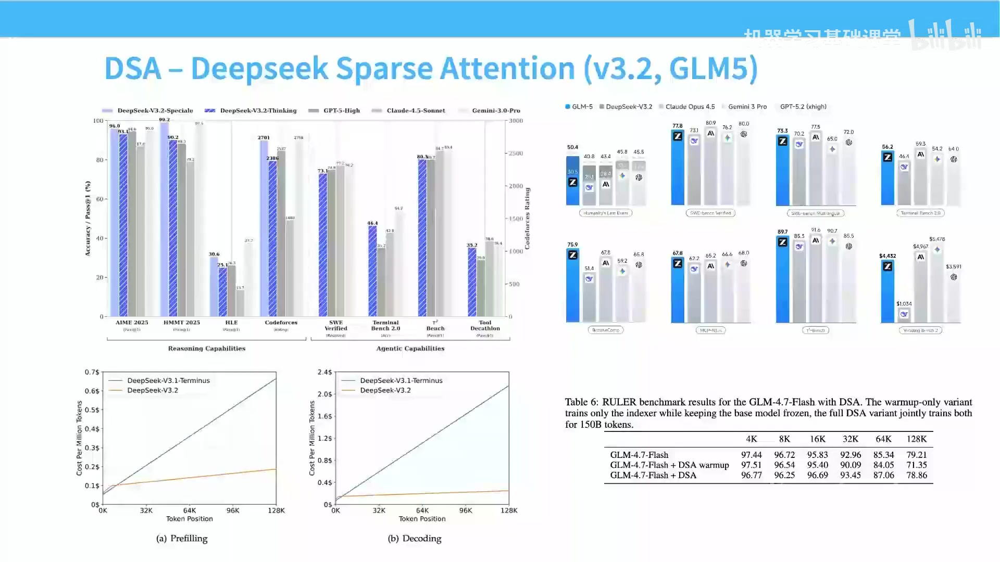

这和后半讲的 MoE 有一个重要结构上的共同点：**先用便宜的 selector/router 做离散稀疏选择，再把昂贵计算集中到被选中的少数项上。** DSA 选择 token positions；MoE router 选择 experts。

## 7. Attention alternatives 小结

| 机制 | 核心状态/选择 | 长上下文思路 | 课程强调的特点 |
| --- | --- | --- | --- |
| Linear attention | $S_t$ 累积 $k_tv_t^\top$ | 避免显式 $n\times n$ attention matrix | parallel/recurrent duality |
| Mamba-2 | $\gamma_tS_{t-1}+k_tv_t^\top$ | 输入相关 forgetting | 更有表达力，仍保留 duality |
| Gated DeltaNet | gate + directional erase | 对状态做选择性写入和擦除 | 与 fast weights / test-time training 有联系 |
| Hybrid | 少量 full attention + 多数便宜层 | 把二次 cost 限制在少量层 | 工程上常见，质量/吞吐折中直接 |
| Sparse attention / DSA | Top-K positions | 只算少数位置的 attention | selector + sparse expensive compute |

课程并没有给出“某一种机制已经彻底取代 attention”的结论。更实际的趋势是 hybrid、sparsity 与更高效 recurrent mechanism 同时发展。

## 8. Mixture of Experts：把稀疏性放进 FFN

Attention alternatives 主要处理 sequence dimension；MoE 则处理 parameter dimension。一个普通 Transformer block 中，FFN 对每个 token 都使用同一组参数。MoE 把这个 FFN 换成多个 experts，并增加 router，让每个 token 只送到其中少数几个 experts。

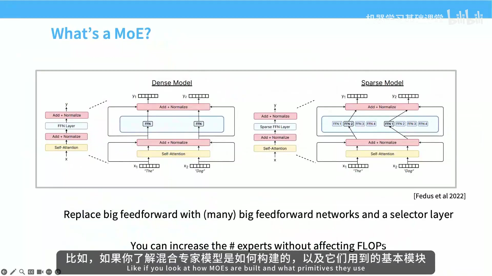

因此 MoE 的核心收益是：

- **总参数量可以很大**，模型有更多 capacity；
- **单 token 只激活少数 experts**，forward FLOPs 不与总参数量等比例增长；
- expert 天然形成可分配到不同设备的模块，为 systems parallelism 提供新的切分维度。

课程在多个图中强调“total parameters”和“activated parameters”的区别。对推理 compute 而言，后者通常更接近实际每 token 支付的 FLOPs。

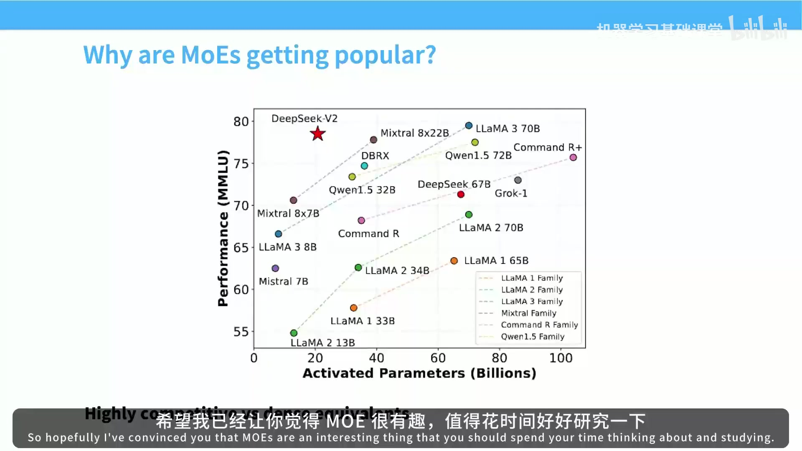

课上引用的 OlMoE 对比中，MoE 在对应设置下被描述为大约能以 dense model 的两倍训练速度达到相近进度；这属于所展示实验的经验结果，不应理解成所有 MoE 都固定有 2x 加速。

## 9. Router 的设计空间

Router 决定 token 和 expert 之间的稀疏连接。课程把可能的 routing 方式分成几类：

- **token chooses expert**：每个 token 选择若干 experts；
- **expert chooses token**：每个 expert 选择若干 token；
- **global assignment**：把整批 token 与 experts 的分配作为全局匹配问题求解。

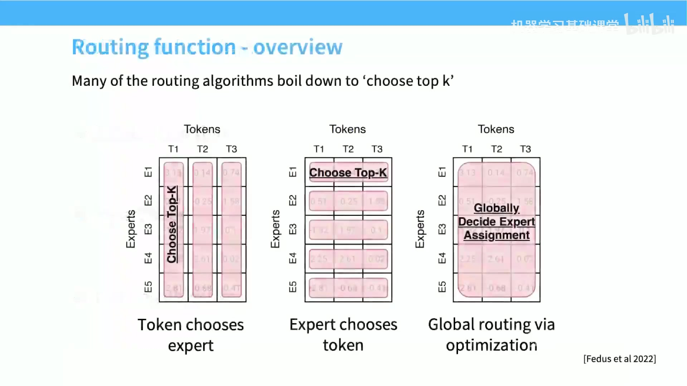

实践中最常见的是 token-choice Top-K routing。Router 本身可以很简单：给每个 expert 一个学习到的向量 $e_i$，token hidden state $u_t^l$ 与它做内积并经 softmax 得到 score。

课程也提到 hash routing、RL routing 和 global matching，但这些方案没有取代简单 Top-K 成为主流。

## 10. Top-K routing 的公式

课堂给出的经典形式为

$$
h_t^l=
\sum_{i=1}^{N}\left(g_{i,t}\operatorname{FFN}_i(u_t^l)\right)+u_t^l,
$$

其中

$$
g_{i,t}=
\begin{cases}
s_{i,t}, & s_{i,t}\in \operatorname{TopK}(\{s_{j,t}\mid 1\le j\le N\},K),\\
0, & \text{otherwise},
\end{cases}
$$

$$
s_{i,t}=\operatorname{Softmax}_i\left((u_t^l)^\top e_i^l\right).
$$

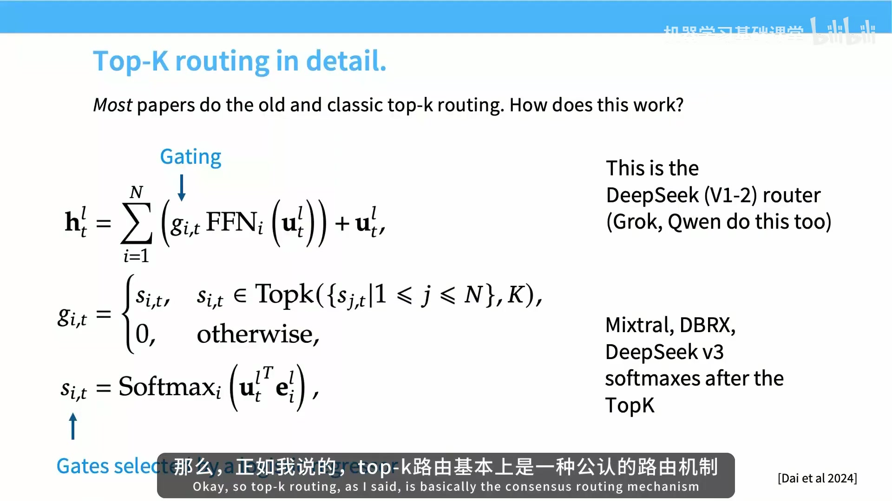

直观上，router 为 token 对所有 experts 打分，只保留 Top-K；未选中的 expert 不参与该 token 的 FFN 计算。复杂模型的许多差异并不在“有没有 router”，而在 expert granularity、shared experts、score normalization、balancing、device constraints 等细节上。

## 11. Fine-grained experts 与 shared experts

DeepSeekMoE 推广了两项后来很常见的设计：

- **fine-grained experts**：把较大的 experts 切成更多、更小的 routed experts，让组合更细；
- **shared experts**：部分 experts 不经过 router，对所有 token 都启用，用来承担通用计算。

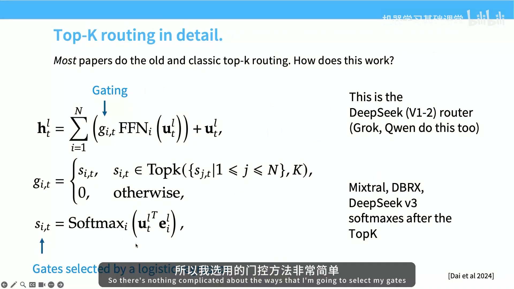

课程展示的 DeepSeek ablation 支持更细粒度 expert 和 shared expert 的组合；随后又用 OlMoE 的 controlled ablation 提醒：fine-grained experts 的收益较稳定，而 shared experts 的收益在不同研究中并不一致。这是一个很好的读论文习惯：不要把某个模型家族中的设计选择自动等同为已被普遍验证的必要条件。

## 12. Router 为什么难训练：离散 Top-K 与 expert collapse

Top-K routing 的选择是离散的。课程先讨论两类直观方案：

- **RL / policy-gradient routing**：可以工作，但梯度方差和复杂度较高，课堂展示的研究中并没有成为最佳方案；
- **stochastic approximation**：在 routing score 上加噪声，让接近的 experts 有探索机会，再执行 Top-K。

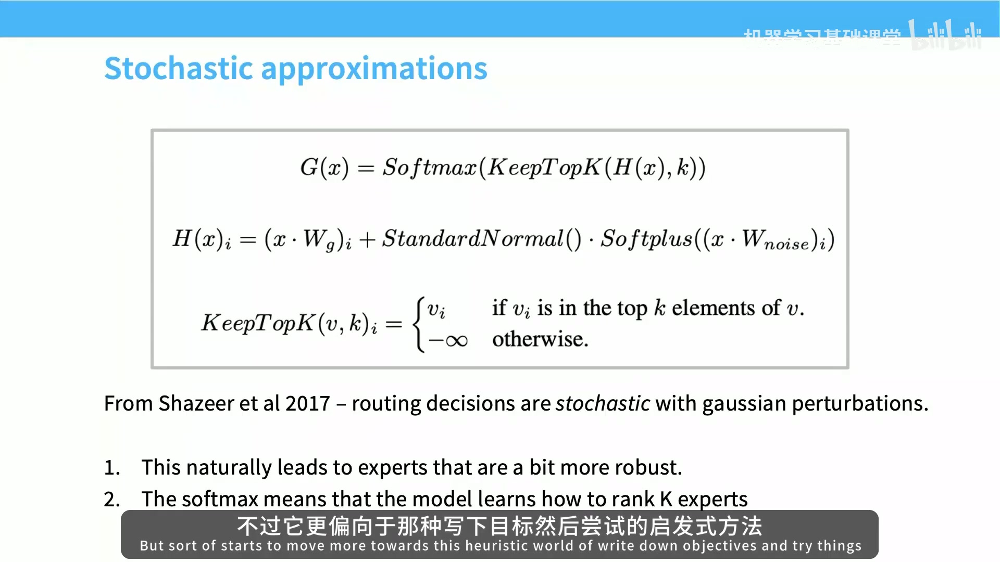

但真正的大问题是 feedback loop：一个 expert 如果早期更常被选中，就会收到更多梯度，因而变得更强，再进一步更容易被 router 选中。结果可能是 **expert collapse / expert starvation**，绝大多数 token 集中到少数 experts。

因此现代 MoE 训练高度依赖 balancing mechanisms。

## 13. Load balancing：用额外目标压制“富者愈富”

课程用 Switch Transformer 风格的辅助 loss 解释最典型的 balancing heuristic：

$$
\mathcal{L}_{\text{balance}}
=\alpha N\sum_{i=1}^{N}f_iP_i,
$$

其中

$$
f_i=\frac{1}{T}\sum_{x\in B}
\mathbf{1}\{\arg\max p(x)=i\},
$$

$$
P_i=\frac{1}{T}\sum_{x\in B}p_i(x).
$$

$f_i$ 表示实际 dispatch 到 expert $i$ 的 token 比例，$P_i$ 表示 router 分给该 expert 的概率质量。这个式子不必从“漂亮的一阶原理”去理解；课程更强调看它的梯度作用：expert 越热门，对其 routing probability 的下压越强。

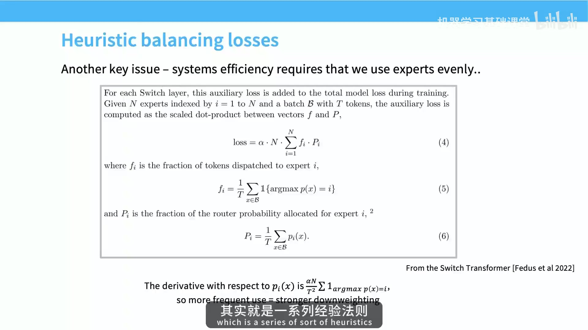

DeepSeek v1/v2 除了 expert-level balancing，还加入 device-level balancing，因为 experts 分布在不同设备时，仅让 expert 数量均匀并不足以保证机器 utilization 均匀。

DeepSeek v3 又引入 per-expert bias，通过在线更新 bias 来调节不同 experts 被选择的频率，减少对显式 auxiliary balancing loss 的依赖。

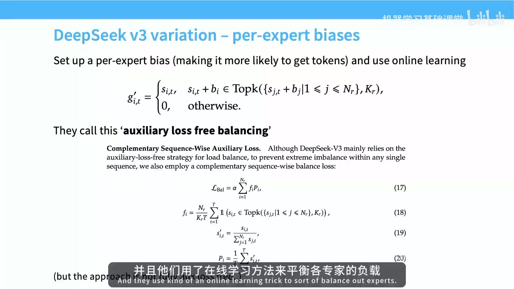

课程同时展示 OlMoE ablation：直接去掉 load-balancing loss 会显著恶化 loss，并让 token routing 集中到很少的 experts。结论是：目前 balancing 仍是 MoE 训练的核心工程问题，不能因为目标函数显得 heuristic 就忽略它。

## 14. Systems：Expert Parallelism 与 sparse matmul

MoE 的计算稀疏不意味着系统自动高效。所有 expert 参数仍要存储，而且 token 会被 router 发往不同 experts；如果 experts 位于不同 GPU，就需要跨设备搬运 activations。

基本过程是：

1. 每个设备先持有输入 token 的一部分；
2. router 计算每个 token 的目标 experts；
3. all-to-all 类通信把 token activations 发到对应 expert 所在设备；
4. 各设备对收到的 token 执行 expert FFN；
5. 结果再通信回来并合并。

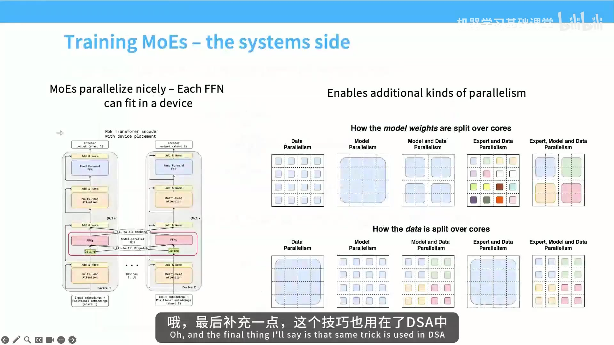

这个模式带来两类关键成本：

- **communication**：expert 越分散，跨设备流量越重要；
- **irregular compute**：不同 experts 收到的 token 数不一样，实际计算是 sparse / block-structured matrix multiplication。

课程提到 MegaBlocks 一类系统通过 block-sparse computation 更直接地支持这种 workload。它还讨论了减少 routing 前 activation dimension 等架构修改，本质目标都是降低 expert-parallel communication cost。

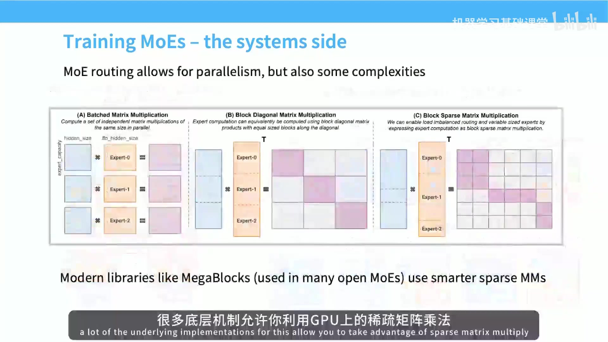

## 15. Token dropping、dropless MoE 与 batch stochasticity

早期系统经常给每个 expert 设置 capacity。如果某个 batch 中被分配给 expert 的 token 超过 capacity，多余 token 可能直接被 drop。这样一来，同一个 token 是否真正通过某个 expert，会依赖同 batch 中其他 token 的 routing，产生额外 stochasticity。

现代 block-sparse / dropless implementation 可以避免依靠 token dropping 来满足固定 capacity，从而让模型行为和系统实现更干净。

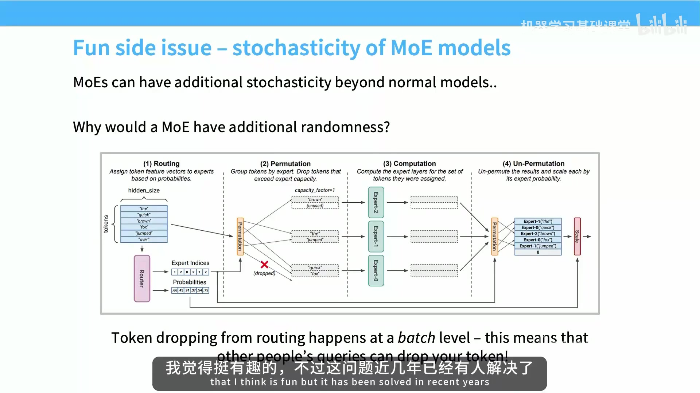

## 16. Router stability 与 z-loss

MoE 又引入了一套 router logits 和 softmax，因此训练稳定性多出一个敏感点。课程展示的 OlMoE ablation 表明 router z-loss 对抑制 instability spike 有帮助。

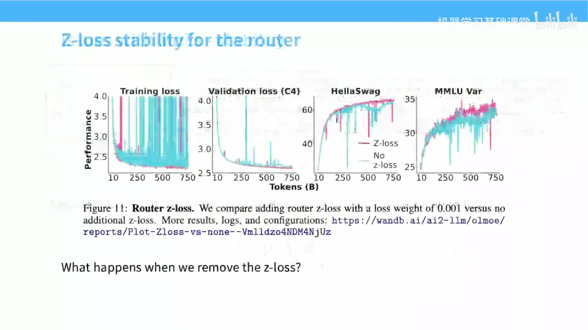

这里的经验值得单独记住：MoE 的困难不只来自“选哪个 expert”的算法问题，还来自 router numerical behavior、load balance、communication 和 sparse kernel 的联合作用。

## 17. Fine-tuning MoE

Sparse model 的总参数量很大，fine-tuning 时更容易出现训练集与验证集之间的 gap。课程列出几种实用选择：

- 只 fine-tune 非 MoE 部分，例如 attention；
- 冻结或部分冻结 experts；
- 数据足够多时再 fine-tune 全部 experts。

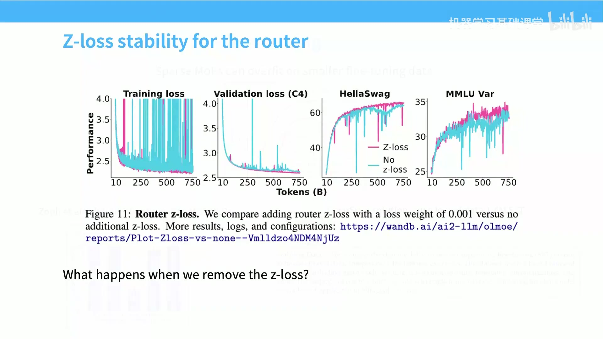

因此 fine-tuning MoE 不能简单沿用 dense model 的“所有参数一起训”默认做法；训练数据规模和要更新的参数子集需要一起考虑。

## 18. Upcycling：把 dense checkpoint 转成 MoE

Upcycling 的基本办法是：从一个已经训练好的 dense model 出发，把原 FFN 权重复制到多个 experts，新增随机初始化的 router，然后继续训练，让 experts 逐渐分化和专门化。

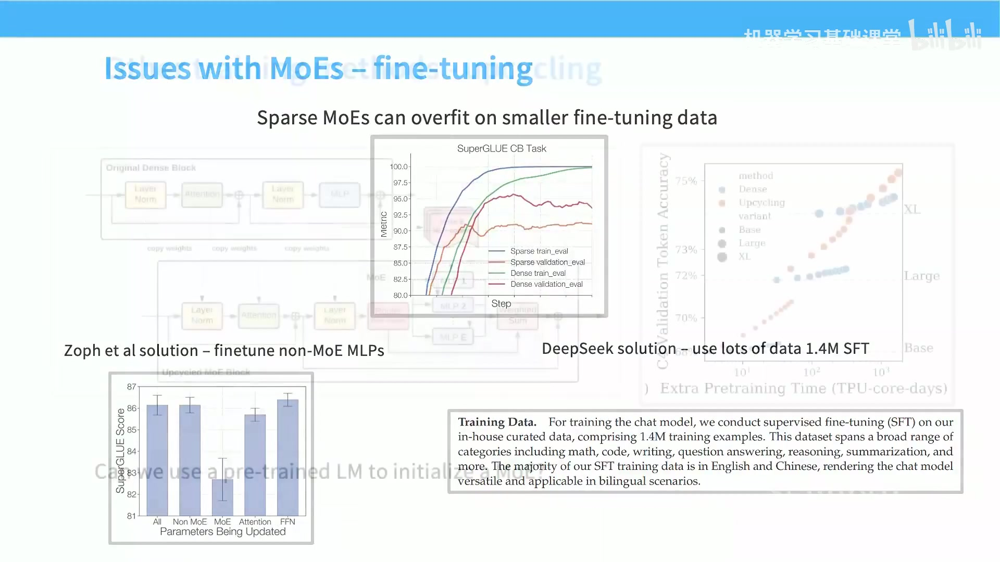

课程给出两个历史例子：

| 模型 | Dense 初始化 | Upcycled MoE | 课堂强调 |
| --- | --- | --- | --- |
| MiniCPM | 2.4B | 约 13.4B total，约 4B active | 在保留较低 activated compute 的同时扩大总参数量 |
| Qwen1.5-MoE | 1.8B Qwen | A2.7B；Top-K=4，60 routed experts + 4 shared experts | 较早的大规模成功 upcycling 案例之一 |

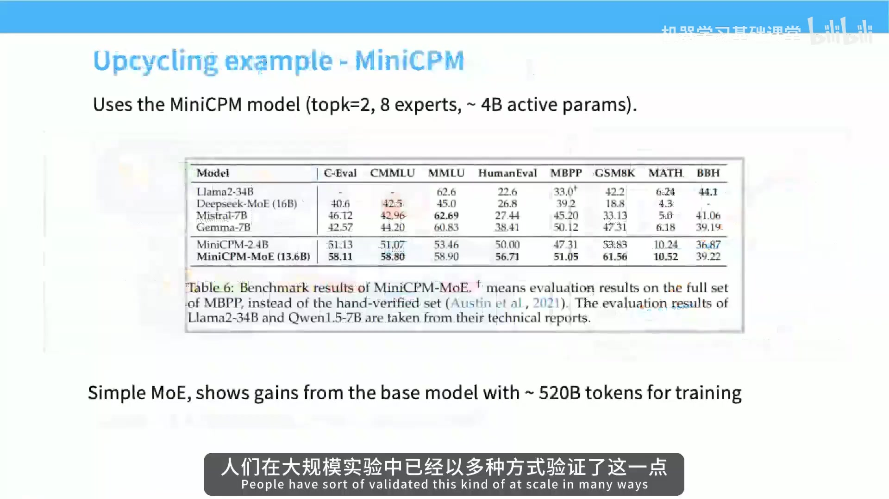

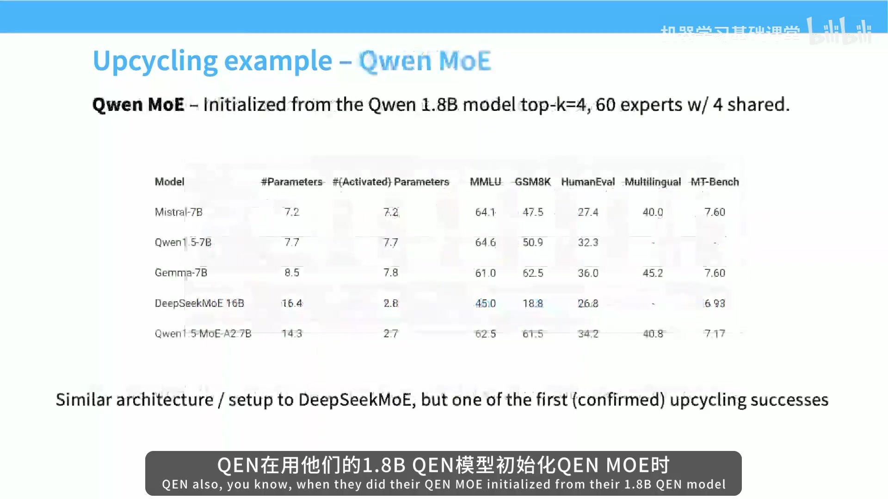

课程也指出，随着大规模训练直接从头采用 MoE，upcycling 已不像早期那样是必经路线；但它仍是理解 MoE 初始化和 expert specialization 的重要方法。

## 19. DeepSeekMoE v1 → v2 → v3：把算法设计和 systems constraints 一起推进

课程最后用 DeepSeek 的演进串起前面的概念。

### DeepSeekMoE v1

v1 已包含现代 DeepSeek-style MoE 的基本骨架：shared experts、fine-grained routed experts、标准 Top-K routing，以及 auxiliary load-balancing loss。

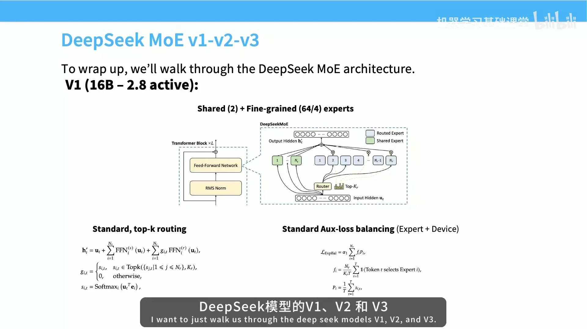

### DeepSeekMoE v2

v2 进一步扩大 expert 规模，并把 systems constraint 显式放进设计：包括 device-limited routing 和 communication balancing。课程借此强调，大模型训练架构不可能只看“网络公式”，还必须同时尊重设备拓扑和通信成本。

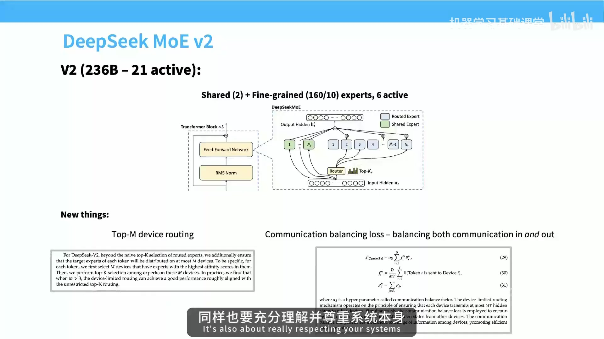

### DeepSeekMoE v3

v3 延续 shared + fine-grained experts，调整 expert weighting / Top-K 方式，并使用 per-expert bias 等机制减少 auxiliary balancing loss 的依赖。核心 MoE 思路没有彻底改变，主要变化集中在 routing、balancing 和 systems integration。

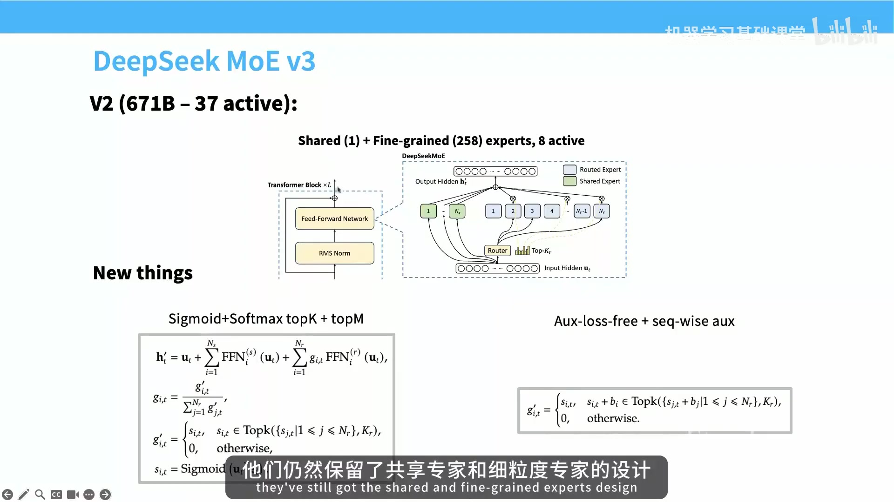

可以把三代设计概括为：

| 版本 | 保留的核心 | 主要新增/强化点 |
| --- | --- | --- |
| v1 | fine-grained + shared experts；Top-K | auxiliary expert balancing |
| v2 | v1 的 MoE 骨架 | device routing、communication balancing、systems-aware scaling |
| v3 | shared/fine-grained sparsity | per-expert bias、减少 auxiliary loss 依赖，并与 MLA / MTP 组合 |

## 20. Bonus：MLA 与 MTP 是 DeepSeek v3 的其他架构组件

这两项不属于 MoE routing 本身，但课程在介绍 v3 时顺带解释了它们。

### Multi-head Latent Attention（MLA）

MLA 先把 hidden state 投影到更低维的 latent $c$，再由 $c$ 生成与 attention 有关的 $Q/K/V$ 表示。推理时可以缓存更紧凑的 latent representation，而不是直接保存完整 K/V，因此降低 KV-cache memory。课程同时提醒：这种压缩要和 positional encoding，尤其 RoPE 的处理一起设计。

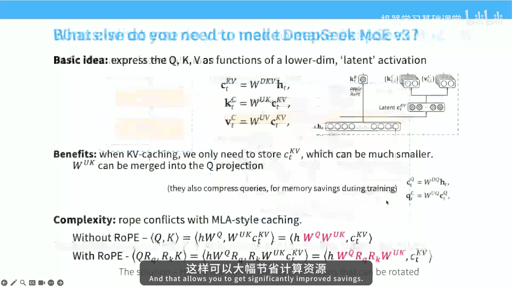

### Multi-token Prediction（MTP）

MTP 增加轻量预测模块，让训练信号覆盖多个未来位置。课程给出的动机包括：从统计上提供更多 future-token supervision，并可与 speculative-style decoding 思路结合，以提升 decoding efficiency。

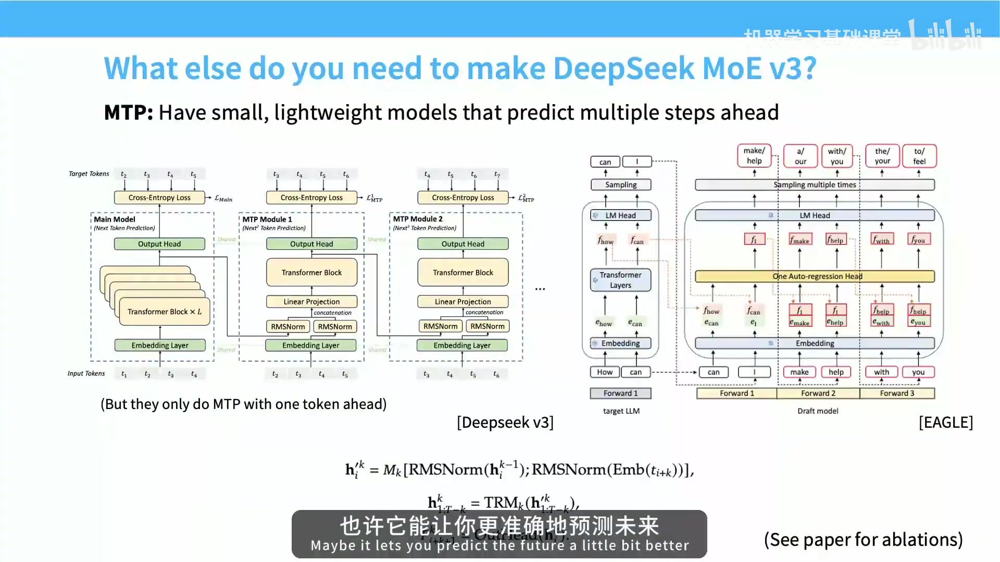

## 21. 本讲的统一视角

Attention alternatives 和 MoE 表面上解决的是两个不同问题，但可以用同一个稀疏计算视角理解：

- **Linear/recurrent attention**：把随序列长度增长的全局 pairwise interaction 压缩进有限状态；
- **Sparse attention / DSA**：从所有历史位置中只选择少数位置做昂贵 attention；
- **MoE**：从所有 FFN experts 中只选择少数 experts 做昂贵计算。

真正困难的部分也高度相似：selector/router 必须足够便宜，稀疏计算必须有高效 kernel 和通信实现，同时又不能因为稀疏选择破坏模型质量或训练稳定性。

对 MoE 来说，最重要的几条结论是：

1. 总参数量和 activated parameters 要分开看；MoE 的价值正来自两者的解耦。
2. Top-K router 本身很简单，难点更多在 balancing、stability 和 systems。
3. Fine-grained experts 已得到较多实践支持；shared experts 的收益需要结合具体 ablation 判断。
4. Expert parallelism 把架构设计直接变成通信问题，因此 load balancing 也同时是 systems utilization 问题。
5. DeepSeekMoE 的 v1→v3 演进体现了现代 LLM architecture 的典型方式：算法机制、训练 objective 和硬件约束一起迭代。

