---
workflow:
  name: ChatGPT-Web-Course-Note-Workflow
  version: v4.9.4
course:
  name: "CS336: Language Modeling from Scratch"
  term: "Spring 2026"
  instructor: "Tatsunori Hashimoto"
chapter:
  index: 5
  local_label: "P05"
  official_unit_label: "Lecture"
  official_unit_number: 5
  official_title: "GPUs, TPUs"
provenance:
  lecture_video_term: "Spring 2026"
  official_materials_term: "Spring 2026"
---

# CS336 Spring 2026 Lecture 5 — GPUs, TPUs

本讲把 GPU 性能从一组经验规则还原成一个可推理的硬件模型。主线很清楚：GPU 用大量并行执行单元换取吞吐量；矩阵乘硬件持续加速后，内存带宽、数据搬运和调度尾部越来越容易成为瓶颈。因此，性能优化的共同目标是提高 arithmetic intensity、减少 HBM/global memory 往返，并让工作更贴合 GPU 的执行与内存粒度。后半讲把这些原则重新组合成 FlashAttention。

## 本讲身份与资料

- **官方课程**：CS336: Language Modeling from Scratch, Spring 2026
- **官方 Lecture**：Lecture 5 — **GPUs, TPUs**
- **日期**：2026-04-13
- **授课**：Tatsunori “Tatsu” Hashimoto
- **本地映射**：`P05 -> Lecture 5`，与前后 Lecture 4 / Lecture 6 顺序连续
- **官方课程页**：<https://cs336.stanford.edu/>
- **Spring 2026 lecture materials**：<https://github.com/stanford-cs336/lectures>
- **本讲官方课件**：<https://github.com/stanford-cs336/lectures/blob/main/lecture_05.pdf>
- **官方录像**：Stanford Online, *Stanford CS336 Language Modeling from Scratch | Spring 2026 | Lecture 5: GPUs, TPUs*

本笔记正文以本地 Spring 2026 录像、VTT 字幕和录像中可见课件为主要证据。VTT 来源角色按 `unknown_subtitle` 处理；数字、公式和硬件参数优先回看课件画面与硬字幕交叉核对。Spring 2025 旧版 Lecture 5 只用于结构核对，不用于把旧学期内容写成本讲事实。2026 录像中新增了 FP8、MXFP8、MXFP4 等较新的低精度内容。

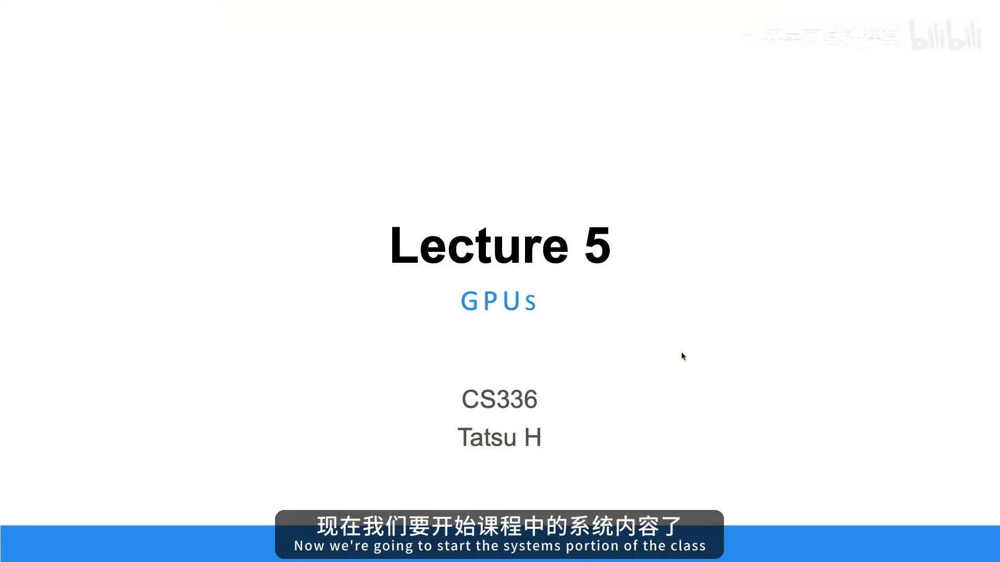

## 1. 课程目标：让 CUDA / GPU “没那么神秘”

开场给出的目标是理解两个问题：**GPU 为什么会慢**，以及**怎样设计更快的算法**。本讲按三部分组织：

1. 深入 GPU：它怎样工作，哪些部件重要；
2. 理解 GPU performance：为什么某些矩阵尺寸和算子组合快、某些慢；
3. 把前两部分的规律组合起来理解 FlashAttention。

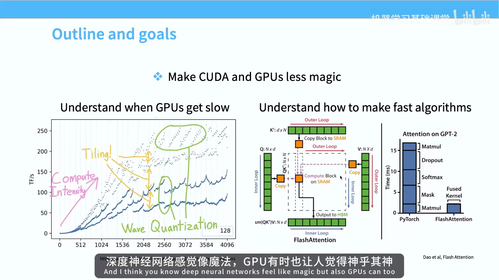

这也是整讲最重要的学习方式：看到“维度最好是 32 的倍数”“要 fusion”“FlashAttention 更快”这类结论时，不把它们当作孤立技巧，而是继续追问它们分别对应哪一种硬件约束。

## 2. 为什么 GPU 成为训练语言模型的主力

### 2.1 从频率提升到横向并行

早期处理器性能可以依赖更高时钟频率持续增长。Dennard scaling 失效后，晶体管数量仍可增加，但频率和单线程性能无法继续以同样速度增长。计算扩展因此越来越依赖横向并行：更多执行单元、更多芯片、更高并行度。

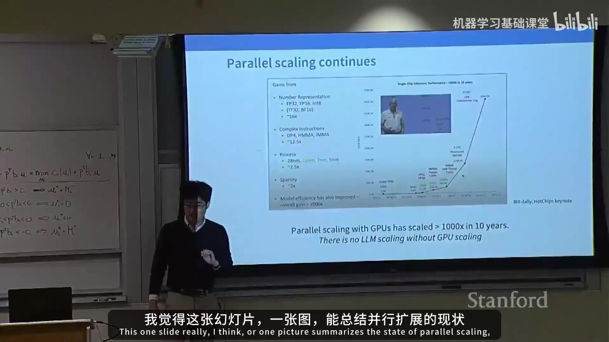

对语言模型尤其重要的一点是：GPU/加速器的 **matrix multiply throughput** 增长非常快，而内存带宽和互连并没有同步按相同速度增长。随着算力提高，很多 workload 的主要约束逐渐从“算得不够快”转向“数据喂不进去”。

### 2.2 CPU 与 GPU：latency 优先和 throughput 优先

CPU 为少量复杂线程优化，给 control、cache、branch prediction 等机制较大预算；GPU 则把更多芯片面积给大量计算单元，让许多相对轻量的线程并行工作。课堂上的简化对比可以记为：

- CPU：少量强线程，擅长复杂控制，偏重 latency；
- GPU：大量轻量线程，擅长规则的数据并行，偏重 throughput；
- GPU 的优势要靠足够并行度才能兑现；当 workload 太小、分支过多、访存方式差或数据搬运主导时，理论峰值不会自动变成真实性能。

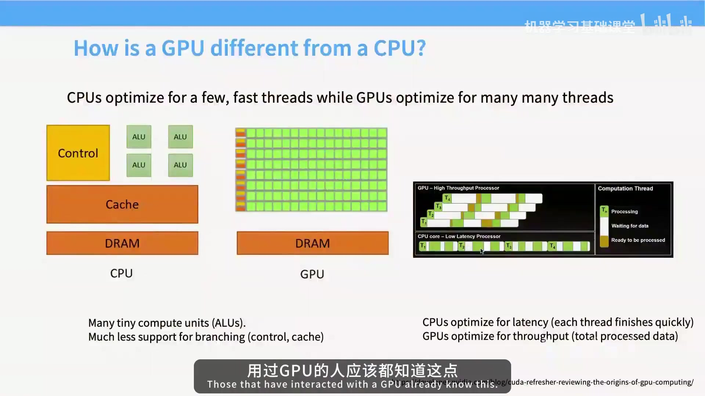

## 3. GPU 的执行模型：SM、thread、block、warp

### 3.1 从 SM 看 GPU

GPU 可以看成许多 Streaming Multiprocessor（SM）的集合。每个 SM 包含大量执行资源以及靠近计算单元的高速存储。工作可以分散到不同 SM，从而获得大规模并行吞吐。

课件把 execution model 的关键对象概括成三层：

- **Thread**：真正执行工作的轻量线程；不同线程处理不同输入；
- **Block**：一组 threads；同一个 block 在同一 SM 上运行，并能共享该 block 的 shared memory；
- **Warp**：实际调度的基本执行组；课堂明确给出 **32 个连续编号的 threads** 组成一个 warp。

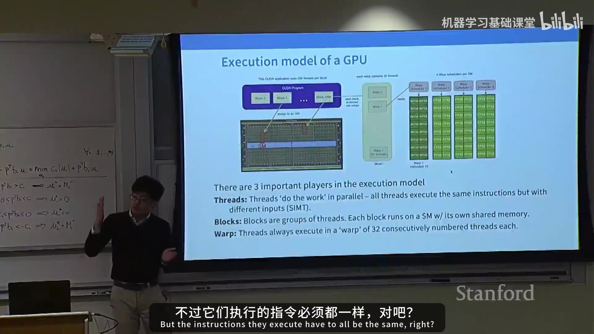

### 3.2 SIMT 与 control divergence

SIMT（Single Instruction, Multiple Threads）的关键约束是：同一 warp 内的线程按同一条指令推进。若线程在条件分支上走向不同路径，硬件通常需要分别执行各路径并对不属于该路径的线程做 masking，于是有效并行度下降。

因此，warp 内高度分歧的 branch 会产生 **control divergence**。这类损失与内存无关，却同样可以显著降低 throughput。课堂后半部分把它列为六个性能技巧中的第一项。

## 4. GPU 的 memory hierarchy：离 SM 越近通常越快

GPU performance 很大一部分来自对 memory hierarchy 的管理。课堂给出的直觉层次是：

- **registers**：线程私有，最快；
- **L1 / shared memory**：靠近 SM；其中 shared memory 由程序显式管理；
- **L2 cache**：跨 SM 的更大缓存层；
- **HBM / global memory**：容量大，但访问代价明显更高。

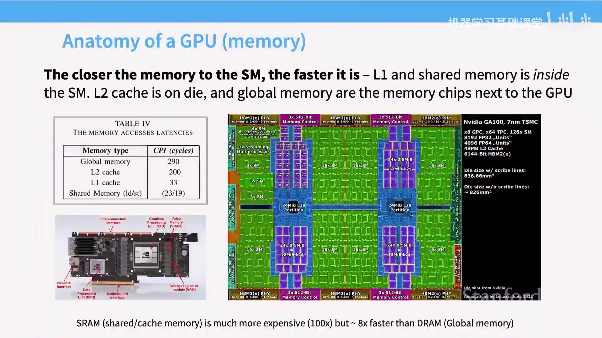

从编程模型看，每个 thread 可以读写自己的 registers/local memory；同一 block 内线程可以通过 shared memory 交换数据；跨 block 的信息通常需要落到 global memory。课件直接把这一点总结成：跨 block 的数据往来必须经过较慢的 global memory。

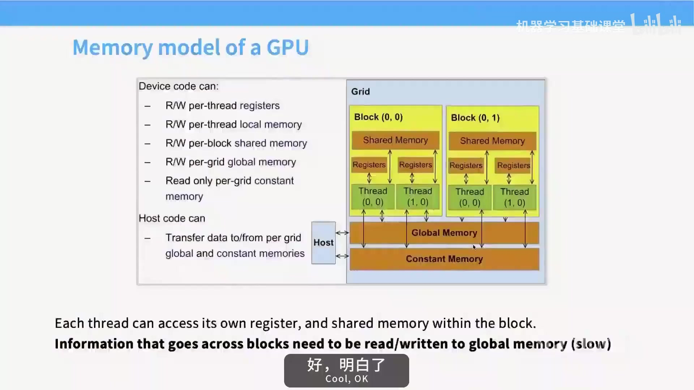

这给出本讲后半段几乎所有优化的共同方向：

> 尽量让数据在寄存器或 shared memory 中多做几次有用计算，减少它在 HBM/global memory 与 SM 之间来回搬运的次数。

## 5. TPU：同一类问题，不同的组织方式

课堂把 TPU 放在 GPU 的同一抽象框架下理解：两者都有轻量控制、大规模矩阵计算单元、较快的片上内存以及较慢的大容量外部内存。很多性能原则可以迁移。

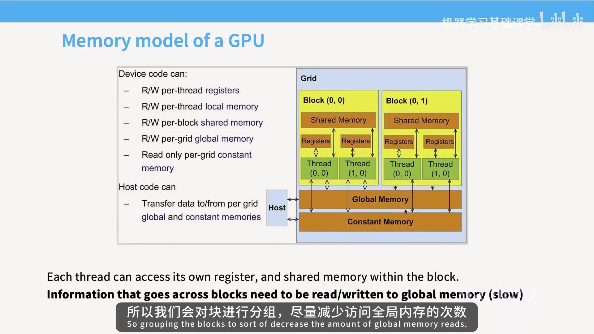

需要注意术语冲突：GPU 的 **Tensor Core** 指专门做小型矩阵乘累加的硬件单元；TPU 语境中的 “TensorCore” 可以指更大的 processor/core。TPU 倾向于使用更少、更大的矩阵计算阵列，GPU 则有更多、更灵活的计算组织。二者在单芯片上越来越接近，网络与系统级连接方式往往更能体现差异。

对本讲而言，TPU 部分最值得带走的是抽象，而不是记品牌参数：**矩阵乘单元 + 分层内存 + 批量并行 + 数据搬运成本**，这些约束决定了高性能算法的形状。

## 6. Tensor Cores 与“算力增长快于带宽”

早期 GPU 的可编程 shader 被研究者重新利用来完成通用矩阵乘。V100 时代引入 Tensor Cores 之后，矩阵乘成为硬件重点优化的特殊路径；低精度进一步提高了可达到的峰值 throughput。

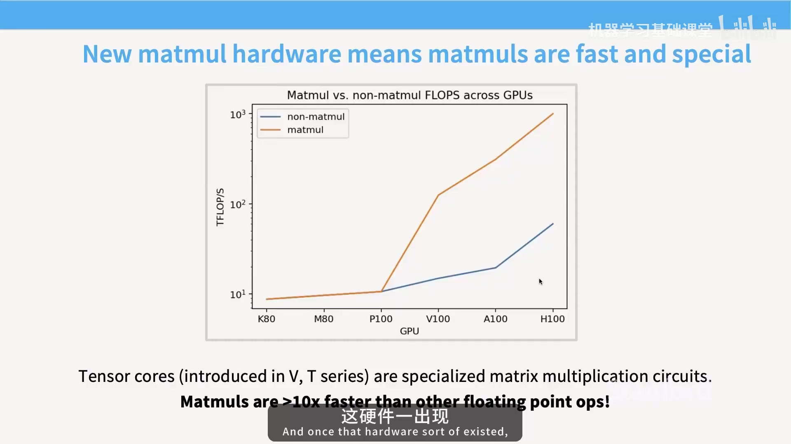

问题在于，matrix FLOPs 的增长速度远快于 memory bandwidth。结果是：即使硬件能做极快的乘加，算子也可能因为持续等待 HBM 数据而跑不满。

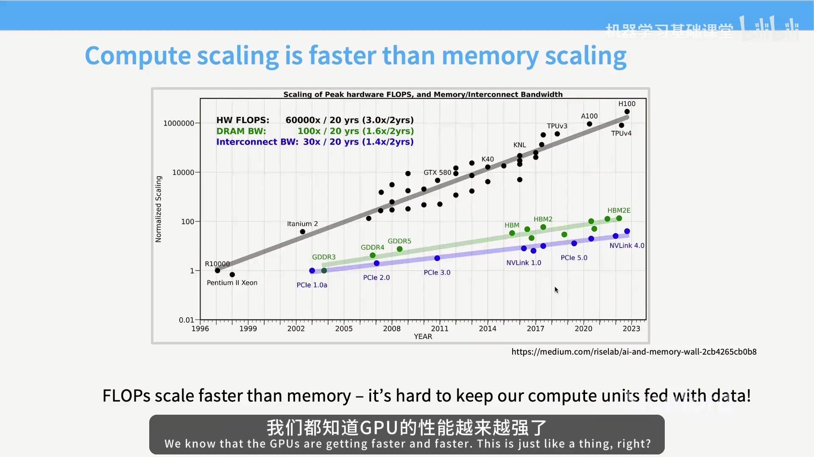

这正是 roofline model 出场的理由。

## 7. Roofline model：性能上限由 compute 与 memory 两侧共同决定

课堂用 roofline 图解释一个非常实用的指标：**operational / arithmetic intensity**，也就是每搬运一个 byte 能完成多少计算。

常见写法是：

$$
I = \frac{\mathrm{FLOPs}}{\mathrm{bytes\ transferred}}
$$

以及把可达到的计算性能近似写成：

$$
P_{\mathrm{achieved}} \leq \min\left(P_{\mathrm{peak}},\; B_{\mathrm{mem}} I\right)
$$

其中 $P_{\mathrm{peak}}$ 是峰值 compute throughput，$B_{\mathrm{mem}}$ 是内存带宽。

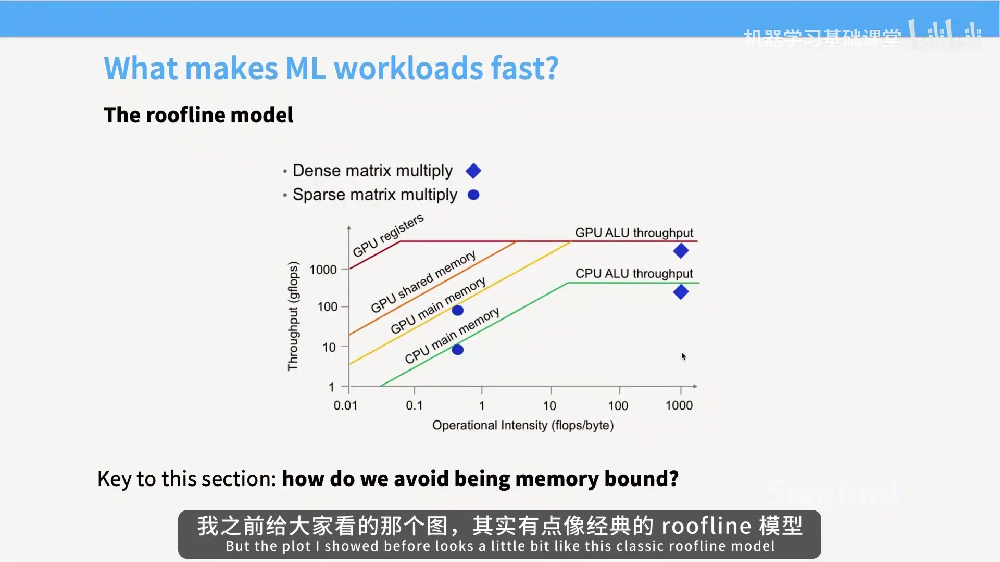

解释很直接：

- $I$ 很低时，算子在 memory-bound 区域，性能随 arithmetic intensity 近似线性增长；
- 当 $B_{\mathrm{mem}}I$ 超过硬件峰值算力后，进入 compute-bound 平台区；
- GPU 优化经常等价于“让每次昂贵的内存访问承载更多计算”。

### 7.1 一个容易混淆的单位

低精度示例 slide 用的是 **bytes/FLOP**：FP32 pointwise ReLU 示例约 8 bytes/FLOP，FP16 约 4 bytes/FLOP。这个量与通常定义的 arithmetic intensity（FLOPs/byte）互为倒数。因此，字节/FLOP 变小意味着 arithmetic intensity 变大。

## 8. 六个让 GPU workload 更快的技巧

课堂把后半段压缩成六项：

1. control divergence；
2. low precision computation；
3. operator fusion；
4. recomputation；
5. coalescing memory；
6. tiling。

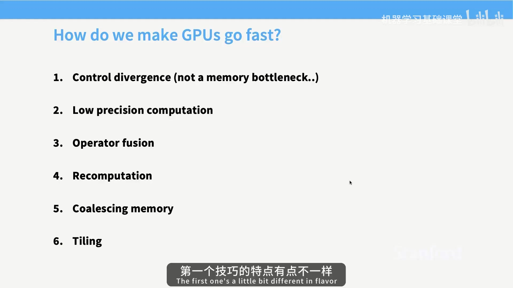

它们可以再分成三类：

- **减少无效执行**：control divergence；
- **减少 global-memory 流量**：low precision、fusion、recomputation、coalescing；
- **提高片上复用**：tiling。

后面理解 FlashAttention 时，这六项会重新组合。

## 9. Control divergence

同一个 warp 的 threads 共享执行节奏。若某些 threads 走 `if` 分支 A，另一些走 B，硬件无法让两条完全不同的指令流真正同时执行，常见结果是分别执行两条路径、屏蔽无关线程。

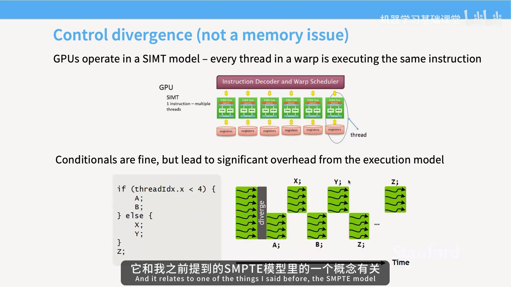

因此，branch 本身未必贵，**warp 内的分歧**才是问题。规则的数据并行程序更容易把 GPU 填满；分支密集、每个 thread 控制流差异很大的程序更难获得高利用率。

## 10. Trick 1：low precision

低精度同时从两侧提高性能：

- 同样数量的元素占用更少 bytes，降低 memory traffic；
- 现代矩阵乘硬件对 FP16、BF16、FP8 等格式提供更高 throughput。

### 10.1 mixed precision 的基本模式

典型矩阵乘可以用较低精度存放/输入 operands，同时用更高精度 accumulation 来避免误差快速累积。敏感操作也可以保留更高精度。选择哪些层、哪些张量降精度，最终是数值稳定性和硬件收益之间的工程权衡。

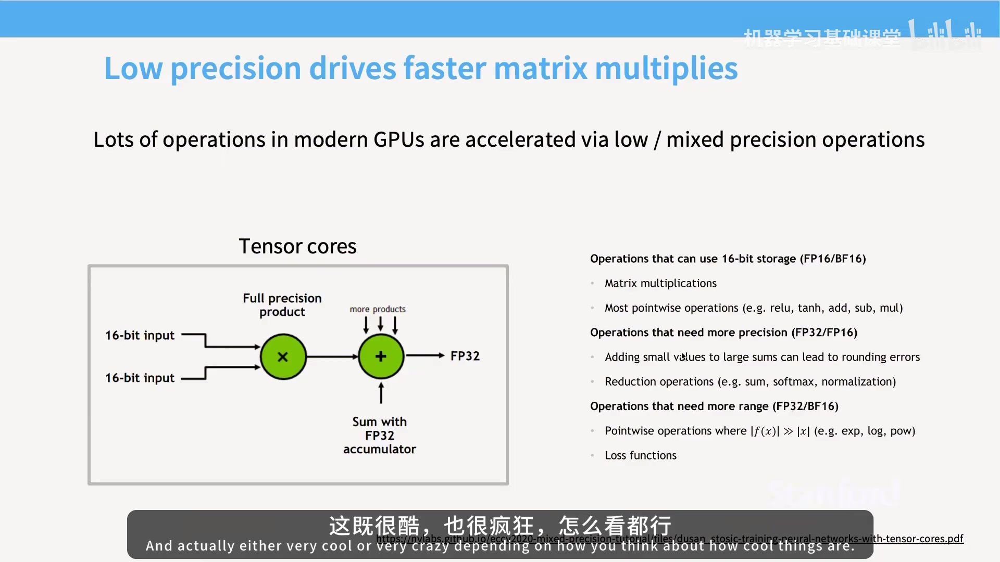

### 10.2 FP8：E4M3 与 E5M2

FP8 不只有一个格式。E4M3 和 E5M2 在 exponent range 与 mantissa precision 之间做不同权衡。位数越低，动态范围越容易成为问题，因此实践中通常需要 scaling factor 把数据映射到可表示范围。

### 10.3 MXFP8：更多、更局部的 scaling factors

2026 录像重点扩展了 MXFP8。课件明确写出：

- MXFP8 使用 E4M3 数据格式，因为更密集的 scale factors 缓解了动态范围问题；
- scaling factor 本身采用 **FP8 E8M0**；
- **每 32 个元素一个 scaling factor**；
- transpose 变得不再简单，因为转置后 32-element block 的分组方向发生改变。

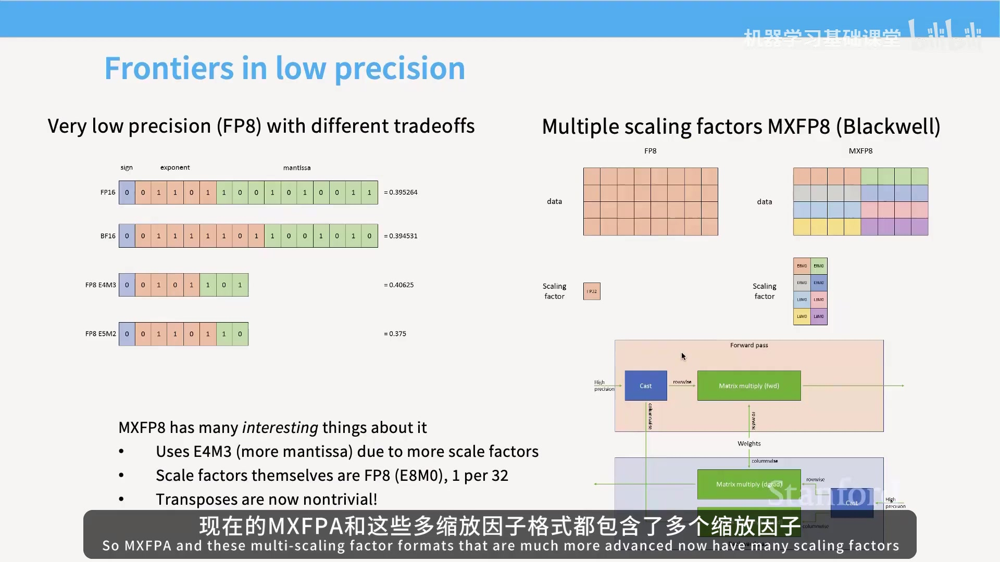

训练中的一个后果是：为了避免频繁重新量化，weight 及其 transpose 可能各自保留经过对应方向量化的版本。

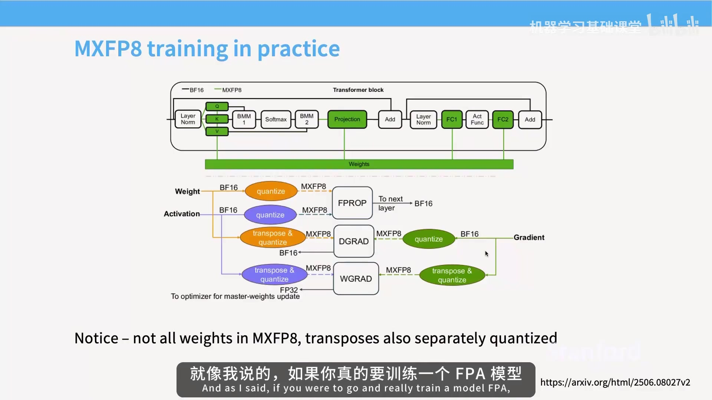

课堂对 FP8 的态度也很工程化：理论位宽减半并不等于矩阵乘必然快 2 倍，因为 quantize/dequantize、scale handling 等都有额外成本。讲师给出的经验量级是某些矩阵乘大约 **20–30%** 的收益，具体依赖矩阵尺寸和 kernel。

### 10.4 MXFP4：更激进的表示

录像继续展示 MXFP4。课件列出的 4-bit 可表示值包括 $0, \pm0.5, \pm1, \pm1.5, \pm2, \pm3, \pm4, \pm6$，并标出 **每 16 个值一个 scaling factor**，scale 采用 E4M3。

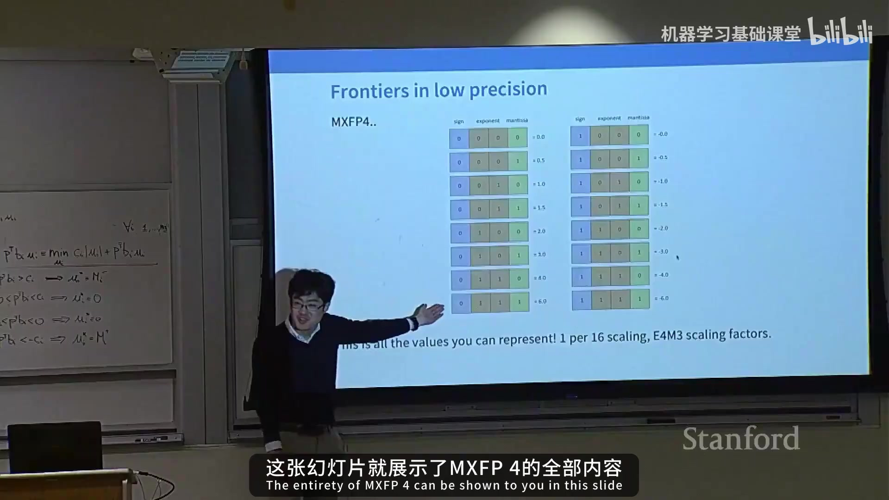

这部分被明确放在 frontier 语境中。课程重点是理解低精度为什么可能更快，以及 block scaling 怎样解决 range 问题；它不把 FP4 描述成已经普遍成熟的大模型训练默认方案。

## 11. Trick 2：operator fusion

GPU 可以类比成工厂：global memory 是仓库，SM 是加工区。若每做一个小操作都把中间结果运回仓库，再由下一个 kernel 重新读取，memory traffic 会迅速淹没计算成本。

Operator fusion 把多个相邻操作合成一个 kernel，让中间值尽可能停留在 registers/shared memory 中，只在必要时访问 HBM。

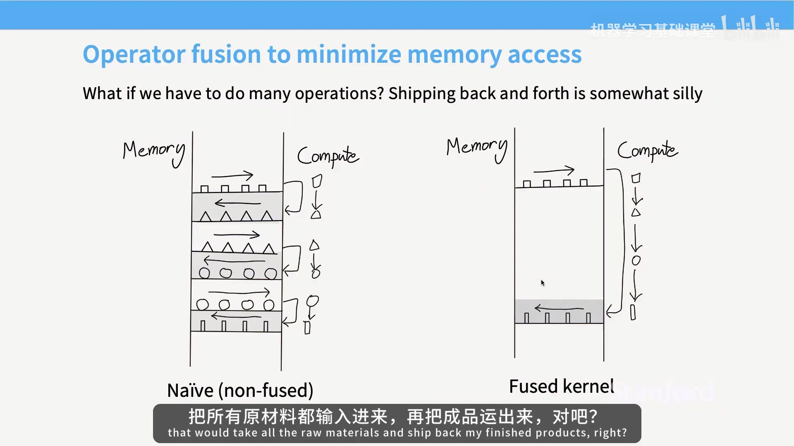

课堂的 $\sin^2x+\cos^2x$ 例子说明：一个高层表达式可能拆成多个 pointwise kernels，每一步都产生读写；编译器如 `torch.compile` / JAX 可以自动融合不少简单模式，更复杂的 fusion 仍可能需要手写或专门 kernel。

## 12. Trick 3：recomputation —— 用廉价 compute 换昂贵 memory

反向传播通常需要前向 activation。直接保存所有中间值会增加写入；backward 再把它们读回来，又增加读取。

课堂用三层 sigmoid 的小例子做了定量对比：

- 保存 activations：forward `1 read + 3 writes`，backward `3 reads + 1 write`，合计 **8 次 memory read/write**；
- 丢弃中间 activation 并在 backward 中重算：forward `1 read + 1 write`，backward `2 reads + 1 write`，合计 **5 次**。

也就是只保留原方案 **5/8** 的 memory accesses，同时多做一些 compute。

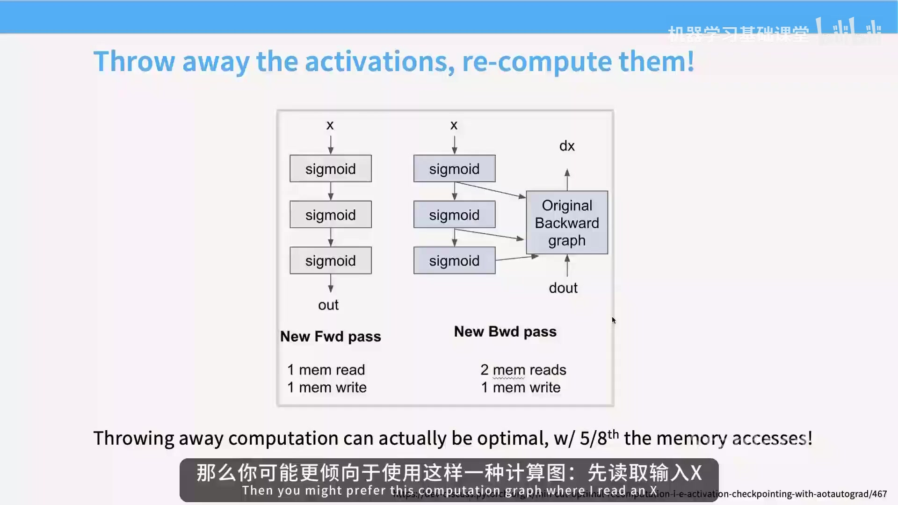

这类 activation checkpointing 的核心判断是：当 compute 便宜、memory traffic 贵时，**重算可能比存储更快**。它同时也能降低 activation memory footprint。

## 13. Trick (?) 4：memory coalescing

DRAM 倾向于按 burst 成块搬运数据。课件写的是实际 burst section 通常为 **128 bytes or more**；课堂用这一量级建立直觉：即使只请求其中一个地址，附近的一整块往往都会被取回。

因此，warp 内 threads 若访问同一个连续 burst 中的地址，就能把一次内存事务利用得更充分；若访问分散、跨多个 burst 的位置，则会浪费带宽。

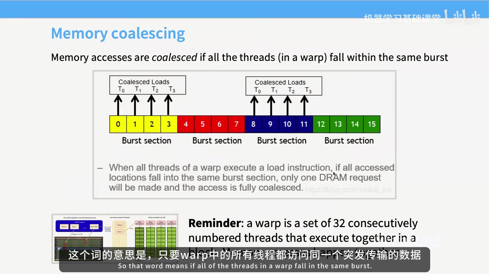

对 row-major matrix 来说，沿连续维度安排相邻 threads 通常更容易 coalesce；沿大 stride 的列方向访问则更容易产生多个分散事务。优化 kernel 时，thread mapping 和数据 layout 必须一起看。

## 14. Trick 5：tiling —— 把数据搬到 shared memory 后反复复用

Tiling 是本讲最重要的技巧。矩阵乘中，同一个 input element 会被重复使用。若每次都从 global memory 重新加载，带宽浪费很大。更好的做法是把 $T\times T$ 一类的小块先搬到 shared memory，再在块内反复使用。

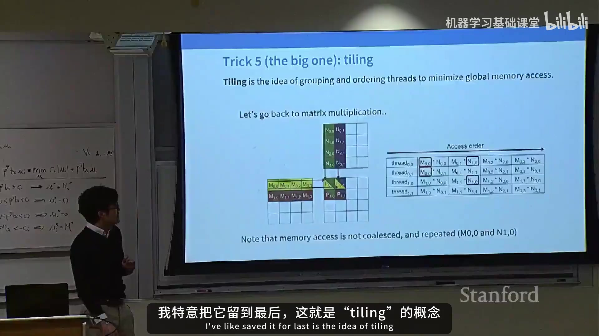

对于 $N\times N$ 矩阵乘，课件给出的计数是：

- non-tiled：每个 input 从 global memory 读取约 $N$ 次；
- tiled：每个 input 从 global memory 读取约 $N/T$ 次，并在 tile 内复用 $T$ 次；
- 因而 global-memory access 约减少 **$T$ 倍**。

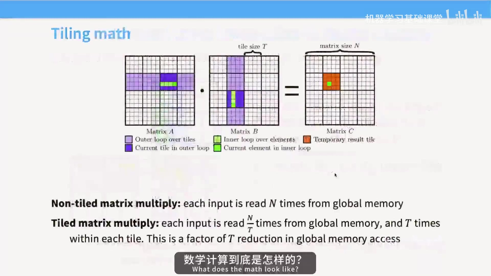

但 tile 不能无限大，因为 shared memory 容量有限；tile size 还要同时考虑 coalescing、矩阵 shape 与 SM 资源。

### 14.1 shape 不整除带来的尾部浪费

如果 kernel 采用固定 tile，大矩阵尺寸刚好整除 tile 时，所有 tile 工作量接近；只多出一行或一列时，却可能新增一整排/列“瘦 tile”，其中大部分 thread 没有有效工作。

这解释了为什么矩阵尺寸改变 1，有时性能却会出现离散跳变。

### 14.2 memory alignment

Burst-based memory 也解释了 alignment：tile 起点若刚好对齐 burst boundary，可以少取无用数据；若偏移导致一次逻辑 tile 横跨两个 burst，就可能增加内存事务。

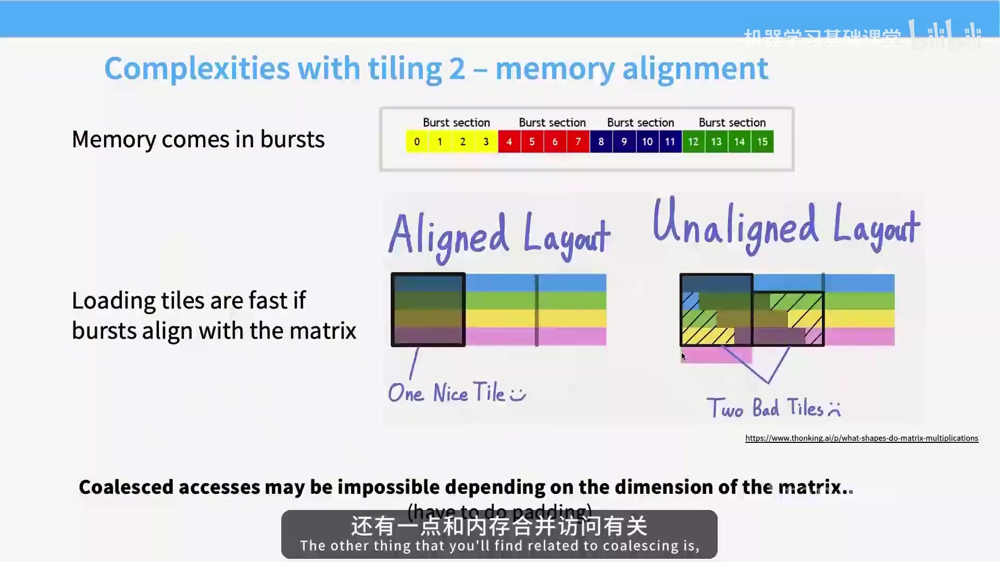

## 15. “更大的矩阵反而更快”：matrix mystery

课堂引用 nanoGPT 的一个例子：把 vocabulary size 从 **50,257** 增加到 **50,304**（最近的 64 的倍数）后，虽然多算了无用维度，实际却得到大约 **25% speedup**。重点不在这个具体模型，而在于它暴露了 GPU performance 的离散结构。

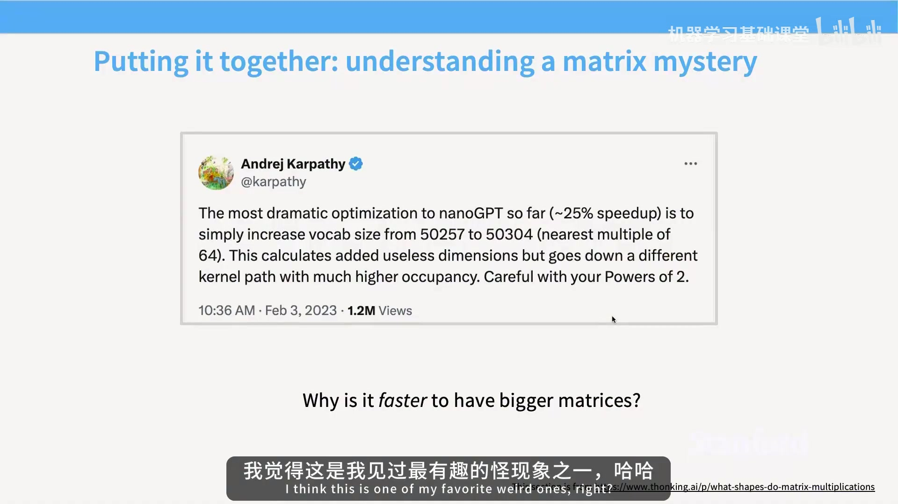

这里有两个主要解释。

### 15.1 tiling / alignment

矩阵维度与 kernel tile/burst 更匹配时：

- 边缘 partial tiles 更少；
- memory accesses 更容易 coalesce；
- tile 起点更容易保持 alignment；
- Tensor Core / kernel dispatch 也更容易落在优化过的路径上。

因此，“选 32/64 的倍数”只是经验表象。真正原因是**让矩阵 shape 与硬件粒度匹配**。

### 15.2 wave quantization

A100 的示例更直观。课件采用 **256×128** tile：

$$
\frac{1792}{256}\times\frac{1792}{128}=7\times14=98\ \text{tiles}
$$

而从 1792 增加到 1793 后，两边都需要向上取整：

$$
8\times15=120\ \text{tiles}
$$

课件给出的 A100 有 **108 SMs**。98 tiles 可以在一轮 wave 中并行发出；120 tiles 则必须留下第二轮 12 tiles。第二轮期间大量 SM 空闲，于是只增加一个矩阵维度却出现明显 performance cliff。

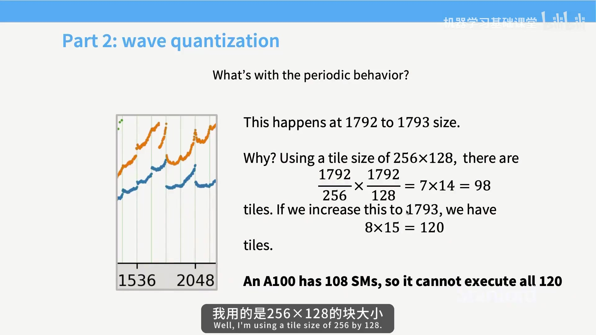

这一段提供了一个很实用的性能分析模板：看到周期性或锯齿状曲线时，先检查 tile 数、SM 数和尾部 wave，而不是立刻把问题归因于“GPU 随机抖动”。

## 16. Part 2 小结：六个技巧其实都在管理数据运动

课堂的小结可以重新整理成三条：

- **reduce memory accesses**：coalescing、fusion；
- **move memory to shared memory**：tiling；
- **trade memory for compute/accuracy**：quantization、recomputation。

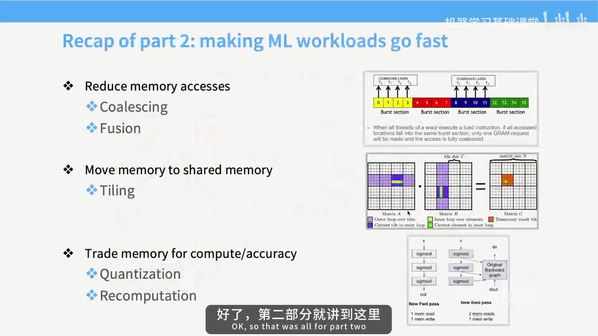

再加上 control divergence 对执行效率的影响，就得到分析大多数单 GPU kernel 的基本工具箱。

## 17. FlashAttention：把前面的原则全部组合起来

普通 attention 的核心计算可写为：

$$
S = QK^\top,\qquad P=\operatorname{softmax}(S),\qquad O=PV.
$$

如果直接 materialize $S$ 和 $P$，sequence length 为 $N$ 时会产生 $O(N^2)$ 级别的中间数据，并频繁经过 HBM。FlashAttention 的关键收益来自 **IO-aware tiling + fusion + online softmax**，而不是改变 attention 的数学定义。

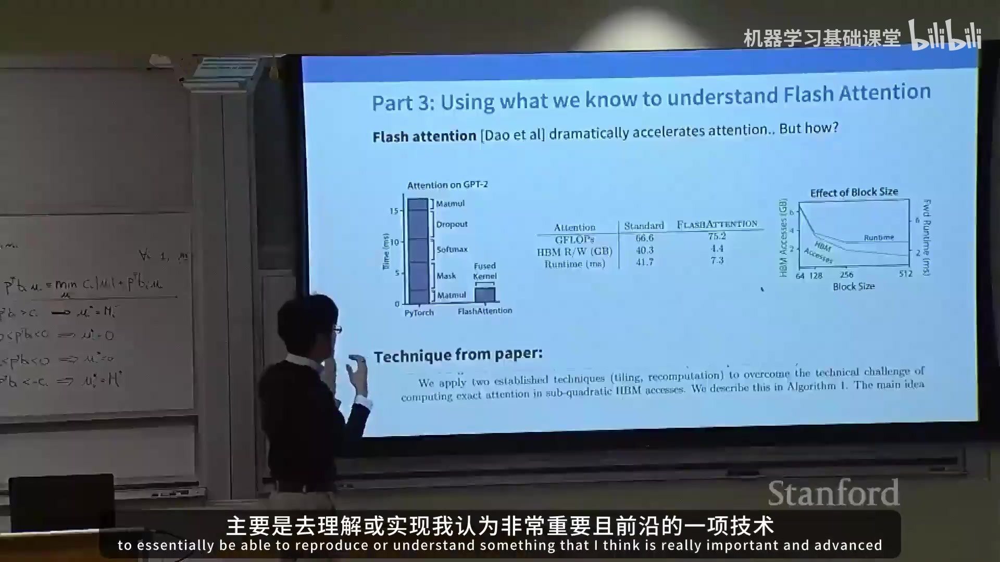

### 17.1 第一步：Q/K/V 的 matmul 可以 tile

矩阵乘已经有成熟 tiling 思路：把 $Q$ 和 $K$ 的块加载到片上存储，算出一小块 score，再进入后续计算。

真正难点是 softmax，因为一个 row 的归一化分母看起来需要看到整行所有 scores。

### 17.2 online softmax：流式维护 max 与 denominator

稳定 softmax 通常先求全局最大值：

$$
y_i=\frac{e^{x_i-m}}{\sum_j e^{x_j-m}},\qquad m=\max_j x_j.
$$

课堂引用 online softmax，把 max 和 denominator 递推地更新。逐元素写法为：

$$
m_0=-\infty,\qquad d_0=0,
$$

$$
m_j=\max(m_{j-1},x_j),
$$

$$
d_j=d_{j-1}e^{m_{j-1}-m_j}+e^{x_j-m_j}.
$$

最终：

$$
y_i=\frac{e^{x_i-m_V}}{d_V}.
$$

关键项 $e^{m_{j-1}-m_j}$ 会在最大值发生变化时重新缩放已有部分和，因此无需预先知道最终 max。把这一递推从元素扩展到 tile，就可以 tile-by-tile 计算 softmax。

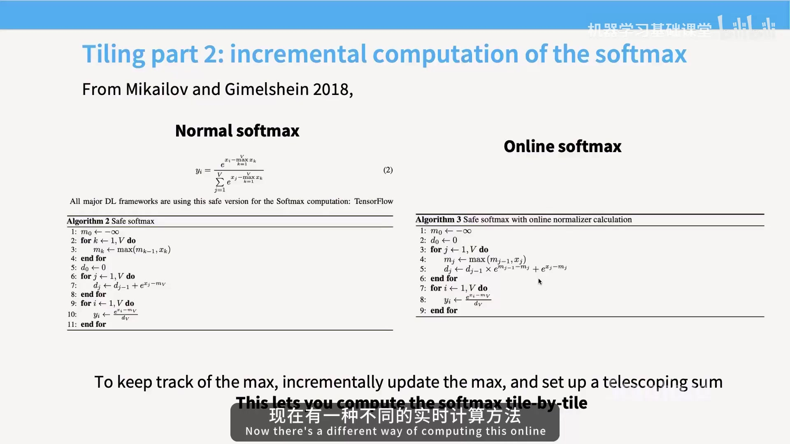

### 17.3 FlashAttention forward 的组合

课堂最后把 forward pass 拆成三项：

1. **tile-wise computation of inner products**：分块计算 score；
2. **fusion of the exponential operator**：softmax 的 exp/归一化留在融合 kernel 内；
3. **tile-wise online softmax**：用递推 max / denominator 处理每个块。

中间的 $N\times N$ score/attention matrix 不需要完整写回 HBM，而是在 SRAM/registers 中分块生成、消费和丢弃。

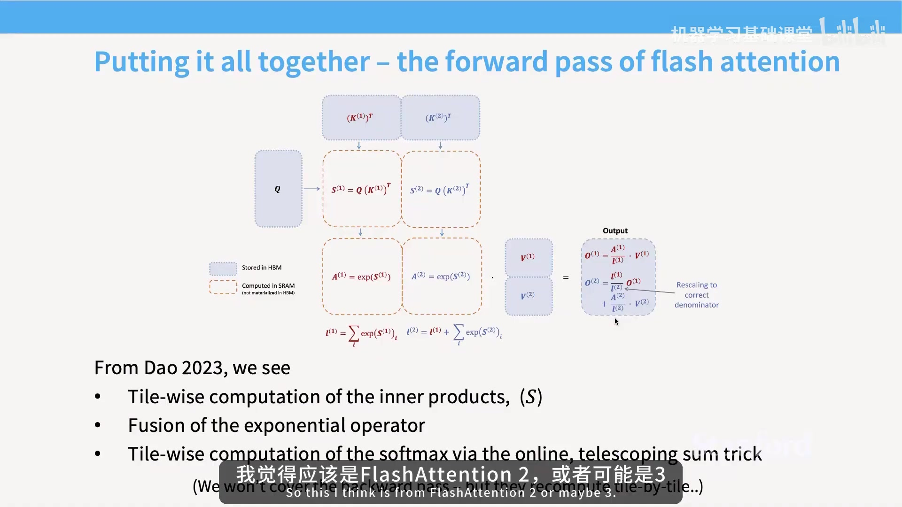

Backward 也沿用本讲的 recomputation 思路：与其为反向传播长期保存庞大的 attention 中间矩阵，不如保留更小的统计量并按 tile 重算需要的中间值。

## 18. 把整讲压缩成一套性能推理顺序

遇到一个 GPU workload 不够快时，可以按下面的顺序定位：

1. **先看规模是否足够**：是否有足够 blocks/warps 填满 SM？是否出现 tail wave？
2. **看 arithmetic intensity**：当前是 memory-bound 还是 compute-bound？
3. **看 memory traffic**：是否反复把中间张量写入 HBM？能否 fusion 或 recomputation？
4. **看 memory access pattern**：warp 内地址是否 coalesced？是否对齐 burst？
5. **看 reuse**：能否把数据 tile 到 shared memory/registers 后多次使用？
6. **看 precision**：更低精度是否有硬件加速，同时数值误差可接受？
7. **看 control flow**：warp 是否存在严重 divergence？
8. **最后看 shape**：矩阵尺寸是否与 tile、Tensor Core/kernel 路径和 SM wave 匹配？

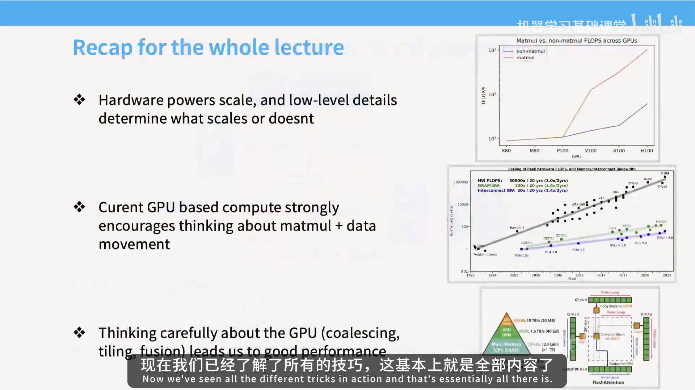

## 19. 最值得记住的结论

- GPU 的核心价值是 **massive parallel throughput**；要给它足够规则、足够大的并行工作。
- 现代 GPU 上 matrix multiply 越来越“便宜”，**数据运动越来越贵**。
- Roofline model 提供了统一坐标：优化很多时候就是提高 arithmetic intensity。
- Low precision、fusion、recomputation、coalescing、tiling 看起来不同，本质都在降低昂贵的数据搬运或提高每次搬运的利用率。
- “矩阵维度最好是 32/64 的倍数”不能脱离硬件解释。tiling、alignment 与 wave quantization 才是背后的机制。
- FlashAttention 是本讲原则的集中案例：**tiling + fusion + online softmax + recomputation** 共同降低 HBM traffic。
- 做系统优化时，比背诵某块 GPU 的具体参数更重要的是建立可迁移的 mental model：**execution granularity、memory hierarchy、matrix hardware、bandwidth、data reuse**。

## 配套资料与 provenance 说明

Spring 2026 官方 Schedule 对 Lecture 5 明确关联的是本讲 lecture PDF，没有列出本讲专属 assigned reading / required paper，因此最终 package 不额外打包 `papers/` 内容。官方 Lecture 5 PDF 已完成同版本身份核验；正文内容仍以实际 Spring 2026 录像、字幕和可见课件状态为准。
