---
workflow:
  name: ChatGPT-Web-Course-Note-Workflow
  version: v4.9.4
course:
  name: "CS336: Language Modeling from Scratch"
  term: "Spring 2026"
  instructors:
    - Tatsunori Hashimoto
    - Percy Liang
chapter:
  index: 6
  local_label: P06
  official_unit_label: Lecture
  official_unit_number: 6
  official_title: "Kernels, Triton"
  recording_title: "Lecture 6: Kernels, Triton, XLA"
  date: "2026-04-15"
  lecturer: "Percy Liang"
provenance:
  lecture_video_term: "Spring 2026"
  official_materials_term: "Spring 2026"
  official_lecture_commit: "15d7589d014172e386d6e750a2ef88dd6d6a79ec"
---

# Lecture 6 — Kernels, Triton

本讲承接上一讲对 GPU 的高层介绍，目标从“知道 GPU 为什么快”推进到“能测量瓶颈，并自己写出贴近硬件的 kernel”。Percy Liang 先复习 GPU 的存储层级、warp、occupancy、bank conflict、memory coalescing 和 block occupancy，再用 benchmark 与 profiler 建立性能诊断方法，最后用 Triton 依次实现 GeLU、softmax、跨 tile 的 row sum，以及融合 ReLU 的 tiled matrix multiplication。

> **章节身份说明**：Spring 2026 官方 Schedule 将本讲标为 **Lecture 6: Kernels, Triton**，日期为 **2026-04-15**，授课教师为 **Percy Liang**。Stanford Online 同版本录像标题为 **Lecture 6: Kernels, Triton, XLA**。本地 P06 的视频、字幕、画面结构和同日官方 `lecture_06.py` 一致。录像标题中的 “XLA” 没有形成独立讲授单元，因此本文不额外扩写 XLA。

## 配套资料

- 课程网站：https://cs336.stanford.edu/
- Spring 2026 Lecture 6 同日官方源码：https://github.com/stanford-cs336/lectures/blob/15d7589d014172e386d6e750a2ef88dd6d6a79ec/lecture_06.py
- Spring 2026 官方 Lecture materials repository：https://github.com/stanford-cs336/lectures
- Stanford Online 官方录像：https://www.youtube.com/watch?v=xnDHaNUvHBg
- Assignment 2: Systems：https://github.com/stanford-cs336/assignment2-systems

同日 commit 是本文的主要官方课件来源。当前 repository `main` 后续修改过部分 B200 bandwidth 数值；下面涉及课堂硬件表格的数字以 **2026-04-15 的同日 commit 和实际录像**为准。

## 1. 本讲主线：从性能直觉到可执行优化

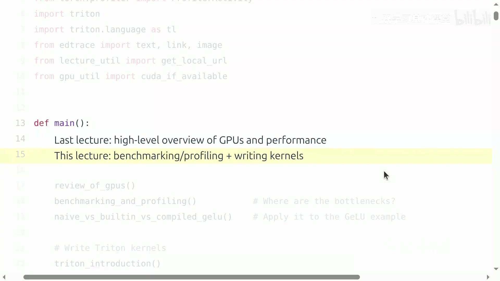

课程将优化过程组织为：

1. 理解 GPU 的执行与存储模型，知道哪些硬件约束可能形成瓶颈。
2. 用 benchmark 测端到端时间，用 profiler 看时间花在哪些 kernel 上。
3. 修改实现，再重新 benchmark/profile。
4. 当框架现成算子或编译器不足以得到目标性能时，用 Triton 写 kernel，并围绕 memory traffic、occupancy、tiling 和 fusion 迭代。

这几步在后半讲反复出现：GeLU 展示 kernel fusion；softmax 展示把多阶段算子压进一个 block；row sum 展示数据超过单个 block 后的 tiled reduction；matmul 则把 shared-memory tiling 和 arithmetic intensity 连起来。

## 2. GPU：正确性由编程模型保证，性能受硬件细节约束

### 2.1 存储层级与带宽

课堂用 A100、H100、B200 对比说明：越靠近计算单元，容量越小但带宽越高；HBM 容量大，却是最昂贵的数据移动层级之一。

| Accelerator | A100 | H100 | B200 |
| --- | ---: | ---: | ---: |
| SM 数量 | 108 | 132 | 148 |
| Register size / SM | 256 KB | 256 KB | 256 KB |
| L1 cache + shared memory / SM | 192 KB | 256 KB | 256 KB |
| L2 cache size | 40 MB | 50 MB | 96–126 MB |
| HBM size | 80 GB | 80 GB | 192 GB |
| Register bandwidth | ~116 TB/s | ~401 TB/s | ~447 TB/s |
| L1 + shared memory bandwidth | ~19 TB/s | ~33 TB/s | ~19 TB/s |
| L2 cache bandwidth | ~5–8 TB/s | ~12 TB/s | ~9 TB/s |
| HBM bandwidth | 2 TB/s | 3.35 TB/s | 8 TB/s |

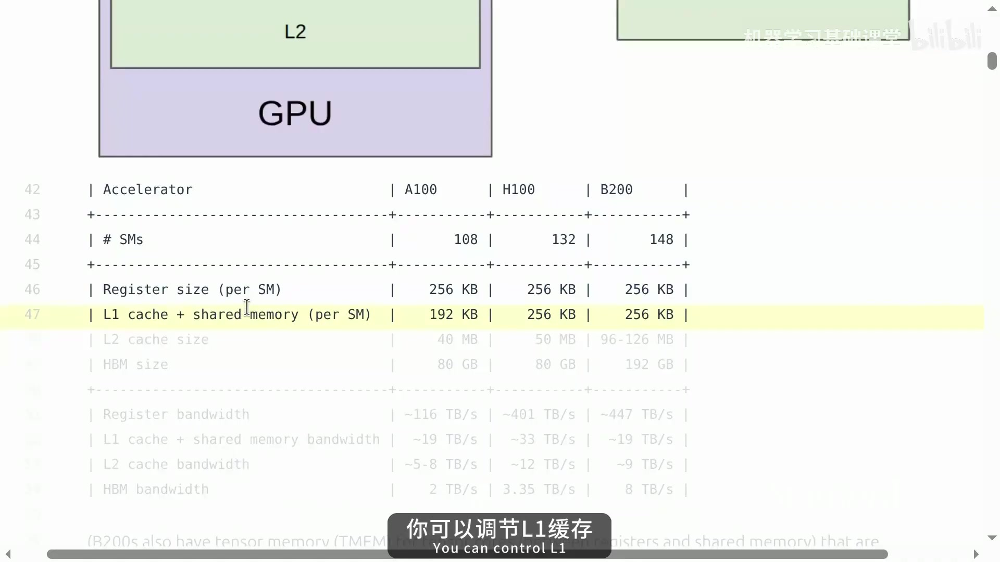

B200 还存在供 tensor core 使用的 tensor memory（TMEM），位于 registers 与 shared memory 之间，但对普通开发者不直接可见。本讲的优化重点仍放在可编程的 registers、shared memory 与 HBM 数据流上。

### 2.2 Grid、thread block 与 thread

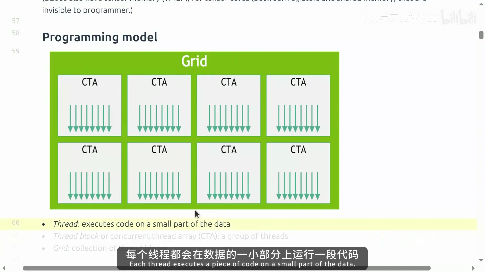

课堂把 CUDA/Triton 的层级对应到存储层级：

- **Grid**：一组 thread blocks，数据通常来自 global memory/HBM。
- **Thread block / CTA**：一组可共享 shared memory 的 threads；一个 block 会被调度到同一个 SM。
- **Thread**：执行局部工作，主要使用 registers。

对逐元素算子，例如 GeLU，“一个 thread 处理一个或多个元素”很自然。但 softmax、matmul 等算子需要线程协作和数据复用，此时 shared memory 与 thread block 成为关键抽象。Triton 把开发者的主要视角从单个 thread 提升到 thread block。

### 2.3 Warp 与 control divergence

一个 warp 固定包含 **32 threads**。同一 warp 内线程在一个 SM 上 lockstep 执行相同指令。如果不同线程走不同分支，硬件必须把分支路径串行化，这就是 control divergence。

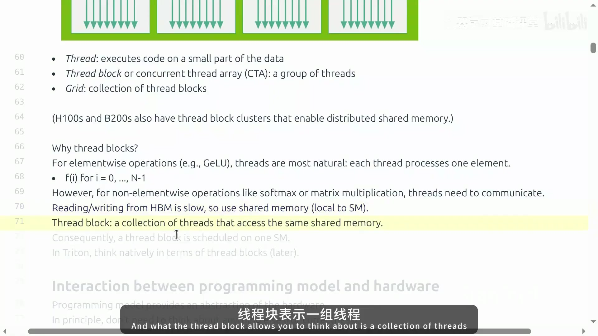

SM 可以同时驻留多个 warps。当某个 warp 等待 HBM load/store 时，scheduler 可以切换到其他 ready warp；因此并发驻留的 warp 数会影响 latency hiding，但 occupancy 越高并不自动意味着性能越好。

### 2.4 Register pressure 与 warp occupancy

每个 thread 可以使用一定数量的 registers。每线程 registers 越多，一个 SM 同时能容纳的 threads/warps 往往越少。

课堂现场例子使用：

- `num_threads_per_block = 128`
- `num_registers_per_thread = 160`
- `max_registers = 65536`
- `max_warps = 64`

因此：

$$
\text{registers/block}=128\times160=20480
$$

$$
\text{resident blocks}=\left\lfloor\frac{65536}{20480}\right\rfloor=3
$$

$$
\text{resident warps}=3\times\frac{128}{32}=12
$$

$$
\text{occupancy}=\frac{12}{64}=0.1875=18.75\%
$$

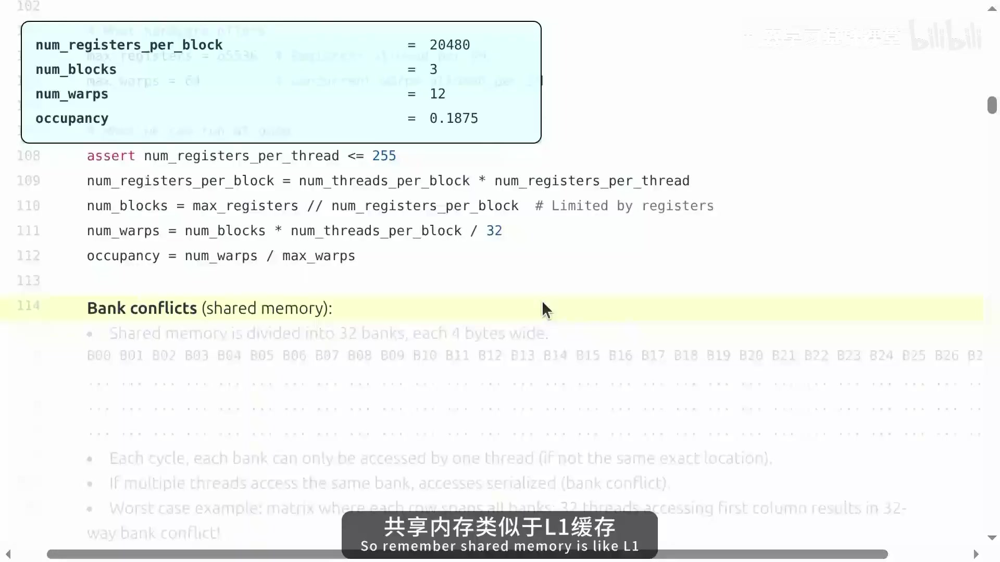

低 occupancy 不一定坏。thread coarsening 会让一个 thread 做更多工作，可能减少调度或提高数据复用，即使它同时增加 register pressure。判断依据仍然是实际 benchmark，而不是单独追求某个 occupancy 数字。

### 2.5 Shared memory bank conflict

Shared memory 被分为 **32 banks**，每个 bank 宽 **4 bytes**。如果一个 warp 的多个线程在同一周期访问同一 bank 的不同地址，访问会被串行化。课堂给出的最坏示例是 32 个线程同时访问矩阵同一列，形成 **32-way bank conflict**。

一种常见处理是 swizzling：改变 shared-memory 中的地址映射，例如让 row/column index 通过 XOR 等方式重排，从而避免同一 warp 的线程集中撞到同一 bank。

### 2.6 HBM memory coalescing

HBM 侧关注的是把相邻线程访问合并成较少的 transaction。课堂以 **128-byte cache line** 为例：一个 warp 有 32 threads，如果每个 thread 连续访问 4 bytes，则

$$
32\times4\ \text{bytes}=128\ \text{bytes}
$$

刚好覆盖一个连续 transaction，形成 full coalescing。

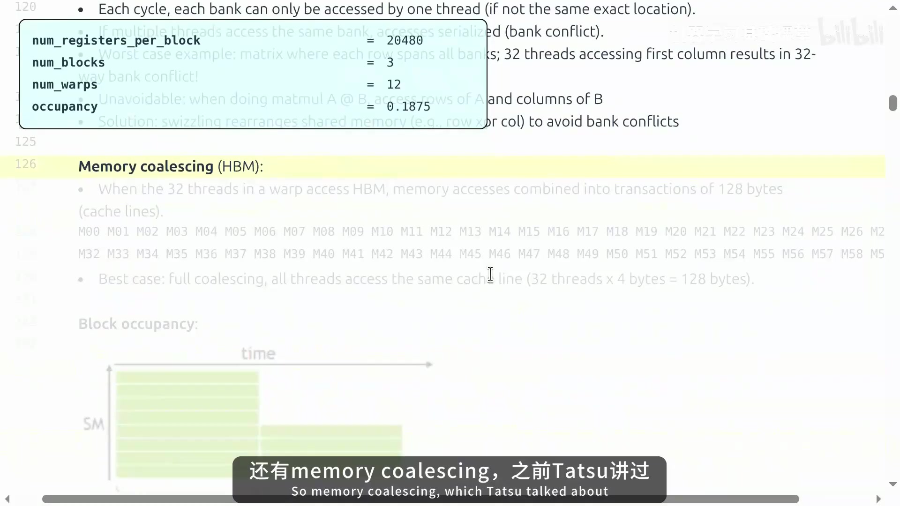

如果访问模式跨越大量 cache lines，即使算术工作量没有增加，HBM transaction 数也会显著上升。因此写 kernel 时既要考虑“算多少”，也要考虑 threads 如何映射到地址。

### 2.7 Block occupancy 与 wave quantization

B200 有 **148 SMs**。若启动 160 个 thread blocks，第一 wave 可以放 148 blocks，第二 wave 只剩 12 blocks，大量 SM 会在最后一 wave 空闲。课堂称这类现象为 wave quantization。

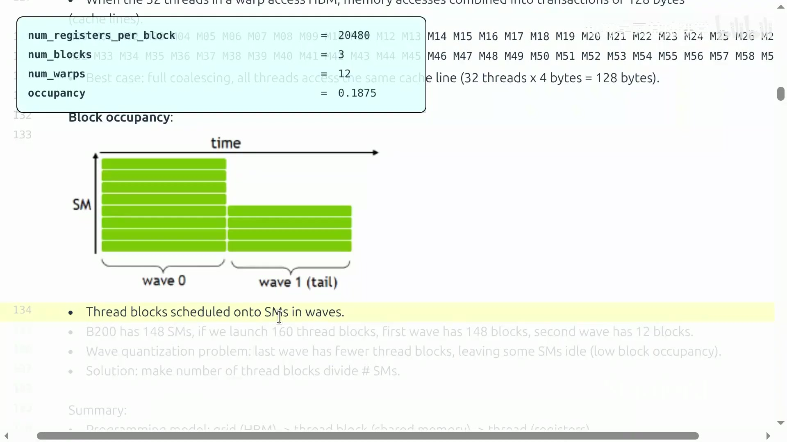

这说明 grid/block 划分还会影响整个 GPU 的利用率。一个局部看起来很好的 tile/block 配置，如果导致很差的 wave packing，也可能损失端到端性能。

## 3. Benchmark 与 profiler：先测，再改

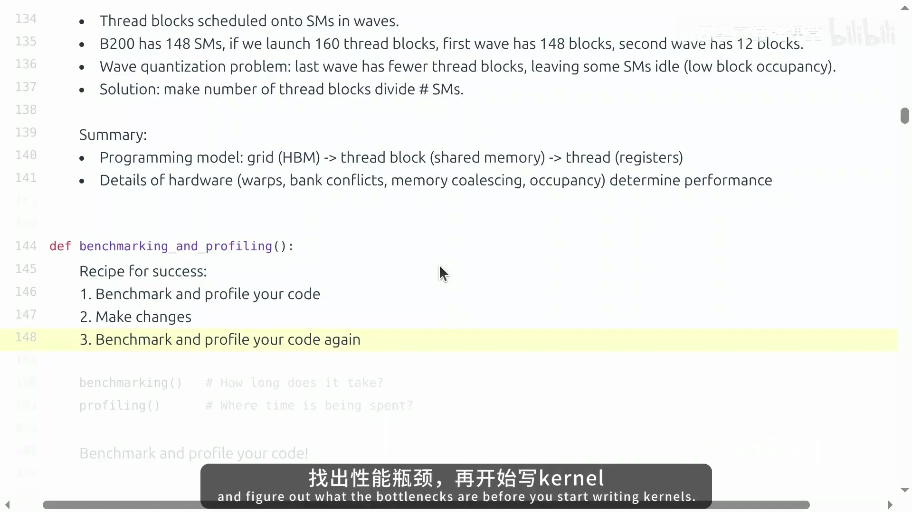

课堂给出的循环是：

> benchmark/profile → 修改 → 再 benchmark/profile

两者解决的问题不同：

- **Benchmark**：一次操作端到端究竟用了多久？不同实现谁更快？随问题规模如何变化？
- **Profiler**：时间具体花在什么地方？实际启动了哪些 CUDA kernels？

### 3.1 正确测 GPU 时间

GPU 执行是异步的。如果只在 CPU 侧包一层普通 timer，很容易把 launch overhead 当成实际 kernel latency。课堂自写 benchmark 的关键步骤是：

- 先做 warmup，避开首次 compilation 等冷启动成本；
- 计时前后适时调用 `torch.cuda.synchronize()`；
- 使用 `torch.cuda.Event(enable_timing=True)` 记录 GPU-side elapsed time；
- 默认 **1 次 warmup、3 次 trials**，取平均值。

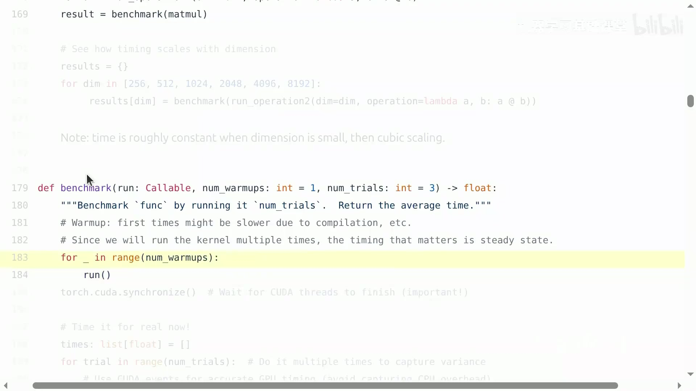

matmul 的 scaling 实验依次扫描 `256, 512, 1024, 2048, 4096, 8192`。小尺寸时，固定开销和硬件利用率使耗时近似平坦；尺寸变大后，matrix multiplication 的 $O(N^3)$ 计算量开始主导。

课堂现场一次运行中，`dim=1024` 的结果显示为 **0.6566 ms**，`dim=256` 的起始结果为 **0.6149 ms**。这些数值依赖课堂机器与运行状态，不应当当作跨硬件 benchmark 基准。

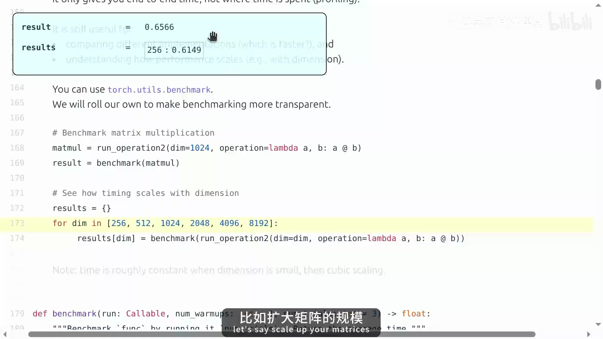

### 3.2 Profiler 显示实际执行内容

PyTorch profiler 可以看到 kernel 名、CUDA time 等信息。课堂分别 profile `add(dim=2048)`、`matmul(dim=2048)`、`matmul(dim=128)`，强调同一种高层算子在不同 shape 下可能选择不同 kernel。

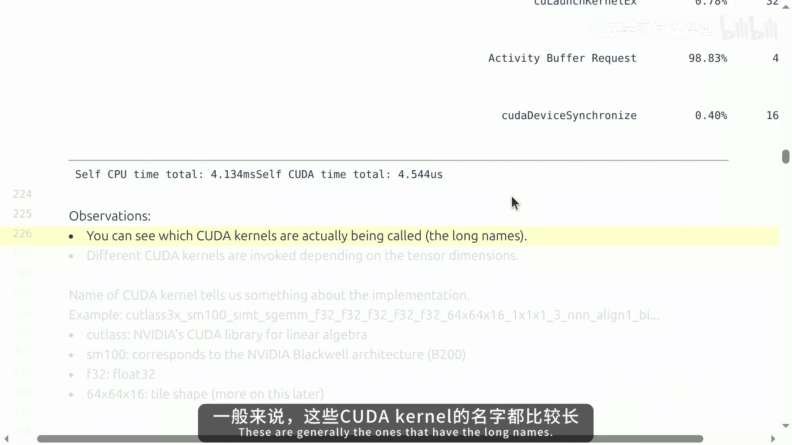

kernel 名本身也带信息。例如课堂展示的 CUTLASS 名称中可读出：

- `cutlass`：NVIDIA CUDA linear algebra library；
- `sm100`：Blackwell/B200 架构代际；
- `f32`：数据类型；
- `64x64x16`：实现使用的 tile shape 线索。

这为后面的 Triton tiling 提供了直接线索：高性能实现需要让工作划分、数据复用和硬件层级匹配。

## 4. GeLU：kernel fusion 为什么能快很多

课堂比较三种 GeLU：

1. 直接用 PyTorch 基础算子写 tanh approximation；
2. PyTorch 内置 fused GeLU；
3. 对朴素实现调用 `torch.compile`。

使用的近似形式是：

$$
\operatorname{GeLU}(x)\approx \frac{x}{2}\left(1+\tanh\left(\sqrt{\frac{2}{\pi}}\left(x+0.044715x^3\right)\right)\right)
$$

官方实现代码中把 $\sqrt{2/\pi}$ 写成约 `0.79788456`。

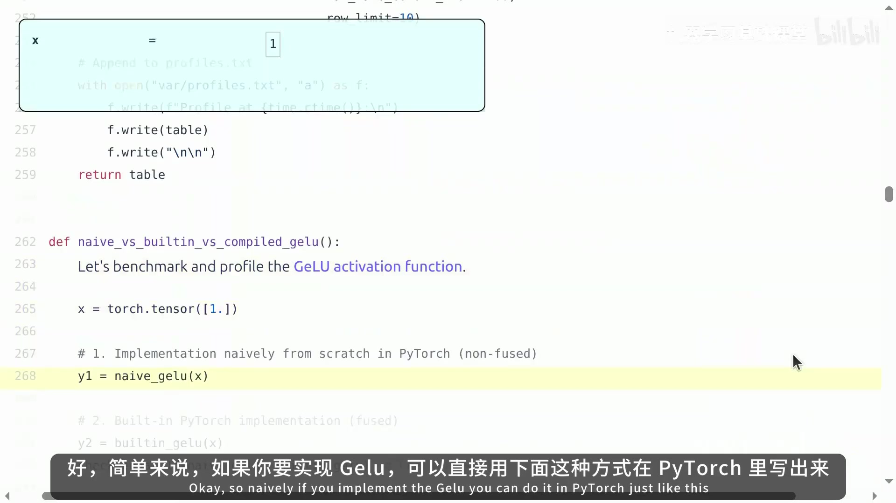

课堂先检查 correctness：当 `x=1` 时，三种实现显示 `y1=y2=y3=0.8412`。随后在 `dim=16384` 的一次现场运行中：

| 实现 | 课堂现场时间 |
| --- | ---: |
| naive PyTorch | 3.7583 ms |
| built-in GeLU | 0.6670 ms |
| `torch.compile` | 0.9388 ms |

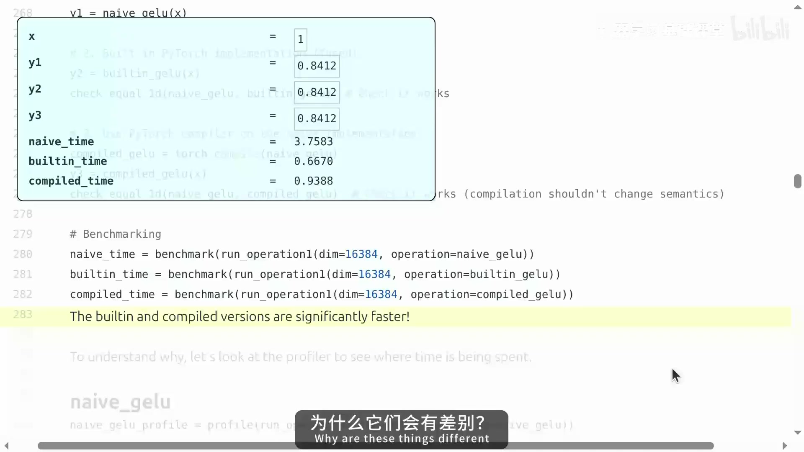

数值本身是机器相关的，关键是 profiler 暴露出的机制：

- naive 版本触发多个 kernels，中间结果反复读写 HBM；
- built-in 与 compiled 版本把计算融合到一个 kernel，接近“一次读入、完成整段逐元素计算、一次写回”；
- 本例中 compiled kernel 是 Triton kernel。

这里的性能差异主要来自更少的 kernel launches 和 HBM traffic，这也是 kernel fusion 的典型收益。

## 5. Triton：从 per-thread CUDA 转向 per-block 思考

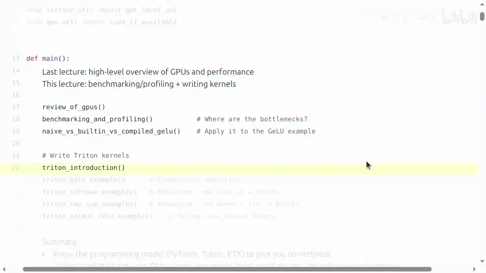

课堂给出一个有用的抽象层级对比：

- CUDA 更接近“指定每个 thread 做什么”；
- Triton 更接近“指定每个 thread block 对一块数据做什么”。

Triton 提升了表达层级，但性能仍取决于 `BLOCK_SIZE`、内存访问、occupancy、coalescing、tiling 等参数。

一个反复出现的心智模型是：

**HBM → load 到 block 可高效处理的数据 → 计算/融合 → 写回 HBM。**

### 5.1 Triton GeLU kernel

课堂中的 GeLU 例子用 `BLOCK_SIZE = 1024`。每个 Triton program/block：

1. 用 `tl.program_id(axis=0)` 得到 block id；
2. `start = pid * BLOCK_SIZE`；
3. 用 `tl.arange(0, BLOCK_SIZE)` 生成该 block 的 offsets；
4. 用 `mask = offsets < num_elements` 防止尾部越界；
5. `tl.load` 读入数据；
6. 对向量执行完整 GeLU；
7. `tl.store` 写回。

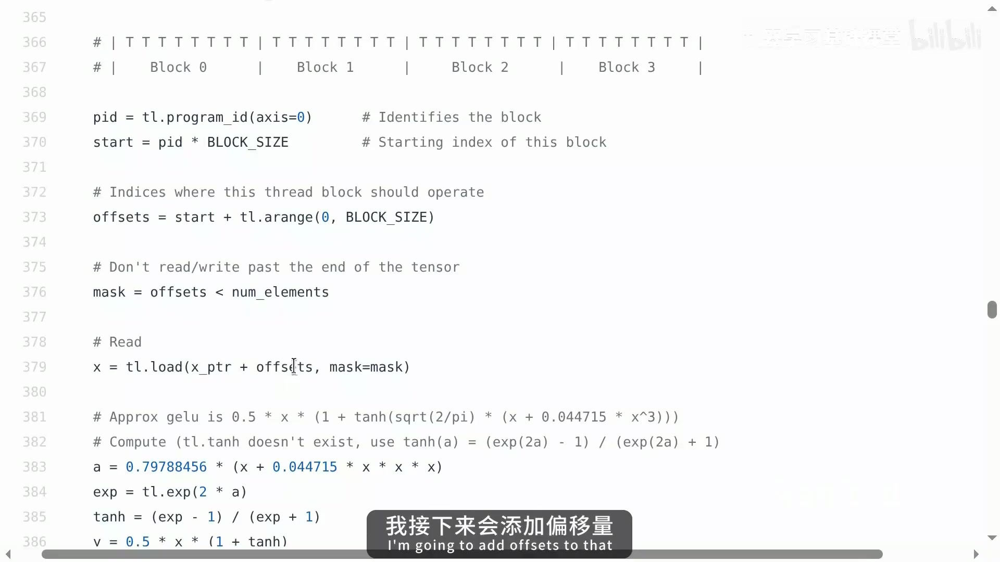

由于示例中不直接调用 `tl.tanh`，代码利用

$$
\tanh(a)=\frac{e^{2a}-1}{e^{2a}+1}
$$

把 GeLU 的 tanh approximation 转成 `tl.exp` 等操作。重要的是整条逐元素计算留在同一个 kernel 内，避免每个 Python/PyTorch primitive 都触发独立的 global-memory round trip。

### 5.2 Triton 最终会落到 PTX

Triton 编译后还会落到 PTX。课堂从生成代码中识别：

- `ld.global.*` / `st.global.*`：global-memory load/store；
- `%ctaid.x`：block index；
- `%tid.x`：thread index；
- `%f*`：floating-point registers；
- `%r*`：integer registers。

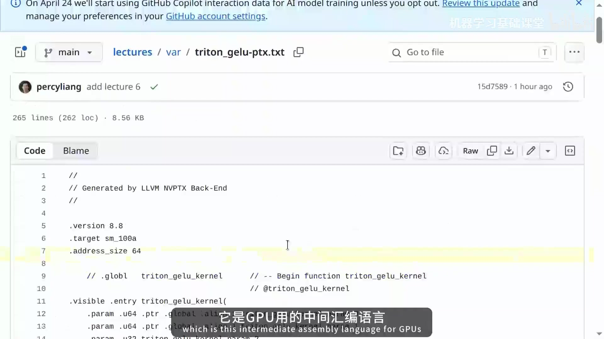

课堂还指出，这一生成代码中 **一个 thread 同时处理 8 个元素**，是 thread coarsening 的实例。也就是说，高层 Triton program 与底层 thread 行为并非一一对应；compiler 会进一步映射和向量化。

## 6. Fused softmax：优化 memory traffic

Softmax 对每一行执行稳定化、指数、求和和归一化。写成数学形式：

$$
m_i=\max_j x_{ij}
$$

$$
y_{ij}=\frac{\exp(x_{ij}-m_i)}{\sum_k\exp(x_{ik}-m_i)}
$$

如果按朴素 PyTorch 步骤逐个 materialize 中间 tensor，官方 executable lecture 对 memory traffic 的统计是：

- row max：`MN reads + M writes`
- subtract max：`MN + M reads + MN writes`
- exp：`MN reads + MN writes`
- row sum：`MN reads + M writes`
- normalize：`MN reads + MN writes`

合计：

$$
\text{reads}=5MN+M,\qquad \text{writes}=3MN+2M
$$

理想 fused kernel 则接近：

$$
MN\ \text{reads}+MN\ \text{writes}
$$

忽略较小的 $M$ 项，相当于约 **4× 更少的 memory traffic**。这是 theoretical traffic reduction，不等同于承诺 wall-clock speedup 也恰好是 4×。

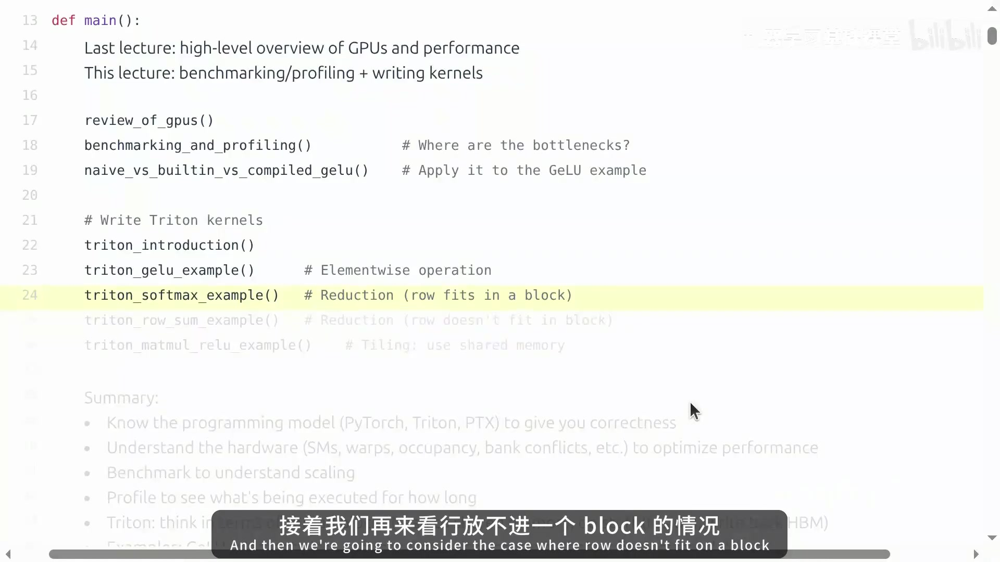

课堂 Triton 版本让“一行 = 一个 block”：

- `BLOCK_SIZE = triton.next_power_of_2(N)`；
- block 数量为 `M`；
- 越界 lanes load 为 `-inf`，这样不会污染 row max；
- block 内一次完成 `max → exp → sum → divide`；
- 最后一次写回该行结果。

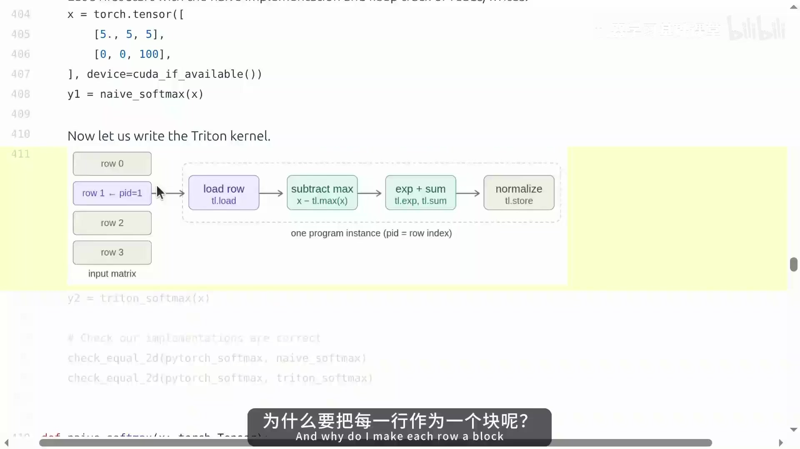

这里出现了本讲最重要的设计模式之一：**只要整个工作集能放进一个 block 的可用资源，就应尽量把跨步骤的中间结果留在片上，减少中间结果写回 HBM 的次数。**

## 7. Row sum：一行放不进一个 block 时怎么办

Softmax 例子假设一整行能由一个 block 处理。但如果一行有 **4096 columns**，而 `BLOCK_SIZE = 1024`，就需要把一行拆成 **4 tiles**。

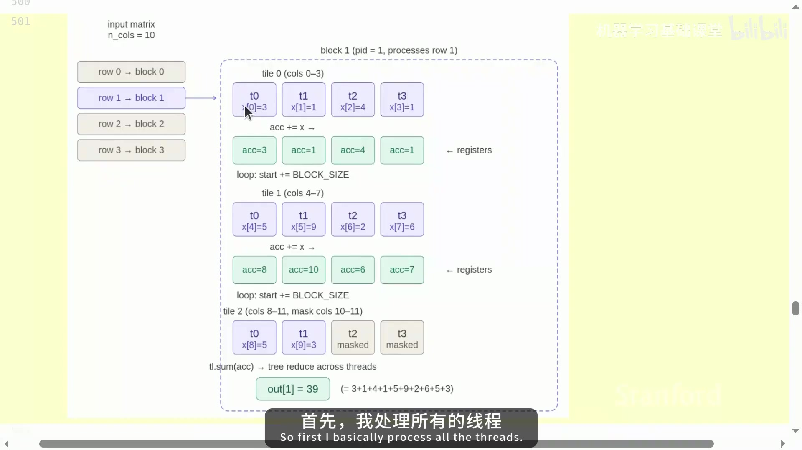

课堂用更简单的 row sum 演示这个模式：

- 每个 thread 对应一个 accumulator；
- `for start in range(0, N, BLOCK_SIZE)` 跨 tiles 循环；
- 每一轮 load 当前 tile，对 `acc` 累加；
- 所有 tiles 完成后，用 `tl.sum(acc, axis=0)` 做最终 reduction；
- 每一行只写回一个 scalar。

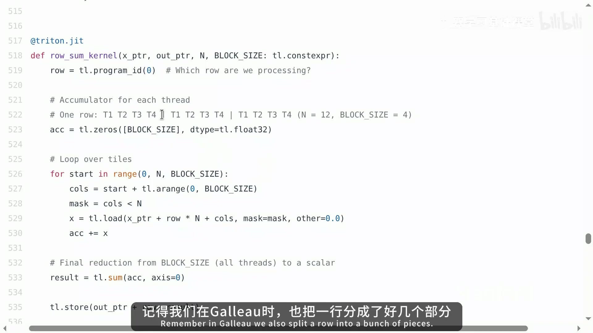

这个例子是后面 matmul tiling 的简化版本：数据太大时，将工作集切成可以驻留的块，并在片上维护 partial result。

## 8. Matrix multiplication：tiling 提高 arithmetic intensity

设 $A\in\mathbb{R}^{M\times K}$、$B\in\mathbb{R}^{K\times N}$、$C=AB$。

### 8.1 朴素方案为什么差

若对每个输出 $C[m,n]$ 都从 HBM 反复读取对应的 $A[m,k]$ 和 $B[k,n]$，数据流量量级为：

$$
MKN\ \text{reads}+MN\ \text{writes}
$$

其 arithmetic intensity 只有 $O(1)$：每从 HBM 搬一批数据，只做常数量级的有效复用。

### 8.2 “全部放 shared memory”是理想上界，但不可行

如果能把整个 $A$ 和 $B$ 一次载入 shared memory，则理论数据流量可以接近：

$$
MK+KN\ \text{reads}+MN\ \text{writes}
$$

arithmetic intensity 可以达到 $O(N)$ 量级。但真实矩阵通常远大于 shared memory 容量，所以这个方案只是帮助理解“数据复用越多越好”的上界。

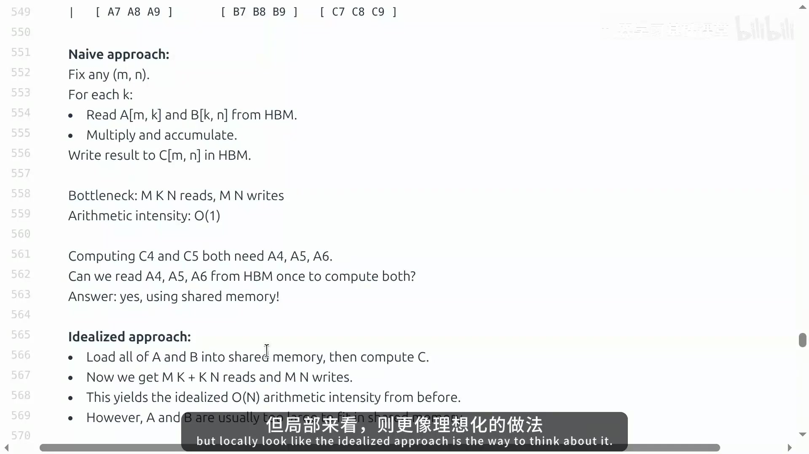

### 8.3 实际方案：output tiling

可行做法是把输出矩阵 $C$ 切成 tiles。对某个 output tile：

1. 取对应的 $A$ row tile 和 $B$ column tile；
2. 从 HBM 载入片上存储；
3. 做局部 matrix multiply；
4. 把 partial sum 累积在片上；
5. 沿 $K$ 方向继续移动到下一对 tiles；
6. 完成后一次写回 output tile。

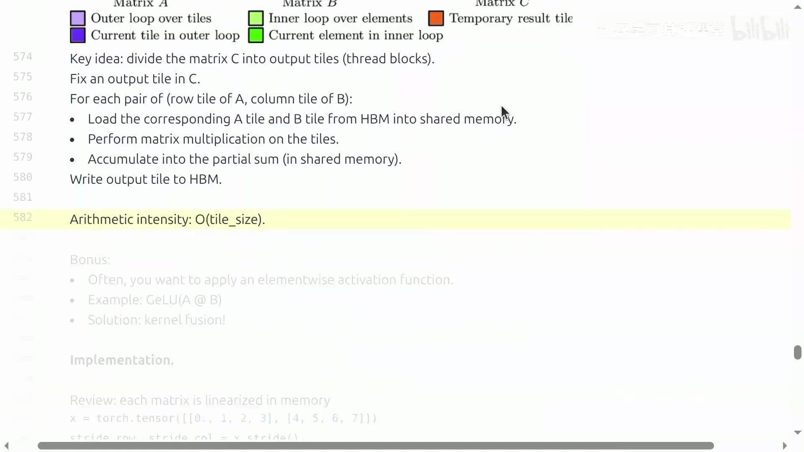

这样 arithmetic intensity 提升到 $O(\text{tile size})$。tile 越大，理论数据复用越高，但同时会增加 shared memory/register 消耗并影响 occupancy，因此 tile size 仍需 benchmark。

### 8.4 课堂 Triton matmul + ReLU

官方实现采用：

- `BLOCK_M = 64`
- `BLOCK_N = 64`
- `BLOCK_K = 32`

每个 Triton program 负责一个 $64\times64$ 的 $C$ tile，沿 $K$ 维每次加载 $64\times32$ 的 $A$ tile 和 $32\times64$ 的 $B$ tile，再通过 `tl.dot` 累加。

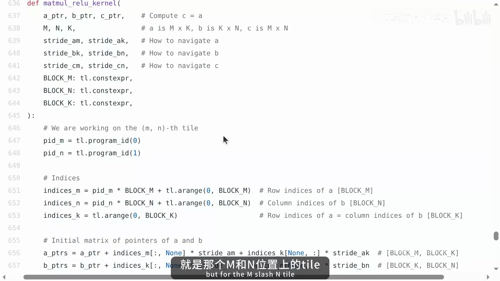

在写回前，课堂直接对 accumulator 做 ReLU：

$$
C=\operatorname{ReLU}(AB)
$$

这再次体现 fusion：既然 matrix multiplication 的结果已经在当前 kernel 的片上 accumulator 中，就没有必要先把 $AB$ 写回 HBM，再启动第二个 kernel 读回来做 ReLU。

## 9. Assignment 2: Systems 与本讲的关系

Spring 2026 Schedule 在 Lecture 6 当天发布 **Assignment 2: Systems**。本讲覆盖的 benchmark、profiling、kernel fusion、Triton、memory hierarchy 与 tiling，是进入系统性能作业前需要建立的核心模型。

课堂明确提到：课程中的 PyTorch profiler 用于理解高层行为，而 assignment 会进一步使用 Nsight 获得更细的 GPU 性能信息。因此做作业时应保留本讲的基本方法：

- 先保证 correctness；
- 建立可重复 benchmark；
- profile 找到真实 bottleneck；
- 再修改 kernel/configuration；
- 用新的 benchmark/profile 验证改动。

Assignment 2 属于作业 handout/codebase；官方没有把它标为本讲的 paper 或 required reading，因此未作为论文 PDF 打包到 `papers/`。

## 10. 结论：四个 kernel 例子对应四种系统思维

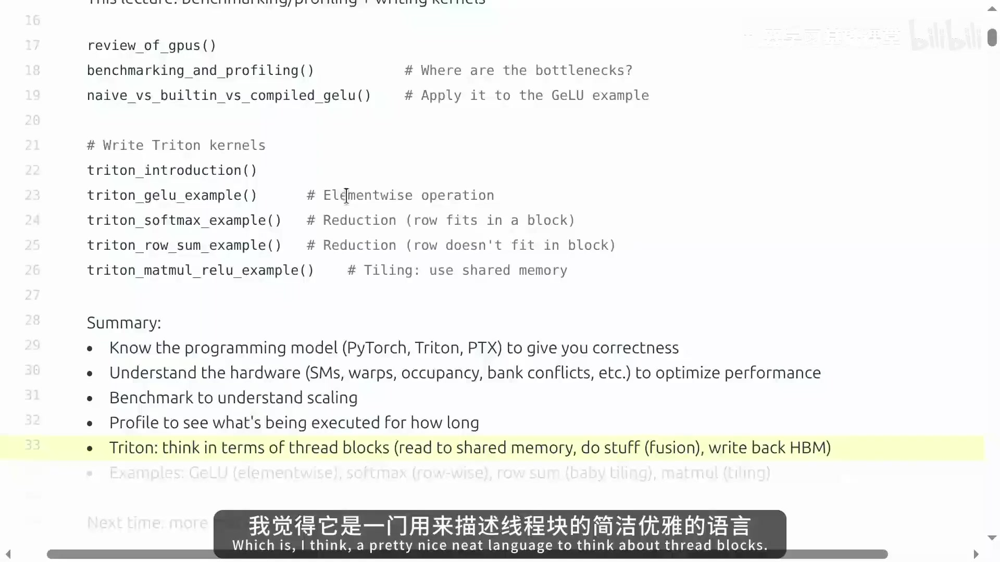

本讲最后把内容收束到四层关系：

- **Programming model**：PyTorch、Triton、PTX 帮助表达正确计算；
- **Hardware model**：SM、warp、register、shared memory、bank conflict、coalescing、occupancy 决定性能上限和常见瓶颈；
- **Measurement**：benchmark 看端到端 scaling，profiler 看实际 kernels 与时间分布；
- **Kernel design**：通过 fusion、thread/block mapping、tiling 和数据复用减少昂贵的数据移动。

四个例子可以作为后续写 kernel 时的模板：

| 例子 | 主要问题 | 关键方法 |
| --- | --- | --- |
| GeLU | 多个逐元素算子造成多 kernel、多轮 HBM traffic | kernel fusion |
| Softmax | 多阶段 row-wise reduction | 一行一个 block，片上完成全部步骤 |
| Row sum | 一行大于单个 block | 跨 tiles 累加，再做最终 reduction |
| Matmul + ReLU | 高数据复用需求与 shared-memory 容量限制 | output tiling + fusion |

末尾问答还强调了一个边界：对于传感器等其他数据，应该“整体处理”还是“按组件处理”，不能脱离具体 computation、数据复用和依赖关系抽象决定。kernel 的划分方式必须服务于实际计算结构和硬件数据流。
