---
workflow:
  name: ChatGPT-Web-Course-Note-Workflow
  version: v4.9.4
course:
  name: "CS336: Language Modeling from Scratch"
  term: "Spring 2026"
  instructors:
    - Tatsunori Hashimoto
    - Percy Liang
chapter:
  index: 7
  local_label: P07
  local_title: "斯坦福 CS336：并行性（一）"
  official_unit_label: Lecture
  official_unit_number: 7
  official_title: "Parallelism"
  date: "2026-04-20"
  instructor: "Percy Liang"
provenance:
  lecture_video_term: "Spring 2026"
  official_materials_term: "Spring 2026"
  local_video_source: "Bilibili collection BV1msTD6CE6j"
---

# Lecture 7: Parallelism

本讲把前一讲的“单 GPU 内怎样减少数据搬运”扩展到多 GPU：计算资源增加后，性能瓶颈转向 GPU 之间、节点之间的通信。Percy Liang 先建立 collective operations 的通信词汇，再把这些原语落到硬件互连、NCCL 和 `torch.distributed`，最后从零构造 data parallelism、tensor parallelism 和 pipeline parallelism。

## 课程身份与配套资料

- 本地章节：P07「并行性（一）」
- 官方映射：Spring 2026 **Lecture 7 — Parallelism**
- 日期：2026-04-20
- 授课：Percy Liang
- 官方 Schedule：<https://cs336.stanford.edu/>
- 官方可执行讲义：<https://cs336.stanford.edu/lectures/?trace=lecture_07>
- `lecture_07.py`：<https://github.com/stanford-cs336/lectures/blob/main/lecture_07.py>
- 讲义对应运行输出：<https://github.com/stanford-cs336/lectures/blob/main/var/traces/lecture_07_stdout.txt>
- Spring 2026 官方录像列表：<https://www.youtube.com/watch?v=JuoVZkPBiKk&list=PLoROMvodv4rMqXOcazWaTUHhq-yembLCV>

官方 Schedule 的 Lecture 7 行没有单独关联 paper、assigned reading 或 required reading，因此本章包不额外加入 `papers/` 内容。

## 1. 从单 GPU 到多 GPU：瓶颈仍然是数据移动 [00:05–05:50]

上一讲研究 kernel、fusion 和 tiling，本质上是在一个 GPU 内让计算单元少等 HBM。多 GPU 场景保留同一个核心矛盾：算力离数据很远，只是“远”的层级变多了。

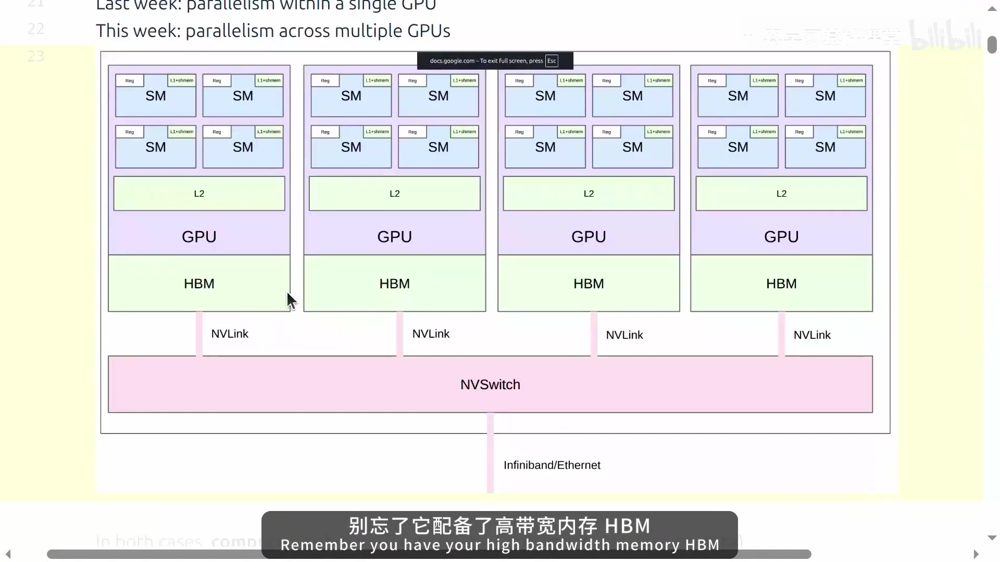

可以把硬件看成逐级变慢的层次：

1. 单 GPU 内的寄存器 / shared memory；
2. 单 GPU 的 HBM；
3. 单节点多 GPU，经 NVLink / NVSwitch；
4. 跨节点，经 InfiniBand 或 Ethernet。

因此，多 GPU 训练要同时回答两个问题：

- **容量**：参数、梯度、optimizer state 和 activation 放不进单卡时，怎样把状态拆到多卡；
- **吞吐**：即使单卡能放下模型，怎样用更多 GPU 增加总 FLOPs，同时控制通信开销。

课程把整讲分成两部分：先学分布式通信与硬件的 building blocks，再用这些原语构造训练并行策略。

## 2. Collective operations：分布式程序的基本通信词汇 [05:53–21:55]

### 2.1 Rank 与 world size

在课程的四设备示例里：

- `rank` 标识某个进程 / 设备，例如 0、1、2、3；
- `world_size` 是参与通信的设备总数，这里为 4。

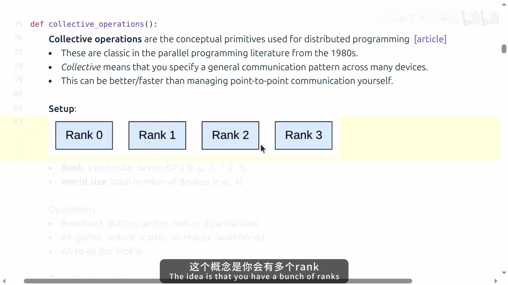

collective operation 描述“一组 rank 之间怎样交换张量”，让程序员直接表达通信模式，而不必自己管理大量 point-to-point send/receive。课程把操作分成三组：

- 基础：broadcast、scatter、gather、reduce；
- 训练中的主力：all-gather、reduce-scatter、all-reduce；
- 更一般的重排：all-to-all。

### 2.2 Broadcast、scatter、gather、reduce

这四个操作先建立方向感。

| 操作 | 输入/输出关系 | 直观用途 |
|---|---|---|
| broadcast | 一个 rank 的完整张量复制到所有 rank | rank 0 加载 checkpoint 后分发 |
| scatter | 一个 rank 的张量切成若干块，分别发到各 rank | 理解 reduce-scatter 的基础 |
| gather | 各 rank 的分块汇集到一个 rank | scatter 的反向操作，也是 all-gather 的基础 |
| reduce | 各 rank 的值用 sum/min/max 等归约到一个 rank | all-reduce 的基础 |

课程用 `world_size=4` 的小张量反复演示这些变化，使后面的组合操作可以直接从数据布局推导，而无需死记 API 名称。

### 2.3 All-gather：每个 rank 都得到完整结果

如果每个 rank 只持有一个参数分片，forward 前又需要完整参数，就可以 all-gather：先把分片聚合，再让每个 rank 都获得聚合后的完整张量。

四个 rank 分别持有 `[0]`、`[1]`、`[2]`、`[3]` 时，all-gather 后每个 rank 都得到 `[0, 1, 2, 3]`。

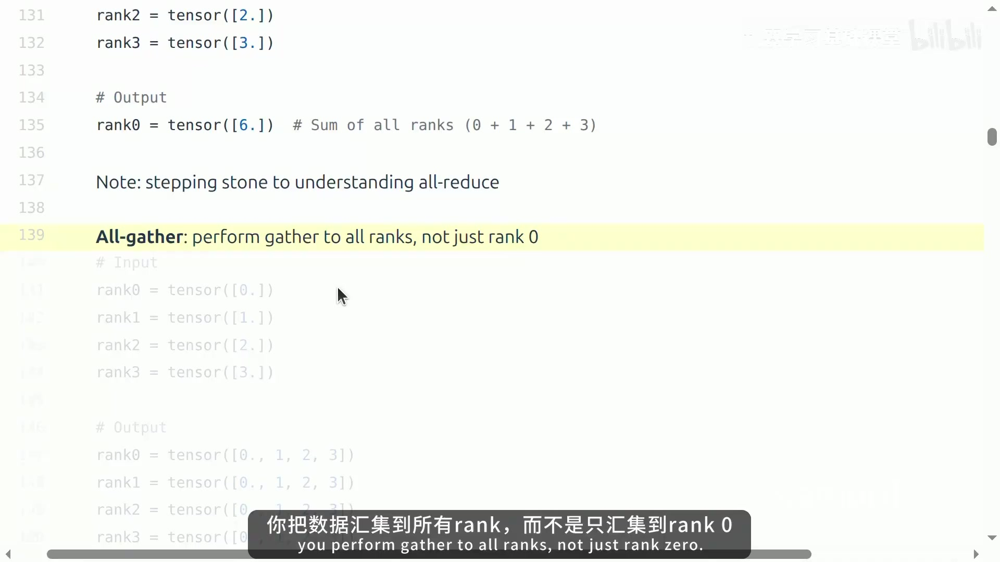

这个模式会在 FSDP/ZeRO 一类参数分片方案中再次出现。

### 2.4 Reduce-scatter：归约之后只保留各自的一片

课程让四个 rank 分别持有：

- rank 0: `[0, 1, 2, 3]`
- rank 1: `[1, 2, 3, 4]`
- rank 2: `[2, 3, 4, 5]`
- rank 3: `[3, 4, 5, 6]`

逐列求和得到 `[6, 10, 14, 18]`，reduce-scatter 随后把四个结果分别留在四个 rank 上：6、10、14、18。

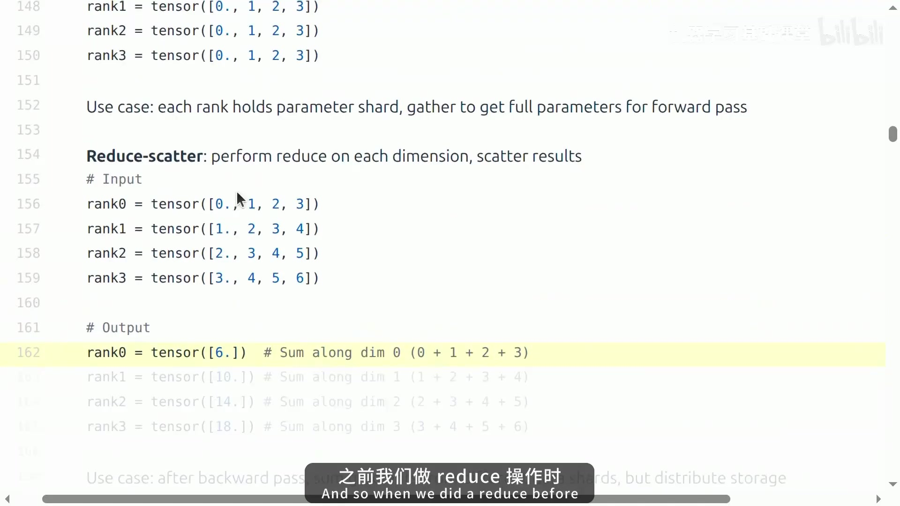

在训练里，这个模式适合“对不同 data shard 产生的梯度做归约，但最终仍分片存储梯度或参数状态”。

### 2.5 All-reduce = reduce-scatter + all-gather

all-reduce 先做归约，再让所有 rank 拥有完整结果。对上面的输入做 sum 后，四个 rank 最终都得到 `[6, 10, 14, 18]`。

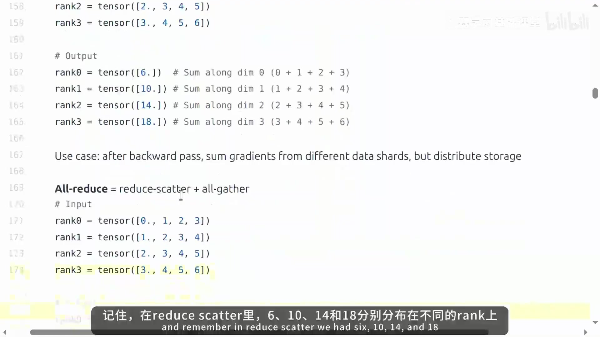

这条等价关系很关键：

$$
\text{all-reduce} = \text{reduce-scatter} + \text{all-gather}.
$$

DDP 可以直接 all-reduce 梯度；如果希望参数、梯度或 optimizer state 不再完整复制到每个 rank，就需要把这一步拆开，允许中间状态保持 sharded。Lecture 7 只做预告，FSDP/ZeRO 留到后续课程。

### 2.6 All-to-all：每个 rank 都向每个其他 rank 发送一部分

all-to-all 可以理解为更一般的重排。四个 rank 各持有四个元素时，把“每行的第 $j$ 个元素发给 rank $j$”，输出在视觉上类似矩阵转置：

- rank 0 得到 `[0, 4, 8, 12]`
- rank 1 得到 `[1, 5, 9, 13]`
- rank 2 得到 `[2, 6, 10, 14]`
- rank 3 得到 `[3, 7, 11, 15]`

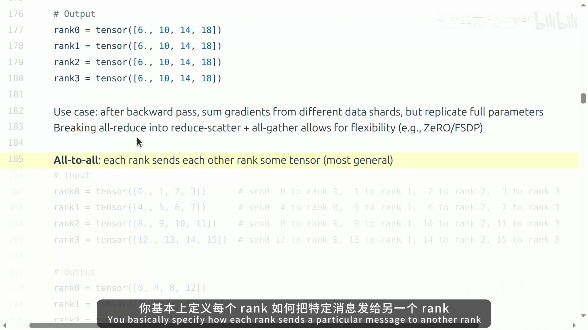

课程把它与 Mixture of Experts 联系起来：数据先按 expert 路由到持有对应 experts 的 rank，负载越均衡，all-to-all 越容易高效执行。

## 3. 通信性能取决于物理拓扑 [21:56–36:15]

collective 只是编程模型。真实代价由数据实际经过的链路决定。

### 3.1 从 PCIe 到 NVLink/NVSwitch，再到跨节点网络

课程先给出传统单机拓扑：GPU 通过 PCIe 与主机及其他设备连接。随后切到数据中心拓扑：一个节点内的多张 GPU 通过 NVLink 接入 NVSwitch，节点之间再经 HCA/NIC 和 InfiniBand 互连。

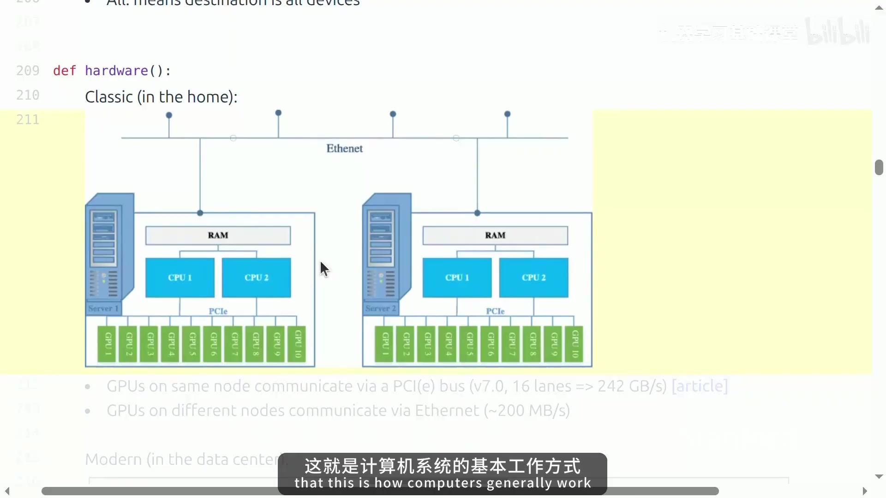

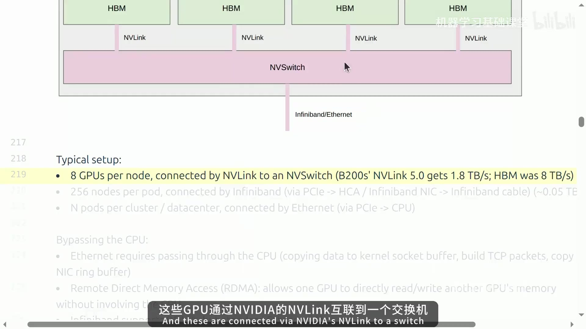

讲义给出的数量级只用于校准通信层级，不代表所有硬件配置：

- B200 的 NVLink 5 示例约 **1.8 TB/s**；
- HBM 示例约 **8 TB/s**；
- 跨节点 InfiniBand 示例约 **0.05 TB/s**；
- 更远的 Ethernet 通常更慢，并可能引入 CPU / kernel networking 路径。

相同的通信量放在 NVLink 域内和跨节点执行，代价可能完全不同，因此并行策略必须与拓扑一起设计。

### 3.2 RDMA：绕过 CPU 的远程内存访问路径

传统 Ethernet 发送会经过 CPU、kernel socket buffer 和 NIC 队列。Remote Direct Memory Access（RDMA）允许一个设备直接读写另一端内存，减少 CPU 介入和额外复制。

课程区分了两类概念：NVLink、NVSwitch、InfiniBand 是具体互连/硬件；RDMA 描述希望获得的直接内存访问能力。InfiniBand 原生支持 RDMA，RoCE 则把 RDMA 机制带到 converged Ethernet。

### 3.3 NCCL：把 collective 映射到实际拓扑

NVIDIA Collective Communications Library（NCCL）位于 collective API 与底层互连之间。它会识别节点、switch、NVLink/PCIe 等拓扑，选择合适的通信路径，并启动 GPU kernels 完成 send/receive。

因此应用代码可以表达“我要 all-reduce”，而环形、树形、跨多少 switch 等细节由通信库处理。后面的 benchmark 也正是测量这个实现层最终交付的有效带宽。

## 4. `torch.distributed`：把 collective 写成可运行程序 [36:16–46:30]

PyTorch 的 `torch.distributed` 给 collective operations 提供统一接口，并通过 backend 适配硬件：课程明确提到 `gloo` 用于 CPU，`nccl` 用于 GPU。课堂演示在 laptop 上使用 `gloo`；同一套 API 在 GPU 集群上可切到 NCCL backend。

课程用四个进程模拟四个 rank。每个进程异步前进，因此在需要对齐观察点时用 `dist.barrier()`；collective 本身再调用 `dist.all_reduce`、`dist.reduce_scatter_tensor`、`dist.all_gather_into_tensor` 等 API。

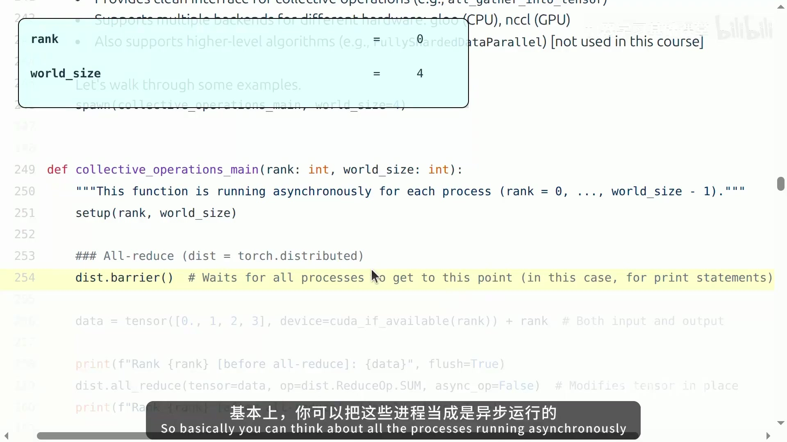

示例里的 `async_op=False` 让调用在该操作完成后再继续，便于观察语义。实际高性能训练还会专门设计 communication/computation overlap，本讲稍后把它列为尚未实现的重要优化。

课堂执行结果验证了前面的数学例子：all-reduce 后四个 rank 都得到 `[6, 10, 14, 18]`；随后 reduce-scatter 分别得到 6、10、14、18，再 all-gather 回完整向量。

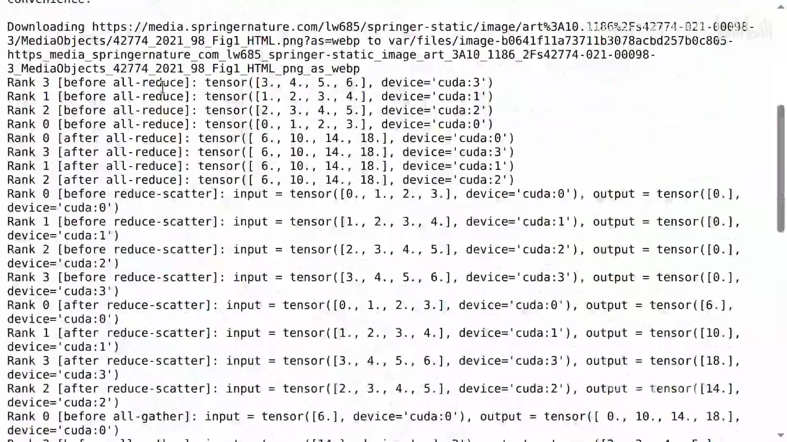

这段演示验证了 collective 对应进程间真实的张量移动和同步，数据布局也随操作发生变化。

## 5. Benchmark：把通信时间换算成有效带宽 [46:38–53:20]

课程用 4 个 rank、`100 * 1024**2` 个元素分别 benchmark all-reduce 和 reduce-scatter。和 kernel benchmark 一样，先 warm up，再同步 CUDA、barrier、计时，避免把异步执行误算进结果。

对于 all-reduce，设单个 rank 的 payload 大小为 $S$ bytes、world size 为 $W$、单次 wall-clock duration 为 $T$。课堂采用的有效带宽估算为：

$$
B_{\mathrm{eff}}
= \frac{2S(W-1)}{WT}
\approx \frac{2S}{T}\quad (W \text{ 较大时}).
$$

其中乘 2 对应 send 与 receive 两个方向；分母乘 $W$ 是把各 rank 等待的总时间纳入估算。

Spring 2026 官方讲义对应的一次运行中：

- all-reduce：约 **1.38–1.60 ms**，测得 **366–426 GB/s**；
- reduce-scatter：约 **2.39–2.61 ms**，测得 **450–490 GB/s**。

这些数值是该次运行的观测结果，不应视为固定硬件规格。教师强调：两种 operation 的有效带宽处在相近数量级；all-reduce 可以看成 reduce-scatter 与 all-gather 的组合，数据移动量和耗时会一起变化。

## 6. Data parallelism：切 batch，复制模型，同步梯度 [55:33–62:59]

data parallelism 沿 batch 维切分数据。每个 rank：

1. 只处理自己的 data shard；
2. 持有完整模型参数和自己的 optimizer state；
3. 独立完成 forward/backward；
4. 把各 rank 的梯度做 all-reduce；
5. 用同步后的梯度更新，因此各 rank 的参数保持一致。

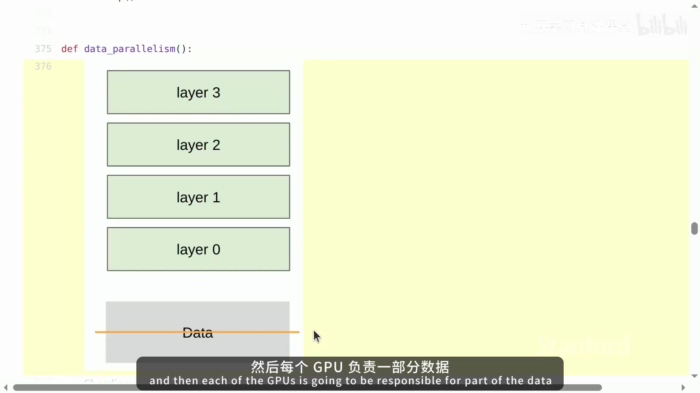

课堂 toy example 使用 `batch_size=128`、`num_dim=1024`、`world_size=4`，所以每个 rank 的 `local_batch_size=32`。各 rank 因为看到的数据不同，local loss 可以不同；真正维持模型副本一致的是梯度同步。

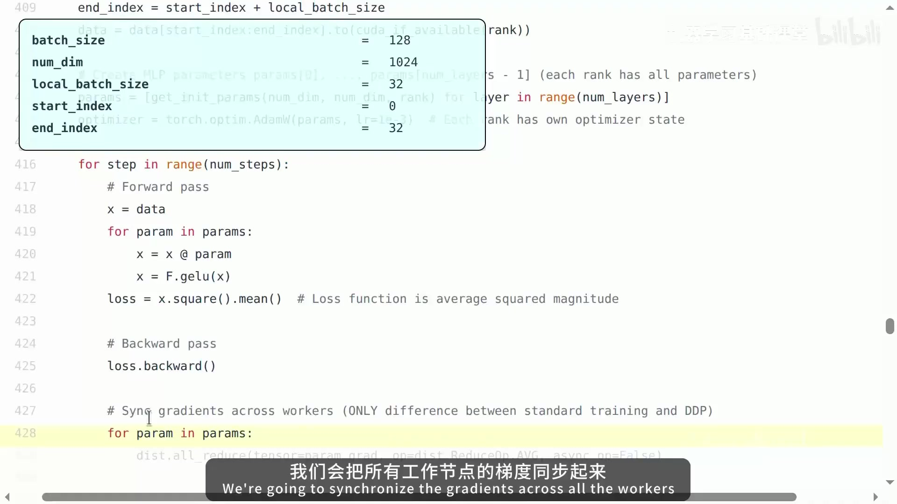

这里有一个容易混淆的细节：前面的 collective toy example 用 SUM 解释 all-reduce；data parallelism 代码对 gradient 使用 AVG。两者不冲突，collective 的归约算子可以按算法需要选择。

DDP 的代价是每个 rank 仍保存完整参数和 optimizer state，所以它主要扩展吞吐，不解决所有内存问题。Lecture 7 在这里明确预告：FSDP/ZeRO 会用 all-gather + reduce-scatter，让参数相关状态也保持 sharded，从而减少单卡常驻内存。

## 7. Tensor parallelism：切 layer width，频繁交换 activation [62:59–69:38]

Tensor parallelism 沿模型宽度切分每一层。课程用 column-wise 的 MLP 示例说明：每个 rank 只保存每层矩阵的一部分，因此参数内存被分摊；但每层计算后，各 rank 只得到局部 activation，下一层又需要完整输入，于是必须通信。

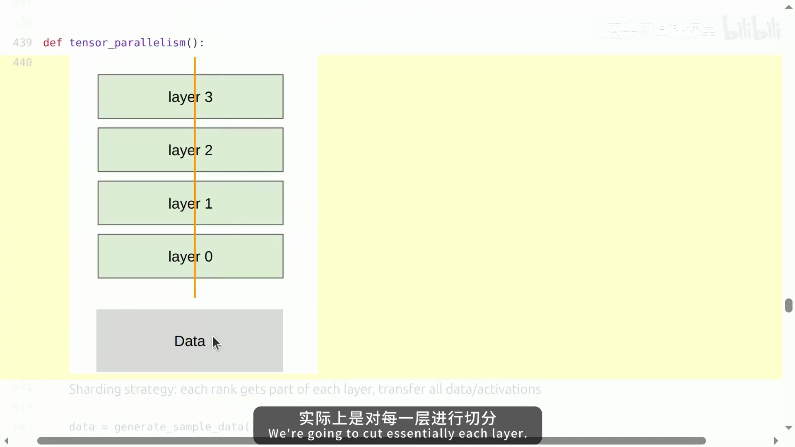

在示例 forward 中：

1. 每个 rank 用自己的参数 shard 计算 `batch_size × local_num_dim` 的局部 activation；
2. 为其他 rank 的 activation 分配 buffer；
3. 执行 all-gather；
4. 沿 feature dimension concatenate，恢复 `batch_size × num_dim`；
5. 进入下一层并重复。

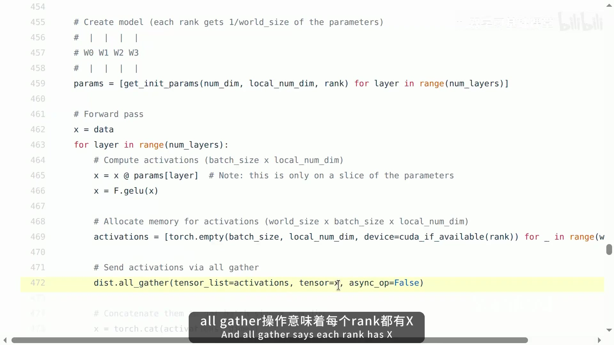

这解释了 tensor parallelism 对互连的苛刻要求：通信发生在层与层之间，频率高，而且 activation 通常很大。教师在后面的策略讨论中明确指出，tensor parallelism 一般放在 NVLink 这类高带宽域内，不适合跨越慢链路。

## 8. Pipeline parallelism：切 depth，用 micro-batch 减少 bubble [69:38–75:10]

Pipeline parallelism 沿模型深度切分 layer。Lecture 7 的 bare-bones 实现设 `world_size=2`、4 层，因此每个 rank 负责 2 层；输入又被切成 4 个 micro-batches。

forward 的数据流是：

1. rank 0 把 batch 切成多个 micro-batches；
2. 后续 rank 预先分配接收 activation 的 buffer；
3. 一个 rank 接收上一 stage 的 activation；
4. 只运行分配给自己的本地 layers；
5. 将结果 `send` 到下一 rank；
6. 对后续 micro-batches 重复，使不同 stage 有机会同时工作。

micro-batch 的目标是缩小 pipeline bubble：如果整批数据一次走完整条 pipeline，后面的 stage 会长时间空闲；把 batch 切细后，前一个 micro-batch 已进入 stage 2 时，stage 1 可以开始处理下一个 micro-batch。

本段本地录像主要保持讲师画面，没有同时展示清晰的 pipeline 图或代码页面，因此这里按字幕与同版本 `lecture_07.py` 转写核心状态，不用低信息量人物帧代替教学图。

本讲的实现仍缺少一个关键工程优化：**communication/computation overlap**。真正的 pipeline system 会尽量让数据传输与算子执行并发，进一步压缩 bubble 和等待时间。

## 9. 如何按硬件选择并行策略 [75:36–79:09]

课程最后把几种切分维度放到同一张设计图里：

| 并行方式 | 主要切分维度 | 典型通信特征 | Lecture 7 给出的硬件判断 |
|---|---|---|---|
| data parallelism | batch | 每步同步 gradient | 相对容易扩展；batch 继续增大时会遇到 critical batch size |
| tensor parallelism | width | 几乎每层交换 activation | 需要很快的互连，通常限制在 NVLink domain 内 |
| pipeline parallelism | depth | stage 之间传 activation | 可以容忍更慢链路，但必须处理 pipeline bubble |
| sequence parallelism | sequence length | 拆分长序列上的计算 | 本讲只点到概念 |
| expert parallelism | experts / width | 常见 all-to-all 路由 | 与 MoE 直接相关 |

如果 data parallelism 已经把 batch 扩到收益递减的 critical batch size，再单纯增加 data-parallel replicas 会浪费计算，这时更有理由切到 tensor parallelism 或与其他策略组合。现实的大模型训练通常形成多维组合，例如节点内做 tensor parallelism，再在更慢的拓扑层级做 data/FSDP 或 pipeline parallelism。

课程也解释了为什么这里故意用低层 PyTorch collective：这样可以看到每一步到底在传什么。JAX/TPU 风格可以让用户声明模型和 sharding strategy，再由 compiler 推导许多通信操作；抽象层更高，但会隐藏本讲希望建立的机械直觉。

## 10. 一页总结 [79:09–80:57]

把整讲压缩成几条可以直接用于后续课程的规则：

- 多 GPU 性能问题首先是**计算与数据的距离问题**；越跨出本地高速存储和高速互连，通信越贵。
- collective operations 是理解分布式训练的基础词汇：尤其要熟悉 all-gather、reduce-scatter、all-reduce、all-to-all。
- `all-reduce = reduce-scatter + all-gather` 把 DDP 与 FSDP/ZeRO 的关系连接起来。
- DDP 切 batch，参数复制；tensor parallelism 切 width，需要高速互连；pipeline parallelism 切 depth，需要控制 bubbles。
- 并行算法不能脱离 hardware topology。NVLink、InfiniBand、Ethernet 的层级会直接决定哪种通信模式可接受。
- 训练系统的资源选择可以归纳为三种：重新计算、占用本地内存、或把状态放在其他 GPU 上并通过通信取回。规模继续增长时，这三者会反复权衡。

### 自测问题

1. 为什么 all-reduce 可以分解为 reduce-scatter + all-gather？这种分解对 ZeRO/FSDP 有什么意义？
2. DDP 中 local loss 可以不同，为什么各 rank 更新后的参数仍能保持一致？
3. Tensor parallelism 为什么通常要求 NVLink 级别的互连，而 pipeline parallelism 可以容忍更慢的网络？
4. `world_size` 增大时，课堂定义的 all-reduce effective bandwidth 为什么趋近于与 `world_size` 无关？
5. micro-batch 怎样减少 pipeline bubble？如果不做 communication/computation overlap，还会留下什么空闲时间？
