---
workflow:
  name: ChatGPT-Web-Course-Note-Workflow
  version: v4.9.4
course:
  name: "CS336: Language Modeling from Scratch"
  term: "Spring 2026"
  instructors:
    - Tatsunori Hashimoto
    - Percy Liang
chapter:
  index: 8
  local_label: P08
  local_title: "并行性（二）"
  official_unit_label: "Lecture"
  official_unit_number: 8
  official_title: "Parallelism"
  official_date: "2026-04-22"
  instructor: "Tatsunori Hashimoto"
provenance:
  lecture_video_term: "Spring 2026"
  official_materials_term: "Spring 2026"
  local_video_collection: "https://www.bilibili.com/video/BV1msTD6CE6j"
  official_course_url: "https://cs336.stanford.edu/"
  official_lecture_material: "https://github.com/stanford-cs336/lectures/blob/main/lecture_08.pdf"
---

# Lecture 8 — Parallelism

> CS336: Language Modeling from Scratch · Spring 2026  
> 日期：2026-04-22 · 授课：Tatsunori Hashimoto · 本地章节：P08「并行性（二）」

## 本讲定位与资料

这一讲承接上一讲 Percy 介绍的并行基础，目标是回答一个更工程化的问题：**当模型、batch 和集群规模都很大时，怎样把多种并行策略组合起来，让模型装得下、通信不拖慢训练，并尽量让加速器持续做有效计算。** 课堂把最终组合称为 3D/4D parallelism，并强调实际系统往往同时使用更多维度的技巧。[00:00:00–00:01:10]

官方 Spring 2026 Schedule 将本讲映射为 Lecture 8 “Parallelism”，并关联官方 [lecture_08.pdf](https://github.com/stanford-cs336/lectures/blob/main/lecture_08.pdf)。本笔记正文以本地 Spring 2026 视频、VTT 字幕和视频中可见课件为主要内容来源；官方 PDF 在本次运行中只用于确认 Lecture 对应关系，没有从该 PDF 抽取正文内容。Assignment 2 Systems 的官方仓库为 <https://github.com/stanford-cs336/assignment2-systems>。

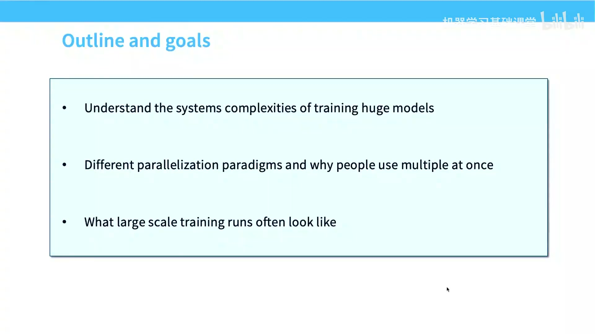

### 学完这一讲应能回答

- 为什么大模型训练同时受 **compute** 和 **memory** 约束。
- 为什么 intranode 与 internode 的带宽/延迟差异会决定 parallelism placement。
- ZeRO-1/2/3（FSDP）分别 shard 哪些状态，通信量为什么不同。
- Pipeline Parallelism（PP）、Tensor Parallelism（TP）、Sequence Parallelism（SP）、Expert Parallelism（EP）、Context Parallelism（CP）分别沿哪个维度切分计算。
- 怎样用 compute/communication overlap 和 roofline 思路判断一个方案是否有效。
- 怎样把 TP/EP、PP/FSDP 与 DP 组合成实际的大规模训练配置。

---

## 1. 为什么训练需要跨 GPU、跨节点并行

### 1.1 两个不可回避的瓶颈：compute 与 memory

单张 GPU 的算力不足以在合理时间内完成超大规模训练；单张 GPU 的显存也无法容纳大模型的参数、梯度、optimizer states 和 activations。因此扩展训练规模时必须同时解决两类问题：[00:01:00–00:02:10]

1. **Compute scaling**：把计算拆给更多 accelerator。
2. **Memory scaling**：把模型状态或 activations 分散到更多 accelerator。

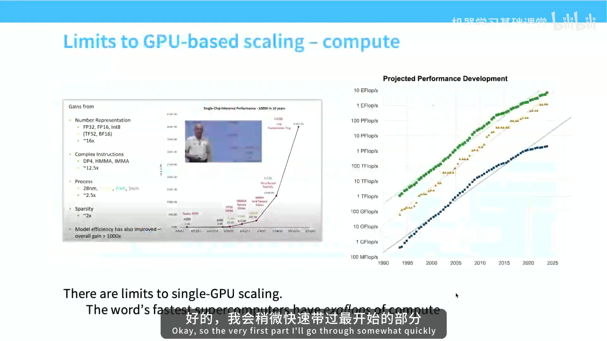

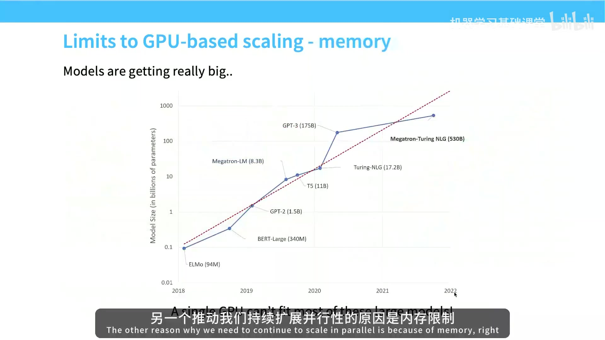

仅增加机器数量还不够。跨设备后的核心约束变成了：**每一步需要传多少数据、通过什么网络传、传输是否能与计算重叠。**

### 1.2 intranode 与 internode：并行策略要匹配网络层级

课堂反复使用一个非常实用的划分：[00:02:00–00:03:00]

- **intranode / scale-up**：同一节点或同一高速互联域内，带宽高、延迟低，适合 TP、EP 这类频繁通信的策略。
- **internode / scale-out**：跨节点通信较慢，应尽量使用通信频率较低、数据量更可控的策略，例如 PP，或让 FSDP 的通信尽可能与计算 overlap。

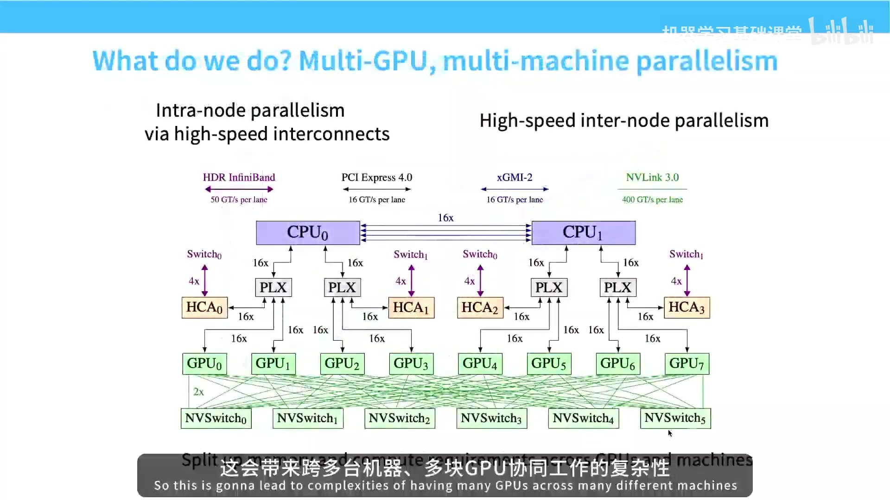

因此，parallelism 设计从一开始就是**模型结构与网络拓扑的共同映射问题**。课堂也把这件事直接关联到 Assignment：给定 network topology 与 model，选择合适的 parallelization strategy。[00:00:20–00:01:20]

### 1.3 collective communication：算法层面看通信

这节课主要在 collective primitive 层面记账，而不是讨论 packet-level networking。常见 primitive 包括 all-reduce、all-gather、reduce-scatter 等。[00:02:30–00:04:00]

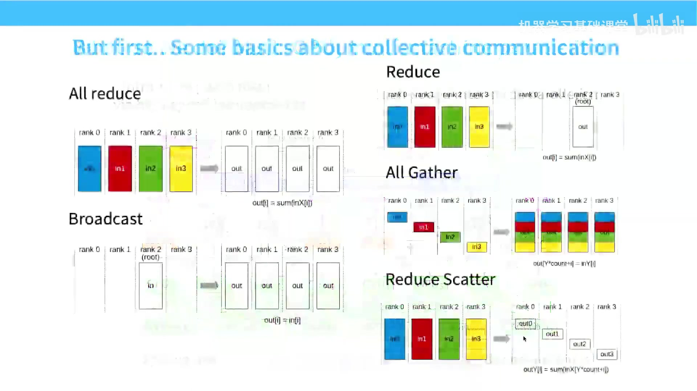

本讲后面 ZeRO 的关键等价关系是：

$$
\text{all-reduce} \approx \text{reduce-scatter} + \text{all-gather}
$$

这里的“等价”指课堂采用的简化通信成本模型下，两边具有相同量级/相同总通信模式。这个等价关系让 ZeRO-1 可以减少显存占用，却不增加相对于 naive DDP 的通信量。[00:03:00–00:03:40]

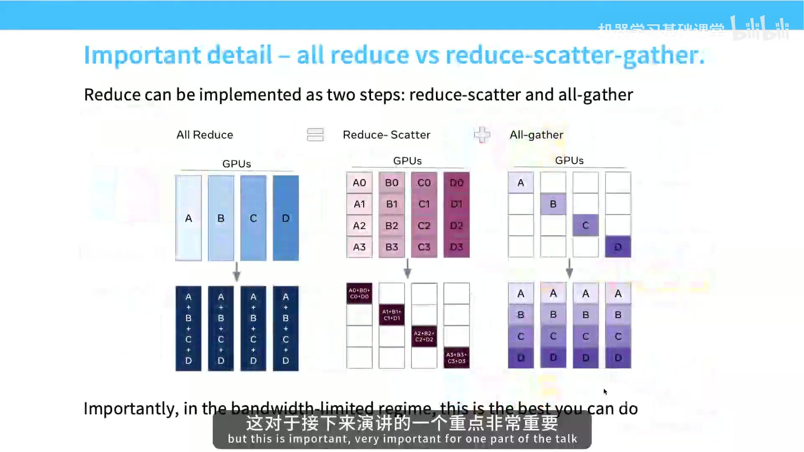

### 1.4 网络拓扑会反过来影响 workload

课堂比较了两类设计：[00:04:20–00:08:40]

- TPU 的经典 toroidal mesh：邻居通信规则、结构规整，适合可预测的 partition/communication pattern。
- GPU 集群常见 fat-tree / 更偏 all-to-all 的层级网络：更灵活，适合 token routing 等较不规则的通信。

MoE 使通信模式更动态，因此新硬件也在增加更强的 all-to-all/跨 rack 能力。这里的重要结论是：**workload 在塑造 network，network 也在限制可行的 parallelism。**

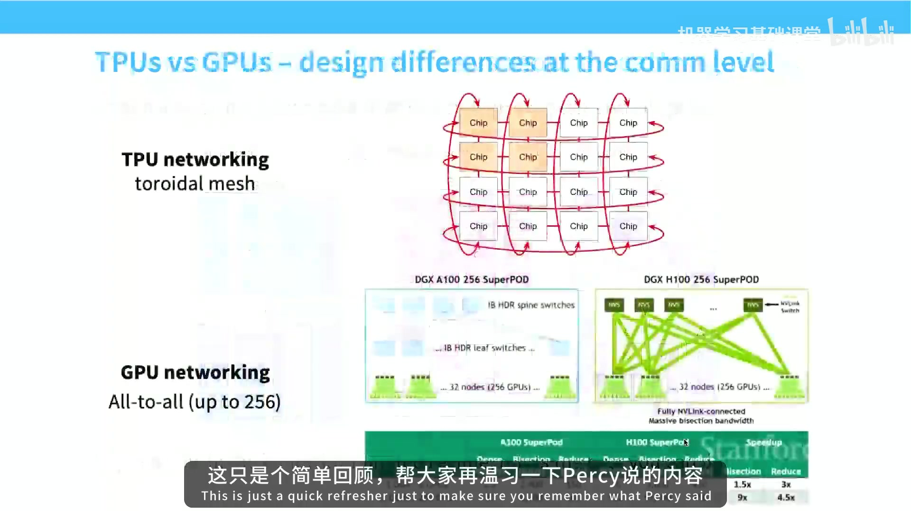

在大规模训练里，课堂用一句话概括这个变化：计算资源的规划单位已经从单张卡扩展到整座 data center。[00:09:00–00:10:50]

---

## 2. Data Parallelism：算力扩展容易，内存扩展没有发生

设 global batch size 为 $B$，使用 $M$ 个 worker。最朴素的 Data Parallelism（DP）把 batch 切成 $B/M$ 的子 batch，每个 worker 保存完整模型并独立计算梯度，随后同步梯度。[00:11:58–00:14:30]

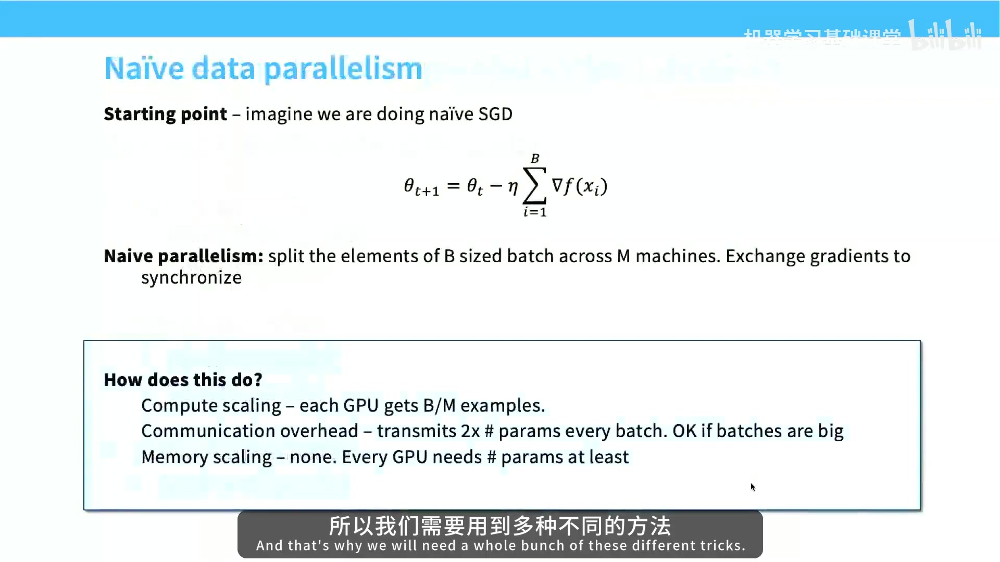

### 2.1 三个维度的记账

- **Compute**：理想情况下接近线性扩展，只要每张 GPU 上仍有足够工作。
- **Communication**：每个 step 要同步全模型梯度。课堂用约 $2\Psi$ 的通信量描述 all-reduce，其中 $\Psi$ 表示参数量对应的数据体积。
- **Memory**：没有模型状态的 sharding。每张 GPU 仍持有完整 parameters、gradients、optimizer states；activation 也不会因为 DP 自动变小。

训练状态的显存远大于“只存一份权重”。课堂给出一个粗略 rule of thumb：某些常见精度配置下可接近 **5 份 weight-sized state、约 16 bytes/parameter**；具体数值取决于精度与 optimizer。[00:14:00–00:15:00]

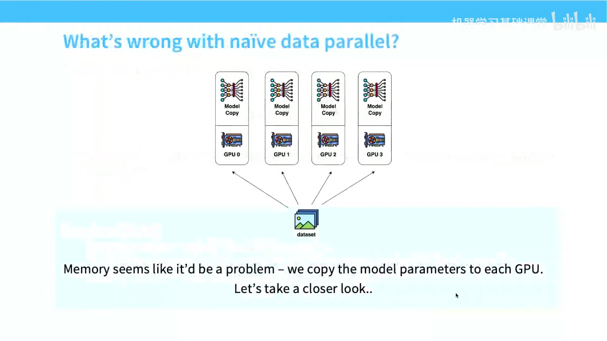

这就是 ZeRO 的出发点：**不要让每张 GPU 都复制全部训练状态。**

---

## 3. ZeRO 与 FSDP：逐步 shard training state

ZeRO 的基本思想是把参数、梯度和 optimizer states 中昂贵的部分分片，同时利用 collective 的等价关系控制通信成本。[00:15:04–00:16:40]

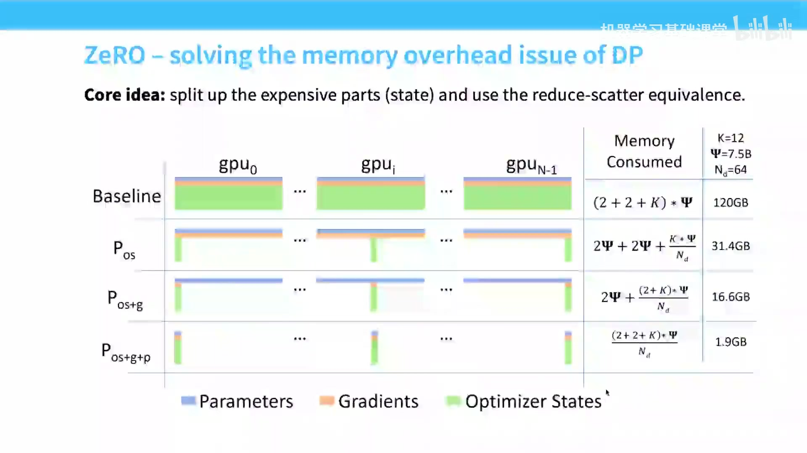

课件中的一组示例用 $\Psi=7.5\text{B}$ parameters、$N_d=64$、$K=12$（optimizer-state 相关字节系数）说明 sharding 对显存的影响：

| 配置 | 每个 device 的主要模型状态内存形式 | 课件示例 |
|---|---:|---:|
| Baseline DP | $(2+2+K)\Psi$ | 120 GB |
| ZeRO-1 | $2\Psi+2\Psi+K\Psi/N_d$ | 31.4 GB |
| ZeRO-2 | $2\Psi+(2+K)\Psi/N_d$ | 16.6 GB |
| ZeRO-3 | $(2+2+K)\Psi/N_d$ | 1.9 GB |

这里的系数是该 slide 的示例记账，不应脱离精度和 optimizer 配置当成固定常数。

### 3.1 ZeRO Stage 1：shard optimizer states

ZeRO-1 让每个 worker 只负责一部分参数的 optimizer state 与 update：[00:16:40–00:19:00]

1. 每张 GPU 仍计算完整 gradient。
2. 用 **reduce-scatter** 把对应参数 shard 的聚合梯度送到负责该 shard 的 worker。
3. 每个 worker 用本地 optimizer state 更新自己的 parameter shard。
4. 用 **all-gather** 把更新后的参数同步回来。

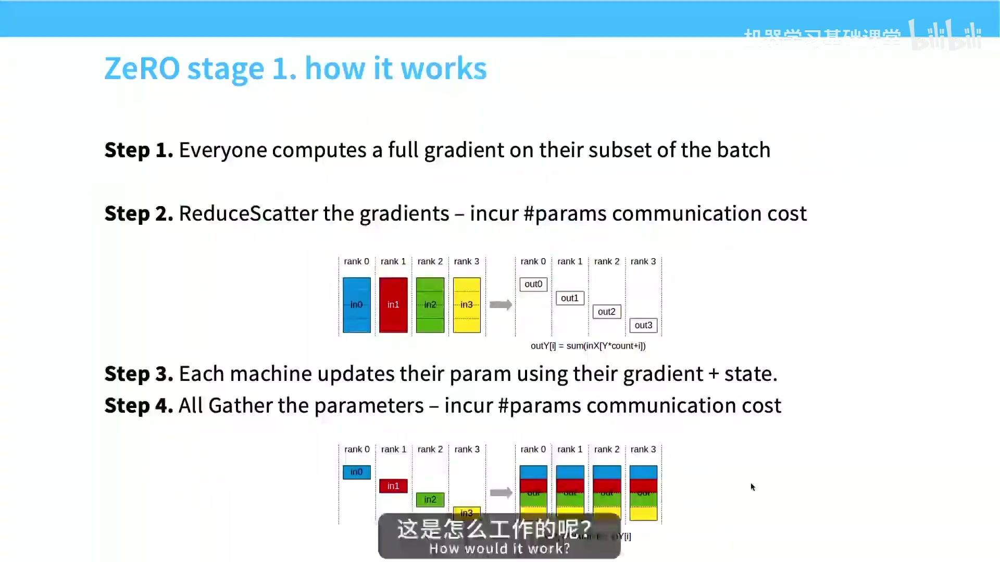

因为 reduce-scatter + all-gather 与 naive DP 的 all-reduce 在课堂成本模型下等价，所以 ZeRO-1 得到显著的 optimizer-state memory saving，同时维持同级别的通信量。这也是本讲第一次出现“用 collective 重排换内存”的典型模式。[00:18:00–00:19:00]

### 3.2 ZeRO Stage 2：再 shard gradients

ZeRO-2 继续把 gradients 分片。关键系统技巧是：**backward 过程中每一层的梯度一算出来，就立即 reduce 到对应 worker；不再需要时立即 free。** 这样无需在一张 GPU 上完整 materialize 全部 gradient vector。[00:19:16–00:20:26]

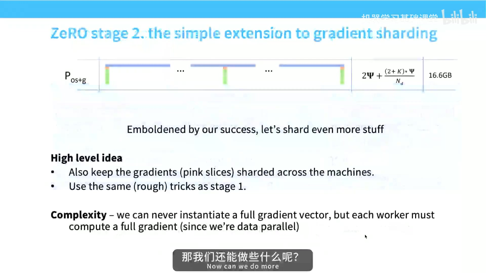

### 3.3 ZeRO Stage 3 / FSDP：parameters 也分片

ZeRO-3 把 parameters、gradients、optimizer states 都 shard。PyTorch 语境里，这类方法通常对应 Fully Sharded Data Parallel（FSDP）。[00:20:26–00:24:30]

核心执行模式是“按需 materialize”：

- forward 到某一层之前，对该层 parameter shards 做 all-gather；
- 完成该层所需计算后，释放不必常驻的完整参数；
- backward 同样按需 all-gather 参数；
- 梯度产生后 reduce-scatter 回各 shard owner。

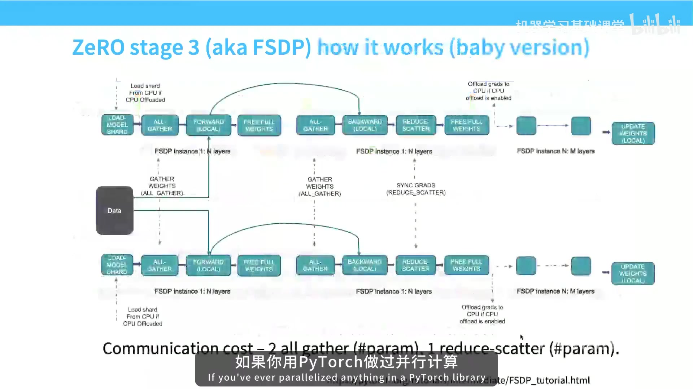

在课堂的简化 step accounting 中，FSDP 需要 **two all-gathers + one reduce-scatter**，相对 DDP/ZeRO-1/2 多一次 parameter all-gather。它之所以仍然有效，是因为通信可以提前发起并与当前层计算 overlap。[00:22:00–00:26:30]

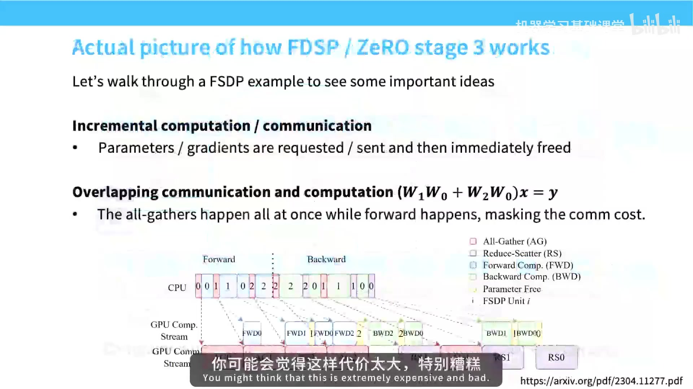

### 3.4 FSDP 的边界

FSDP 主要解决 model state memory，仍有两个约束：[00:26:00–00:30:44]

- DP/FSDP 会消耗 global batch 的并行维度，batch 不可能无限增大。
- activation memory 并没有被 FSDP 自动切开；模型或序列继续变大时仍可能 OOM。

因此接下来需要进入真正的 **model parallelism**。

---

## 4. Pipeline Parallelism：沿 depth 切模型

### 4.1 直接按 layer 串行切分会产生大面积 bubble

最直接的 layer-wise model parallel 让不同 GPU 负责不同层，但一份 batch 逐层流过时，大部分 GPU 都在等待。[00:30:44–00:32:30]

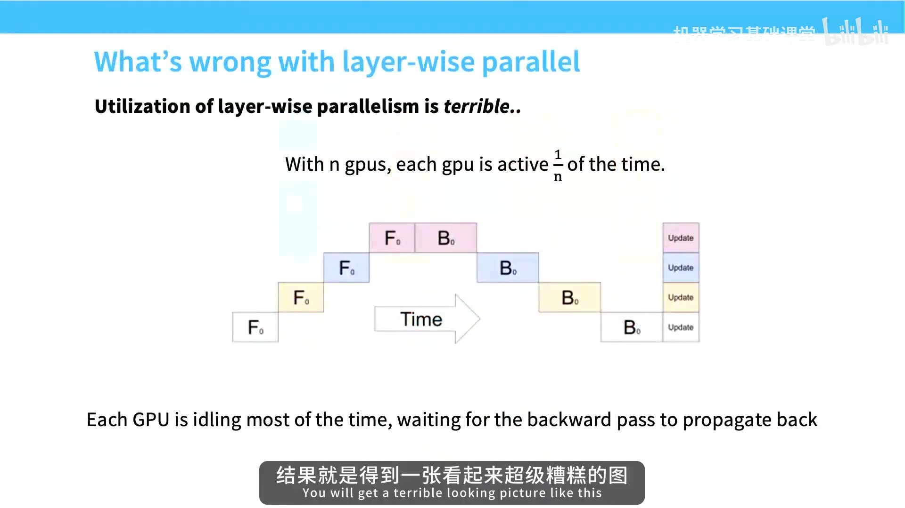

Pipeline Parallelism（PP）把 batch 切成多个 microbatch，使不同 stage 同时处理不同 microbatch，从而填充流水线。[00:33:02]

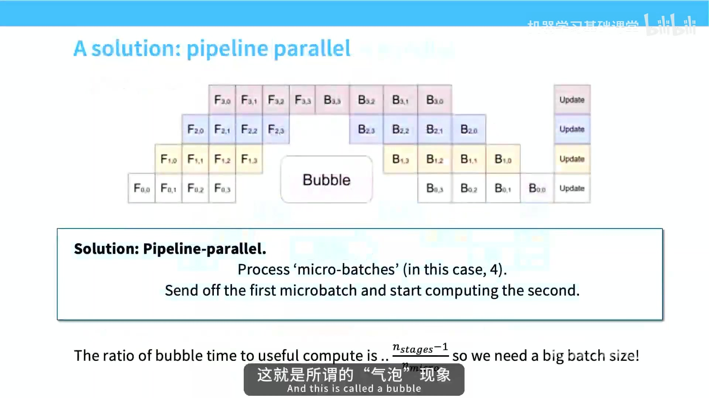

对于 $n_{stages}$ 个 pipeline stage 和 $n_{micro}$ 个 microbatch，课件给出的 bubble 与 useful work 比例为：

$$
\frac{\text{bubble}}{\text{useful}} = \frac{n_{stages}-1}{n_{micro}}.
$$

含义直接：stage 数越多，pipeline 越深；microbatch 越多，bubble 占比越小。但 microbatch size 太小又会降低单卡 kernel efficiency，因此 PP 需要 batch/microbatch 层面的折中。[00:33:00–00:35:30]

### 4.2 PP 为什么适合跨较慢的 link

相邻 stage 主要交换 activation，通信量近似随

$$
O(bsh)
$$

变化，其中 $b$ 是 microbatch size、$s$ 是 sequence length、$h$ 是 hidden dimension。通信以 point-to-point 为主；与 TP 频繁 all-reduce 相比，它更容易放在较慢的跨节点链路上。[00:34:00–00:36:40]

### 4.3 Zero-bubble pipeline

普通 backward 可以拆成两部分：[00:37:14–00:39:18]

- **B**：把梯度继续向前一 stage 传播，位于依赖关键路径上。
- **W**：计算本 stage 的 weight gradient，可以更灵活地调度。

Zero-bubble 思路优先调度 B，再把 W 填进原本的 idle gap，从 scheduling 上进一步压缩 bubble。

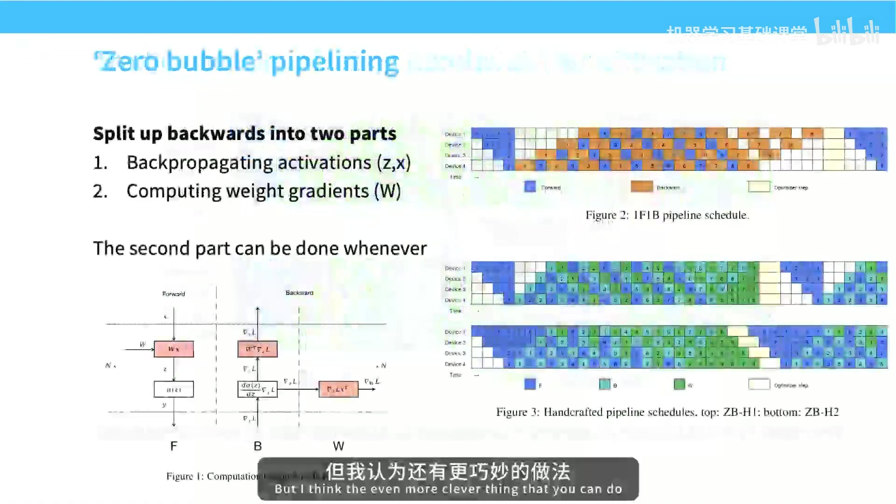

---

## 5. Tensor Parallelism：沿 width 切矩阵运算

PP 沿网络 depth 切分；Tensor Parallelism（TP）沿单层内部的 matrix dimension 切分。[00:39:18–00:44:54]

以线性层为例，可以选择：

- **column parallel**：按输出维度切权重；
- **row parallel**：按输入维度切权重。

两种布局在相邻 projection 间交替组合，使中间结果尽可能保持已分片状态，减少不必要的重组通信。Transformer 中常见的 input projections 适合 column-wise，down/output projections 常用 row-wise；小型 pointwise operations 可以复制执行。[00:40:04–00:43:00]

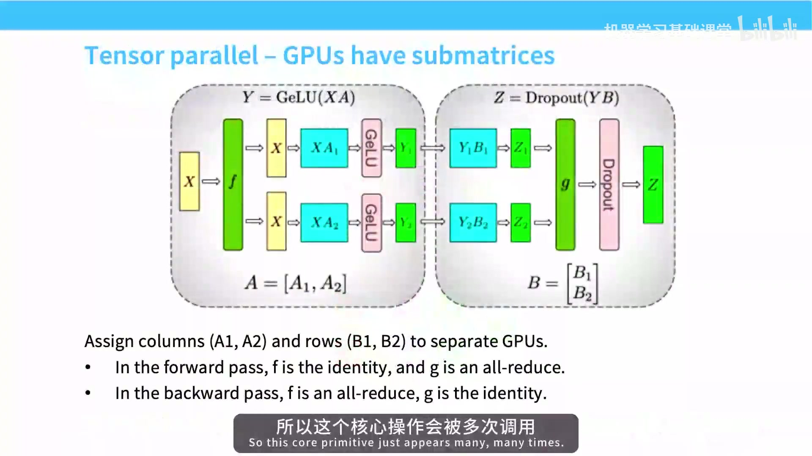

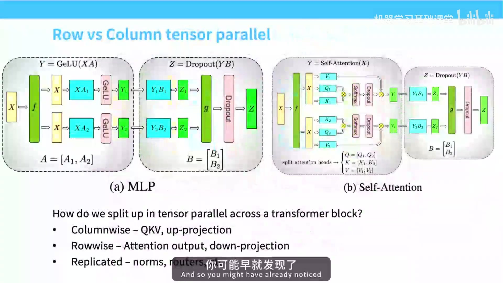

### 5.1 TP 的主要成本：高频 collective

TP 几乎每层都可能需要 all-reduce / all-gather，因此对 bandwidth 和 latency 很敏感。课堂给出的工程经验是：**GPU 集群里 TP 通常留在一个高速互联域内，典型大小不超过 8。** TPU mesh 可以支持更规整、更大的 tensor partition，但仍取决于网络和 workload。[00:42:20–00:44:50]

这也是 TP 与 PP 的典型互补关系：

| 维度 | TP | PP |
|---|---|---|
| 切分方向 | layer 内部 width | layer/stage depth |
| 通信 | 频繁 collective | stage 间 point-to-point |
| bubble | 基本没有 pipeline bubble | 有，靠 microbatch/scheduling 降低 |
| 合适链路 | 快速 scale-up | 可跨较慢 scale-out |
| 主要收益 | 模型与 activation 的局部分片 | 模型按 stage 分片 |

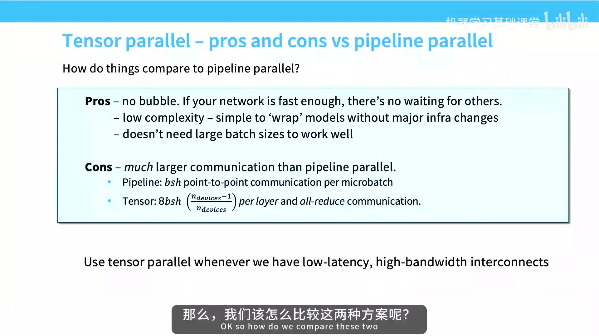

---

## 6. Activation memory：TP 之后为什么还需要 Sequence Parallelism

模型状态不是唯一的显存来源。训练时必须保存 backward 所需 activations；sequence length、microbatch 和 hidden size 增大时，这部分很快变成瓶颈。[00:44:54–00:47:00]

课件给出每个 Transformer layer 的 activation memory baseline：

$$
\text{activation memory per layer}
= sbh\left(34 + 5\frac{as}{h}\right),
$$

其中：

| 符号 | 含义 |
|---|---|
| $a$ | number of attention heads |
| $b$ | microbatch size |
| $h$ | hidden dimension size |
| $L$ | number of Transformer layers |
| $p$ | pipeline parallel size |
| $s$ | sequence length |
| $t$ | tensor-parallel size |
| $v$ | vocabulary size |

$5as/h$ 项来自 quadratic-attention 相关 activation；通过类似 FlashAttention 的 selective recomputation，可以去掉这部分长期保存的开销。[00:46:44]

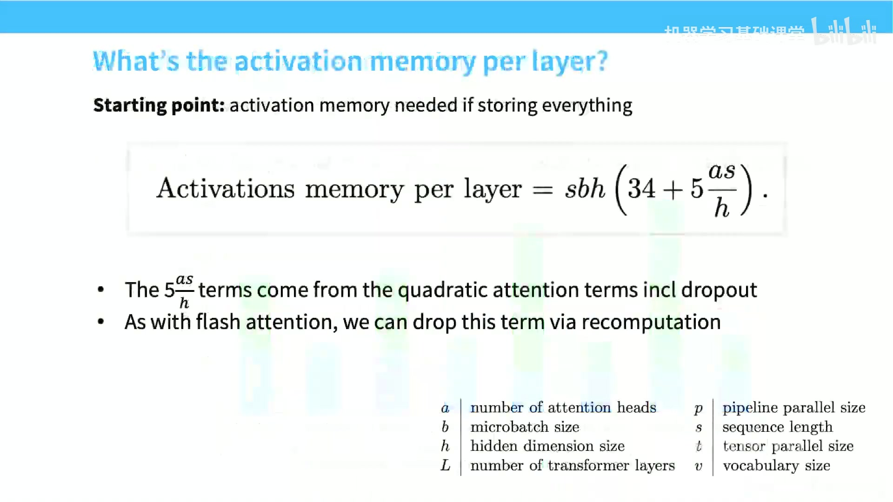

### 6.1 TP 并不会把所有 activation 都按 $1/t$ 缩小

课件总结了几种配置下的 activation memory：

| 配置 | 每层 activation memory |
|---|---:|
| no parallelism | $sbh\left(34 + 5\frac{as}{h}\right)$ |
| tensor parallel baseline | $sbh\left(10 + \frac{24}{t} + 5\frac{as}{ht}\right)$ |
| tensor + sequence parallel | $sbh\left(\frac{34}{t} + 5\frac{as}{ht}\right)$ |
| tensor parallel + selective activation recomputation | $sbh\left(10 + \frac{24}{t}\right)$ |
| tensor + sequence parallel + selective activation recomputation | $sbh\left(\frac{34}{t}\right)$ |

最关键的一行是最后一行：SP + TP + selective recomputation 可以让主要 activation memory 近似随 $1/t$ 线性缩放。[00:46:44–00:51:10]

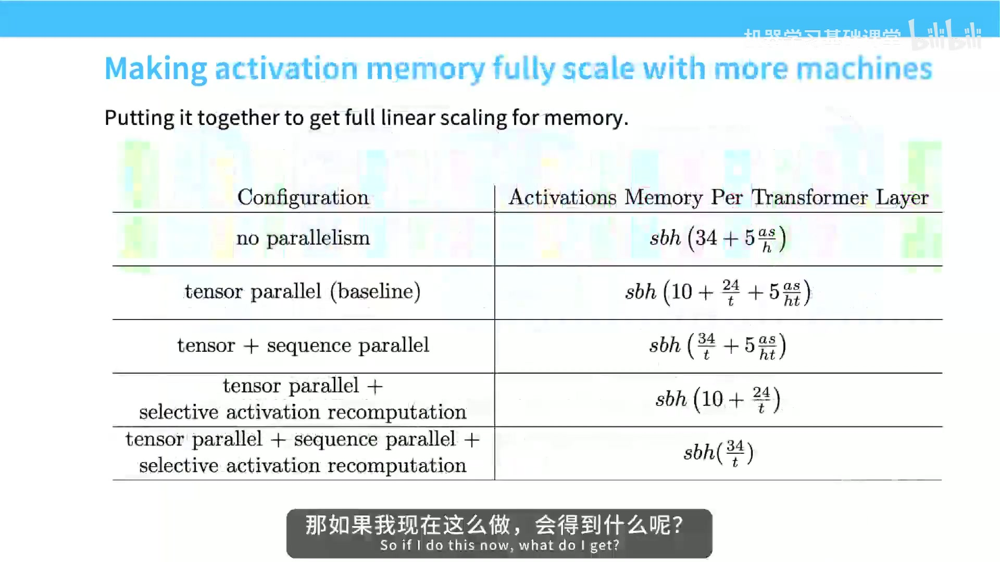

### 6.2 Sequence Parallelism 的作用

TP 会自然 shard 某些大矩阵运算，但 LayerNorm、dropout 等较轻量操作对应的 activation 仍可能复制。Sequence Parallelism（SP）沿 sequence dimension 把这些状态继续 shard，在需要计算时通过 all-gather / reduce-scatter 进行局部 materialization。[00:49:22–00:52:20]

它与 FSDP 的思路很接近：**长期只保存 shard，需要时短暂 gather，使用后释放。** SP 通常作为 TP 的伴生优化，而不是单独的大规模 parallel dimension。

---

## 7. Expert Parallelism：MoE 的自然切分维度

Mixture-of-Experts（MoE）只有部分 experts 会接收某个 token。Expert Parallelism（EP）把 experts 分布到不同设备，并把 token activations route 到目标 expert。[00:53:26–00:56:50]

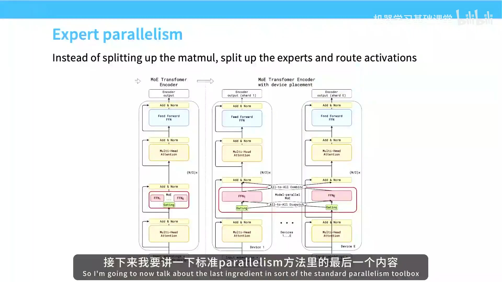

### 7.1 EP 与 TP 的差别

对于 MoE MLP，EP 往往比继续加大 TP 更自然：

- EP 保持每个 expert 的 GEMM 更大，更容易获得较高 GPU utilization。
- TP 继续切 expert matrix 会得到更小的 GEMM，可能降低 arithmetic efficiency。
- EP 的代价是 **all-to-all dispatch/combine**，而且训练中频率很高，对低延迟网络要求很强。

课件举到 **DeepEP**；该名称也可由 DeepSeek 官方仓库确认。它属于 expert-parallel communication library，课堂用它说明大规模 EP 需要专门优化通信栈。[00:55:54]

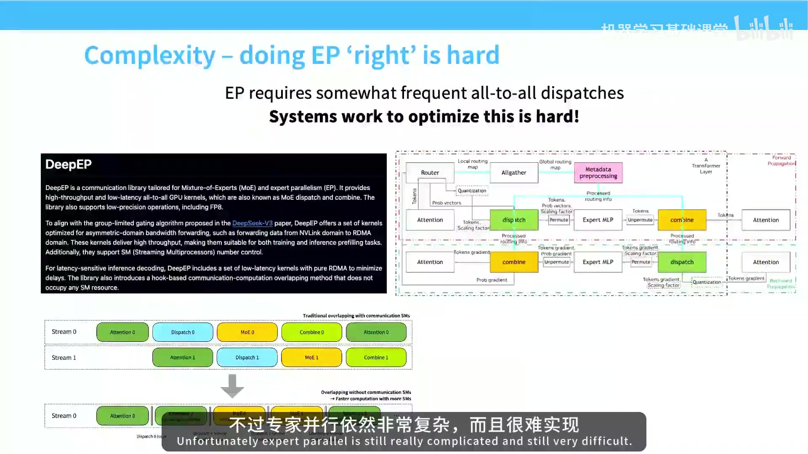

### 7.2 Attention 与 MoE MLP 不一定使用同一个 TP/EP 配置

MoE 只改变 MLP，不改变 attention。于是会出现一个冲突：[00:57:58–01:00:40]

- attention 可能希望较高 TP；
- MoE MLP 已经做 EP，再叠很高 TP 会把 expert matrix 切得过小。

现代系统可以给 attention 与 MoE layer 采用不同的 tensor/expert partition，让两类计算各自使用更合适的 parallel degree。

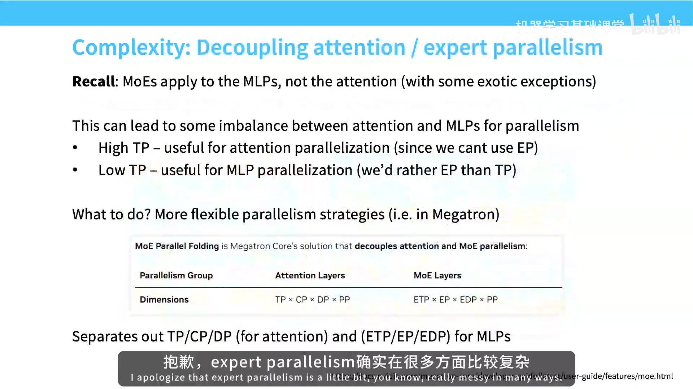

---

## 8. Context Parallelism：沿长上下文切 activation

Context Parallelism（CP）面向超长 sequence，把长上下文对应的 activations 沿 sequence/context 维度分到多个 accelerator；ring-attention-style 方法可以让必要的 activation 在设备间按环形方式传递。[01:01:14–01:02:20]

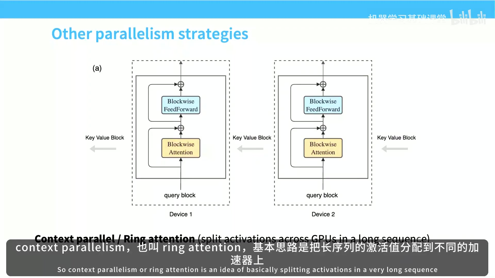

CP 常出现在：

- long-context extension；
- 长上下文训练；
- serving 中需要跨设备处理很长 context 的阶段。

与 SP 的定位要区分：SP 更多是 TP 的 activation-memory 配套优化；CP 可以成为真正独立的大规模 parallel dimension。

---

## 9. 没有单一最优策略：用 roofline 判断组合是否合理

课堂把各种方法放到一张表里，强调它们各有约束：[01:01:50–01:04:00]

- FSDP 节省 model-state memory，但仍消耗 DP/batch 维度，也不直接解决所有 activation memory。
- TP 有利于模型和 activation 分片，但需要高速 collective。
- PP 能跨较慢链路扩展，但有 bubble，并依赖 microbatch/batch size。
- EP 对 MoE 高效，但要求强 all-to-all。
- CP 适合长 context，但只解决特定 sequence 维度的问题。

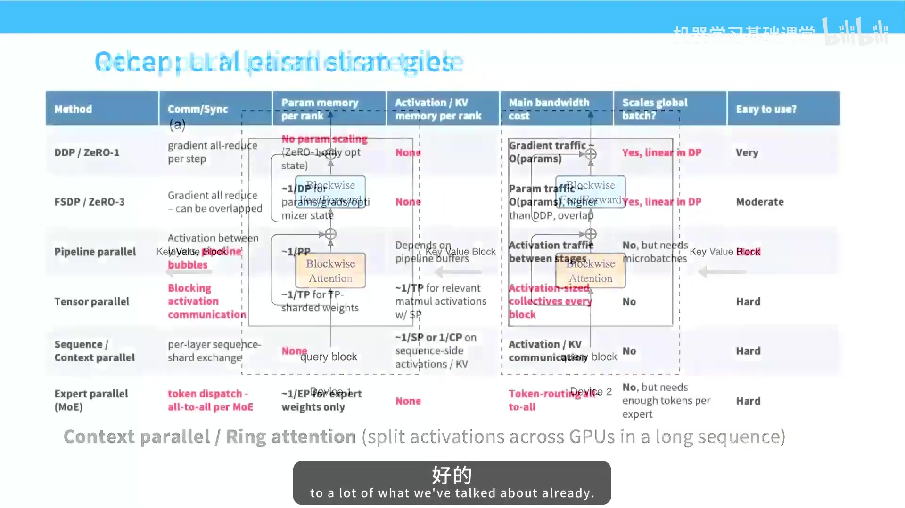

### 9.1 compute 能否遮住 communication

把某个 layer 的 compute time 和 communication time 分别估算出来。如果

$$
T_{compute} \ge T_{comm},
$$

并且 scheduling 允许 overlap，那么通信原则上可以藏在计算下面；如果 $T_{comm}$ 更大，就会落入 communication-bound 区域。[01:04:48–01:06:10]

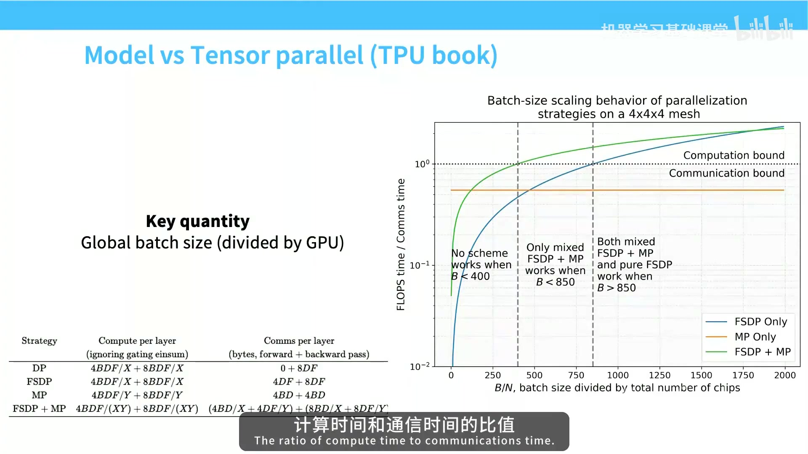

这解释了为什么同一种 FSDP 配置会随 per-device batch 改变表现：batch 大时 compute 足够多，FSDP 通信容易被遮住；batch 小到一定程度后会转成 communication bound，需要引入 TP 等模型并行手段改变每张卡的 compute/communication ratio。

---

## 10. 3D/4D Parallelism：一个实用的组合顺序

课堂给出很明确的 practitioner recipe：[01:06:04–01:08:20]

1. **先让模型装得下。**
   - 在最快的 scale-up interconnect 上使用 TP；MoE 则优先考虑 EP。
   - GPU 场景里 TP/EP 往往先限制在一个高速盒子/NVLink domain 内。
2. **仍然装不下时，继续沿 depth 或 state 维度切。**
   - 用 PP 跨节点切 stages；
   - 或用 ZeRO-3/FSDP 继续 shard model states。
3. **模型已经 fit 后，剩余 GPU 尽量用于 DP。**
   - DP 通常最简单、compute scaling 最直接。
4. **batch 太小影响利用率时，使用 gradient accumulation 等办法提高有效 batch。**
5. **长 context 再引入 CP；TP 场景通常配 SP 降 activation memory。**

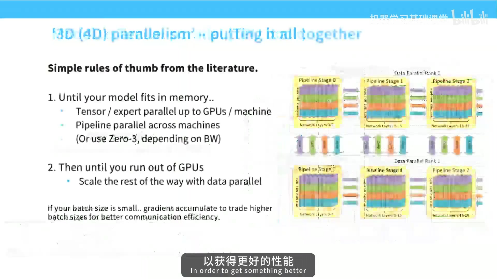

Megatron 的工程指南与这套顺序一致：**minimize model parallelism, maximize data parallelism**；把 TP/EP 留在高速本地互联，跨节点优先 PP，MoE 优先 EP，长 sequence 使用 CP。[01:06:30–01:08:20]

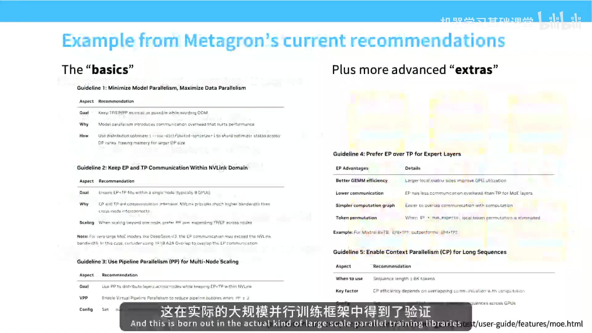

### 10.1 为什么 TP 往往停在 8

课堂引用的大规模实验表明，随着 GPU 数增加，可以先提高 TP，但 TP 到 8 左右后继续增大通常收益恶化；之后更多依赖 PP 扩展，必要时 DP degree 反而下降，为模型并行让出设备。[01:10:00–01:12:00]

这不是一个对所有硬件永远成立的定律，而是由 GPU scale-up domain、collective 成本和 GEMM efficiency 共同形成的强经验规律。

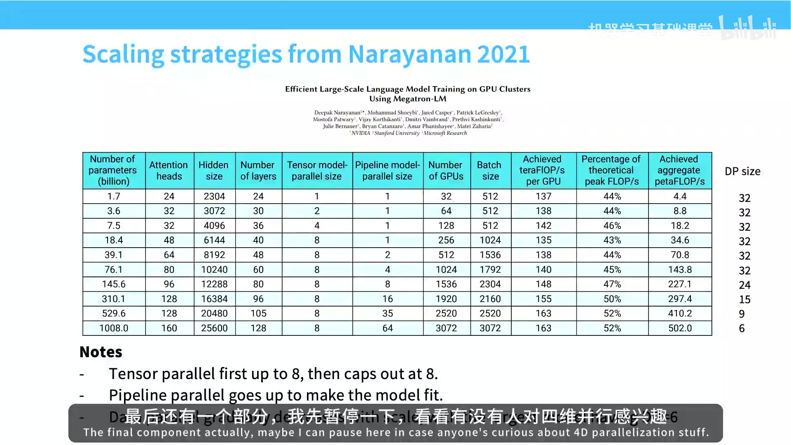

### 10.2 Recomputation 有时会提高吞吐

Activation recomputation 增加 FLOPs，看起来像纯开销；但它减少 memory，释放出的显存可以换成更大的 microbatch/batch。更大的 batch 又能改善 PP/TP/FSDP 的利用率，因此最终 wall-clock throughput 可能反而更高。[01:11:50–01:12:40]

这是 systems optimization 中常见的跨资源交换：**多算一点，少存一点，再用省下的 memory 换更高的并行效率。**

---

## 11. 现代训练案例：实际配置如何体现这些规则

课堂最后用公开训练配置检查前面的经验规律。[01:12:28–01:19:20]

### 11.1 OLMo 与 DeepSeek

- **OLMo 7B**：课堂将其作为 FSDP 可以扩到很多 GPU 的小型 dense-model 例子。讲师口头先说到 Dolma，随后明确更正为 OLMo（trained on Dolma）。
- **DeepSeek V1**：ZeRO-1 风格 DP + tensor/sequence parallel + pipeline parallel。
- **DeepSeek V3**：MoE 使 EP 成为主要模型并行维度；课堂示例中为 **EP=64（8 nodes）+ PP=16 + ZeRO-1**，并强调需要通信/流水 overlap 才能把这么大的 EP domain 用好。

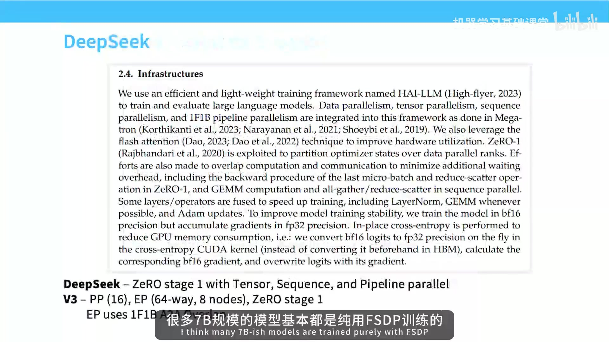

### 11.2 Yi 与 Llama 3 405B

- **Yi**：dense 配置使用 ZeRO-1 + TP + PP；MoE 版本 Yi-Lightning 用 EP 替换主要 TP 角色。
- **Llama 3 405B** 主 pretraining 阶段：
  - TP = 8
  - CP = 1
  - PP = 16
  - DP = 128
- 到 long-context extension 阶段，CP 增大，DP 相应下降，用更多设备去承担 sequence/context 维度的切分。[01:14:52–01:16:10]

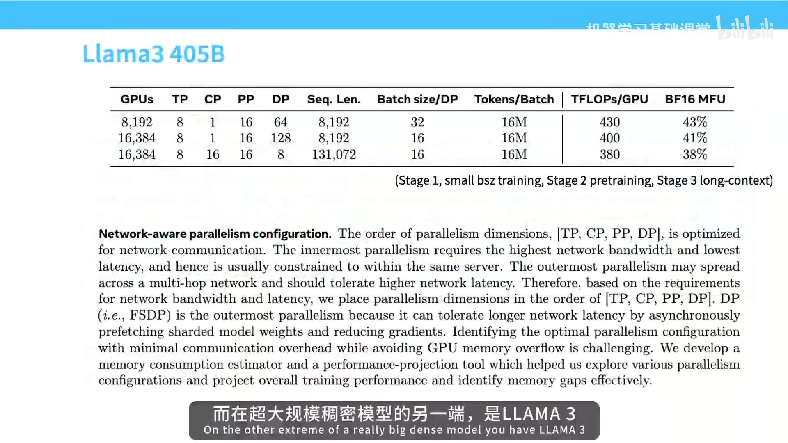

课堂顺带指出，Llama 3 405B 的训练过程中 GPU failure 达到 **148 次**。这提醒我们：当训练扩展到成千上万张 GPU 时，parallelism 之外还必须处理 checkpoint、failure recovery、straggler 和作业重启等 distributed-systems 问题。[01:15:50–01:16:30]

### 11.3 课堂最终 overview table

下表按最后一张 overview slide 转写；`??` 表示课件没有给出该值，保留未知，不做推断。[01:18:48]

| Model / recipe | DP | TP/SP | EP | PP | CP |
|---|---:|---:|---:|---:|---:|
| DeepSeek | ?? (ZeRO-1) | 1 | 8 | 16 | ?? |
| DeepSeek V3 | ?? (ZeRO-1) | 1 | 64 | 16 | ?? |
| Yi | ?? (ZeRO-1) | >0 | 1 | >0 | ?? |
| Llama 3 405B | 128 | 8 | 0 | 16 | 1 |
| Gemma 2 | 768 | 8 | 0 | 0 | 0 |
| Mixtral 8x22B (Megatron) | 2 | 4 | 8 | 4 | 1 |
| Nemotron 3 120B (long context) | ?? | 2 | 64 | ?? | 64 |
| Qwen 3 (Megatron) | ?? | 2 | 32 | 8 | 1 |

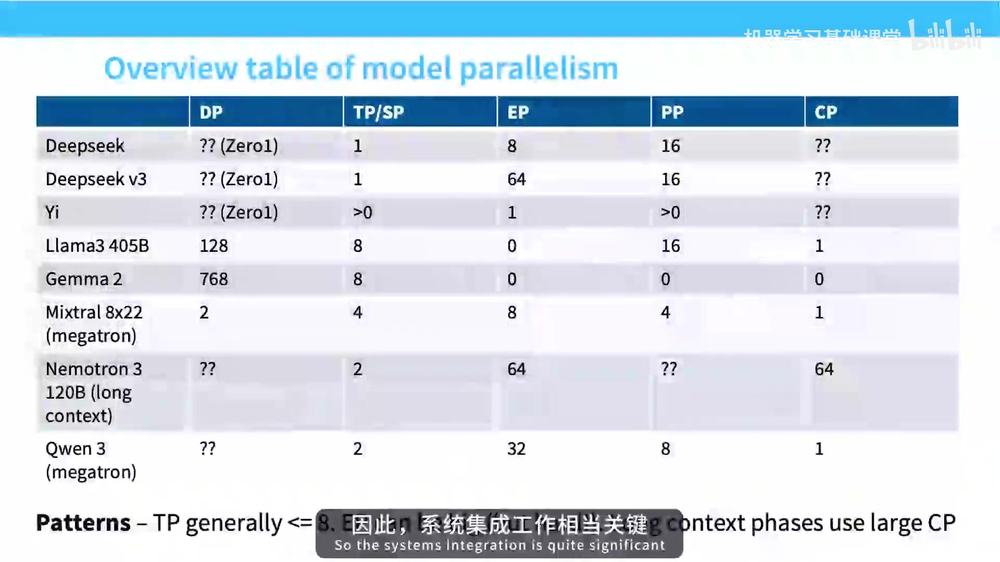

从表里能读出的课堂规律是：[01:18:48–01:20:00]

- 能用 DP 的地方尽量把 DP domain 做大。
- GPU 场景下 TP 通常保持在 $\le 8$ 的高速互联域。
- MoE 的 EP 可以明显大于 8，DeepSeek V3 等系统已经把大规模 EP 做到跨节点。
- long-context 阶段会把更多设备预算分给 CP。
- PP 仍是跨节点扩展 dense/MoE 大模型的重要维度。

---

## 12. 一张决策表：遇到瓶颈时先加哪种 parallelism

| 主要瓶颈 | 优先考虑 | 原因 | 主要代价/前提 |
|---|---|---|---|
| 参数/optimizer state 装不下 | ZeRO/FSDP | shard model states | all-gather / reduce-scatter；依赖 overlap |
| 单层矩阵太大、activation 也要切 | TP + SP | 沿 width 分片并让 activation 更接近 $1/t$ scaling | 高频 collective，需要高速 scale-up |
| 整个模型 depth 太大 | PP | 沿 layers/stages 分片 | pipeline bubble，需要足够 microbatches |
| MoE experts 太多 | EP | 按 experts 分片，保持 expert GEMM 较大 | 高频 all-to-all，需要高性能 routing/communication |
| sequence/context 极长 | CP | 沿 context 维度分片 activation | 需要 ring/collective 通信与 attention 协同 |
| 模型已经 fit，只需要更多 throughput | DP | 简单、compute scaling 好 | 消耗 global batch 维度；梯度同步 |

实际配置通常不是从表中只选一项，而是按硬件层级组合：**fast links 承担 TP/EP；slower links 承担 PP 或可 overlap 的 FSDP；剩余资源尽量做 DP。**

---

## 13. 与 Assignment 2 的关系

课堂多次把这些概念指向 Systems assignment：[00:00:20–00:01:20, 00:25:00–00:27:00, 01:04:00–01:05:00]

- 实现 distributed training / FSDP 类组件时，需要理解 parameter materialization、gradient reduction、shard ownership 和 overlap。
- 选择 parallel strategy 时，不能只看“显存能否装下”，还要计算 communication volume、网络 bandwidth、microbatch 以及 kernel utilization。
- 最终目标是找出在给定 model shape 与 hardware topology 下的有效组合，而不是追求某个固定 parallel degree。

官方 Assignment 2 Systems 仓库也明确要求构建 memory-efficient distributed training code，可把本讲作为其中分布式部分的系统背景。

---

## 14. 本讲总结

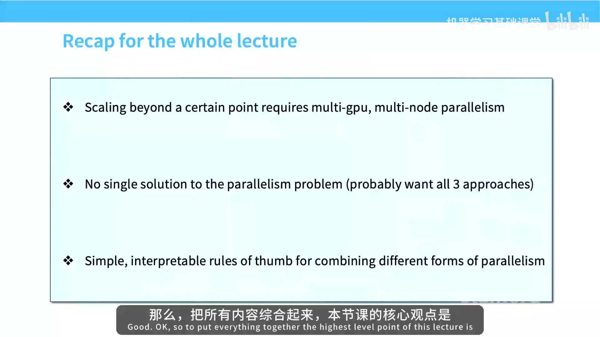

1. 大模型训练扩展到 multi-GPU、multi-node 后，**memory 与 communication** 会与 FLOPs 一样成为一等约束。
2. ZeRO/FSDP 通过 state sharding 显著减少 model-state memory；它的工程关键是 collective 重排与 compute/communication overlap。
3. PP 沿 depth 切分，TP 沿 width 切分，SP 补齐 TP 的 activation sharding，EP 按 MoE experts 切分，CP 沿长 context 切分。
4. 这些策略各有适用的网络层级和代价。典型做法是先用高速互联上的 TP/EP 与 PP/FSDP 把模型装下，再把剩余设备用于 DP。
5. 现代训练配置体现了清晰模式：TP 多数保持在小型高速域，EP 可以更大，long-context 阶段会显著增加 CP，PP 负责进一步 scale-out。
6. 最终优化指标是 **有效硬件利用率和 wall-clock throughput**。最小化某一种通信量或显存占用本身不是终点；要看它是否改善整个训练 step 的 critical path。

下一讲进入 Scaling Laws。[01:20:00]
