---
workflow:
  name: ChatGPT-Web-Course-Note-Workflow
  version: v4.9.4
course:
  name: "CS336: Language Modeling from Scratch"
  term: "Spring 2026"
  instructor: "Tatsunori Hashimoto"
chapter:
  index: 9
  local_label: "P09"
  official_unit_label: "Lecture"
  official_unit_number: 9
  official_title: "Scaling laws"
  recording_title: "Scaling Laws - Basics"
  date: "2026-04-27"
provenance:
  lecture_video_term: "Spring 2026"
  official_materials_term: "Spring 2026"
  local_video_source: "Bilibili collection mirror of the Spring 2026 lecture recording"
  subtitle_role: "unknown_subtitle"
---

# Lecture 9 — Scaling laws

> **本讲定位**：这是 Spring 2026 的第 9 讲，由 Tatsunori Hashimoto（Tatsu）授课。本地 P09 视频画面直接标注 **“Lecture 9 — Scaling Laws - Basics”**。官方 Schedule 将 2026-04-27 的 Lecture 9 标为 **Scaling laws [Tatsu]**；下一讲是 Inference，之后 Lecture 11 再回到 Scaling laws。视频开场也明确说明本讲讲基础、下一讲切到 inference、随后再讲更高级的 scaling topics，因此本地 P09 与官方 Lecture 9 的映射可以可靠确认。

## 本讲要解决的问题

假设已经有模型代码、训练基础设施和预训练数据，现在拿到一笔非常昂贵的训练预算。真正困难的问题不是“能不能训练”，而是：该选什么 architecture、optimizer、depth/width、batch size、learning rate、model size 与 data size？如果这些选择只能在最大的 run 上逐个试错，成本会高得不可接受。

Scaling law 提供了一种工程方法：在小规模实验上寻找稳定、可外推的规律，再据此预测大规模训练的行为。核心目标是把“大 run 的经验赌博”变成“小 run 的定量实验 + 外推”。

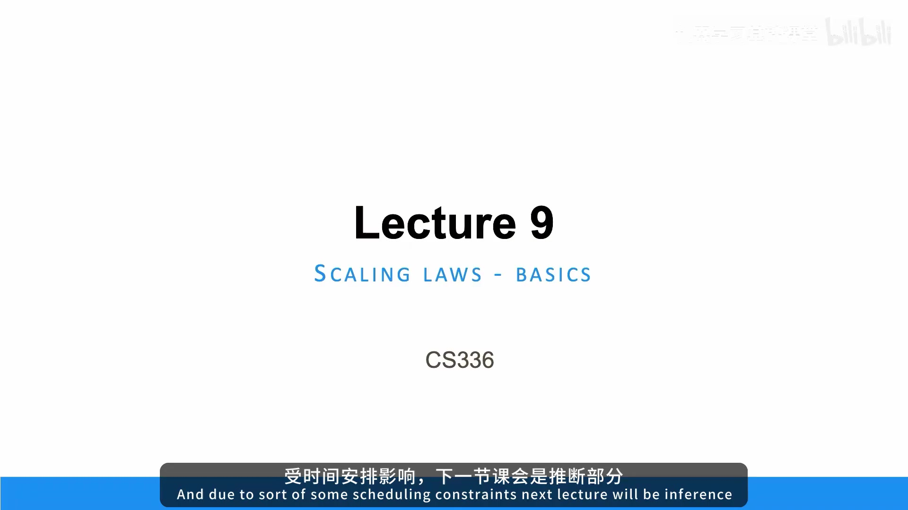

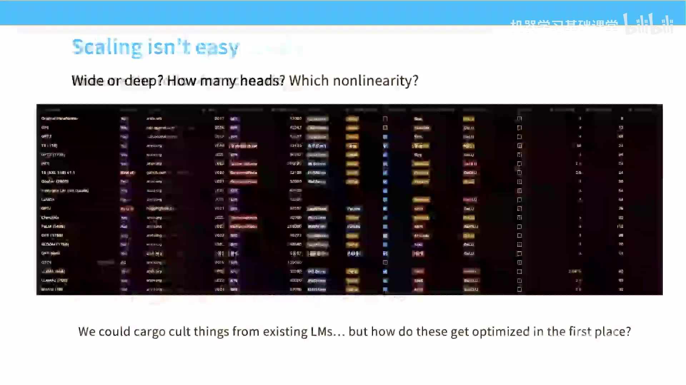

讲师反复强调一个前提：scaling law 并不自动成立。它依赖合适的自变量、正确的参数计数、合理的超参数调优，以及足够宽的 scale range。换句话说，**可预测性本身也需要被工程化**。

## 1. 从 sample complexity 到 neural scaling

### 1.1 Scaling law 并不是 LLM 时代才出现的思想

机器学习理论长期研究 sample complexity：随着样本量 $n$ 增加，估计误差如何下降。经典 generalization bound 本身就把误差写成样本数量的函数。早在 1990 年代，研究者已经在尝试用较小训练集拟合学习曲线，再预测更大数据集上的性能；后来的 NLP 工作也系统研究过数据量与 BLEU、分类误差等指标之间的函数关系。

本讲特别强调 Hestness et al. (2017)：在 speech recognition、machine translation、language modeling 等多个任务上，都能观察到近似 power-law 的学习曲线。这个历史视角很重要，因为它说明现代 LLM scaling 并不是完全独立的新现象，而是把更早的 empirical learning-curve 思路推到了极大算力与模型规模上。

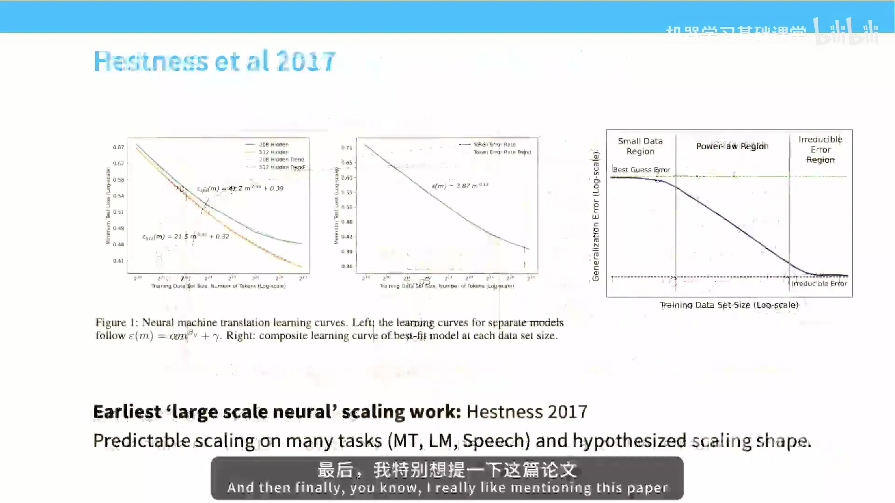

### 1.2 为什么 log-log 图上的直线意味着 power law

如果某个资源量 $x$ 与误差 $E$ 近似满足

$$
E(x) \approx A x^{-\alpha},
$$

那么取对数后

$$
\log E(x) \approx \log A - \alpha \log x,
$$

所以在 log-log 坐标上会近似成为直线。语言模型里常见的自变量包括 data、parameters 和 compute；纵轴通常选择 test loss / validation loss 这类低噪声指标。

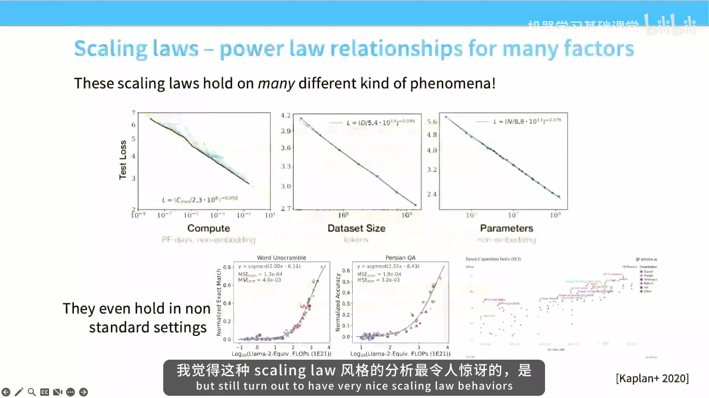

讲师也提醒：power law 主要描述一个远离 asymptote 的 regime。接近 irreducible error / noise floor 时，曲线应当逐渐变平；如果只观察很窄的一段 scale range，polynomial、exponential 甚至别的函数都可能“看起来像直线”。因此不能仅凭局部线性就过度解释。

## 2. Data scaling laws

### 2.1 一个最简单的统计学例子：估计 Gaussian mean

设

$$
x_1,\ldots,x_n \sim \mathcal N(\mu,\sigma^2),
$$

用 sample mean

$$
\hat\mu=\frac{1}{n}\sum_{i=1}^{n}x_i
$$

估计 $\mu$。其均方误差为

$$
\mathbb E[(\hat\mu-\mu)^2]=\frac{\sigma^2}{n}.
$$

这本身就是一个 scaling law：误差按 $n^{-1}$ 衰减。

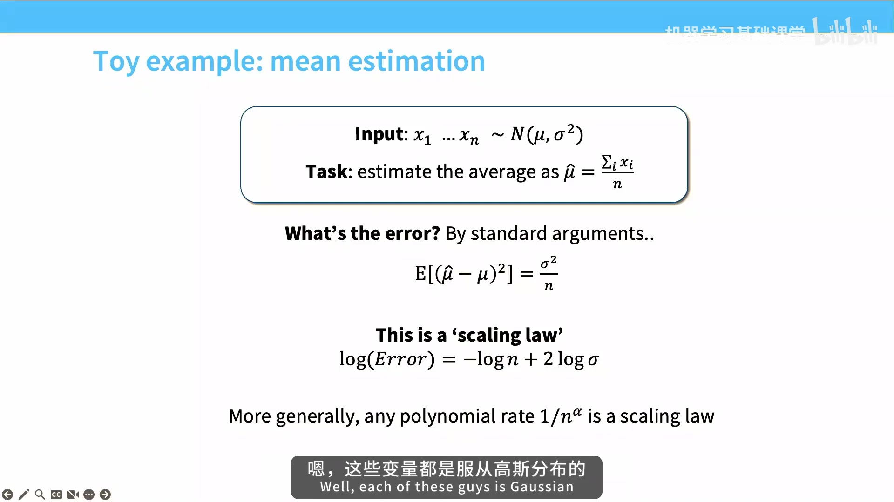

对语言模型，更常见的经验形式可以写成

$$
L(D) \approx L_\infty + A D^{-\alpha},
$$

其中 $D$ 是数据量，$L_\infty$ 是不可约误差/渐近项。若离 $L_\infty$ 足够远，log-log 图上就会呈现近似线性。

### 2.2 真正奇怪的是 exponent

如果是普通参数估计，常见 rate 接近 $1/n$；但语言模型的经验 exponent 往往只有大约 $0.1$ 到 $0.3$ 的量级，收敛慢得多。本讲用 nonparametric estimation 提供直觉：如果要在 $d$ 维空间中估计一般的平滑函数，误差 rate 可能近似

$$
E(n)\propto n^{-1/d}.
$$

因此很小的 scaling exponent 可以被理解成“有效问题维度很高”。一些理论工作进一步把 empirical exponent 与 data manifold / intrinsic dimensionality 联系起来。讲师把它作为解释性 mental model，而不是已被证明的唯一机制。

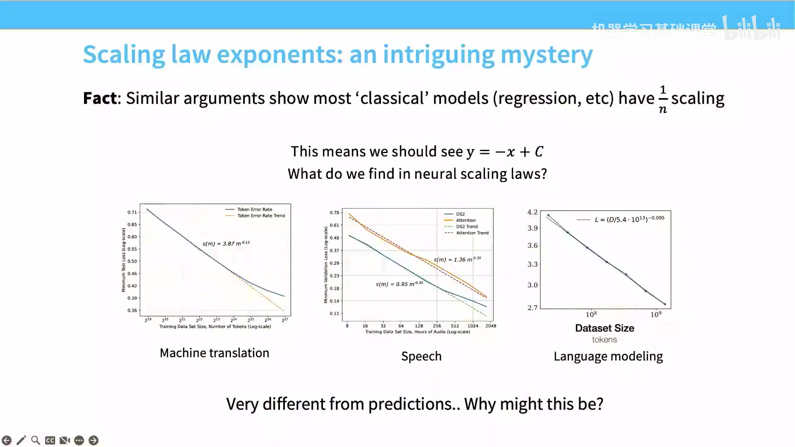

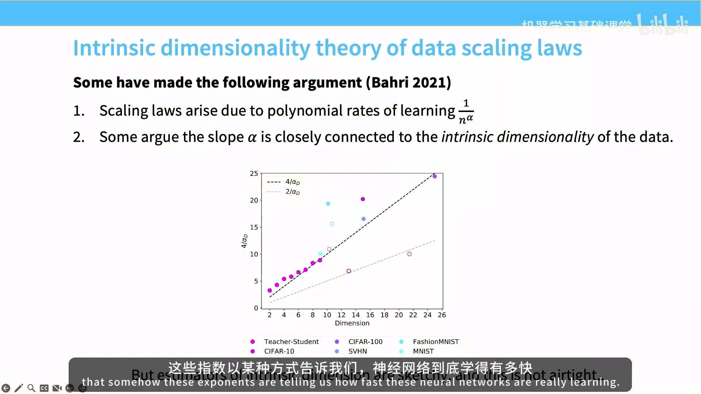

### 2.3 Data composition 会改变 scaling 的 intercept，甚至改变最佳决策

数据不是一个只用 token count 描述的标量。数据分布、domain composition、quality filter 都会改变曲线。讲师讨论了两类实践问题：

- **distribution shift / domain mixture**：不同数据构成可能具有不同的 intercept；在一个 domain 上的数据不一定等价于另一个 domain 的数据。可以把 mixture ratio 也作为变量拟合，再寻找给定预算下的最佳 mixture。
- **filtering 随 scale 改变**：小规模时可以只选最高质量样本；规模越来越大后，为了获得足够数据，过滤器往往必须逐渐放宽。因此“最佳过滤阈值”不是与 scale 无关的常数。

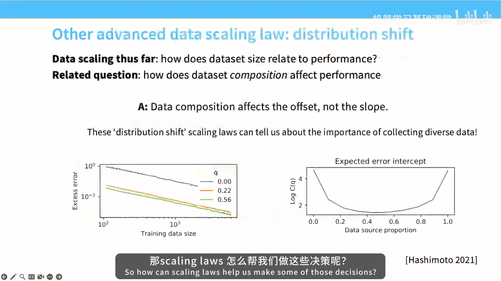

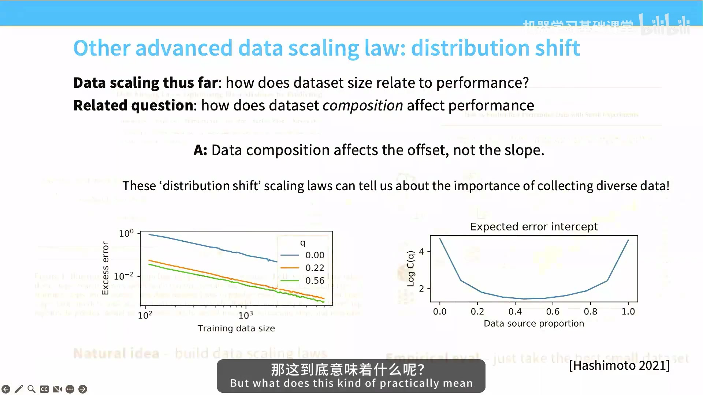

### 2.4 Repeated data 不是无限等价的新数据

当高质量数据有限时，一个自然问题是重复训练同一批 token。重复仍然能带来收益，但收益会递减，重复 token 的“有效数据量”不能简单按重复次数线性累计。这个现象意味着，在固定 compute 下，“更多独立数据”和“对同一数据训练更多 epoch”不是等价操作。

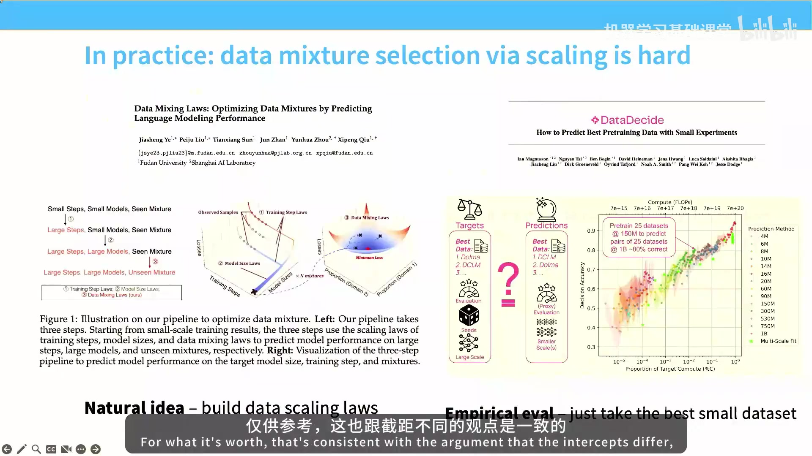

### 2.5 Data scaling 的工程结论

单变量 data scaling 是本讲最容易理解的一类规律：固定训练 recipe，扩大数据量，loss 往往以相当稳定的 power law 改善。但真实大规模训练里，data amount、composition、repetition、filtering policy 会相互耦合，因此真正可用的 scaling experiment 需要复现最终训练的数据策略，而不能只扫 token count。

## 3. 用 scaling laws 做 model engineering

### 3.1 Architecture：比较小模型曲线，而不是直接训练一个巨型候选

要判断 Transformer 与 LSTM、SSM 或其他 architecture 谁更值得放大，可以分别在多个 compute scale 上训练小模型，比较曲线的 intercept 与 slope。如果一个 architecture 在整个已观察范围都更差，而且 slope 也没有改善迹象，就没有必要先投入巨额预算把它训练到 frontier scale。

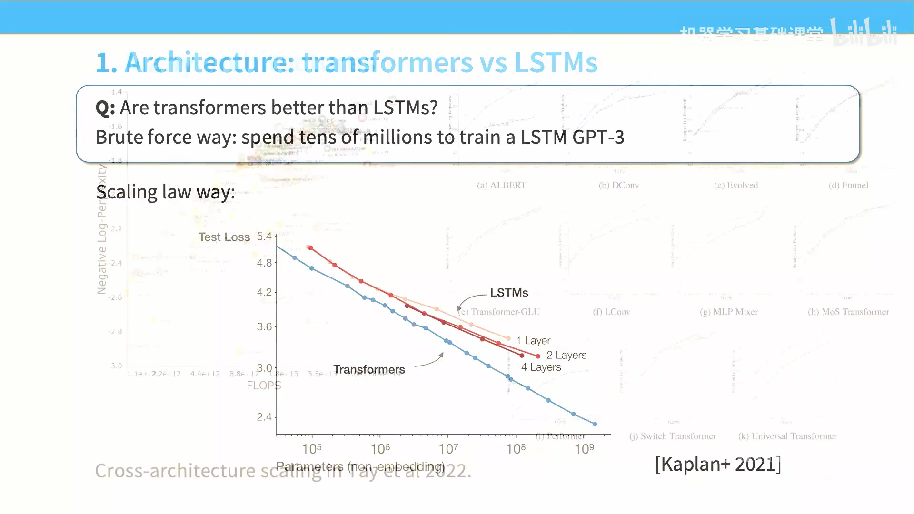

本讲举了多种 architecture ablation 的例子。一个重要经验是：很多后来进入主流模型的改动，在较小 compute range 上已经表现出一致的 scaling advantage。Scaling law 在这里承担的是“方案筛选器”的角色。

### 3.2 Optimizer、depth/width 与 scale-invariant hyperparameters

类似的方法可以比较 optimizer。一个常见现象是：不同 optimizer 的 intercept 不同，但 slope 却可能很接近。也就是说，优化算法会带来稳定优势，却不一定改变规模增长的指数。

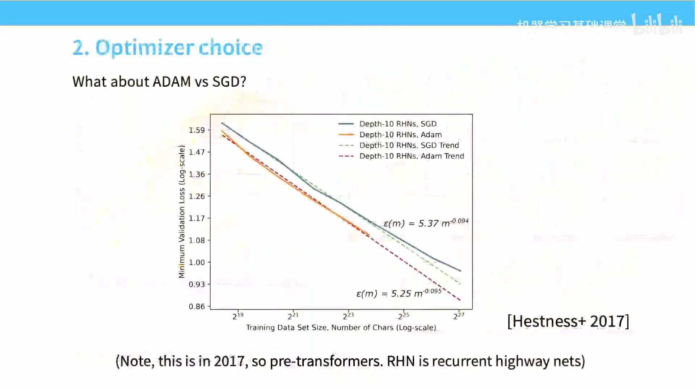

Depth/width 也可以通过 sweep 来研究。极浅的网络明显较差；达到合理深度以后，不同配置的差距会缩小。更值得寻找的是类似 aspect ratio 这样的 **scale-invariant quantity**：随着模型整体放大，最优层数当然会改变，但某些比例可能在不同 scale 上保持相近的 optimum。若这种 optimum 不随规模剧烈漂移，就更适合用于外推。

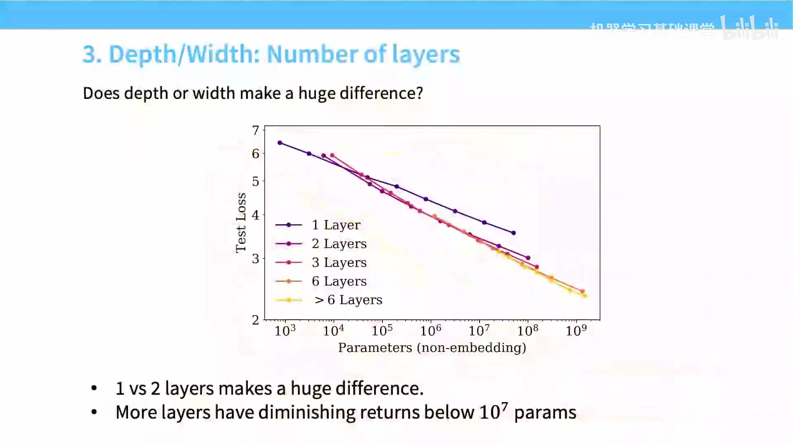

### 3.3 “Parameter count” 本身就是建模选择

Kaplan scaling analysis 中出现过一个重要现象：若把 embedding parameters 计入 parameter count，一些曲线会变得不规整，因此论文选择主要使用 non-embedding parameters。讲师用这个例子说明：scaling law 的 x-axis 不是天然给定的；怎么定义“模型大小”会直接影响规律是否看起来稳定。

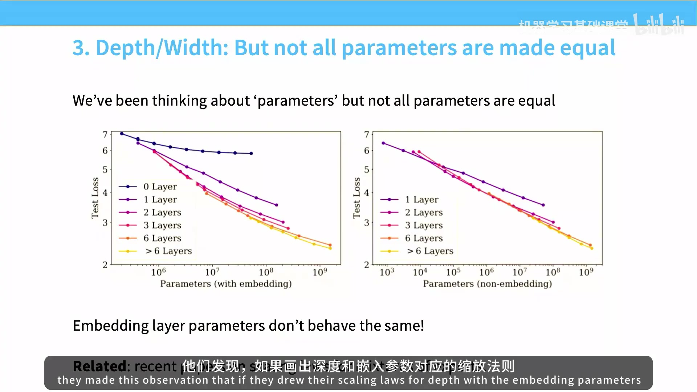

这个问题在 Mixture-of-Experts (MoE) 中更明显。MoE 同时存在 **total parameters** 与每个 token 实际经过的 **active parameters**。固定 active compute 时，增加 inactive experts 仍可能改善 loss，因此“一个 parameter 值多少 compute / capacity”并不统一。Scaling analysis 必须明确究竟在控制 total parameters、active parameters、FLOPs，还是 sparsity。

## 4. Batch size 与 learning rate 的 scaling

### 4.1 Critical batch size

大 batch 对 systems 很有吸引力，因为 data parallelism 需要足够大的 global batch；但 batch 无限增大并不会一直带来线性收益。本讲把过程分成两个 regime：

- **noise-limited**：batch 增大显著降低 gradient noise，几乎能得到理想收益；
- **bias-limited**：variance 已经不再是主要限制，继续扩大 batch 的边际收益迅速下降。

临界位置称为 **critical batch size**。

为了把它定义得更精确，先固定一个 target loss。对不同 batch size，记录达到该 loss 所需的 optimization steps $S$ 与 examples processed $E$。经验关系写成

$$
\frac{S}{S_{\min}}-1
=\left(\frac{E}{E_{\min}}-1\right)^{-1}.
$$

拟合 $S_{\min}$ 和 $E_{\min}$ 后，定义

$$
B_{\mathrm{crit}}=\frac{E_{\min}}{S_{\min}}.
$$

它对应 steps efficiency 与 sample efficiency 的折中点。

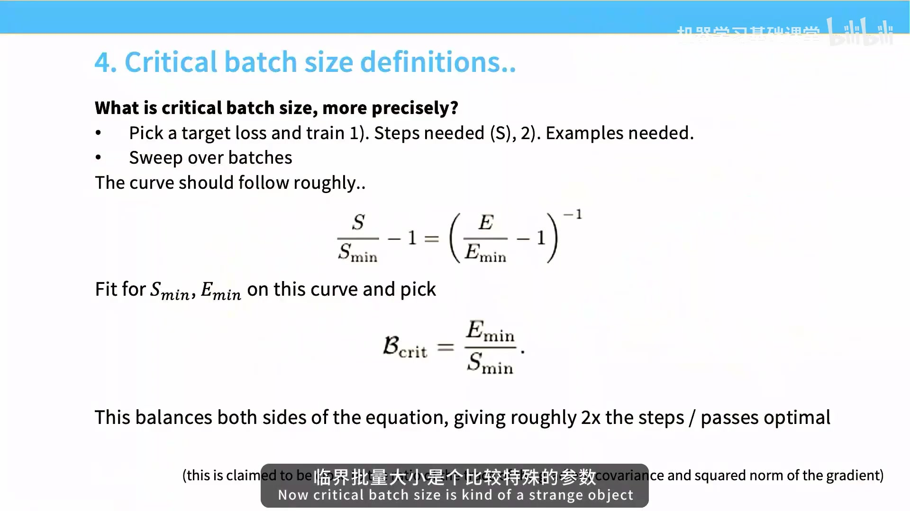

更关键的是，$B_{\mathrm{crit}}$ 自己也会随目标 loss / scale 系统性变化：目标越高、loss 越低，通常越能容纳更大的 batch。因此 batch size 也可以被纳入 scaling prediction，而不是靠一个固定经验值一路放大。

### 4.2 Learning rate：直接外推 optimum，或让 optimum 保持不变

宽度变大时，普通 parameterization 下的最佳 learning rate 往往会移动；一个朴素规则是随 width 增大降低 learning rate。另一条路线是使用类似 $\mu$P 的 parameterization，重新设计 initialization / update scaling，使不同宽度下的 optimal learning rate 更接近不变。

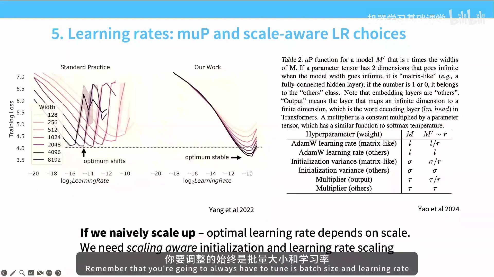

本讲把这两种思路概括为：

1. 直接测量不同 scale 的最佳 learning rate，再拟合其变化规律并外推；
2. 改变 parameterization，让 hyperparameter optimum 尽量跨 scale transfer。

两条路线都曾被用于大规模训练；更深入的讨论留到后续 advanced scaling lecture。

## 5. Scaling 很干净，但 downstream transfer 未必干净

Perplexity / loss 之所以适合做 scaling target，是因为方差通常很低，曲线平滑，外推相对稳定。但 downstream benchmark 往往更噪、更离散，而且不同 model family 的 downstream ranking 可能与 perplexity ranking 不一致。

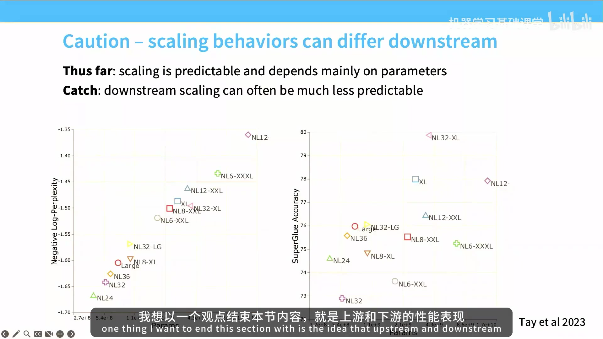

因此可靠的工作流通常是：

1. 先在低方差的 upstream metric 上建立稳定规律；
2. 再单独验证这种规律是否 transfer 到 downstream；
3. 不要因为 perplexity scaling 很漂亮，就假设最终应用指标一定按同样方式改善。

讲师对工程实践的要求很明确：在启动昂贵的大 run 前，团队应该大致能预测最终 loss，甚至应该能估计“换 optimizer、architecture 或其他 recipe 后大约能提升多少”。如果完全不知道大 run 会落在哪里，就说明 scaling experiment 还没有把风险降到足够低。

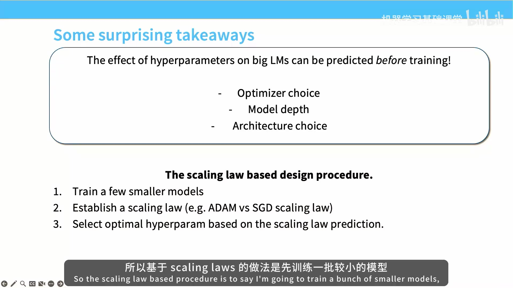

## 6. Model、data 与 compute 的联合 scaling

### 6.1 固定 compute 时，应该把预算花在更大的模型还是更多 token？

训练 FLOPs 大致随 parameter count $N$ 与 token count $D$ 的乘积增长。因此固定 compute budget $C$ 后，$N$ 与 $D$ 之间存在直接 trade-off：模型太小而数据过多会浪费数据；模型太大而数据不足也会浪费参数容量。

Rosenfeld、Kaplan 等工作通过联合函数 $L(N,D)$ 拟合 model-size 与 data-size 对 loss 的共同影响。一个有用的 sanity check 是看极限：

- $D\to\infty$ 时应退化为 model-size-limited scaling；
- $N\to\infty$ 时应退化为 data-limited scaling。

这些联合模型在小模型、低 compute 区域拟合后，仍能对更大的 $N,D$ 组合给出相当准确的 loss prediction。

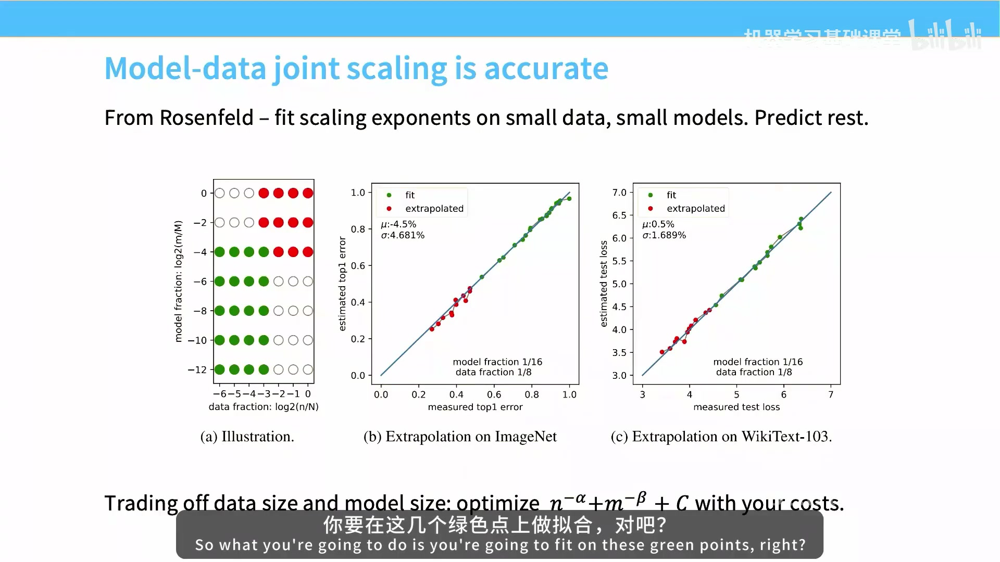

### 6.2 Kaplan 与 Chinchilla 的核心差异

Kaplan et al. (2020) 的 compute-optimal prescription 更倾向于随 compute 增长快速增加 parameter count、较慢增加数据量；这推动了一段“越来越大的 dense model”时期。Hoffmann et al. (2022) 的 Chinchilla 结果则主张在给定训练 compute 下使用更小的模型和更多 token，常见简化记忆是大约 **20 tokens / parameter**。

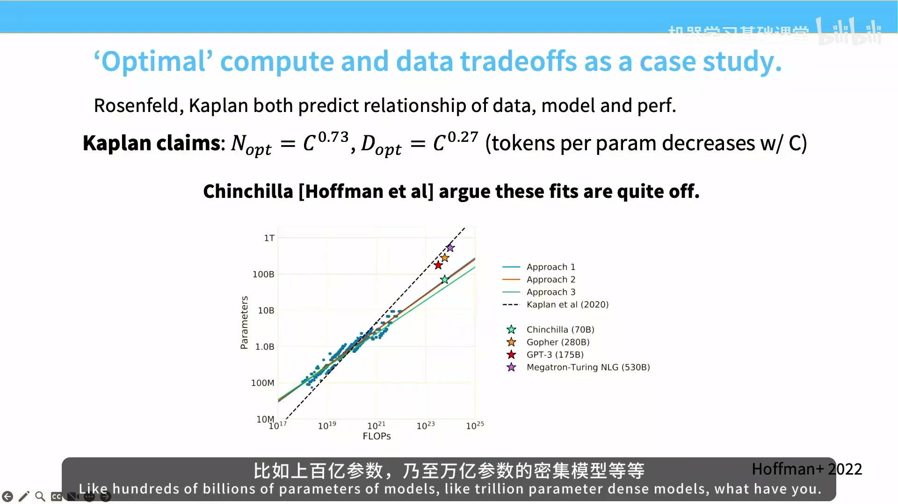

本讲最重要的地方不是背住 20:1，而是理解为什么两个看似严谨的 scaling study 会给出差异如此大的建议：**结果对 parameter counting、warmup、batch size、fit range、regression 方法等细节高度敏感。**

### 6.3 Chinchilla 的三种拟合方法

Hoffmann et al. 给出三种估计 compute-optimal trade-off 的方法：

1. **minimum over training curves**：对多个 model size 的 training curve，在每个 compute budget 上取最优点；
2. **IsoFLOP profiles**：固定 FLOPs，扫不同 $N$/$D$ 分配，寻找该预算下的最优 model size；
3. **parametric modeling of the loss**：直接拟合一个 $L(N,D)$ 的二维函数，再解析/数值求 optimum。

前两种方法得到接近对半的 compute exponent，即 model size 与 data amount 都大致按 $C^{1/2}$ 增长；第三种原论文结果略有偏差。

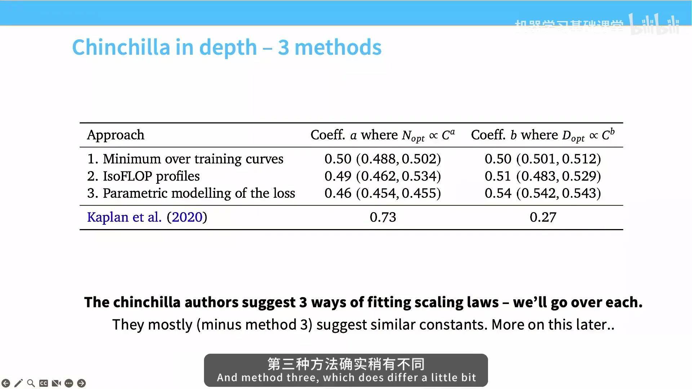

IsoFLOP 特别值得记住，因为它是一个非常实用的实验设计：固定预算、扫 allocation，而不是在不同 FLOPs 上混杂比较。对不确定该把预算分给哪个维度的问题，它往往是很稳妥的默认方案。

### 6.4 为什么 Kaplan 与 Chinchilla 会差这么多？

讲师总结了几类足以显著移动 scaling curve 的“看似小”的细节：

- **parameter counting**：Kaplan 为了得到规整曲线排除了 embedding parameters，并且连形状相似的 output/softmax parameters 也一起排除；
- **learning-rate warmup**：部分非常小的 Kaplan models 在 warmup 结束前就接近训练结束，导致它们处在不理想的 learning-rate regime；
- **batch size**：固定一个很大的 batch 对小模型并不最优；按 scale 调整 batch 后，趋势会明显变化；
- **compute range**：低 compute 区间更容易受到参数定义等有限规模效应影响。

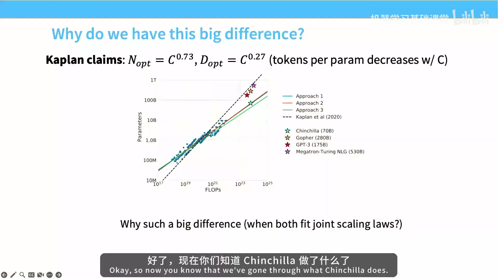

这导向一个关键结论：scaling law 更像是“**按当前 recipe 继续放大会发生什么**”的预测器。如果小模型阶段的 recipe 本身没调好，scaling law 会忠实地把这个坏 recipe 外推到更大的 scale。

### 6.5 Chinchilla method 3 的后续重拟合

本讲还讨论了一个很有代表性的细节：Chinchilla 原论文的 method 3 与 methods 1/2 并不完全一致。后续 Epoch AI 工作从论文图中恢复数据并重新拟合，认为 method 3 的原拟合存在 underfitting；重新拟合后，结果重新接近约 20 tokens/parameter 的趋势。

这个案例的价值不在于“20”这个具体数字，而在于说明 scaling result 会受到 regression procedure 的影响。只看论文最终曲线，不检查 fit quality，可能会把拟合误差误解为物理/学习规律。

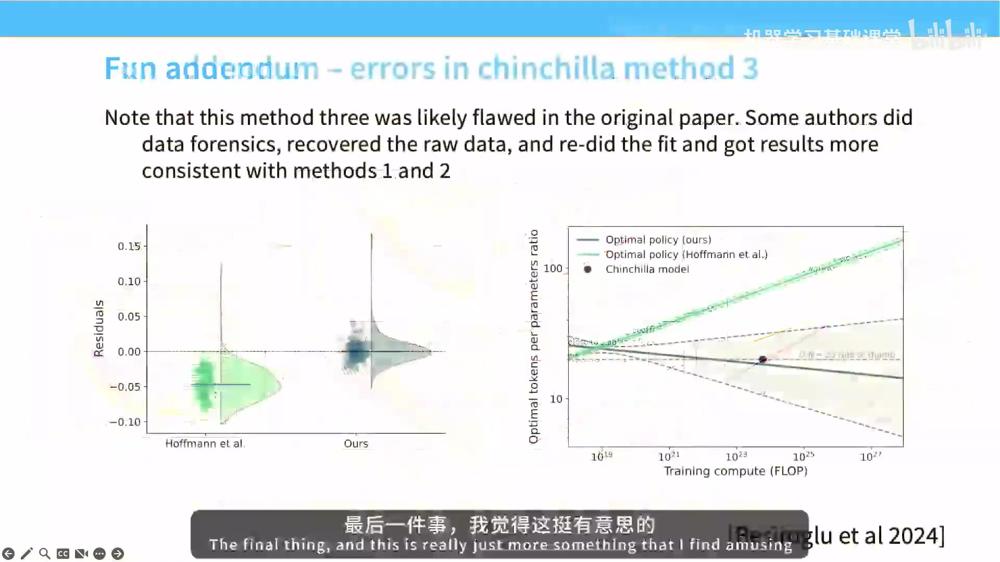

## 7. Train-optimal 不等于 deployment-optimal

Chinchilla 的“optimal”指的是：**在固定 training FLOPs 下使训练后的 loss 最小**。真实产品通常还要承担长期 inference / serving 成本。如果模型会被大量调用，更小但训练更久的模型可能有更低的 total cost。

因此现代公开模型常常比 Chinchilla 20:1 明显更“overtrained”：更多 token / parameter，以更多训练 compute 换取更小的部署模型。本讲列出的公开示例包括 GPT-3、Chinchilla、LLaMA、LLaMA 2、Mistral 7B、Llama 3 70B 等，token/parameter ratio 随时代明显上升。

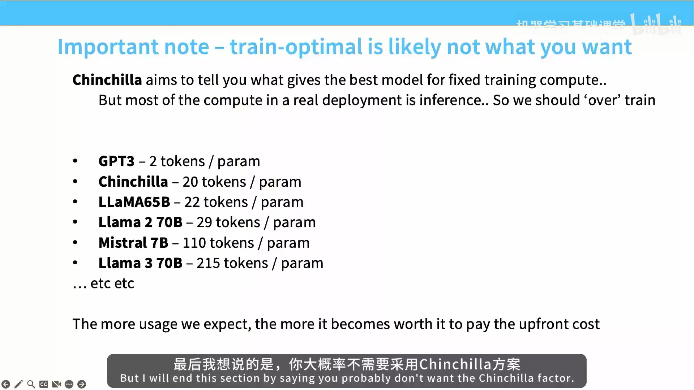

这里的“overtrained”是相对于 **training-compute optimum** 的说法，不等于训练错误。若优化目标包含 serving，它反而可能是正确的工程选择。

## 8. IsoFLOP：一个可以直接带走的实验设计

IsoFLOP 的操作非常简单：

1. 固定一个 FLOPs budget；
2. 在这个预算下 sweep model size、data amount 或其他自由度；
3. 找出每个预算上的最优点；
4. 再研究这些最优点如何随 budget 变化。

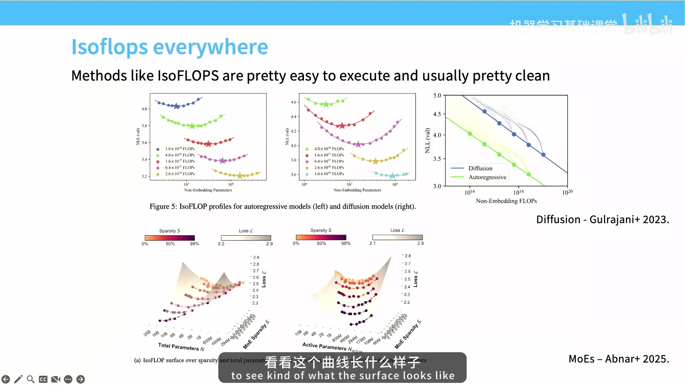

这种设计的优点是比较对象共享同一个 compute constraint，因此不容易把“某方案只是花了更多计算”误判成“某方案本身更好”。讲师指出，类似方法也已用于 diffusion、MoE 等问题。

## 9. 本讲总结

Scaling laws 的核心价值，是发现 **resource 与 performance 之间跨 scale 保持稳定的 regularity**，从而让大模型工程可以更多依赖预测，减少直接在最大规模上试错。

- **Data scaling**：数据越多，loss 通常按稳定 power law 改善；真正难点在 exponent、data composition、repetition 与 filtering。
- **Model engineering**：architecture、optimizer、depth/width、MoE sparsity、batch size、learning rate 等都可以用 scaling experiment 做定量筛选。
- **Joint scaling**：model size、data amount 与 compute 必须联合考虑；Kaplan/Chinchilla 的分歧说明细节和实验设计会实质改变结论。
- **Prediction requires engineering**：parameter definition、hyperparameter tuning、scale range、fit procedure、upstream/downstream transfer 都必须检查，规律不会“自动出现”。
- **Optimization target matters**：training-compute optimal 与 serving / total-cost optimal 可能完全不同。

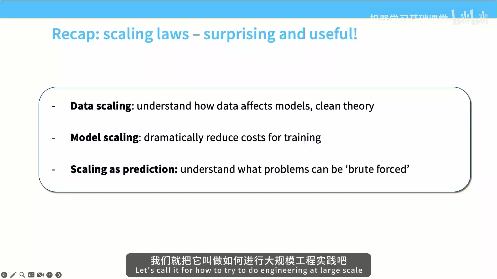

## 配套资料与来源

- Spring 2026 官方课程主页与 Schedule：<https://cs336.stanford.edu/>
- Spring 2026 官方 Lecture 9 slides：<https://github.com/stanford-cs336/lectures/blob/main/lecture_09.pdf>
- Spring 2026 官方 lectures repository：<https://github.com/stanford-cs336/lectures>
- 本地输入：P09 Spring 2026 lecture video + English VTT subtitle。

本讲没有在官方 Schedule 中发现明确标为 Lecture 9 的 assigned paper / required reading，因此 `papers/` 不额外打包课程级 bibliography。Assignment 3 虽然主题是 scaling，但官方 Schedule 将其 release 关联到 Lecture 10，本文不把它强行并入 Lecture 9 正文。
