---
workflow:
  name: ChatGPT-Web-Course-Note-Workflow
  version: v4.9.4
course:
  name: "CS336: Language Modeling from Scratch"
  term: "Spring 2026"
  instructors:
    - "Tatsunori Hashimoto"
    - "Percy Liang"
chapter:
  index: 10
  local_label: "P10"
  official_unit_label: "Lecture"
  official_unit_number: 10
  official_title: "Inference"
  instructor: "Percy Liang"
  date: "2026-04-29"
provenance:
  lecture_video_term: "Spring 2026"
  official_materials_term: "Spring 2026"
  local_video_source: "Bilibili collection BV1msTD6CE6j"
  subtitle_role: "unknown_subtitle"
  hard_subtitle_present: true
---

# Lecture 10: Inference

本讲讨论一个训练之后才真正开始持续付费的问题：**如何把已经训练好的语言模型高效地用于推理**。核心矛盾是，训练阶段可以在 sequence 维度大规模并行，而 autoregressive generation 必须逐 token 推进；因此训练时常见的 compute-bound 工作负载，在生成阶段很容易变成 **memory-bandwidth-bound**。后续的 GQA、MLA、量化、剪枝、speculative sampling、continuous batching 与 PagedAttention，都围绕这个瓶颈展开。

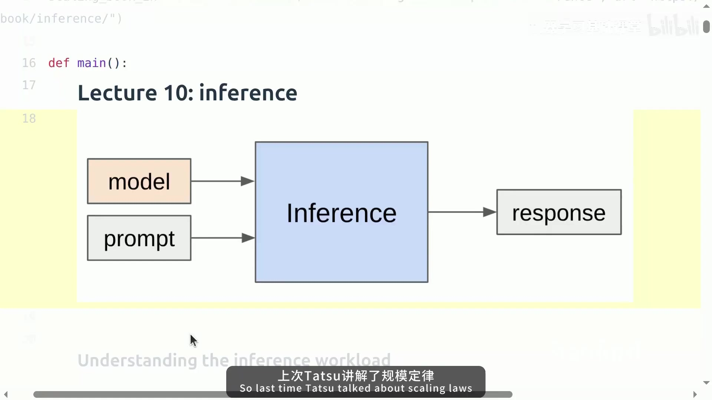

## 资料与章节身份

- 官方课程：<https://cs336.stanford.edu/>
- Spring 2026 官方 lecture materials：<https://github.com/stanford-cs336/lectures>
- 本讲官方 executable lecture：<https://github.com/stanford-cs336/lectures/blob/main/lecture_10.py>
- 官方 Schedule：2026-04-29，**Lecture 10 — Inference [Percy]**。
- 本地输入的开场画面直接显示 “Lecture 10: inference”；字幕开头说明上一讲是 scaling laws，本讲转向 inference，结尾预告下一讲回到 scaling laws part 2。由此可确认本地 `P10` 与 Spring 2026 官方 Lecture 10 对应。

## 本讲路线

大致可以分为四组问题：

1. **推理为什么和训练不同？** 建立 TTFT、latency、throughput 与 arithmetic intensity 的性能模型。
2. **怎样减少每一步必须搬运的数据？** KV cache、GQA、MLA、CLA、local/sparse attention、quantization、pruning/distillation。
3. **怎样减少昂贵 target model 真正逐 token 生成的次数？** speculative sampling。
4. **怎样处理在线服务的动态请求？** continuous/selective batching、PagedAttention、prefix sharing 与 copy-on-write。

---

## 1. 推理工作负载与性能指标

Inference 不只发生在聊天产品里。课程列举了实际产品调用、模型评测、强化学习中大量采样，以及 agent 内部长 trace 等场景。训练成本通常只支付有限次数，而推理会随着产品使用持续发生，所以推理效率会直接决定 serving 成本与可用吞吐。

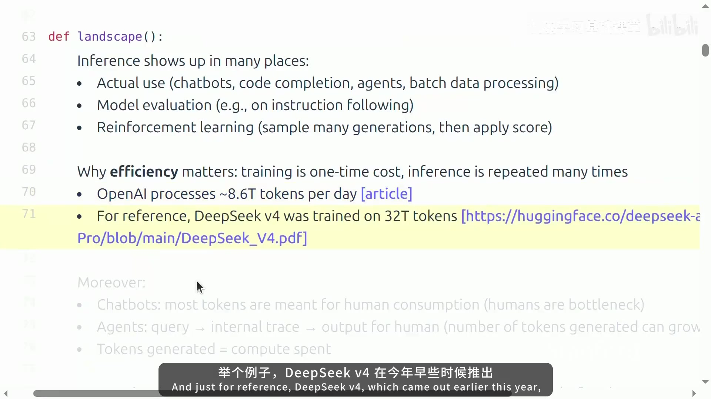

### 1.1 “快”至少有三种含义

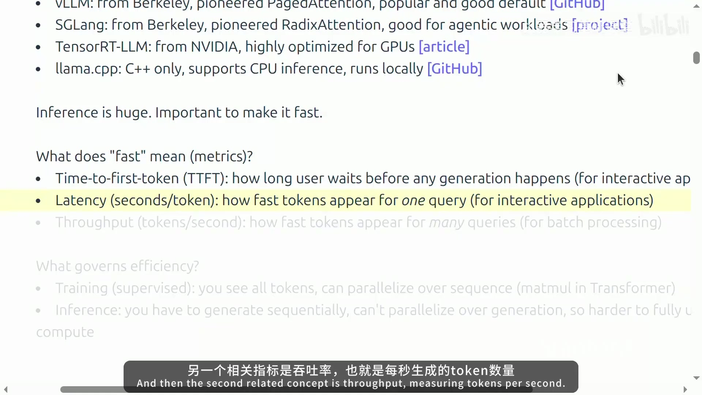

- **Time to First Token, TTFT**：从请求到第一个输出 token 的等待时间。交互式应用尤其敏感。
- **Latency**：单个请求连续生成 token 的速度，常写成 seconds/token。
- **Throughput**：系统面对多个请求时的总体生成能力，常写成 tokens/second。

这三个指标不能混为一谈。增大 batch 往往能提高总体 throughput，却会增加单请求需要搬运的 KV cache，并可能恶化 latency；prefill 与 generation 的最佳 batch 策略也不同。

### 1.2 训练与生成的关键区别

训练时，一段 sequence 的 token 都已知，可以把大量 token 一起送入矩阵乘法；generation 时，下一个 token 依赖前一个 token 的采样结果，因此 generation 方向无法像训练一样一次展开。

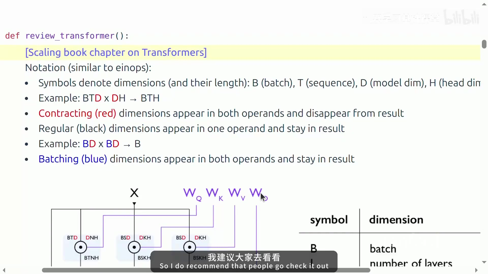

本讲使用的主要维度记号：

| 符号 | 含义 |
|---|---|
| $B$ | batch size |
| $S$ | 已有/条件上下文长度 |
| $T$ | 本次计算覆盖的输出 token 数 |
| $D$ | model dimension |
| $F$ | MLP hidden/up-projection dimension，示例约 $4D$ |
| $N$ | query heads 数 |
| $K$ | key/value heads 数 |
| $H$ | head dimension |
| $L$ | Transformer layers 数 |
| $V$ | vocabulary size |

课程采用 $D=NH$，GQA 下 $N=KG$。训练阶段常可令 $S=T$；decode 单步则典型是 $T=1$。

---

## 2. Arithmetic intensity：为什么 generation 容易被内存带宽卡住

Arithmetic intensity 定义为：

$$
\text{Arithmetic Intensity}=
\frac{\text{FLOPs}}{\text{bytes transferred}}
$$

它衡量“每从 HBM 搬一个 byte，能做多少计算”。若工作负载的 arithmetic intensity 高于硬件的 compute/bandwidth 比值，就更可能 compute-bound；反之更可能 memory-bound。

### 2.1 从一个矩阵乘法开始

考虑 $X\in\mathbb{R}^{B\times D}$ 与 $W\in\mathbb{R}^{D\times F}$，使用 bf16（每元素 2 bytes）：

$$
\text{FLOPs}=2BDF
$$

$$
\text{Bytes}=2BD+2DF+2BF
$$

因此

$$
I=\frac{BDF}{BD+DF+BF}
$$

当 $B\ll D,F$ 时，主导项是读取权重 $DF$，于是

$$
I\approx B.
$$

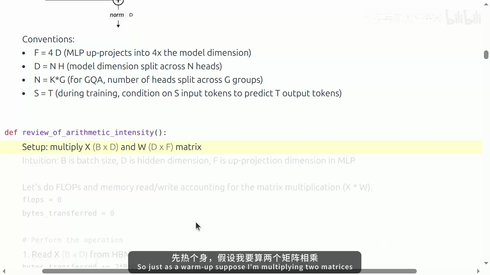

课程用 H100 的示例峰值 $989\times10^{12}$ FLOP/s 与 $3.35\times10^{12}$ byte/s 带宽得到：

$$
I_{\text{H100}}\approx \frac{989}{3.35}\approx295\ \text{FLOP/byte}.
$$

在这个简化模型中，$B=1$ 的 matrix-vector multiply 只有约 1 FLOP/byte，离 295 很远，因此明显受内存带宽限制。

### 2.2 朴素 autoregressive inference 会重复计算历史

如果每生成一个新 token 都把完整历史重新送入 Transformer，那么前缀会被重复计算。注意力单次前向随 sequence length 有二次项，累计生成 $T$ 个 token 的朴素方式会形成 $O(T^3)$ 级总计算量。

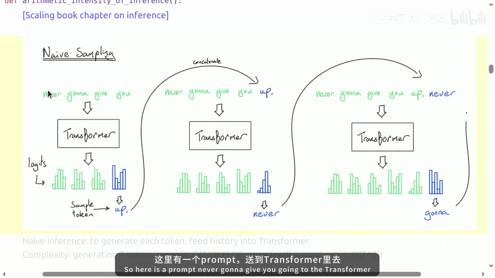

解决办法是把此前 token 的 keys/values 缓存在 HBM 中：这就是 **KV cache**。生成下一 token 时，只计算新增 token 对应的状态，并复用旧的 K/V。

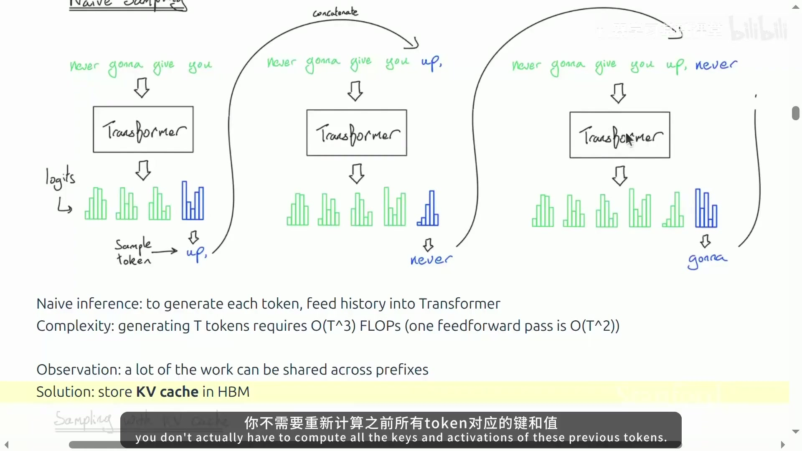

对每个 sequence，若每层有 $K$ 个 KV heads、每 head 维度为 $H$，上下文长 $S$、层数 $L$，bf16 下 K 与 V 各需一份缓存：

$$
\text{KV bytes per sequence}
=S(KH)L\times2\times2
=4SKHL.
$$

这里第一个 2 来自 key + value，第二个 2 来自 bf16 的 2 bytes/element。

### 2.3 推理分成 prefill 与 generation

- **Prefill**：一次处理 prompt，能在 prompt token 维度并行，行为更接近训练。
- **Generation / decode**：每一步只产生一个新 token，必须串行迭代。

这一区分解释了为什么 TTFT 与稳态 decode latency 经常需要分别优化。

---

## 3. MLP 与 attention 在 prefill/decode 中的强度差异

### 3.1 MLP：batching 仍然有用

只看 gated MLP 的三个大矩阵乘法（$W_{up},W_{gate},W_{down}$），课程中的 FLOPs/IO 记账为：

$$
\text{FLOPs}_{MLP}=6BTDF
$$

$$
\text{Bytes}_{MLP}=4BTD+4BTF+6DF.
$$

在 $BT\ll D,F$ 的近似下：

$$
I_{MLP}\approx BT.
$$

于是：

- prefill 中 $T$ 可以很大，$B\cdot T$ 容易把 MLP 推向 compute-bound；
- generation 中 $T=1$，于是 $I\approx B$，需要足够多并发请求才能提高强度。

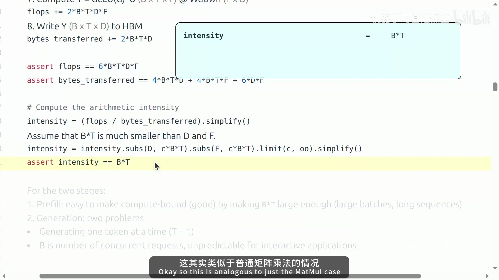

### 3.2 Attention：decode 时 batching 也救不了算术强度

对 FlashAttention 风格的 attention 主要矩阵乘法，课程给出：

$$
\text{FLOPs}_{attn}=4BSTD
$$

$$
\text{Bytes}_{attn}=4BSD+4BTD.
$$

因此

$$
I_{attn}=\frac{ST}{S+T}.
$$

prefill 时 $T=S$：

$$
I_{attn,prefill}=\frac{S}{2}.
$$

generation 时 $T=1$：

$$
I_{attn,decode}=\frac{S}{S+1}<1.
$$

最关键的一点是：这里 **$B$ 被约掉了**。MLP 权重可在 batch 中复用，但每个请求拥有自己的 KV cache；因此仅靠增大 batch，并不能让 decode attention 的 arithmetic intensity 变高。

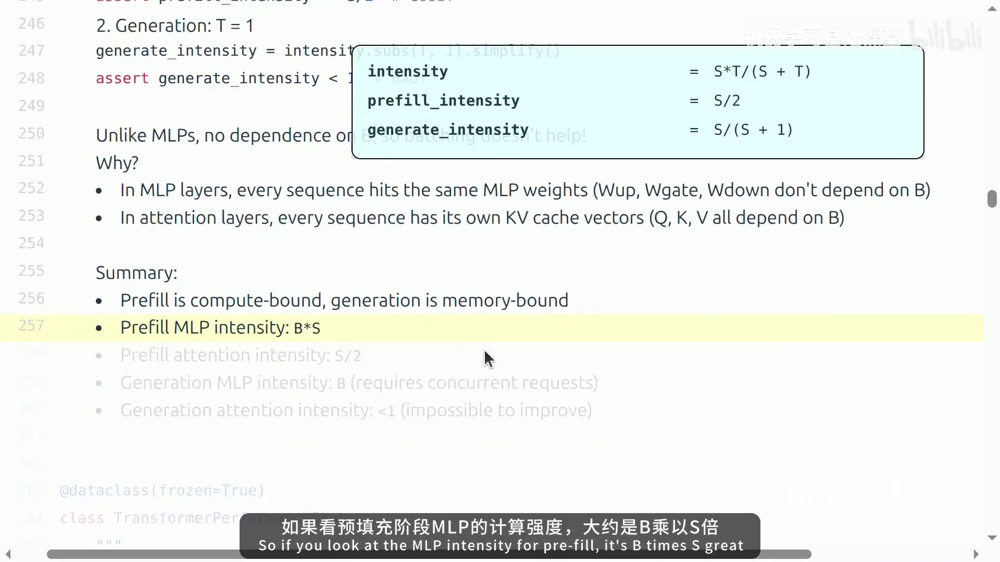

本讲由此得到一个贯穿后半程的结论：

> **Prefill 更容易 compute-bound；autoregressive generation 尤其是 attention 更容易 memory-bound。**

---

## 4. Latency 与 throughput：batch size 的直接代价

课程用一个简化的 memory-bandwidth 模型估算 Transformer generation。参数量写作：

$$
P=2VD+3DFL+(2DNH+2DKH)L.
$$

bf16 参数占用约为 $2P$ bytes。若每序列 KV cache 为 $C_{KV}$，batch size 为 $B$：

$$
M=B C_{KV}+2P.
$$

在“计算与通信可完美重叠、忽略其他 overhead”的理想化假设下：

$$
\text{latency}\approx\frac{M}{\text{memory bandwidth}},
$$

$$
\text{throughput}\approx\frac{B}{\text{latency}}.
$$

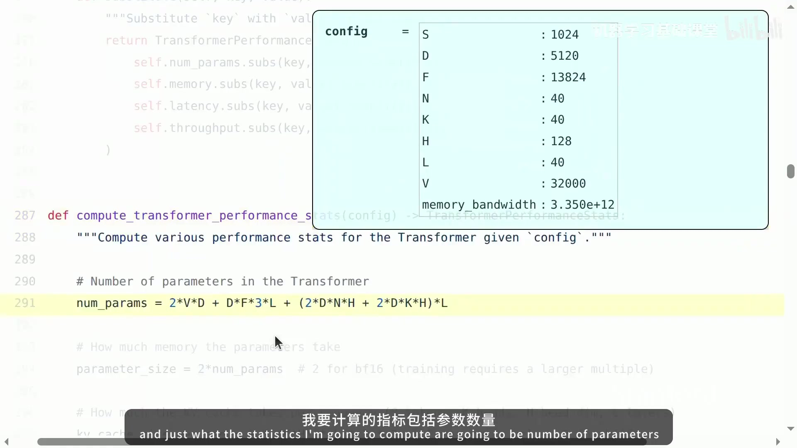

### 4.1 Llama 2 13B / H100 示例

课程 executable lecture 使用：

- $S=1024$
- $D=5120$
- $F=13824$
- $N=K=40$
- $H=128$
- $L=40$
- $V=32000$
- HBM bandwidth $=3.35\times10^{12}$ byte/s

按照课件公式重算：

| Batch | 总内存约 | 理想 latency | 理想 throughput |
|---:|---:|---:|---:|
| 1 | 26.87 GB | 8.02 ms/token | 124.7 tok/s |
| 64 | 79.72 GB | 23.80 ms/token | 2689.5 tok/s |
| 256 | 240.78 GB | 71.87 ms/token | 3561.8 tok/s |

$B=256$ 已明显超过单张 80 GB H100 的容量，而且 throughput 增益开始变小。

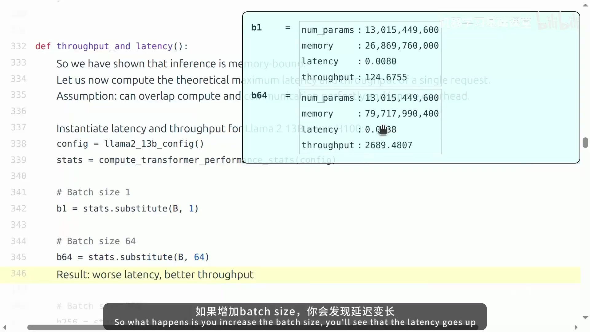

因此 batch size 有明确权衡：

- 小 batch：较低 latency，较差 throughput；
- 大 batch：摊薄每次读取模型参数的成本，提高 throughput，但 KV cache 随 $B$ 增大，使 latency 和显存占用变坏。

课程进一步区分：**prefill 用较小 batch 有利于 TTFT；generation 可以倾向较大 batch 来追求 throughput。** 若有足够 GPU，把模型复制 $M$ 份是简单的吞吐扩展方式；更复杂的方式是 shard model 与 KV cache。

---

## 5. 第一类捷径：减少 KV cache

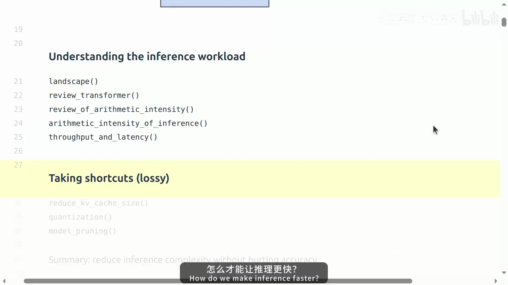

既然 decode 经常 memory-bound，那么减少必须从 HBM 读取的 KV cache 通常能直接改善 serving 性能。代价是：这些结构变化可能影响模型质量，因此必须检查 accuracy。

### 5.1 GQA：跨 query heads 共享 K/V

三种典型设置：

- **MHA**：$K=N$，每个 query head 都有自己的 K/V head；
- **MQA**：$K=1$，所有 query heads 共用一组 K/V；
- **GQA**：$1<K<N$，若干 query heads 共享一组 K/V。

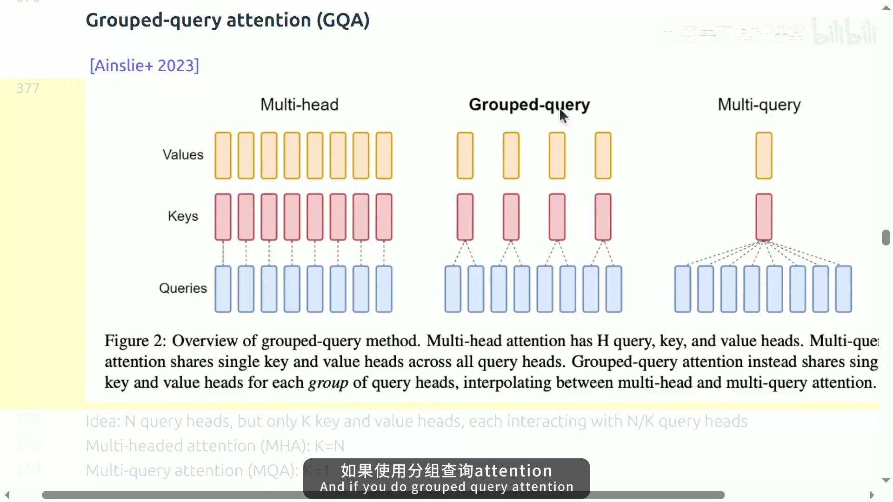

GQA 的 KV cache 相比 MHA 缩小约：

$$
\frac{N}{K}.
$$

课程用 Llama 2 13B 的简化模型把 $K$ 从 40 降到 8。在同样 $B=64$ 下，按课件公式计算：

- KV cache / sequence：约从 0.839 GB 降到 0.168 GB；
- 总内存：约从 79.72 GB 降到 33.41 GB；
- 理想 latency：约从 23.80 ms 降到 9.97 ms；
- 理想 throughput：约从 2689 tok/s 提升到 6417 tok/s。

释放的显存还允许继续增大 batch。这里的核心不是“GQA 一定更准确”，而是用一定的共享换取更小的 KV cache，并在质量—成本之间寻找 Pareto 点。

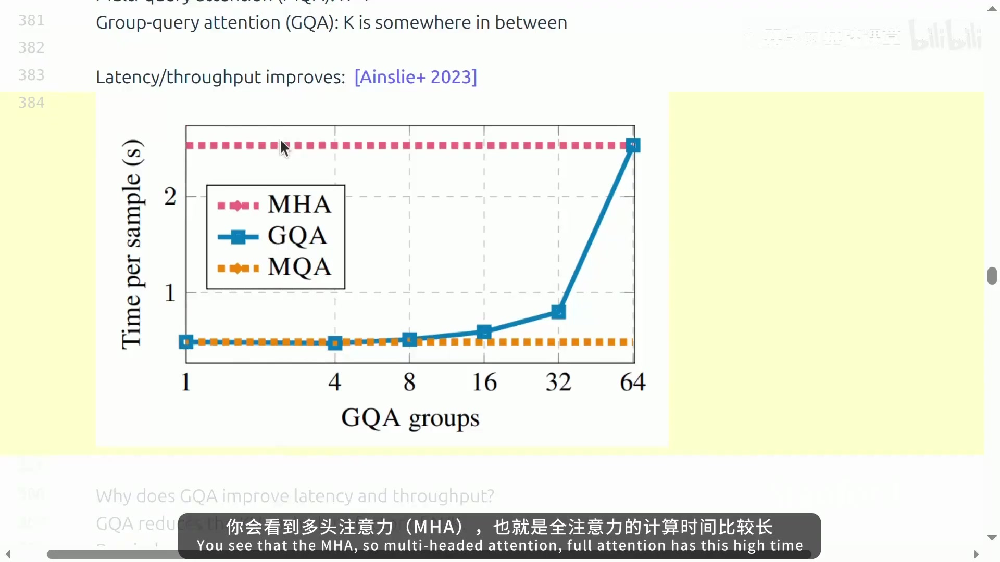

### 5.2 MLA：缓存低维 latent，再按需投影

普通 attention 直接缓存：

$$
K=W_Kh,\qquad V=W_Vh.
$$

MLA（Multi-head Latent Attention）改为先压缩：

$$
c=W_ch,
$$

只缓存低维 $c$，使用时再由 $c$ 投影到 K/V。

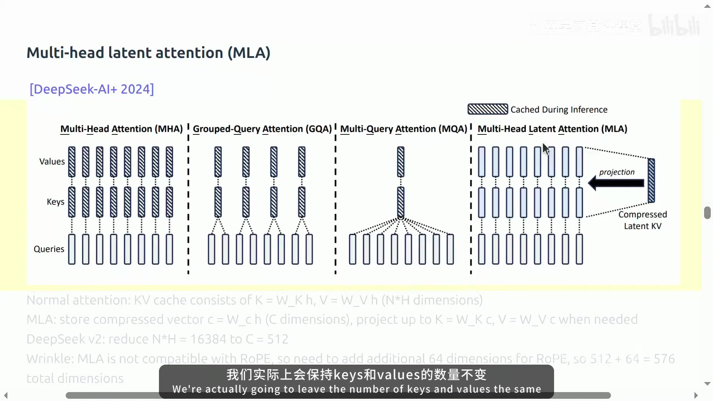

课件以 DeepSeek-V2 为例：原始 $N\cdot H=16384$ 维压到 $C=512$；由于 RoPE 兼容性问题再保留 64 维，因此课程给出的总缓存维度示例是 576。这里同样是在“更多计算换更少 HBM 流量”。

### 5.3 CLA：跨 layers 共享 KV

Cross-Layer Attention 的方向与 GQA 类似，只是共享发生在 **layer 维度**：若相邻层可以复用 K/V，就减少每层单独保存 KV 的需求。课程强调的评价方式仍然是 accuracy 与 KV-cache size 的 Pareto frontier。

### 5.4 Local / sliding-window attention

另一种直接办法是只保留局部窗口。若每层只 attend 最近固定数量 token，则缓存规模不再随总 sequence length 无界增长。

代价是长距离依赖会受损。因此常见修正是：

- 不同层使用不同局部范围；
- interleave local attention 与 global attention；
- 结合 sparse / compressed attention。

### 5.5 DeepSeek v4：进一步压缩与稀疏化

Spring 2026 本讲还展示了 DeepSeek v4 的长上下文 attention 设计，课件列出：

- **CSA — Compressed Sparse Attention**：把每 $m$ 个 token 压成更少的表示；
- **DSA — DeepSeek Sparse Attention**：选择 top-$k$ 相关项；
- **HCA — Heavily Compressed Attention**：进一步压缩缓存/访问量。

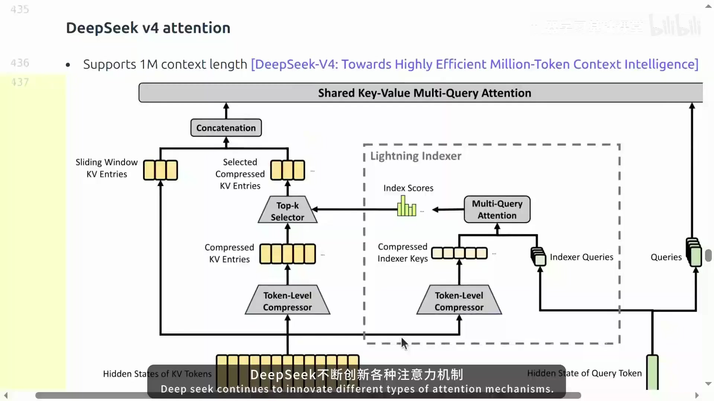

这一组方法的共同目标很清楚：**既然 generation 是 memory-bound，就降低每一步必须搬运的上下文状态。**

---

## 6. 第二类捷径：Quantization

Quantization 不改变模型的宏观拓扑，而是降低数值表示精度，从而减少参数与部分状态的 byte 数。对于 memory-bound inference，这不仅节省容量，也直接减少 HBM traffic。

课程给出的标量示例：

```text
x = 5.2342
scale = 0.1
zero_point = 4
x_quant = round(x / scale) + zero_point = 56
x_approx = (x_quant - zero_point) * scale = 5.2
```

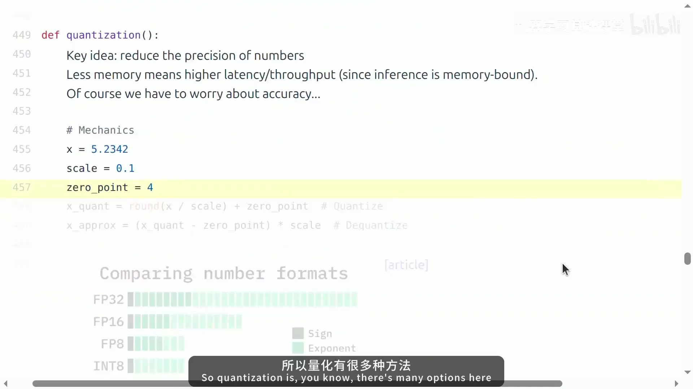

常见精度的存储量：

| 格式 | 约 bytes / value | 本讲强调 |
|---|---:|---|
| fp32 | 4 | 训练中参数/optimizer states 常见 |
| bf16 | 2 | 推理常用基线 |
| fp8 | 1 | 更低带宽；H100 等硬件有支持 |
| int8 | 1 | 推理常见低精度方案 |
| int4 | 0.5 | 更省内存，但更难保持质量 |

### 6.1 QAT 与 PTQ

**Quantization-Aware Training (QAT)** 在训练 forward 中模拟 quantize/dequantize 误差，让权重适应低精度。优点是更有机会恢复质量，缺点是需要昂贵训练。

**Post-Training Quantization (PTQ)** 在训练后完成，因此便宜得多。通常用校准数据估计每层或 tensor 的 scale / zero point。课程还提到 GPTQ：利用 Hessian 信息，在量化部分权重后修正尚未量化的权重，以降低误差。

### 6.2 AWQ：由 activation 判断哪些权重更重要

AWQ 的观察是：少数 activation channels 特别大，与这些 channels 相乘的权重对误差更敏感。因此不必平均对待所有权重，而是让极少量重要权重保留更高精度。

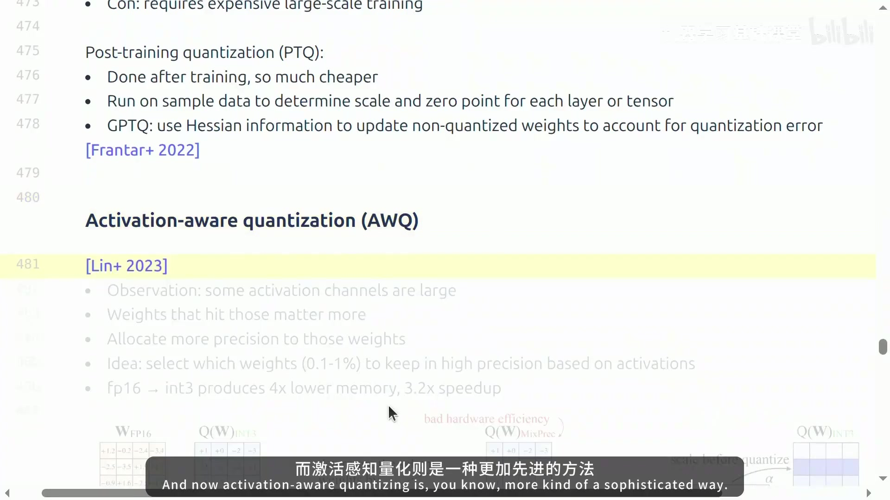

课件给出的量级是保留约 **0.1%–1%** 的权重为高精度，并展示 fp16→int3 的示例结果：约 **4× 更低内存、3.2× speedup**。这些数字应理解为所引用方法/实验设置下的结果，不是所有模型和硬件上的普遍常数。

---

## 7. 第三类捷径：Pruning + Distillation

Pruning 的思想更激进：直接删掉昂贵模型中的一部分结构，再修复质量。

本讲展示的流程：

1. 用小规模 calibration data（课件示例为 1024 samples）估计 layer、attention head、hidden dimension 的重要性；
2. 删除不重要结构，得到更小、更快的 student；
3. 用原模型对 pruned model 做 distillation，恢复性能。

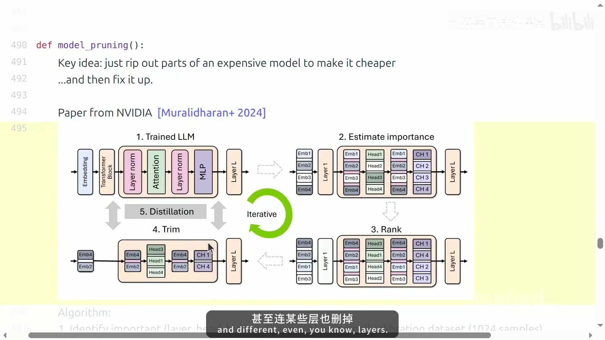

课程把它与“从头训练一个更快架构”作对比：如果已经有一个昂贵但质量好的模型，常可以先构造更便宜的架构，再尽量继承可复用参数，最后用 distillation repair。这里的 tradeoff 从“bit 数”上升到了“模型结构本身”。

---

## 8. Lossless shortcut：Speculative Sampling

前面的 GQA、quantization、pruning 都可能引入模型质量变化。Speculative sampling 的目标不同：**让小模型先猜，再让大模型批量检查，同时保持 target model 的精确采样分布。**

关键不对称来自前面的性能分析：

- target model 逐 token generation 是 memory-bound；
- 给定一串 candidate tokens 后，target model 可以一次并行 evaluate 它们，更像 prefill，检查往往比逐个生成便宜。

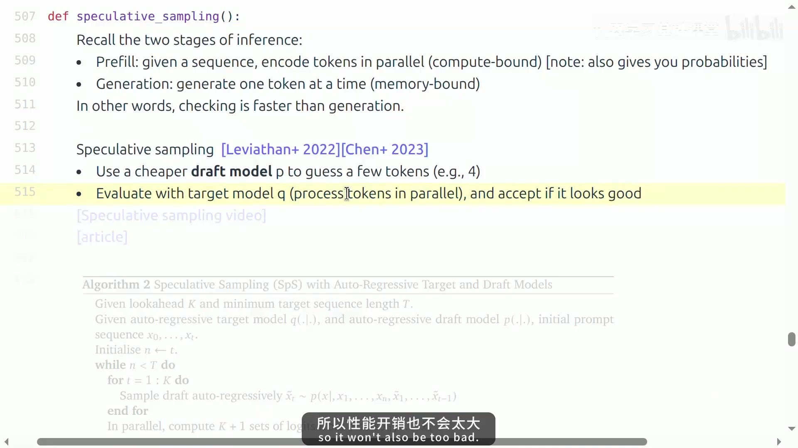

设便宜的 draft model 为 $p$，target model 为 $q$。draft 一次猜若干 token（课程示例约 4 个），target 对这些 token 并行算概率；通过修正后的 rejection sampling 决定接受多少个 draft token，并在拒绝处从残差分布补采样。

### 8.1 为什么结果仍然精确服从 target $q$

课程用只有 $\{A,B\}$ 两个 token 的例子说明。假设 draft 对 A 过采样：

$$
p(A)>q(A),\qquad p(B)<q(B).
$$

A 的接受概率为 $q(A)/p(A)$，因此最终输出 A 的概率：

$$
P(A)=p(A)\frac{q(A)}{p(A)}=q(A).
$$

B 可以来自 draft 直接给出 B，也可以来自 A 被拒绝后的 residual 分布：

$$
P(B)=p(B)+p(A)\left(1-\frac{q(A)}{p(A)}\right).
$$

又因为 $p(A)+p(B)=1$：

$$
P(B)=1-q(A)=q(B).
$$

所以尽管候选来自便宜的 $p$，修正后的最终 sample 分布仍然是 $q$。

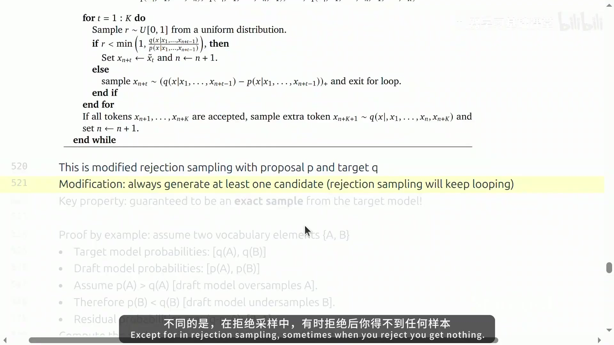

### 8.2 系统上什么时候划算

收益依赖于 draft 的两个条件：

- **够便宜**：自己生成 candidate 的成本不能太高；
- **够接近 target**：acceptance rate 要高，否则 target 频繁拒绝，省不下多少 decode step。

课程给出过 70B target + 8B draft、8B target + 1B draft 这样的量级，并强调可以通过 distillation 让 draft 更贴近 target。

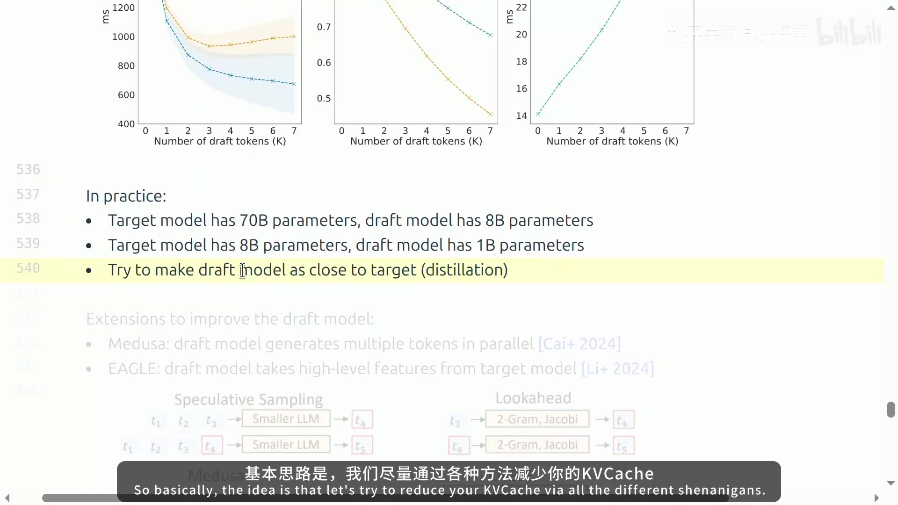

扩展方向包括：

- **Medusa**：让 draft 侧并行提出多个 token/branch；
- **EAGLE**：利用 target 的高层 feature 帮助 draft proposal。

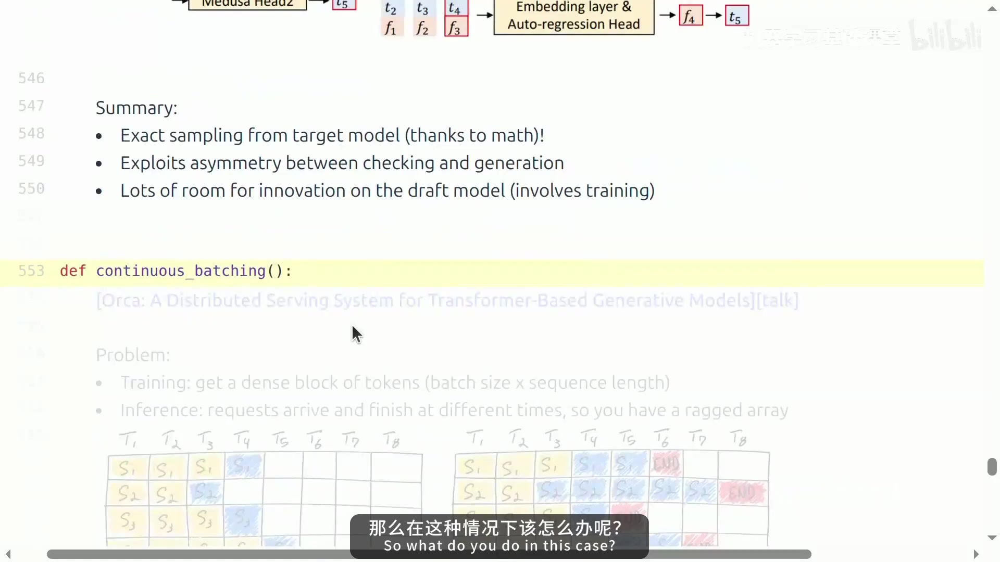

这部分最重要的概念不是某个特定 draft 架构，而是：**把系统优化问题转化成 speculative execution，并用概率校正确保 semantics 不变。**

---

## 9. 动态 serving：Continuous Batching 与 Selective Batching

在线请求不像训练数据那样天然组成规则的 $B\times S$ 矩形：

1. 请求到达时间不同；
2. 完成时间不同；
3. sequence lengths 不同；
4. 不同请求可能共享 system prompt 或其他 prefix。

如果固定一批请求并等待最慢的请求完成，GPU 会产生大量空洞，而且新请求必须等待整批结束。

### 9.1 Continuous batching：按 decode iteration 调度

Continuous batching 的思想是 **iteration-level scheduling**：每生成一步就重新看当前 active requests。旧请求结束后立即移出，新请求到达后可以加入下一轮，而不是等待一个静态 batch 的生命周期结束。

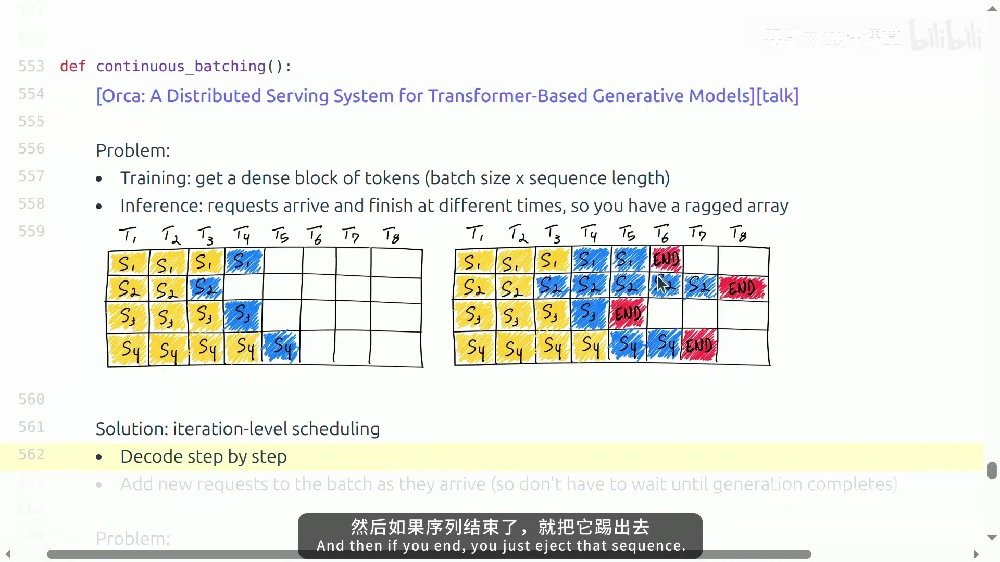

### 9.2 Selective batching：attention 与其他层分开处理 ragged shapes

若当前序列长度分别为：

```text
[3, H], [9, H], [5, H]
```

attention 需要尊重每条序列自己的 KV history，因此可分别处理；而 MLP、normalization 等 token-wise/non-attention 计算可以把 token 拼起来：

```text
[3 + 9 + 5, H] = [17, H]
```

这样既支持 ragged sequences，又能让非 attention 部分维持较好的 dense batching。

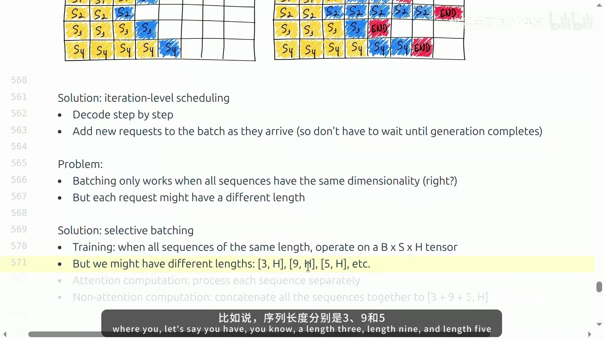

---

## 10. PagedAttention：把操作系统的 paging 思路用于 KV cache

传统实现可能在请求到达时，按“最大可能长度”预留一段连续 KV-cache 空间。在线生成长度不可预测，这会产生两类浪费：

- **internal fragmentation**：给某个请求预留了很多空间，实际只生成少量 token；
- **external fragmentation**：已分配区域之间出现零散空洞，即使总空闲容量够，也难找到足够大的连续区间。

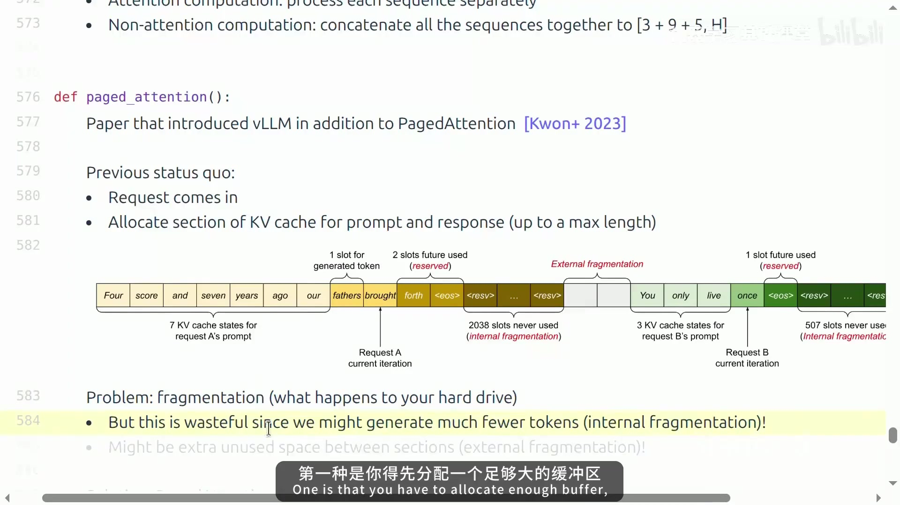

### 10.1 非连续 blocks

PagedAttention 把一条 sequence 的逻辑 KV cache 切成固定大小 blocks；逻辑上连续的 token，不要求物理上也连续。只需维护 logical block → physical block 的映射。

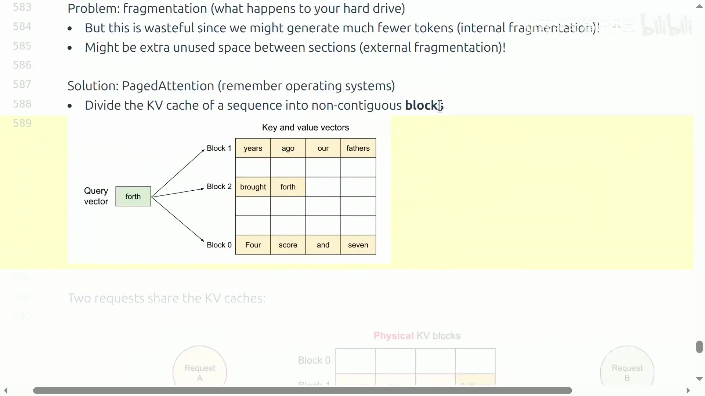

这和 OS virtual memory 的 paging 很相似：服务层可以更灵活地利用显存，而不必为每个请求提前预留一整块连续空间。

### 10.2 Prefix sharing

很多在线请求拥有相同 prefix，例如：

- 同一个 system prompt；
- 同一 prompt 采样多个候选 response；
- program synthesis / RL 中从同一状态展开多个分支。

PagedAttention 允许这些请求共享相同 physical KV blocks，而不是复制多份。

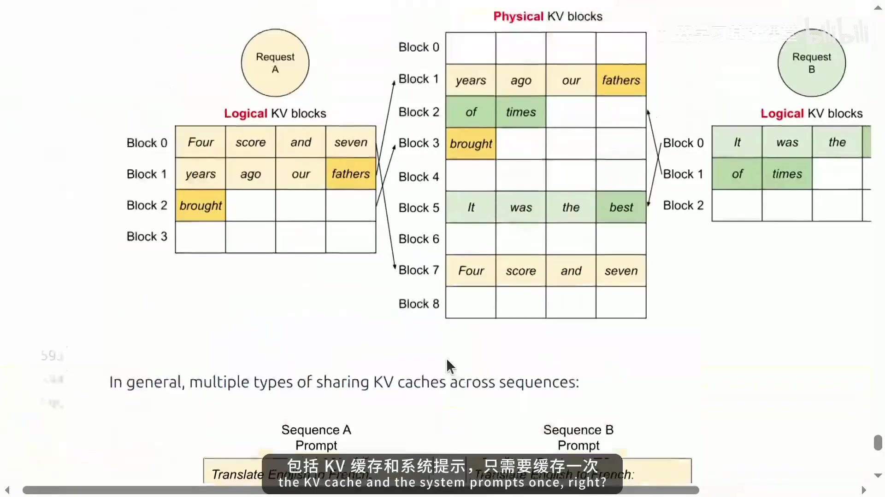

当某个分支开始产生不同 token 时，再对需要修改的 block 做 **copy-on-write**：

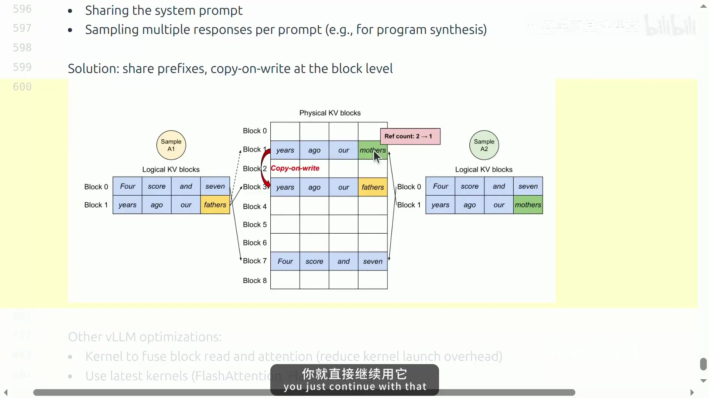

这样 prefix 共享与分支生成可以同时成立。

### 10.3 vLLM 还做了什么

课程列出的其他优化包括：

- fuse block read 与 attention，降低 kernel-launch / memory-access overhead；
- 使用 FlashAttention、FlashDecoding 等高效 kernels；
- 使用 CUDA graphs 减少重复 kernel launch 的 CPU overhead。

PagedAttention 的意义因此不只是一个 attention kernel：它是 serving runtime 的 **memory-management abstraction**，专门适配动态、长度不一、可共享 prefix 的 autoregressive workload。

---

## 11. 把整讲串起来

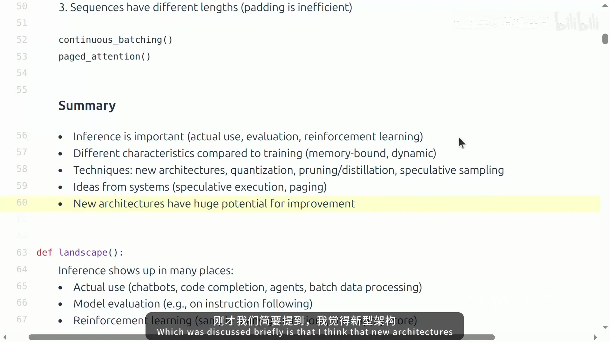

本讲的推理优化可以用三条因果链理解。

### 11.1 Memory bandwidth 是 decode 的第一性约束

$$
\text{generation attention intensity}<1
$$

意味着每做很少计算就要搬大量 K/V。于是：

- GQA / MLA / CLA：降低 KV 表示维度或共享程度；
- local/sparse attention：减少需要读取的历史；
- quantization：减少每个数值的 byte 数；
- PagedAttention：减少分配浪费并支持共享。

这些方法看似不同，底层目标都在减少 HBM traffic 或提高有效显存利用率。

### 11.2 “少算一点”分为 lossy 与 lossless 两类

- quantization、pruning、架构压缩等会改变 representation 或模型结构，需要重新验证 accuracy，甚至用 distillation repair；
- speculative sampling 不要求改变 target distribution，而是让 cheap draft 做 speculative work，再由 target 批量验证。

这也是算法设计与系统设计之间非常直接的一次连接。

### 11.3 Serving workload 本身是动态系统

真实请求不是静态矩形 tensor。continuous batching 解决 arrival/completion 动态性，selective batching 处理 ragged lengths，PagedAttention 处理动态内存与 prefix sharing。换言之，LLM inference 的后半程问题已经非常像操作系统与数据库/服务系统问题，而不只是神经网络算子问题。

课程最后还强调：Transformer 的 KV cache 与 attention 结构本身并不是为推理效率设计的。state-space models、linear attention、diffusion-style alternatives 等新架构如果从一开始就把 inference cost 纳入设计，可能带来比局部工程优化更大的空间。

## 12. 复习清单

学完本讲，应能独立回答：

1. 为什么 autoregressive generation 比 training/prefill 更容易 memory-bound？
2. 如何从 FLOPs 与 HBM bytes 推导 arithmetic intensity？为什么 generation attention 的强度与 batch size 无关？
3. KV cache 的大小怎样随 $S,K,H,L$ 扩展？
4. 增大 batch 为什么通常提高 throughput、却可能恶化 latency 和显存占用？
5. GQA、MLA、CLA、local attention 分别从哪个维度缩小 KV cache？
6. QAT、PTQ、GPTQ、AWQ 的区别是什么？
7. pruning 后为什么常需要 distillation？
8. speculative sampling 为什么可以加速，同时仍精确采样自 target model？
9. continuous batching 与 selective batching 分别解决什么动态 serving 问题？
10. PagedAttention 如何把 paging、prefix sharing 和 copy-on-write 用到 KV-cache 管理？
