---
workflow:
  name: ChatGPT-Web-Course-Note-Workflow
  version: v4.9.4
course: "CS336: Language Modeling from Scratch"
term: "Spring 2026"
local_chapter: "P11"
official_unit:
  type: "Lecture"
  number: 11
  title: "Scaling laws"
  date: "2026-05-04"
  instructor: "Tatsunori Hashimoto (Tatsu)"
provenance:
  primary: "local Spring 2026 lecture video"
  subtitle_role: "unknown_subtitle"
  hard_subtitle_role: "cross-check"
  official_identity: "Spring 2026 official schedule + Stanford Online recording"
---

# Lecture 11 — Scaling Laws

本讲继续 Lecture 9 的 scaling laws 主题，但重心从“拟合 loss 随 compute / model / data 的变化”转到一个更实际的问题：**当模型真的变大时，训练 recipe 里的 learning rate、batch size、初始化、optimizer 和架构选择能否一起稳定地 scale？** Tatsu 用 MiniCPM、DeepSeek、Qwen、Kimi K2、Hunyuan、LLaMA 3、MiniMax 等公开案例说明，现代 scaling 已经不只是预测最终 loss；它也被用来缩小超参数搜索空间、选择 MoE sparsity、比较 optimizer，甚至辅助架构决策。

- Official lecture: **Lecture 11 — Scaling laws**
- Date: **2026-05-04**
- Instructor: **Tatsunori Hashimoto (Tatsu)**
- Official schedule: https://cs336.stanford.edu/
- Official Spring 2026 material index: https://github.com/stanford-cs336/lectures
- Official lecture material: https://github.com/stanford-cs336/lectures/blob/main/lecture_11.pdf
- Stanford Online recording: https://www.youtube.com/watch?v=vTfEyOyzV9E

> 资料说明：本地 P11 的开场明确说这是继续此前的 scaling journey，并提到“两讲前”的 scaling-law 内容；Spring 2026 官方 Schedule 恰好是 Lecture 9 Scaling laws → Lecture 10 Inference → Lecture 11 Scaling laws，因此 P11 与 official Lecture 11 的身份可以可靠对应。官方 `lecture_11.pdf` 已定位，但本次执行环境没有可靠取得其原始 PDF 字节；正文逐页内容以同版本本地视频中的可见课件帧、口述和字幕时间线为准，不把未读取的 PDF 内容当成已验证事实。

## 1. 从“经典 scaling law”到真实训练 recipe

前面的 scaling law 讨论通常把问题写得很干净：给定 compute budget，model size 和 data size 应怎样分配，loss 会怎样下降。本讲提醒我们，真正训练一个模型时还有一组会随规模漂移的参数：

- initialization scale；
- learning rate；
- batch size；
- optimizer 及其内部超参数；
- residual / embedding / LM head 的参数化；
- MoE sparsity、attention 形式等架构选择。

如果这些量没有随宽度、深度和数据规模一起调整，那么“模型变大后性能没有按 scaling law 走”可能源于训练 recipe 已经离开小模型的最优区域，而不一定说明 scaling law 本身失效。因此，本讲把两类实践路线并列起来：

1. **让超参数尽量具有尺度不变性**：典型代表是 MiniCPM 借鉴 tensor programs / μP 的做法，希望小模型调好的 learning rate 能迁移到更大模型。
2. **直接拟合最优超参数如何随 scale 变化**：典型代表是 DeepSeek 和后续 StepFun 风格的 grid search + empirical scaling law。

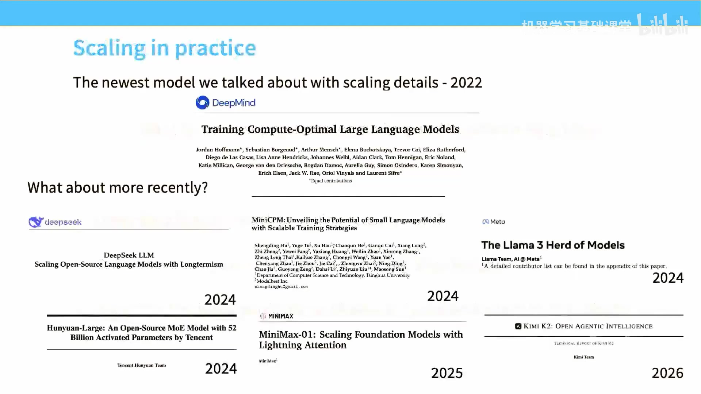

## 2. MiniCPM：先让参数化更“可迁移”

### 2.1 μP-like tensor scaling

MiniCPM 的公开 recipe 里先做了一组与模型宽度相关的 parameterization。课件给出的示例超参数为 `scale_emb=12`、`scale_depth=1.4`、`init_std=0.1`、`lr=0.01`，并列出五项关键操作：

| 项目 | 课件中的 scaling rule |
| --- | --- |
| Embedding output | embedding 输出乘 `scale_emb` |
| Residual connection | 每层 residual increment 乘 `scale_depth / sqrt(num_layers)` |
| 2D tensor initialization | 标准差设为 `init_std / sqrt(d_m / d_base)` |
| 2D tensor learning rate | 设为其他部分 LR 的 `1 / (d_m / d_base)` |
| LM head | logits 乘 `1 / (d_m / d_base)` |

这些规则用于控制不同宽度下 activation 和 update 的尺度，从而减少模型变宽后重新搜索训练超参数的幅度。

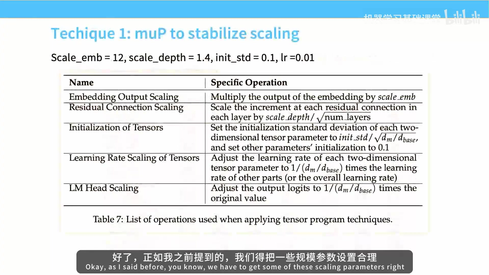

### 2.2 Optimal learning rate 与 optimal batch 的行为不同

MiniCPM 的实验展示了两个不同现象：

- 经过上述 parameterization 后，**optimal learning rate 在不同模型规模间可以相对稳定**；
- **optimal batch size 仍然会随训练规模变化**，并呈现可以拟合的趋势。

这给出一个很实用的思路：如果可以先把 LR 的宽度依赖“吸收”到 parameterization 中，那么剩余 scaling sweep 就少一个维度。这里的结论应理解为特定 recipe 下的经验结果，而不是“所有模型的 LR 都应固定”。

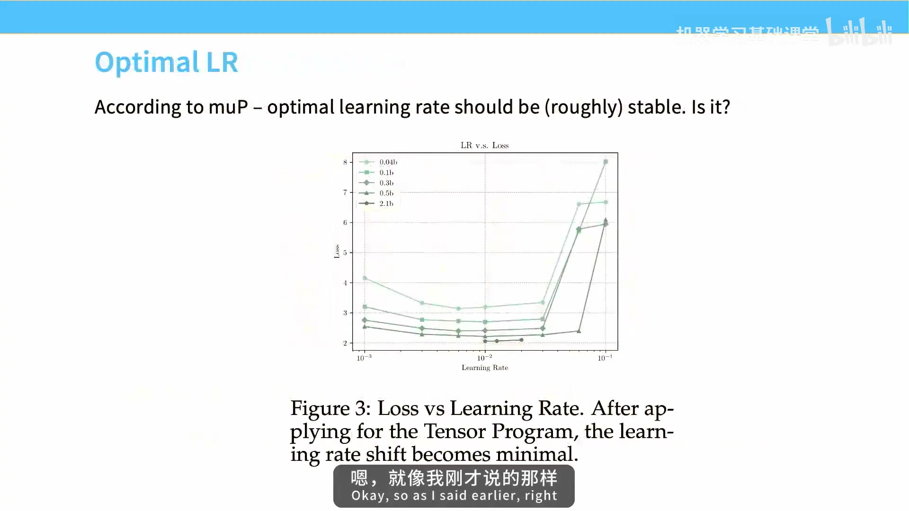

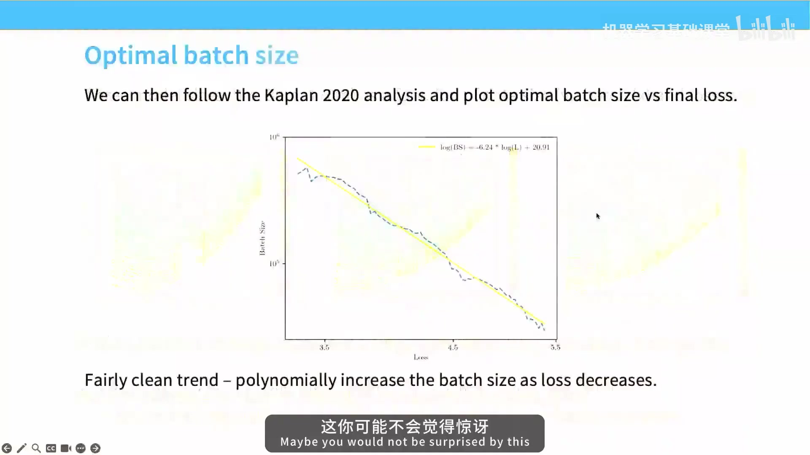

### 2.3 WSD：让 data-axis sweep 不必从头重训

做 Chinchilla-style data/model tradeoff 时，一个工程问题是 cosine schedule 通常绑定训练 horizon：如果把训练 token 数从 $D_1$ 改成 $D_2$，原来的 cosine decay 已经不再对应同一个训练阶段，常常需要重新训练。

MiniCPM 使用 WSD（warmup–stable–decay）缓解这个问题：

1. warmup：先升到最大 LR；
2. stable：较长时间维持稳定 LR；
3. decay：在目标训练终点前做较短的衰减。

关键在于 stable checkpoint 可以复用。要测试更长的数据 horizon，可以从 stable 阶段的 checkpoint 继续训练，最后再做一次 decay，而不是每个 token budget 都从 step 0 开始。这使 IsoFLOPs / Chinchilla-style sweep 在 data axis 上便宜很多。

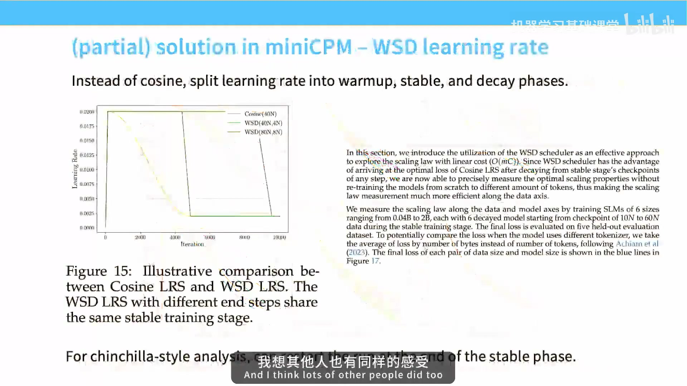

WSD 并不自动保证 scaling fit 正确。MiniCPM 复现了 Chinchilla 的多种拟合方式，但得到的 model/data tradeoff 与原始 Chinchilla 结果并不完全一致。Tatsu 对这种差异保持谨慎：**看似平滑的 power law fit 仍然依赖训练 recipe、测量区间和拟合方法。**

## 3. DeepSeek：直接拟合 LR 和 batch 的 scaling law

DeepSeek 代表另一条路线：不先要求 learning rate 跨宽度不变，而是在多个小规模点上做 LR × batch size grid search，找出每个规模的最优区域，然后拟合这些最优点如何随 compute 变化。

在讲中展示的结果里：

- compute 增大时，optimal batch size 变大；
- compute 增大时，optimal learning rate 变小；
- 拟合结果再用于更大模型的训练配置。

这种做法的优点是直接、与最终 recipe 一致；代价是需要足够密的 search grid，而且拟合的指数对采样点、离散 grid 和训练设置都可能敏感。Tatsu 特别提醒，LR 的趋势线并不是“看上去就必然正确”的物理定律。

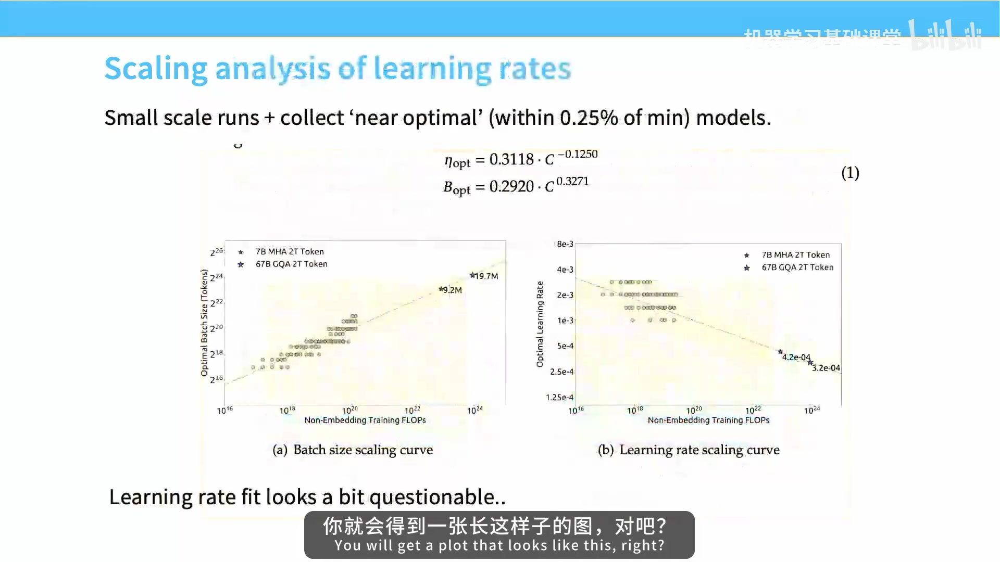

DeepSeek 随后也用 WSD 风格的 schedule 做 Chinchilla-style data/model sweep，并用拟合结果预测最终模型 loss。这里展示了现代 scaling workflow 的一个常见结构：

$$
\text{small-scale sweeps}
\rightarrow \text{fit hyperparameter/data/model trends}
\rightarrow \text{choose large run recipe}
\rightarrow \text{check final loss against prediction}.
$$

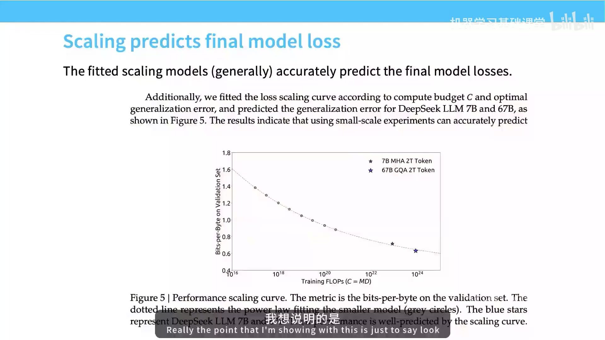

## 4. Scaling law 已经被用来做哪些决策？

接下来的案例集中说明 scaling law 在现代训练 recipe 中承担了哪些决策功能。

### Qwen

Qwen 系列公开 recipe 也会估计 learning rate 与 batch size 随 scale 的变化。它与 DeepSeek 的共同点是：**把训练超参数本身当作 scaling 对象**，而不是只拟合 validation loss。

### Kimi K2 与 MoE sparsity

MoE 额外引入了 total parameters、active parameters、expert sparsity 等维度。Kimi K2 的例子说明，scaling sweep 可以用来选择 sparsity，减少仅凭经验固定 expert 配置的成分。讲中的重点是识别收益开始递减的区域；某个单一 sparsity 数字并不是普适答案。

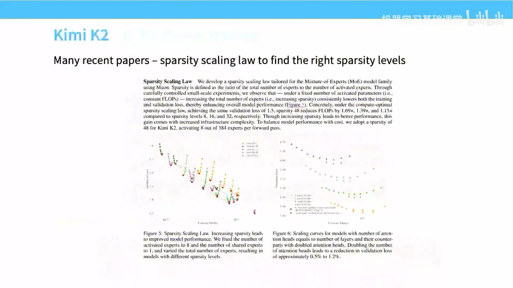

### Hunyuan、LLaMA 3、MiniMax

- Hunyuan：展示更大规模的 MoE / active-parameter scaling 研究；
- LLaMA 3：不仅看 pre-training loss，还尝试把 log-loss 与 downstream accuracy 建立映射；
- MiniMax-01：比较不同 attention 设计的 scaling 行为，用 scaling evidence 辅助 architecture selection。

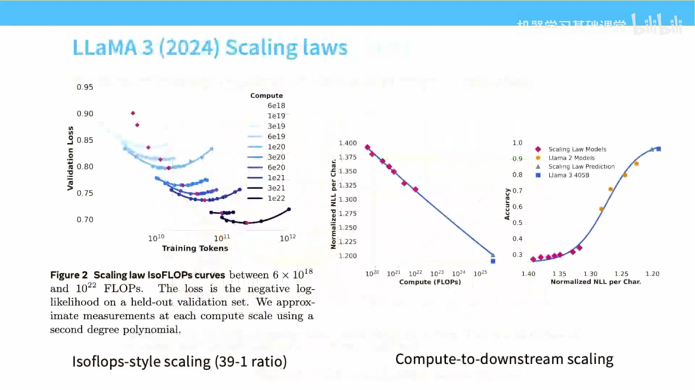

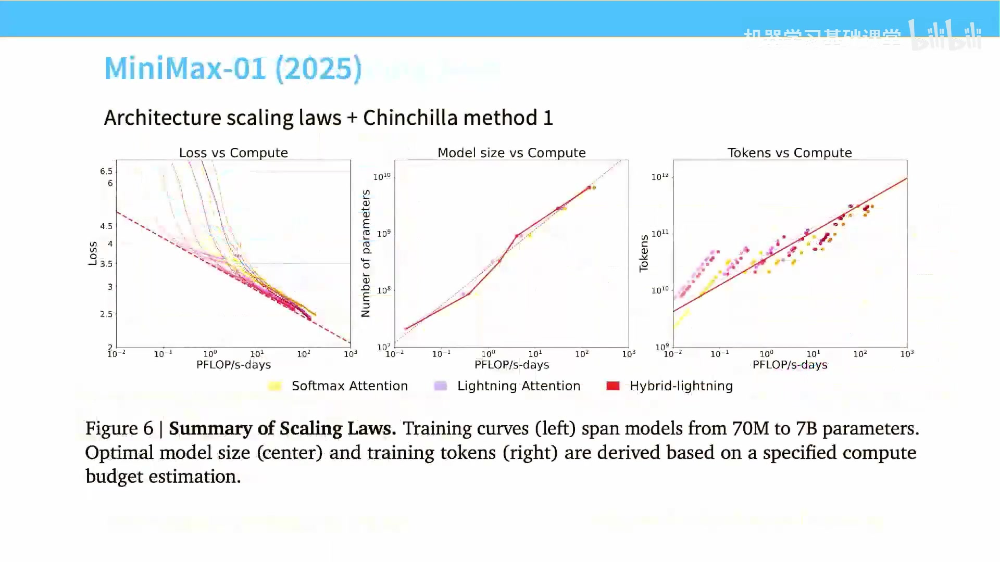

这里的共同点是：**scaling law 已经成为一种低成本决策工具，其用途超出了绘制 loss-vs-compute 曲线。** 它可以帮助判断哪种 recipe 值得投入大规模训练 run。

## 5. StepFun：把 optimal LR / batch 当作一个经验优化问题

后半讲引用 StepFun 的一项大规模 hyperparameter scaling study。它直接追问：DeepSeek/Qwen 一类经验关系到底有多稳？optimal learning rate 和 batch size 究竟主要由 model size、dataset size、compute 还是当前 loss 决定？

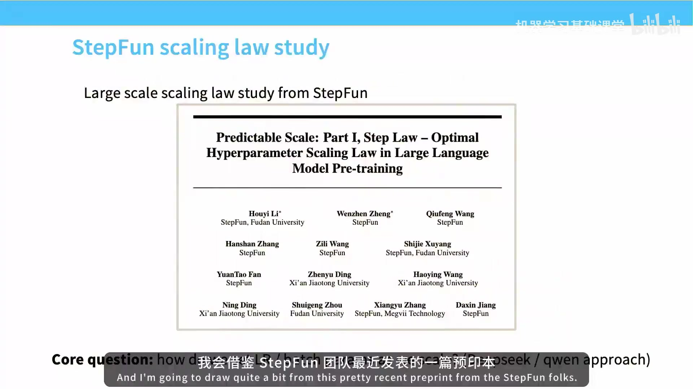

### 5.1 Loss landscape 足够平滑，grid search 才有意义

研究先在多种 model/data 设置上扫描 learning rate 和 batch size。讲中展示的切片呈现较清晰的盆地形状：对 pre-training loss 而言，LR/batch 的 minimizer 可以比较稳定地识别。这一点重要，因为后续所有 scaling fit 都隐含假设“每个规模确实存在可比较的最优点”。

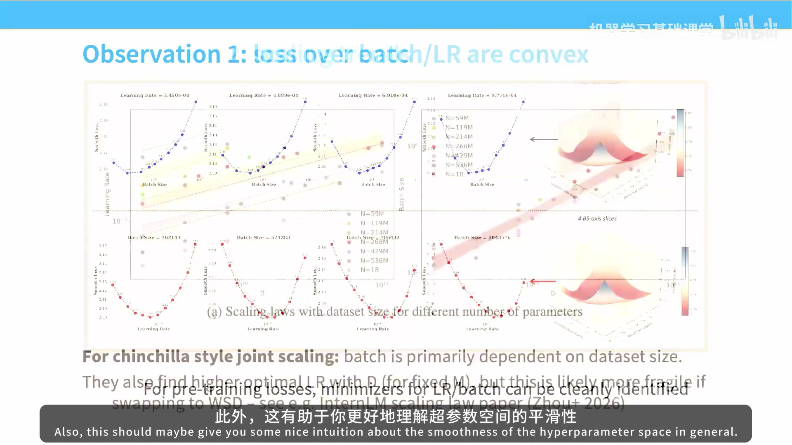

### 5.2 Batch 与 LR 的依赖并不对称

讲中总结的经验现象是：

- 在 Chinchilla-style joint scaling 下，**optimal batch 主要跟 dataset size 走**；
- optimal LR 同时受到 model size 和 data size 的影响；
- 在这组实验中，固定 model size 时 data 更多对应更高的 optimal LR，而 model 更大对应更低的 optimal LR。

Tatsu 对第二条尤其谨慎，因为它很容易受到 schedule、数据分布和 parameterization 的影响。与 DeepSeek 的 fit 相比，指数不一致并不奇怪；如果 recipe 变了，scaling law 的常数甚至函数形式都可能变。

### 5.3 Robustness 不是“跨设置完全不变”

StepFun 还把方法放到不同 MoE sparsity 和不同 dataset 上测试。MoE 方向在控制 active parameters 后仍能看到可用的趋势，但换数据集时 optimum 会偏移。课件把这部分称为 “Observation 3(?) robustness”，问号本身就反映了结论的强度：**有迁移性，但不能假设完全 invariant。**

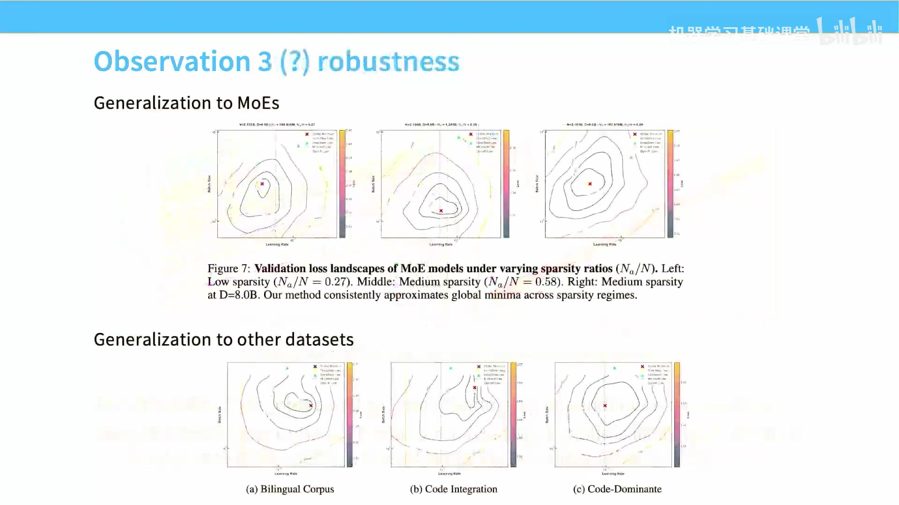

因此，工业实践里更合理的做法是把公开 scaling law 当作 prior，再针对自己的 architecture、dataset、optimizer 和 schedule 做较小的校准 sweep，而非直接沿用某篇 paper 的 LR scaling exponent。

## 6. Optimizer 也有 scale dependence

讨论 optimizer 时，Tatsu 强调两个容易被忽略的问题。

### 6.1 公平比较必须分别调参

如果 Adam、Muon 或其他 optimizer 使用同一个 learning rate / weight decay，比较往往没有意义。每个 optimizer 都应在自己的超参数最优附近比较，否则“新 optimizer 更好/更差”可能只是 tuning bias。

### 6.2 不只看 model size，还要看 token/parameter regime

optimizer 的相对收益可能同时依赖：

- 总训练规模 / compute；
- token-to-parameter ratio，也就是训练处于更 overparameterized 还是更 data-heavy 的区域。

某些方法在小模型或某个 Chinchilla ratio 上有明显优势，但随着 scale 增长，优势可能缩小。反过来，一个看起来非常平滑的 scaling trend 也可能在超出观测范围后突然失效。讲中用相关 optimizer 实验提醒：**extrapolation failure 本身就是 scaling research 要处理的问题。**

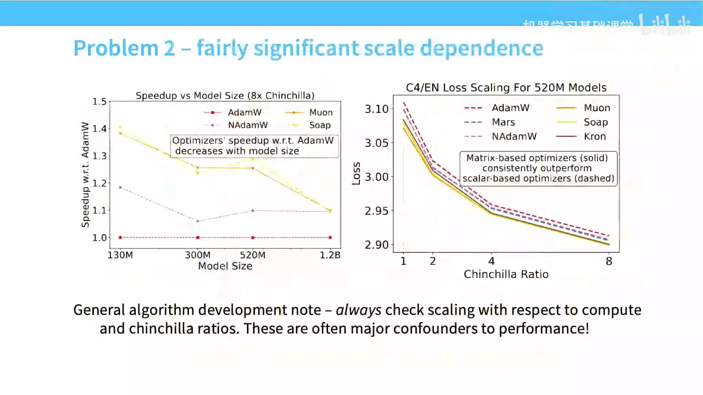

## 7. Muon：对矩阵更新做近似正交化

Muon 的讲解先从算法本身开始。对矩阵参数，课件给出的主循环是：

$$
G_t = \nabla_{\theta}\mathcal{L}_t(\theta_{t-1}),
$$

$$
B_t = \mu B_{t-1} + G_t,
$$

$$
O_t = \operatorname{NewtonSchulz5}(B_t),
$$

$$
\theta_t = \theta_{t-1} - \eta O_t.
$$

如果把 momentum matrix 写成 SVD：

$$
B_t = U S V^\top,
$$

那么 Newton–Schulz 的作用可以直观理解为近似把奇异值“压平”，得到：

$$
B_t \mapsto U V^\top.
$$

这和对每个 coordinate 做 normalization 的 optimizer 思路有相似之处，但 Muon 的归一化对象是 matrix update 的谱结构。实现上使用 Newton–Schulz 迭代，主要由 matrix multiplication 构成，更适合 GPU，而不是每步真的做完整 SVD。

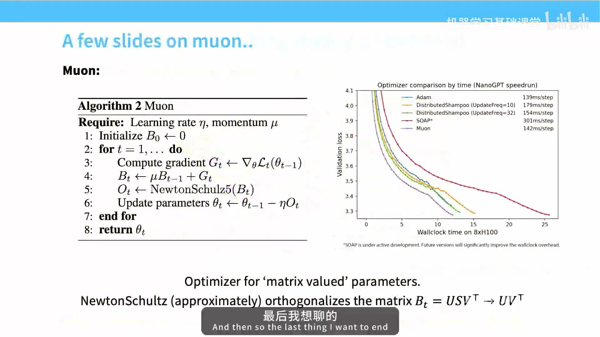

Muon 主要用于 matrix-valued parameters；向量参数可以继续用 AdamW。讲中还提到 Kimi K2 使用了带额外稳定化措施的 Muon，这至少说明它能被工程化到很大规模。但这不能推出“Muon 在大模型上一定比 AdamW 好”，因为缺少同规模、同预算、同等 tuning 的 Adam ablation。

## 8. μP 想解决什么？

μP（maximum update parametrization）的目标是：**当网络宽度 $n_l$ 改变时，让 activation 和一次更新造成的 activation change 保持同一量级，从而提高超参数迁移性。**

课件用两个条件来定义这个目标：

- **A1**：初始化时，每个 activation 保持 $\Theta(1)$；
- **A2**：一次 gradient step 后，每个 activation 的变化也保持 $\Theta(1)$。

如果一个 layer 有 $n_l$ 个 activation，而每个分量都是 $\Theta(1)$，那么向量范数应为：

$$
\lVert h_l \rVert_2 = \Theta(\sqrt{n_l}).
$$

A2 很关键：如果更新导致的 feature change 随宽度趋近于 0，就会滑向更接近 kernel / lazy-training 的 regime，而不是在不同宽度上保持相似的 feature learning 动力学。

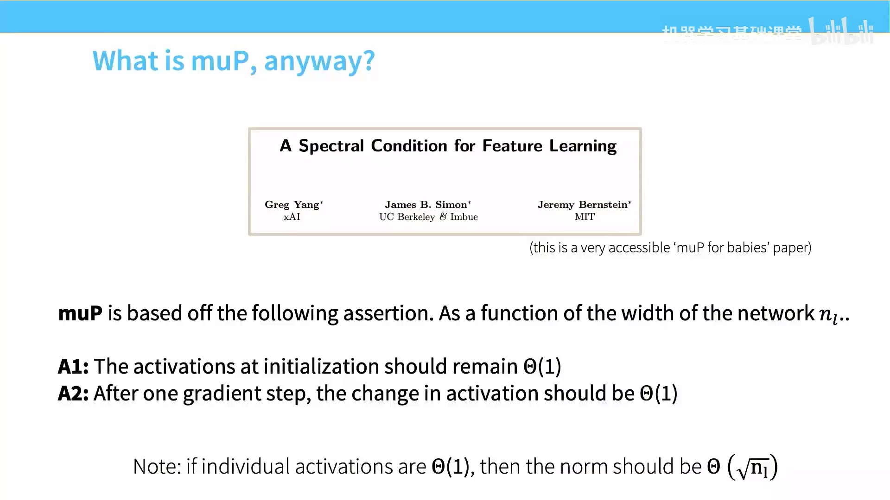

## 9. μP 推导：从 A1/A2 反推 initialization 与 LR scaling

这一段是全讲最需要保留公式的部分。Tatsu 明确把它当作 order-of-magnitude 的“physicists math”：重点是看量级约束，不是给现代 Transformer 做严格定理证明。

### 9.1 A1：初始化时保持 activation scale

先看深线性网络：

$$
h_l = W_l h_{l-1},
$$

并设：

$$
W_l \sim \mathcal{N}\!\left(0,\sigma^2 I_{n_l\times n_{l-1}}\right).
$$

课件使用随机矩阵的 operator-norm 量级：

$$
\lVert W_l\rVert_* \to \sigma\left(\sqrt{n_{l-1}}+\sqrt{n_l}\right).
$$

为了让 $\lVert h_{l-1}\rVert_2=\Theta(\sqrt{n_{l-1}})$ 推出 $\lVert h_l\rVert_2=\Theta(\sqrt{n_l})$，选择：

$$
\sigma
=\frac{\sqrt{n_l}}{\sqrt{n_{l-1}}}
\left(\sqrt{n_l}+\sqrt{n_{l-1}}\right)^{-1}
=\Theta\!\left(
\frac{1}{\sqrt{n_{l-1}}}
\min\left(1,\sqrt{\frac{n_l}{n_{l-1}}}\right)
\right).
$$

于是：

$$
\lVert h_l\rVert_2=\sqrt{n_l}+o(\sqrt{n_l}).
$$

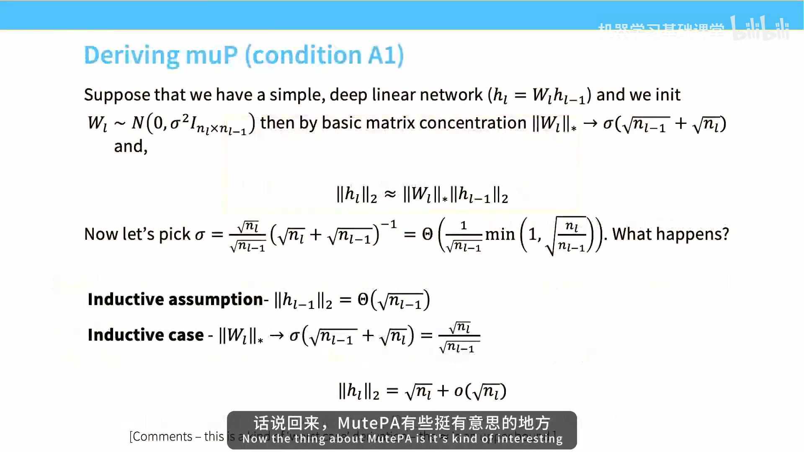

### 9.2 A2：一次 update 也必须保持 feature-change scale

对 SGD 和线性层，权重更新是 rank-one outer product：

$$
\Delta W_l
=-\eta_l\nabla_{h_l}\ell\,h_{l-1}^{\top}.
$$

activation 的变化可以写为：

$$
\Delta h_l
=W_l\Delta h_{l-1}
+\Delta W_l\left(h_{l-1}+\Delta h_{l-1}\right).
$$

如果假设 leading-order terms 不发生精确抵消，并希望各项都保持 $\Theta(\sqrt{n_l})$，则需要：

$$
\lVert\Delta W_l\rVert_*\sqrt{n_{l-1}}
=\Theta(\sqrt{n_l}),
$$

也就是：

$$
\lVert\Delta W_l\rVert_*
=\Theta\!\left(\frac{\sqrt{n_l}}{\sqrt{n_{l-1}}}\right).
$$

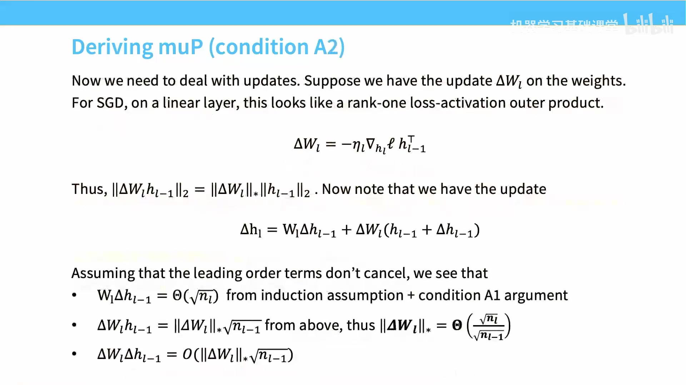

### 9.3 再用 loss update 约束 learning rate

再假设单步 loss change 也是 $O(1)$。课件按量级写成：

$$
\Delta\ell
\approx
\Theta\!\left(\langle\Delta W_l,\nabla_{W_l}\ell\rangle\right)
=
\Theta\!\left(\lVert\Delta W_l\rVert_F\lVert\nabla_{W_l}\ell\rVert_F\right)
=
\Theta\!\left(\lVert\Delta W_l\rVert_*\lVert\nabla_{W_l}\ell\rVert_*\right).
$$

结合前面的 update-size 约束，可以得到 SGD-like 情况下：

$$
\eta_l=\Theta\!\left(\frac{n_l}{n_{l-1}}\right).
$$

而课件 recap 给出的 Adam layerwise scaling 是：

$$
\eta_l\propto\frac{1}{n_{l-1}}.
$$

μP 的核心思路是根据 fan-in / fan-out 的宽度关系，为不同 layer 设置相应的初始化与 learning-rate 尺度，而非要求所有层共享同一个 LR。

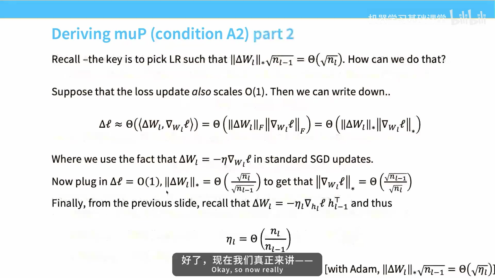

### 9.4 Mini recap

课件最后把这个 simplified derivation 汇总为：

**Initialization stdev**

$$
\Theta\!\left(
\frac{1}{\sqrt{n_{l-1}}}
\min\left(1,\sqrt{\frac{n_l}{n_{l-1}}}\right)
\right).
$$

**Learning rate**

$$
\eta_l\propto\frac{n_l}{n_{l-1}}
\qquad
\text{(Adam: }\eta_l\propto 1/n_{l-1}\text{)}.
$$

对比课件中的 standard parametrization：

$$
\sigma\propto\frac{1}{\sqrt{n_{l-1}}},
\qquad
\eta_l=\Theta(1).
$$

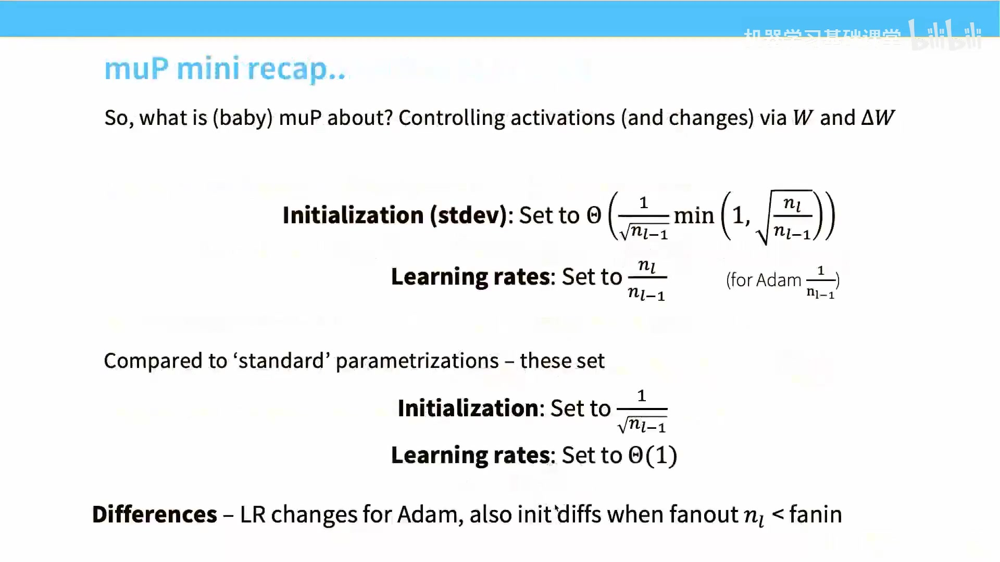

这里的 $\Theta(\cdot)$ 规则是用来解释“为什么宽度变化时要跟着调 initialization / LR”，并不意味着现代 LLM 每一个组件都严格满足这个简化线性网络推导。

## 10. μP 在现代 LLM 中会在哪里失效？

现实模型包含大量不在最简 μP 理论里的组件。讲中列出的 stress-test 方向包括：

- SwiGLU、squared ReLU 等 activation；
- 大/小 batch；
- zero attention 等 initialization variation；
- RMSNorm gain；
- Lion 等 exotic optimizer；
- regularizer / weight decay。

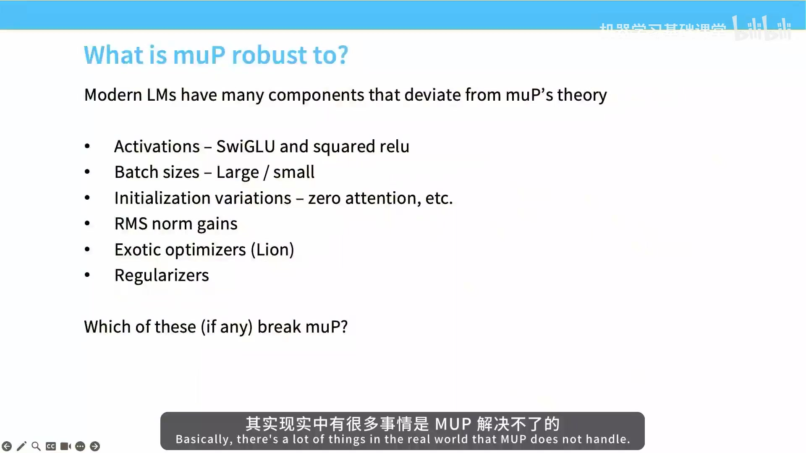

多数测试显示 μP 仍有一定 transferability，但并非所有组件都安全。例如 learned RMSNorm gain 和某些 optimizer 会改变 update scale；最值得警惕的是较强的 decoupled weight decay。

课件的 stress test 特别展示了 **decoupled weight decay = 0.1** 的情况，并把它描述为该组实验里“maybe the only significant muP failure”。这里应按来源原意理解为**这项 stress test 的经验观察**，而不是“0.1 weight decay 普遍会让 μP 失败”的定理。

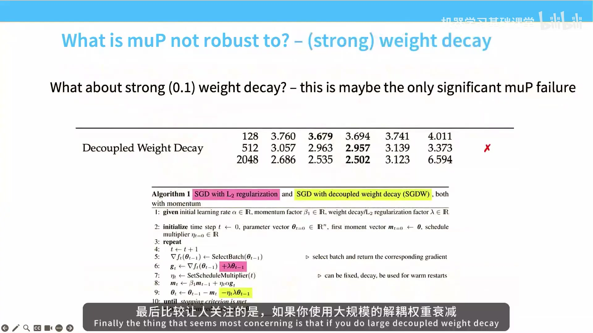

最后的实验表格显示，standard parametrization（SP）随 width 改变时最佳 LR 更容易漂移，而 μP-style parameterization 在大规模实验中更容易调。Tatsu 的结论是“at least to some extent”：μP 是有用工具，但它没有消除真实训练中的所有 scale dependence。

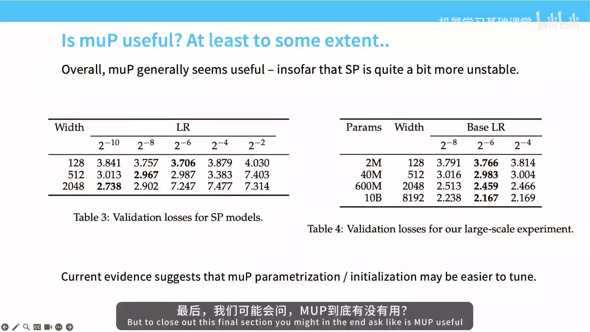

## 11. 本讲结论：scaling in the wild

这节课主要展示真实 LLM scaling 的工作方式，并没有试图给出一条新的 universal power law：

1. **先辨认哪些量会随 scale 漂移。** Loss、optimal batch、optimal LR、optimizer gain、MoE sparsity 都可能有自己的 scaling behavior。
2. **尽量减少需要重复搜索的维度。** μP / tensor-program style parameterization 的价值在于让一部分超参数更容易跨宽度迁移。
3. **剩余维度用小规模 sweep 拟合。** DeepSeek / StepFun-style grid search 是典型做法，但拟合只在相近 recipe 和观测区间内可信。
4. **WSD 可以降低 data-axis sweep 的成本。** Stable checkpoint 让多个训练 horizon 共用前半段训练。
5. **optimizer comparison 必须在各自的最优超参数附近进行。** 否则比较的是 tuning quality，而不是 optimizer 本身。
6. **architecture 也可以成为 scaling 对象。** MoE sparsity、attention 形式等都能通过小规模 scaling evidence 辅助选择。
7. **不要把 extrapolation 当成保证。** 数据分布、normalization、weight decay、optimizer 或 parameterization 一变，原来的 scaling relation 可能偏移甚至失效。

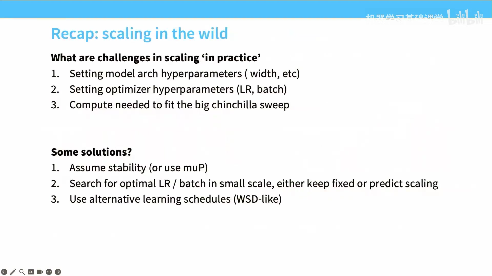

对实践者来说，更可靠的工作流是把 scaling law 当成实验设计工具：先用理论或 parameterization 控制明显的宽度依赖，再用有限的小规模实验估计剩余超参数如何变化，最后保留足够的 intermediate-scale check，避免把平滑的 log-log 拟合直接外推到从未验证过的区域。
