---
workflow:
  name: ChatGPT-Web-Course-Note-Workflow
  version: v4.9.4
course:
  name: "CS336: Language Modeling from Scratch"
  term: "Spring 2026"
  instructors:
    - Tatsunori Hashimoto
    - Percy Liang
chapter:
  index: 13
  local_label: P13
  official_unit_label: Lecture
  official_unit_number: 13
  official_title: "Data (sources, datasets)"
  date: "2026-05-11"
  instructor: Percy Liang
provenance:
  lecture_video_term: "Spring 2026"
  official_materials_term: "Spring 2026"
  official_recording: "https://www.youtube.com/watch?v=-qm0ln33G24"
---

# Lecture 13：Data (sources, datasets)

本讲讨论语言模型训练数据的上游问题：数据从哪里来、哪些数据可以收集与使用、公开数据集是怎样从原始来源逐步变成可训练语料的。课堂以 pre-training 为主，同时把 mid-training 和 post-training 放到同一条数据质量演进线上理解。

## 1. 为什么数据是核心变量

Percy Liang 开场强调：训练语言模型时，数据是最需要做对的部分之一。以 Llama 3 为例，模型架构和训练过程公开得相当充分，但训练数据细节仍高度保密。课堂给出的两个直接原因是竞争压力与版权责任。

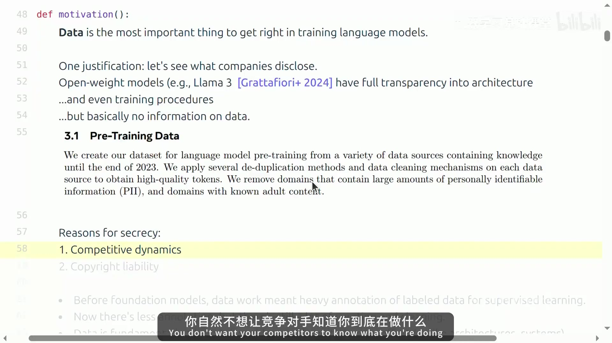

数据工作并没有因为 foundation model 的出现而消失。传统 supervised learning 依赖大量人工标注；现在标注比例降低，但数据清洗、筛选、组合和 provenance 管理仍需要大量人工判断。它还是典型的 long-tail problem：模型架构或系统优化常能复用，而数据问题会不断出现新的边缘情况。

训练阶段可以粗略分成三类：

1. **Pre-training**：主要使用网页、书籍、代码、论文等原始文本，量最大、平均质量最低。
2. **Mid-training**：继续训练，但数据更有针对性、更高质量，用来增强特定能力。
3. **Post-training**：使用对话、偏好数据或 reinforcement learning 相关数据，让模型更符合任务与交互需求。

总体趋势是从“大量、质量参差的数据”逐步转向“较少、质量更高的数据”。实际模型可以有更多阶段，三分法主要用于理解数据角色的变化。

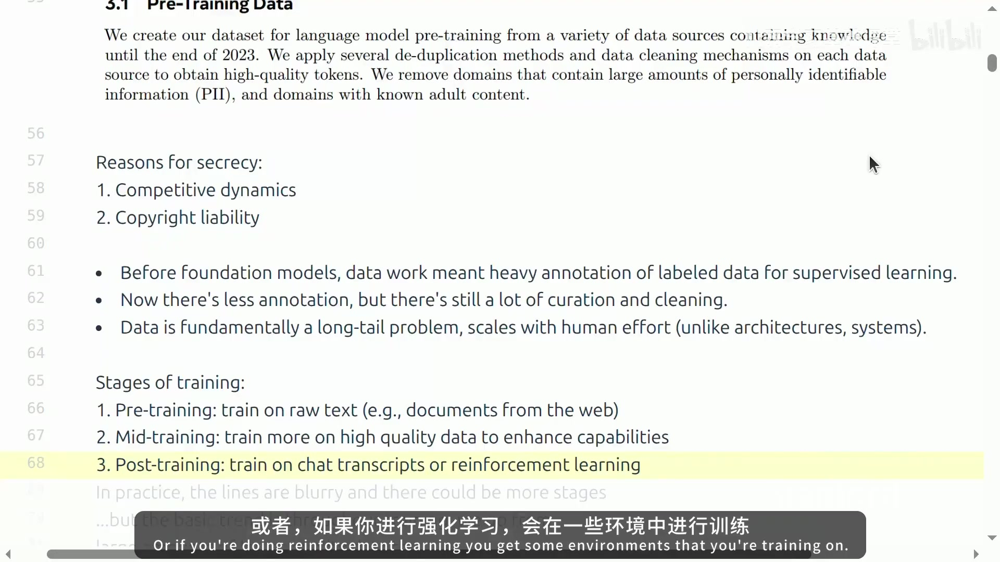

OLMo 2 是课堂中的完整例子：pre-training、Dolmino Mix mid-training 与 Tulu post-training 使用不同数据配方，说明“训练一个模型”实际上对应多套数据分布，而不是一份静态语料从头用到尾。

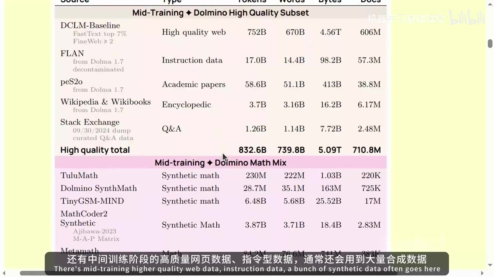

## 2. 从 live service 到可训练语料

“模型在整个 Internet 上训练”只是很粗的说法。网页首先存在于 live servers 上，训练系统不能直接对着在线服务做 SGD。必须先把内容获取并冻结成离线数据。

Crawler 的基本流程是：

1. 从 seed URLs 开始；
2. 发现网页；
3. 下载网页；
4. 从下载结果中的 hyperlinks 继续扩展待抓取队列。

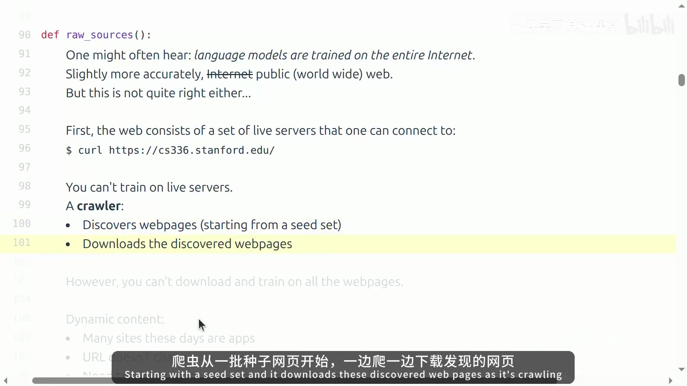

真正困难的是“哪些内容能抓、应该抓”。课堂把限制分成几类：

- **Dynamic content**：现代网站可能是应用，URL 不变，需要点击、提交表单或执行 JavaScript 才能看到内容。
- **Authentication / paywall**：Facebook、X、LinkedIn、NYTimes 等内容需要登录或付费。
- **Technical restrictions**：`robots.txt`、Cloudflare/CAPTCHA、IP/地区限制、rate limit。
- **Legal restrictions**：Terms of Service（ToS）可能禁止 bot 下载；即使技术上能访问，也不代表拥有复制并用于训练的许可。

课堂引用 *Consent in Crisis*，说明常见训练语料中的 URL 随时间出现了更多 `robots.txt` 和 ToS 限制。这里关注数据获取环境的变化，不依赖某个单一比例；过去可抓取的来源不一定长期可用。

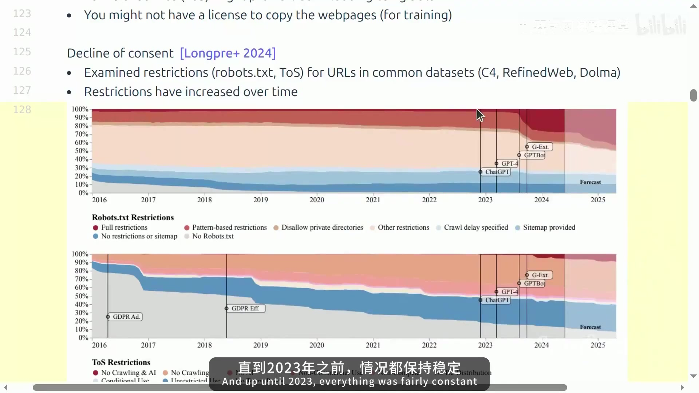

课堂还讨论了 shadow libraries，例如 LibGen、Z-Library、Anna's Archive、Sci-Hub。它们说明“网络上存在”与“合法可训练”是两件事。课程将这部分放在版权章节之前，是为了先建立 provenance 与访问权限的边界。

## 3. Copyright、license、fair use 与 ToS

这一部分是 Spring 2026 课堂对法律问题的教学性概述，不应当作法律意见。核心区分是：

- **Copyright** 保护具体表达，而不是抽象 idea；网上的大量文本默认处于版权保护范围内。
- 使用受版权保护的作品，一条路径是获得 **license**；另一条路径是在具体法域和事实条件下主张 **fair use**。
- **Terms of Service** 是额外约束。即使某份内容本身有许可，网站的 ToS 仍可能限制抓取或下载方式。

美国 fair use 的课堂框架包含四个因素：

1. 使用目的和性质：教育用途、transformative use 通常更有利；商业、单纯复制通常更不利。
2. 原作品性质：事实性、非虚构材料通常比高度创作性作品更有利。
3. 使用部分的数量与重要性：片段通常比完整复制更有利。
4. 对原作品现有或潜在市场的影响。

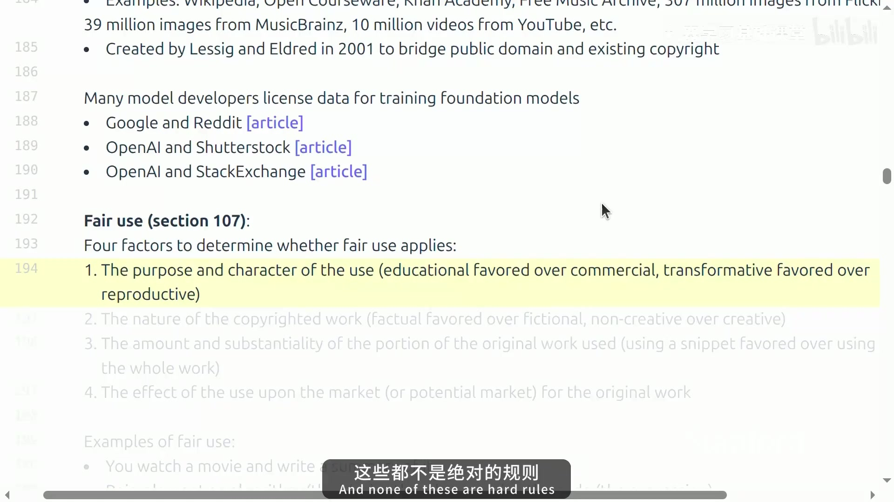

课堂随后用 NYT v. OpenAI、Bartz/Graeber 等 v. Anthropic、Kadrey/Silverman 等 v. Meta 说明：截至本讲时间点，判例只回答特定案件与特定事实，不能推出“所有模型训练都属于 fair use”的一般结论；获取训练材料时的 piracy 问题也需要与“训练行为本身是否构成 fair use”分开讨论。

## 4. Common Crawl：网页语料的基础设施

Common Crawl 是 2007 年成立的非营利组织。课件给出的 Spring 2026 量级是：大约每月一次 crawl，每次新增约 **3–5 billion webpages**；累计约 **300 billion pages**。April 2026 crawl 包含 **2.19 billion pages（372.2 TB）**。

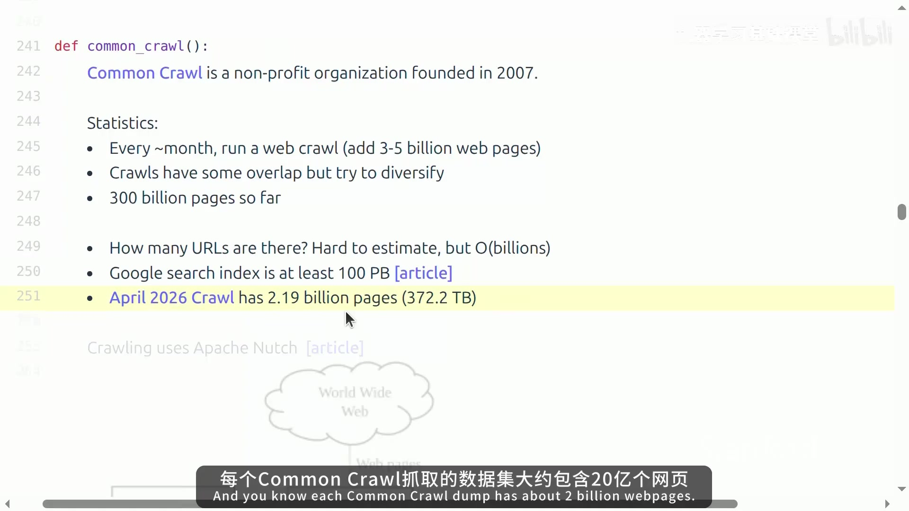

Crawler 不只是“把所有 URL 下载一遍”，还需要策略：

- **Selection policy**：抓哪些页面；
- **Politeness policy**：遵守 `robots.txt`，避免压垮服务器；
- **Re-visit policy**：多久检查一次内容变化；
- 处理大量动态 URL 和内容重复。

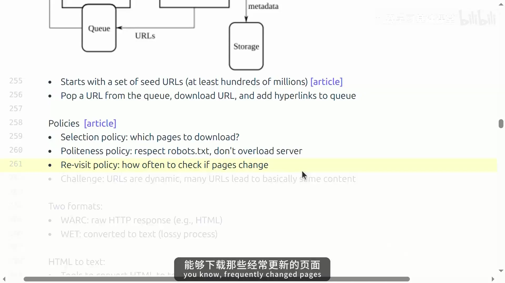

Common Crawl 常见两种格式：

- **WARC**：保留原始 HTTP response，例如 HTML；
- **WET**：把网页转成 text，体积更小，但这是 lossy conversion。

HTML-to-text 不是无关紧要的预处理。正文提取工具、噪声处理方式会改变最终 token distribution，并影响下游模型效果。因此后续很多数据集宁愿从 WARC 重新做 extraction，也不直接接受已有 WET 文本。

## 5. 三类专门数据源

### Wikipedia

Wikipedia 是高质量 general knowledge 的典型来源。课件给出的 May 2026 规模为 **67 million articles、361 language editions**。它有明确的 notability / no-original-research 等编辑规则，并定期提供 dumps，因此通常不需要自己 crawl。

课堂同时提醒：高质量来源也可能被污染。若攻击者在 dump 前短暂插入恶意内容，即使编辑随后回滚，已经生成的 dump 仍可能包含这些内容。

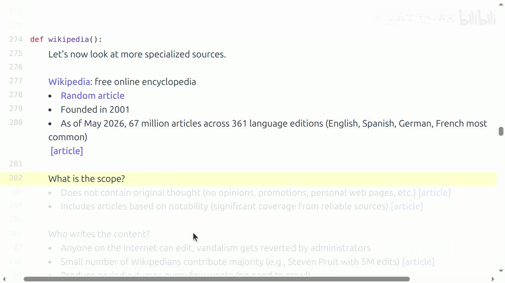

### GitHub

代码既直接服务编程任务，也常被认为对 reasoning 能力有帮助。课件给出的 May 2026 规模是 **420M+ repositories，其中约 28M public**。训练数据可分为两类：

- **Repository content**：应通过 Git protocol 获取，而不是抓 GitHub 网页；
- **Metadata**：issues、pull requests、comments 等可通过 GitHub API 或 event archives 获取。

公开 repository 也不等于自动拥有训练许可。课堂重点关注 MIT、Apache 等 permissive licenses，并在后面的 The Stack 中展示如何做 license detection。

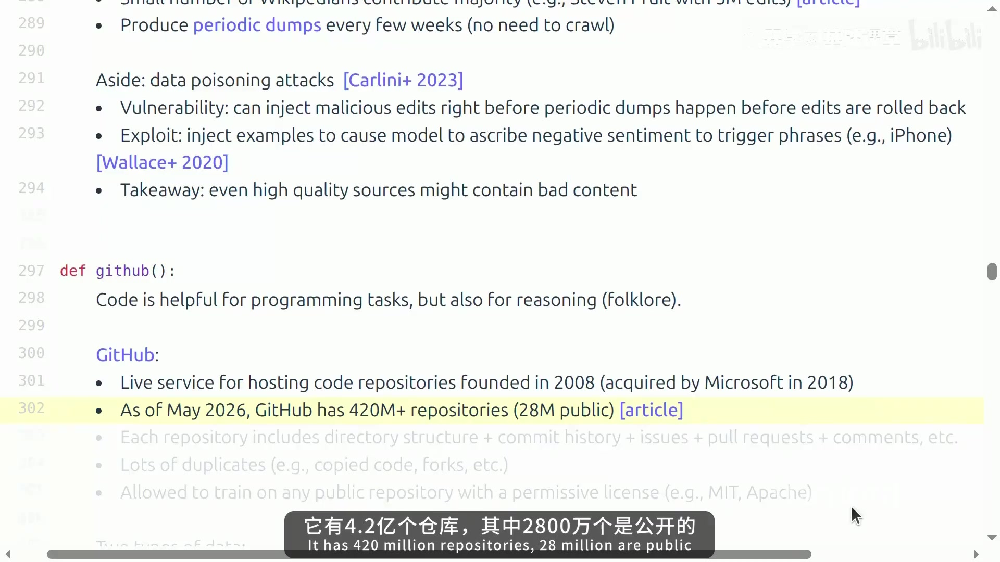

### arXiv

arXiv 约有 **3 million submissions**。一篇 submission 可以包含 metadata、PDF 和可选的 LaTeX source。metadata 使用宽松许可，但论文正文的许可由作者选择，因此不能把“arXiv 可下载”直接等同于“全部内容可任意训练”。arXiv 提供 bulk download，也不需要逐页 crawl。

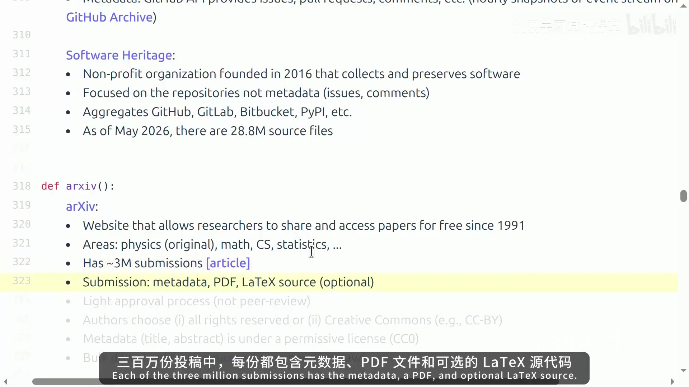

## 6. 公开训练数据集如何演进

下面按课堂顺序整理。重点是每一代数据集如何回答三个问题：**从哪里取数据、怎样过滤、最终留下多少**。

| 数据集 / 模型 | 主要来源与方法 | 课堂给出的规模或结果 |
| --- | --- | ---: |
| BERT | Wikipedia + BooksCorpus；强调 document-level sequence | BooksCorpus：7K books、985M words |
| GPT-2 WebText | Reddit posts 中 karma ≥ 3 的 outbound links 作为质量代理 | 8M pages、40GB text |
| CCNet | Common Crawl；paragraph dedup + fastText language ID + Wikipedia-like KenLM quality | 自动构建多语言高质量语料 |
| C4 | April 2019 Common Crawl；rule-based filtering + English language detection | 1.4T tokens → 806GB / 156B tokens |
| GPT-3 | processed Common Crawl + WebText2 + Books1/2 + Wikipedia；quality classifier + fuzzy dedup | 570GB / 400B tokens |
| The Pile | 22 个高质量 domains，混合 web、papers、books、code、Q&A 等 | 825GB / ~275B tokens |
| MassiveText / Gopher | 多源数据；manual quality rules、SafeSearch toxicity filtering、dedup | 10.5TB；Gopher 实际训练 300B tokens（约 12%） |
| LLaMA | CCNet-processed Common Crawl、C4、GitHub、Wikipedia、books、arXiv、Stack Exchange | 1.2T tokens |
| RefinedWeb | Common Crawl WARC → trafilatura → rules → MinHash dedup | released 600B of 5T tokens |
| FineWeb | 95 Common Crawl dumps；language ID、rules、MinHash、email/IP anonymization | 15T tokens |
| Dolma | Common Crawl + Reddit + papers + C4 + Gutenberg + Wikipedia 等 | 3T tokens |
| DCLM | 先构造 240T-token pool，再用 model-based quality classifier | 3.8T tokens |
| Nemotron-CC | 放宽过强过滤；classifier ensemble + synthetic rephrasing / task generation | 6.3T tokens，HQ subset 1.1T |
| The Stack | GitHub repositories；permissive license detection + near-dedup | 137M repos、51B files（5B unique）、3.1TB code |
| CommonPile | 只收集 permissively licensed data | 8TB |

### BERT → WebText：从“高质量来源”到“质量代理”

BERT 使用 Wikipedia 和 books。BooksCorpus 来自 Smashwords 上价格为 $0 的 self-published books；课件同时指出该语料后来因 ToS 问题下线。这里已经出现本讲反复强调的区分：数据集的技术价值和获取 provenance 必须分别记录。

GPT-2 的 WebText 则不直接定义“好网页长什么样”，而是借 Reddit 用户行为做 surrogate：只保留获得至少 3 karma 的帖子所指向的网页。OpenWebText 后来公开复现了这一思路，并加入 non-English filtering 与 near-dedup。

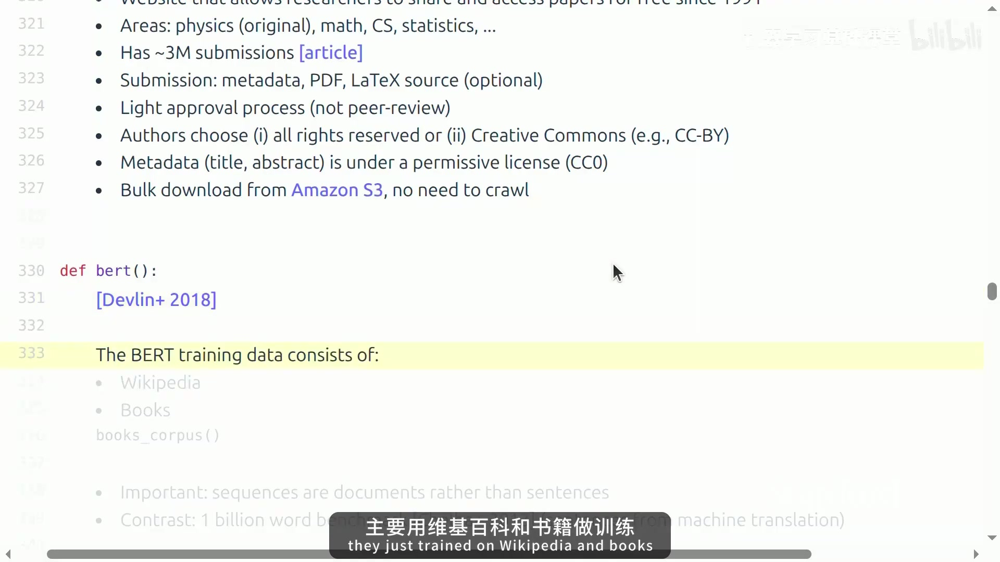

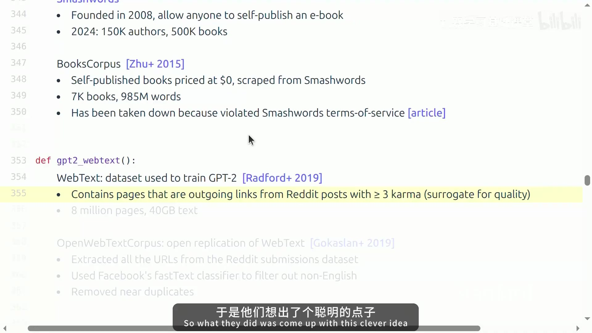

### CCNet 与 C4：Common Crawl 需要大幅清洗

CCNet 的典型 pipeline：

1. 轻量 normalization 后做 paragraph dedup；
2. fastText 做 language identification；
3. 用 Wikipedia 训练 KenLM 5-gram，保留更像 Wikipedia 的文档。

C4 选择 hand-written rules：句末标点、最少词数/句数、bad-word list、排除代码或模板化文本，再做 English language detection。April 2019 Common Crawl 的 **1.4T tokens** 最终缩到 **156B tokens**，说明原始网页规模与可用自然语言规模差距极大。

### GPT-3 与 The Pile：质量模型和多源混合

GPT-3 把 Common Crawl 与 WebText2、Books1/2、Wikipedia 混合，并训练 quality classifier 去区分高质量 reference sets 与普通网页，再做 fuzzy deduplication。

The Pile 则采取“很多高质量 domain 拼在一起”的策略，是 EleutherAI 的开放协作项目。来源包括 Pile-CC、PubMed Central、arXiv、Enron emails、Project Gutenberg、Books3、StackExchange 等。

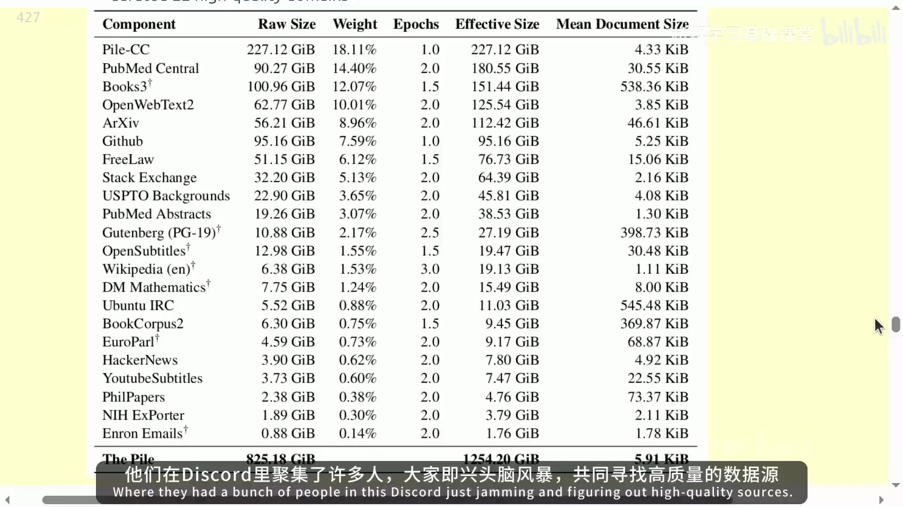

Books3 进一步说明 provenance 问题：它来自 shadow library Bibliotik，后来因版权争议下线。开放发布并不能消除上游来源的问题。

### MassiveText 与 LLaMA：规则过滤仍然有效

Gopher 的 MassiveText 对 MassiveWeb 使用 English filtering、dedup、train-test overlap 检查和人工规则，例如要求足够比例的 words 包含 alphabetic character；toxicity 使用 Google SafeSearch，而不是简单 bad-word list。完整数据约 **10.5TB**，Gopher 只训练了其中约 **300B tokens（12%）**。

LLaMA 的数据混合包含 CCNet-processed Common Crawl、C4、GitHub、Wikipedia、Project Gutenberg / Books3、arXiv、Stack Exchange，结果为 **1.2T tokens**。RedPajama v1 尝试复现这套 recipe，SlimPajama 再通过 MinHashLSH dedup 得到更小子集。

### RefinedWeb / FineWeb：web-only 路线

RefinedWeb 的核心主张是“web data is all you need”：从 WARC 重新用 trafilatura 做 HTML-to-text，使用 Gopher-style rules，并用 MinHash 对 5-grams 做 fuzzy dedup。它从约 5T tokens 中发布 600B。

FineWeb 从复现 RefinedWeb 出发，使用 95 个 Common Crawl dumps，加入 URL filtering、English probability threshold、更多规则、MinHash dedup，以及 email / public IP anonymization，最终得到 **15T tokens**。

### Dolma：透明的多源开放数据

Dolma 把 Common Crawl、Pushshift Reddit、Semantic Scholar papers、C4、Project Gutenberg、Wikipedia/Wikibooks 等来源组合起来。Common Crawl 部分使用 fastText language ID、Gopher/C4 rules、toxicity filtering 与 Bloom-filter dedup，最终约 **3T tokens**。

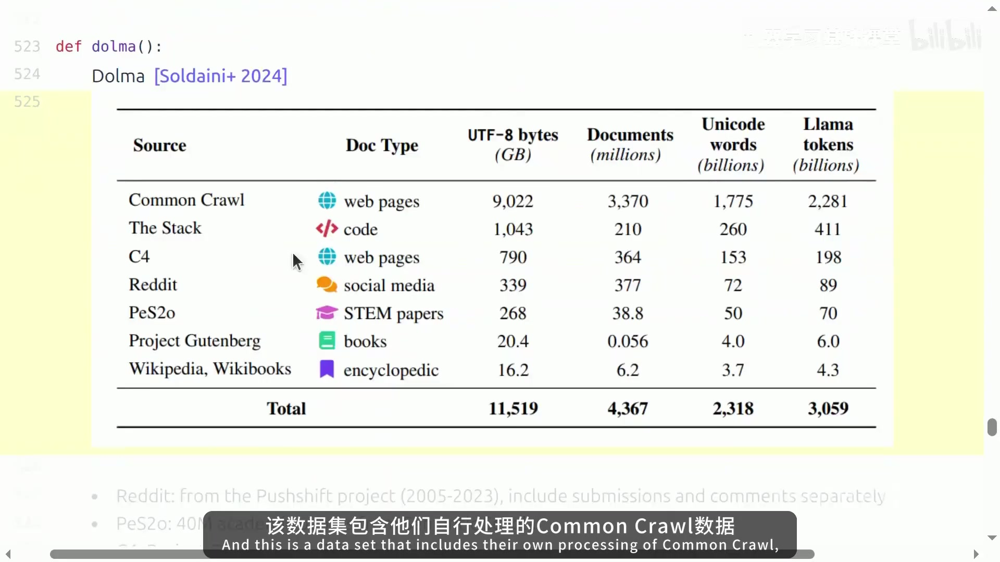

### DCLM：把 data filtering 变成可比较的 benchmark

DataComp-LM（DCLM）先构造 **240T-token DCLM-pool**，目标是让不同 data processing 方法在同一个原始池上比较。DCLM baseline 用 quality classifier 大幅过滤。

课堂特别强调 classifier 的训练数据：positive examples 来自 OpenHermes-2.5、ELI5 等，negative examples 来自 RefinedWeb。换言之，“quality”由 reference distribution 定义，并非天然属性。最终 baseline 约 **3.8T tokens**。

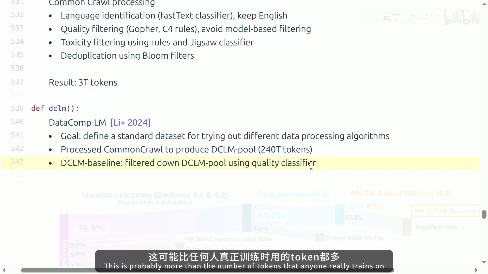

### Nemotron-CC：过滤太狠后，把规模加回来

Nemotron-CC 认为 FineWebEdu、DCLM 一类过滤器会删除约 90% 数据，因此尝试在维持质量的同时恢复 token 数量：

- ensemble educational-value scorer 与 DCLM classifier；
- 对低质量文本用 LM rephrase；
- 对高质量文本生成 QA、key-information extraction 等任务。

结果是 **6.3T tokens**，其中 HQ subset 为 **1.1T**。课堂拿 Llama 3 的 **15T** 与 Qwen3 的 **36T** 作为训练 token 规模参照，同时提醒这些数字可能包含重复采样，不能直接当成 unique corpus size。

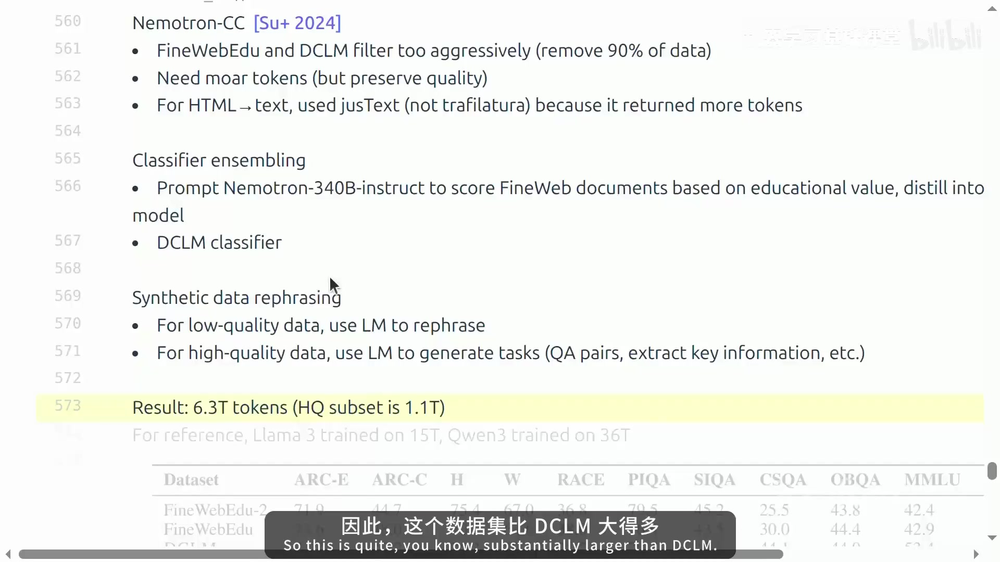

### The Stack / Stack v2：代码数据不仅是 source files

The Stack 从 GitHub Archive 获得 repository names，clone 约 **137M repositories**，涉及 **51B files（约 5B unique）**；用 `go-license-detector` 保留 MIT、Apache 等 permissive licenses，再用 MinHash / Jaccard 去 near-duplicates，得到约 **3.1TB code**。

Stack v2 扩大到：

- GitHub Archive 的 issues、comments、pull requests；
- Software Heritage repositories；
- PyPI、npm、devdocs.io 等文档；
- binary/malware/bot filtering、dedup、PII redaction；
- 用 LLVM 作为共享 intermediate language，帮助 low-resource programming languages；
- 将 pull request 的 structured object linearize 成 token sequence，并加入局部 source context。

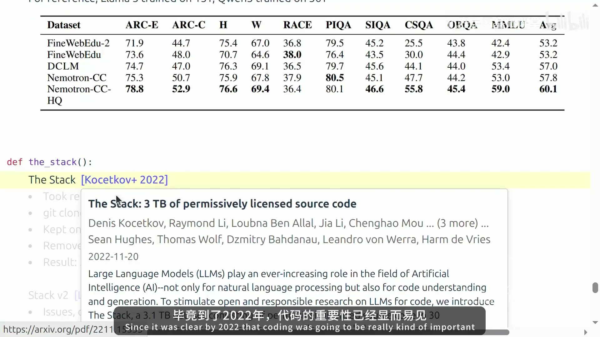

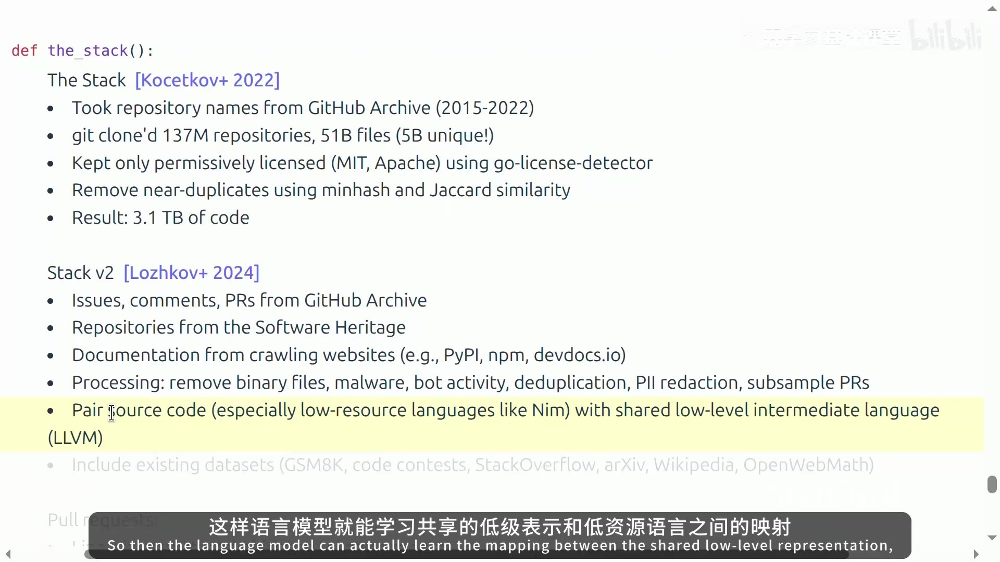

### CommonPile：只用 permissively licensed data 能走多远

CommonPile 直接研究一个限制更强的问题：只使用 permissively licensed data，能否训练出有竞争力的模型？该项目收集了约 **8TB** 数据。

困难不只在“有没有 license”：

- **License laundering**：上游把受版权保护内容重新标成宽松许可；
- **Collection license ≠ item license**：集合采用 ODC-By 等许可，不意味着其中每个文档都自动获得相同许可；
- **Synthetic provenance**：如果 synthetic data 来自使用未授权数据训练的模型，其许可边界仍不清晰。

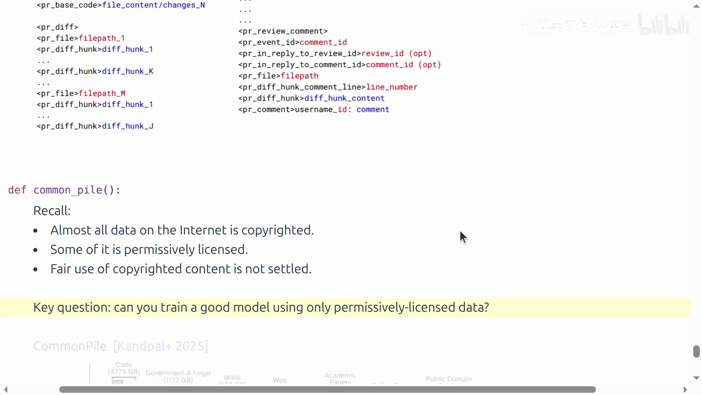

课堂结果显示，permissively licensed data 可以支撑有效训练，但在 token 数和最终效果上仍难完全追平使用更大、更广泛数据来源的模型。

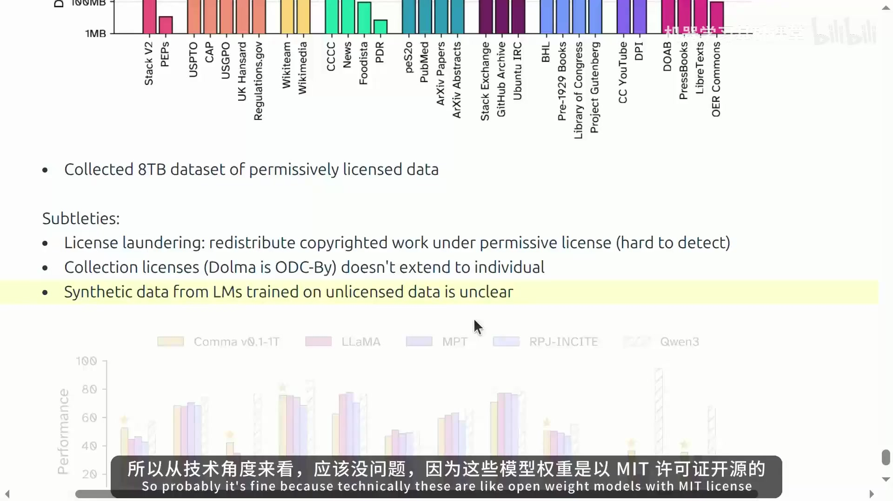

## 7. 贯穿全讲的数据 pipeline

本讲的数据流程可以写成：

```text
live service
    -> raw acquisition / crawl / dump / API / git
    -> extraction
    -> language identification
    -> filtering
    -> deduplication
    -> mixture / weighting
    -> tokenized training corpus
```

这条 pipeline 需要同时处理三个约束：

1. **Access / provenance**：能访问不等于能合法复制，更不等于适合训练。
2. **Quality definition**：rule-based filter、classifier、human curation 都在编码“什么算高质量”。
3. **Scale vs. quality**：过滤能提高平均质量，却可能把语料规模压得过小；DCLM 与 Nemotron-CC 正好展示了这组 trade-off。

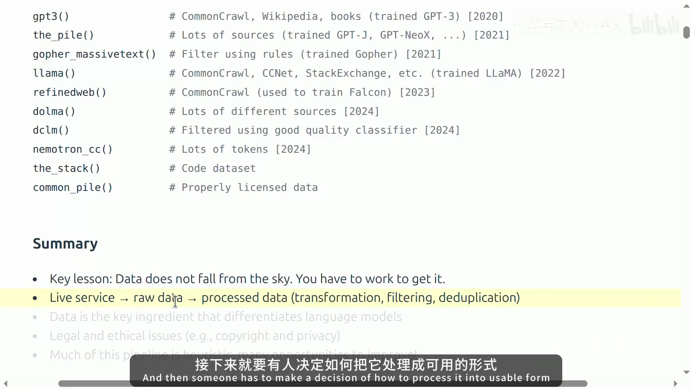

课程最后把这些问题连接到 **Assignment 4: Data**：作业要求实现数据过滤与处理，再用固定训练代码评估自己的数据 recipe。官方 schedule 在 Lecture 12 行发布 Assignment 4，本讲结尾明确再次提到它；因此它是本讲的相关作业，但不是“Lecture 13 专属 handout”。

## 8. 复习检查点

学完本讲后，应当能回答：

- 为什么 live website 不能直接当训练语料？crawler 和 bulk dump 分别解决什么问题？
- `robots.txt`、ToS、copyright、license、fair use 分别约束什么？哪些概念不能混为一谈？
- WARC 与 WET 有什么差异？为什么 HTML-to-text 会影响模型质量？
- CCNet、C4、DCLM 分别如何定义“高质量”？rule-based 与 model-based filtering 的偏差从哪里来？
- 为什么 DCLM 强调统一 data pool？为什么 Nemotron-CC 又要从“过强过滤”中恢复数据规模？
- The Stack 为什么需要 license detection、near-dedup、PII/malware filtering？Stack v2 为什么还要引入 issues、PRs 和文档？
- CommonPile 主要解决哪一类 provenance / licensing 问题？它与普通 filtering 有何不同？

## 配套资料与 provenance

- 课程主页与 Spring 2026 schedule：https://cs336.stanford.edu/
- Spring 2026 official lecture material：<https://github.com/stanford-cs336/lectures/blob/main/lecture_13.py>
- Stanford Online official recording：<https://www.youtube.com/watch?v=-qm0ln33G24>
- Assignment 4: Data：<https://github.com/stanford-cs336/assignment4-data>
- 本地视频来源说明（Bilibili 合集）：<https://www.bilibili.com/video/BV1msTD6CE6j>

本笔记的章节身份、标题、日期、授课教师与课件结构均以 Spring 2026 first-party sources 交叉核验；未使用其他学期资料补写本讲内容。本讲没有在官方 schedule / lecture page 上发现明确指定的 chapter-level paper 或 required reading，因此 `papers/` 不额外打包 PDF。
