---
workflow:
  name: ChatGPT-Web-Course-Note-Workflow
  version: v4.9.4
course:
  name: "CS336: Language Modeling from Scratch"
  term: "Spring 2026"
  instructors:
    - Tatsunori Hashimoto
    - Percy Liang
chapter:
  index: 14
  local_label: P14
  official_unit_label: Lecture
  official_unit_number: 14
  official_title: "Data (filtering, deduplication, mixing, synthetic data)"
  lecture_material_title: "Data II"
  date: "2026-05-13"
  instructor: Percy Liang
provenance:
  lecture_video_term: "Spring 2026"
  official_materials_term: "Spring 2026"
---

# Lecture 14 — Data II：Filtering、Deduplication、Mixing 与 Synthetic Data

本讲延续 Lecture 13 的数据主题。上一讲回答“数据从哪里来”：在线服务经过 dump / crawl，形成可处理的数据源，同时受 terms of service、copyright、license 与 fair use 等约束。本讲转向“拿到原始数据以后怎么把它变成训练数据”，主线是 **transformation → filtering → deduplication → mixing**，最后把同一套数据工程视角延伸到 mid-training / SFT 的 synthetic data。

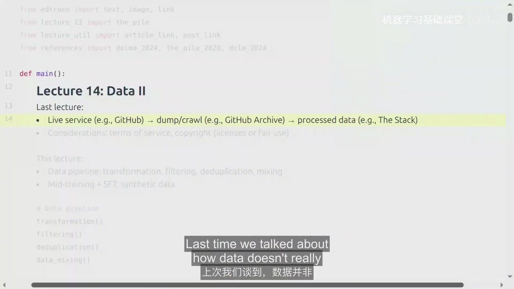

## 课程信息与配套资料

- 本地章节：`P14`
- 官方映射：Spring 2026 **Lecture 14**
- 日期：2026-05-13
- 授课：Percy Liang
- 官方标题：**Data (filtering, deduplication, mixing, synthetic data)**
- 官方课程页面：[CS336 Spring 2026](https://cs336.stanford.edu/)
- 本讲 executable lecture：[lecture_14.py](https://github.com/stanford-cs336/lectures/blob/main/lecture_14.py)
- 课程相关练习：[Assignment 4: Data](https://github.com/stanford-cs336/assignment4-data)。它要求把 raw Common Crawl 转成可用的 pretraining data，并做 filtering / deduplication；官方 schedule 在 Lecture 12 发布、Lecture 16 截止，因此这里把它作为本阶段相关课程作业，而不是“Lecture 14 专属作业”。

官方 schedule 的 Lecture 14 行没有标出 assigned / required reading，因此本包的 `papers/` 为空。正文中的论文链接用于理解课堂案例，不代表本讲要求阅读。

## 1. Transformation：原始数据首先不是“文本”

互联网数据通常以 HTML、PDF、代码仓库目录等形态存在。进入 language model 的 token stream 之前，第一步是把这些结构化或视觉化对象转换成线性文本。这个转换天然有信息损失：HTML 的层级、页面布局、图片、表格，PDF 的二维排版，都不可能无代价地压成一维字符序列。

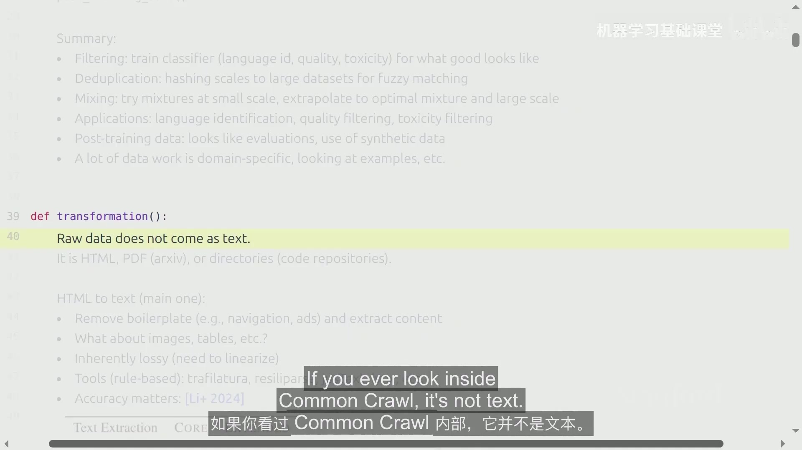

### 1.1 HTML → text

Web 数据最常见。典型处理包括：

- 去掉 navigation、广告、footer/header 等 boilerplate；
- 提取页面主体内容；
- 处理或放弃图片、表格等非纯文本结构；
- 将层级/视觉布局线性化；
- 用高吞吐的 rule-based 工具完成大规模转换，例如 `trafilatura`、`resiliparse`、`jusText`、`lynx`。

Extraction quality 会直接改变训练分布。规则系统即使只有小比例失败，乘上 web-scale 数据量后也会留下大量噪声。

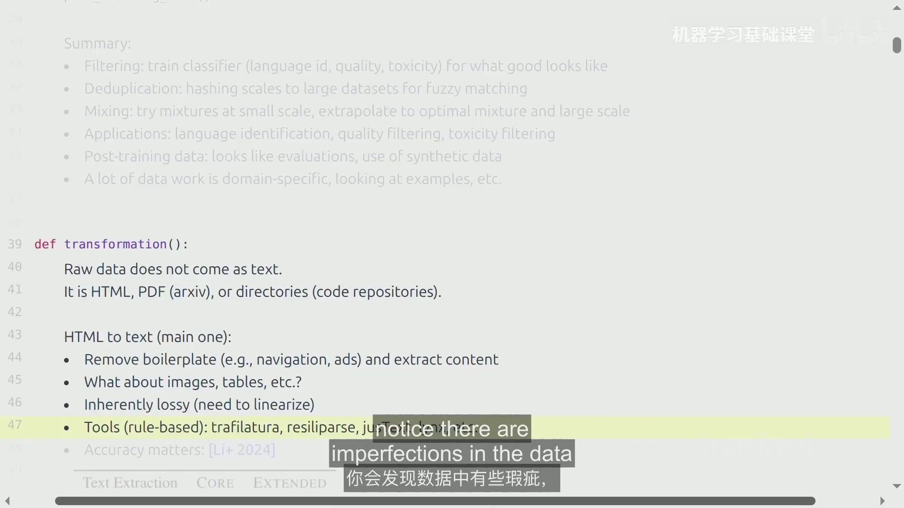

### 1.2 PDF：价值高，但处理成本更高

课堂以 FinePDFs 为例说明 PDF 的特殊性：Common Crawl 里有 PDF，但大文件可能被截断，因此需要 recrawl；随后还要把 PDF 的视觉内容恢复成文本。扫描 PDF 甚至本质上只是图片，需要 OCR。讲义提到 RolmOCR 这类 VLM-based OCR，以及 Docling 等工具。

PDF 的占比不一定高，但平均信息密度往往更高：作者愿意排成论文、报告或文档，通常意味着内容比随机网页更“有话要说”。代价是处理更贵，而且 PDF 本身强调 layout，抽成文本后语义结构仍可能丢失。

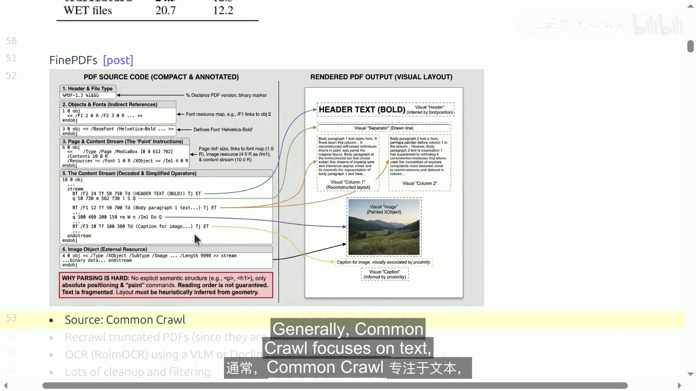

## 2. Filtering：从海量 raw data 中找“像目标数据”的子集

课堂把 filtering 抽象成一个统一问题：给定少量高质量 **target data** $T$ 和规模巨大的 **raw data** $R$，寻找 $R$ 的子集 $T'$，使 $T'$ 在我们关心的意义上更接近 $T$。

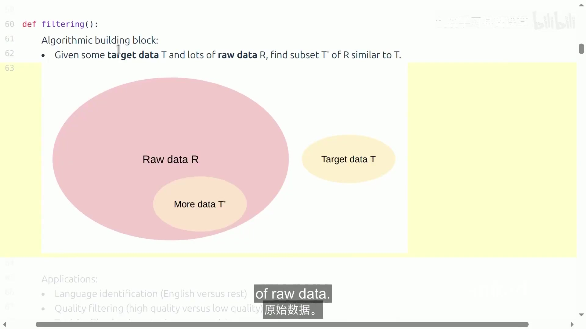

常见目标包括：

- **Language identification**：留下目标语言；
- **Quality filtering**：偏向高质量、信息丰富的文本；
- **Toxicity filtering**：去除不希望模型吸收的有害内容。

Filtering algorithm 有两个互相拉扯的要求：一方面要从 $T$ 泛化，不能只记住 $T$；另一方面必须极快，因为要扫过整个 $R$，规模可能达到几十万亿乃至更高数量级的 tokens。

### 2.1 统一的 scoring framework

最常见流程只有两步：

1. 用 $T$、$R$ 或两者训练/估计一个轻量模型，得到 scoring function；
2. 对 $R$ 中每个 example 打分，按阈值或随机策略保留。

两类经典 score：

- generative model（如 KenLM）：$\operatorname{score}(x)=p_T(x)$；
- discriminative classifier（如 fastText）：$\operatorname{score}(x)=p(T\mid x)$。

大模型并不是这里的默认工具。Filtering 位于数据管线前端，吞吐量本身就是算法约束，因此轻量 n-gram 或线性分类器经常比昂贵的 LLM 更合适。

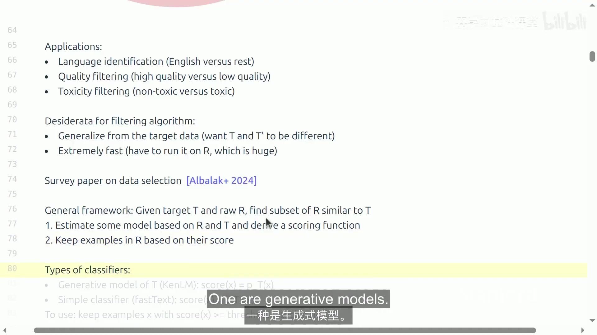

### 2.2 Language identification

fastText 的现成 language ID classifier 支持 176 种语言，训练数据包括 Wikipedia、Tatoeba、SETimes 等多语来源。Dolma 的例子是保留 $p(\text{English})\ge 0.5$ 的页面。

这类任务很适合轻量分类器：标签定义明确，推理必须跑在海量数据上，而且我们关心的是“足够好地筛掉不相关样本”，并不需要复杂生成能力。

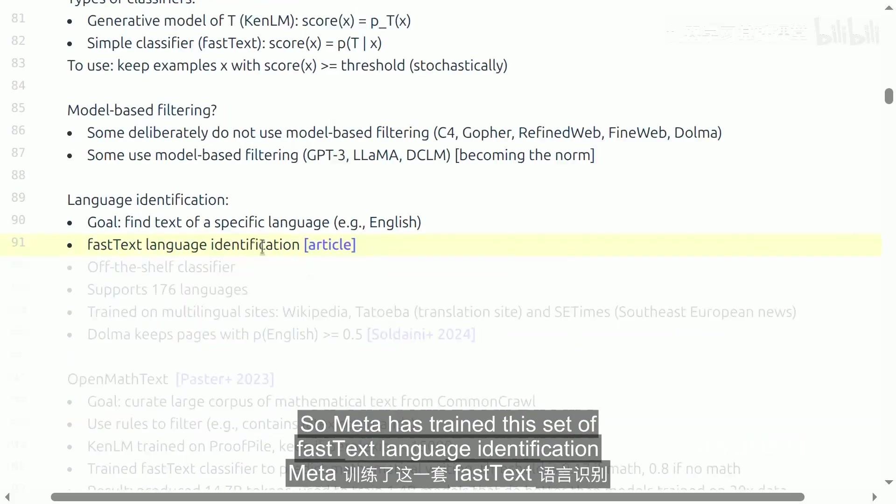

### 2.3 OpenMathText：把“数学味”变成可计算的分数

OpenMathText 从 Common Crawl 中构建数学语料，组合了多种信号：

- 规则：例如是否包含 LaTeX commands；
- KenLM：在 ProofPile 上训练，保留 perplexity $<15000$ 的文本；
- fastText：预测 mathematical writing；课堂材料列出的 threshold 为 math 类 0.17、non-math 类 0.8。

最终数据规模为 **14.7B tokens**。课堂强调的结果是：用这些数据训练的 **1.4B** 模型，可以优于使用约 **20×** 数据训练的对照模型。这组结果说明，在 compute 有限时，过滤掉低价值 token 能显著提高每个训练 FLOP 的收益。

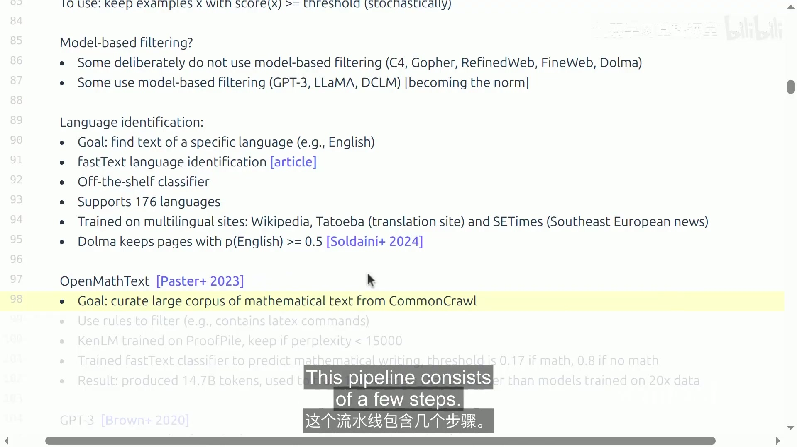

### 2.4 GPT-3、LLaMA/RedPajama、phi-1：target data 如何定义

不同数据集最本质的差异之一，是“什么算 positive example”。

**GPT-3** 的做法是：

- positive：Wikipedia、WebText2、Books1、Books2；
- negative：Common Crawl；
- 用 word features 训练线性分类器；
- 根据 classifier score 随机保留文档，而不是简单硬阈值。

**LLaMA / RedPajama** 使用另一种 positive 定义：被 Wikipedia 页面引用的网页；negative 仍来自 Common Crawl。它把“被百科条目引用”当作质量 proxy。

**phi-1** 进一步把强模型用于构造小规模 supervision，再让廉价模型跑全量数据：

> `determine its educational value for a student whose goal is to learn basic coding concepts`

流程是从 The Stack 的 Python subset 中取 100K 样本，用 GPT-4 按这个 prompt 标注教育价值，再用 pretrained CodeGen embedding 训练 random forest classifier，最后把 classifier 应用于更大的 raw set。

HumanEval 结果在课堂材料中是：

- 1.3B LM，直接用 The Stack Python subset：**12.19% after 96K steps**；
- 1.3B LM，用新的 filtered subset：**17.68% after 36K steps**。

这说明昂贵模型可以只用在“定义什么是好数据”的小样本阶段，web-scale 筛选仍交给轻量模型。

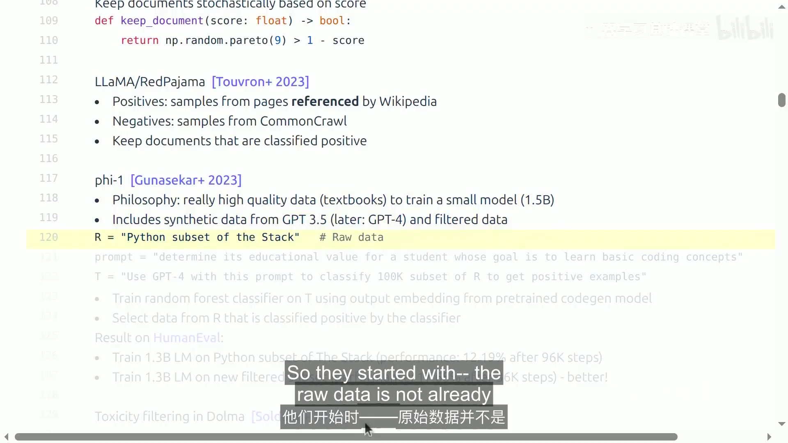

### 2.5 Toxicity filtering 与 scale-dependent threshold

Dolma 的 toxicity classifier 使用 2018 Jigsaw Toxic Comments 数据，标签包括 `toxic`、`severe_toxic`、`obscene`、`threat`、`insult`、`identity_hate`。这说明 filtering 不只服务于“质量”，也编码了数据集的内容边界。

更重要的是，**不存在与训练规模无关的唯一最优阈值**。如果训练 token budget 较小，宁可保留更少、更高质量的数据；训练更久时，过严过滤会让模型反复 epoch 少量高质量样本，此时适当放宽阈值反而更好。因此“质量分数”不能脱离 downstream training budget 单独优化。

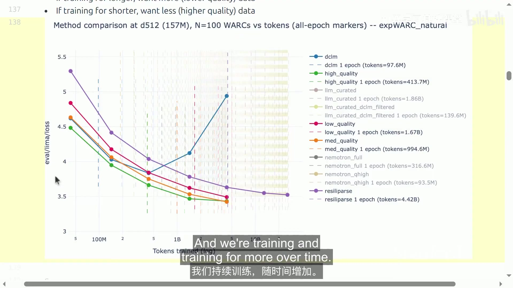

## 3. Deduplication：把重复暴露从训练分布里拿掉

重复数据分两类：

- **exact duplicates**：镜像站、GitHub forks、完全相同的文本；
- **near duplicates**：主体相同，只改了少量 token、格式或模板字段。

Near duplicate 很常见：license / terms of service、模板化文章、商品描述、格式变化后的复制文本都可能大量重复。课堂展示的一个 C4 例子中，同一段商品描述出现了 **61,036 次**。

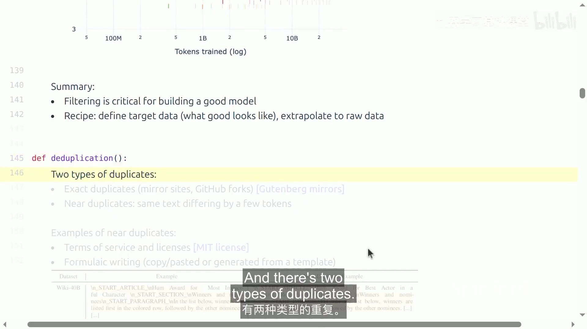

Dedup 的收益有两层：训练 token 更少，效率更高；同时减少 memorization，因而对版权与隐私风险也有帮助。设计一个 dedup system 时至少要明确三件事：

1. **item 是什么**：sentence、paragraph 还是 document？
2. **怎么判重**：exact match、共享子片段，还是相似度阈值？
3. **匹配后怎么处理**：全部删除，还是每个 group 留一个？

难点在规模：朴素 all-pairs comparison 是二次复杂度，web-scale 不可用，因此后面的方法都围绕“用 hash 把比较变得接近线性”展开。

### 3.1 Hash function 与 exact dedup

Hash 把大对象映射到小的 hash value。课堂区分：

- SHA-256 等 cryptographic hash：强调 collision resistance，代价较高；
- DJB2、MurmurHash、CityHash：更快，适合 hash table / 数据处理，但不提供密码学级碰撞保证。

课堂示例使用 MurmurHash。对

```text
["Hello!", "hello", "hello there", "hello", "hi", "bye"]
```

按 hash 排序、分组，每组只保留一个，就能在线性/排序可扩展的框架里完成 exact dedup。这种写法也很接近 MapReduce：map 出 hash key，按 key group，再 reduce 每组。

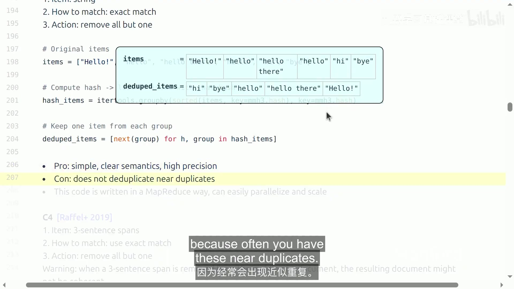

C4 的一个具体策略是把 **3-sentence spans** 当 item，exact match 后只留一个。但这也暴露了粒度问题：如果从文档中间删掉一个重复 span，剩余上下文可能不再连贯。

### 3.2 Jaccard similarity：先定义 near duplicate

对集合 $A,B$，Jaccard similarity 定义为

$$
J(A,B)=\frac{|A\cap B|}{|A\cup B|}.
$$

课堂示例：

$$
A=\{1,2,3,4\},\qquad B=\{1,2,3,5\},
$$

交集大小是 3，并集大小是 5，所以 $J(A,B)=3/5=0.6$。定义 near duplicate 后，可以规定 $J(A,B)$ 高于某个 threshold 就认为两者近似重复。

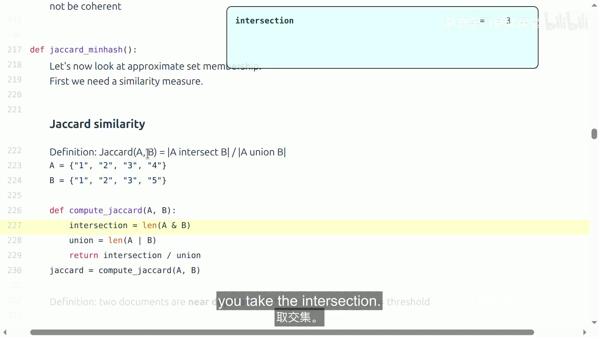

问题仍然存在：如果要显式计算每对文档的 Jaccard，复杂度仍是 $O(N^2)$。

### 3.3 MinHash：让碰撞概率等于 Jaccard

MinHash 的关键性质是

$$
\Pr[h(A)=h(B)] = J(A,B).
$$

直觉来自 characteristic matrix。把 universe 中的元素按随机 hash 产生的顺序看成随机 permutation，$A$ 和 $B$ 的 MinHash 就是各自第一个出现的元素。若第一个落在交集里，两者相同；若先落在只属于一侧的元素上，两者不同。因此 collision probability 恰好等于交集占并集的比例。

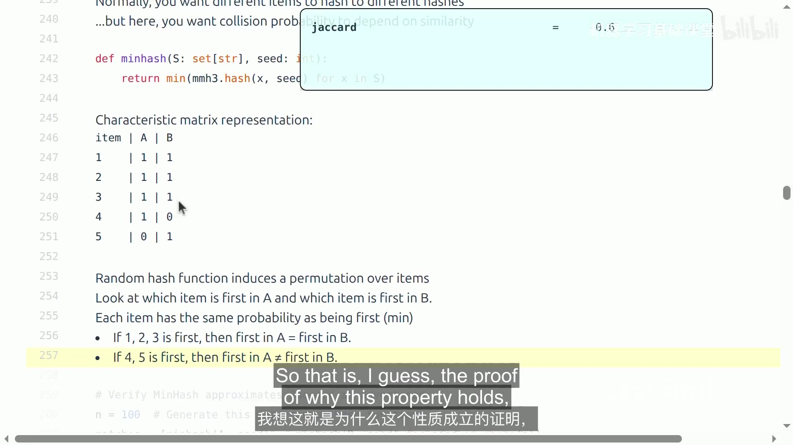

用多个独立 MinHash 可以估计 Jaccard，但“发生一次碰撞”仍然不是一个锋利的 near-duplicate threshold。需要 LSH 把概率曲线变陡。

### 3.4 Locality-Sensitive Hashing：用 AND-OR 结构制造阈值

设总共有 $n=b\times r$ 个 MinHash，分成 $b$ 个 bands，每个 band 有 $r$ 个 hash。规则是：**只要存在某个 band，使该 band 内所有 $r$ 个 hash 都相同，就把两项视为 candidate pair。**

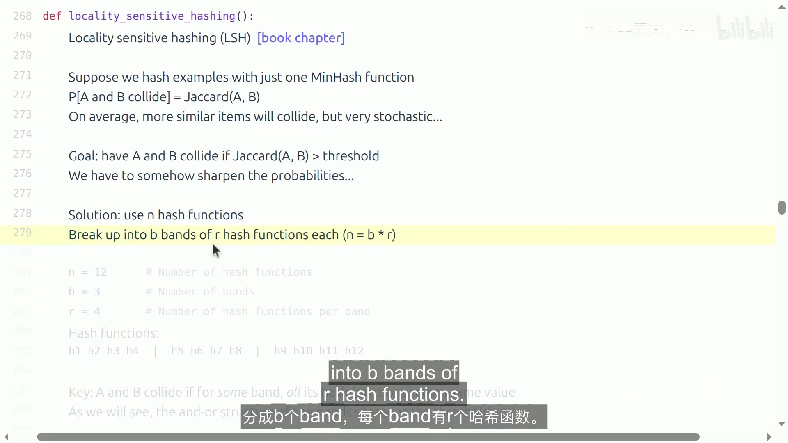

若两项 Jaccard similarity 为 $s$：

- 一个固定 band 全部匹配的概率：$s^r$；
- 至少一个 band 匹配的概率：

$$
P(\text{collision})=1-(1-s^r)^b.
$$

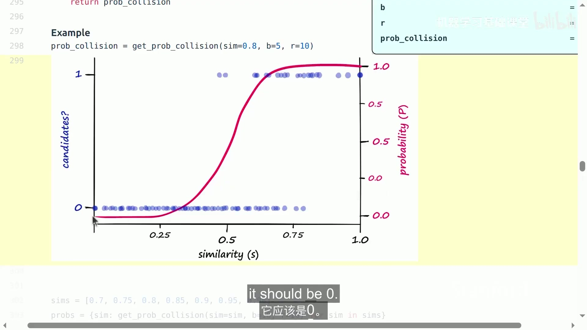

参数控制很直观：

- 增大 $r$：要求一个 band 内更多 hash 同时匹配，曲线更陡、向右移动，更难成为 candidate；
- 增大 $b$：给更多“至少一个 band 命中”的机会，曲线向左移动，更容易成为 candidate。

课堂给出的一个实际设置是 $n=9000,b=20,r=450$。相变附近的近似 threshold 写成

$$
\left(\frac{1}{b}\right)^{1/r}.
$$

在该点，一个固定 band 的 match probability 是 $1/b$，整体 collision probability 为

$$
1-\left(1-\frac{1}{b}\right)^b\approx 1-\frac{1}{e}.
$$

这套方法把“模糊相似度”转换成可用 hash table / distributed grouping 实现的 candidate generation，因此能把 near-dedup 推到大规模数据集。

## 4. Data mixing：决定训练时到底看多少来自每个 source 的 token

即使每个 source 都已经清洗好，训练时仍要决定 mixture。设 sources 为 Wikipedia、Common Crawl、GitHub，一个例子可以是

$$
p(\text{Wikipedia})=0.3,\quad p(\text{CC})=0.5,\quad p(\text{GitHub})=0.2.
$$

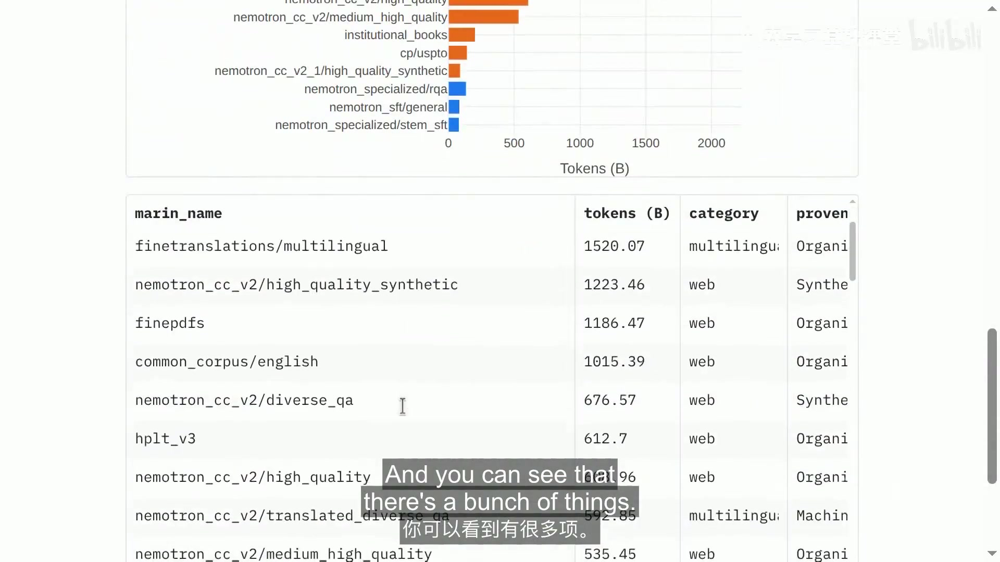

基础策略包括：

- **manual / vibes**：凭经验定权重，实际很常见；
- **uniform**：$p(s)\propto 1$；
- **proportional**：$p(s)\propto \operatorname{num\_tokens}(s)$。

直觉上应该 upweight 高质量 source，但 mixture 同时受 **diversity** 和 **source size** 限制。一个很小的高质量 source 权重过大时，会被重复 epoch，最终过拟合。

### 4.1 Epoching 是 mixing 的隐藏约束

对 source $s$，如果训练总 token 数为 $N_{\text{train}}$，source 本身有 $N_s$ 个 tokens，mixture 权重为 $p(s)$，其有效 epoch 数约为

$$
\operatorname{epochs}(s)=\frac{p(s)N_{\text{train}}}{N_s}.
$$

课堂例子：

- low-quality but abundant：10T tokens；
- high-quality but scarce：10B tokens；
- 总训练量：1T tokens；
- 两个 source 都取 $p=0.5$。

于是 abundant source 只走 **0.05 epoch**，scarce source 却要走 **50 epochs**。这就是为什么“质量高就一直加权”会失败。

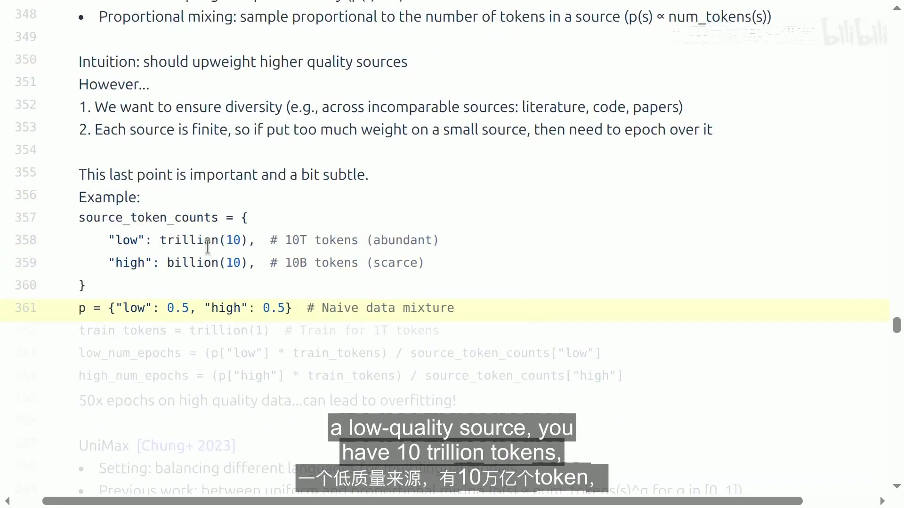

### 4.2 UniMax：给小 source 的重复次数加 cap

UniMax 的背景是 multilingual data balancing。之前常用

$$
p(s)\propto \operatorname{num\_tokens}(s)^\alpha,\qquad \alpha\in[0,1],
$$

在 uniform 与 proportional 之间插值。UniMax 的核心想法是从 uniform 倾向出发，但给每个 source 的 epoch 数设置硬上限 $C$。这样既不会完全被最大语种/最大 source 吞没，也避免对小 source 无限重复。

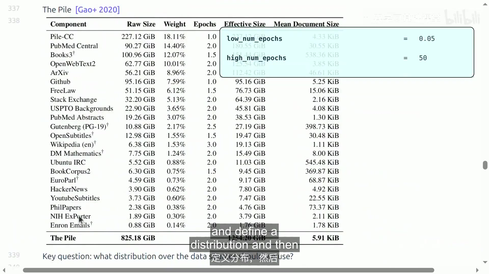

### 4.3 Regression-based mixing：把 mixture selection 当成小规模优化问题

另一条路线是在小模型、小 token budget 上试很多 mixture，然后拟合“mixture $\rightarrow$ downstream loss/performance”的 surrogate：

1. 从 mixture distribution 中采样多组 $p$，例如 Dirichlet；
2. 在较小规模训练；
3. 用 linear regression、gradient boosted trees 等拟合 mixture 与目标指标；
4. 找预测最优 mixture，再把它外推到大规模训练。

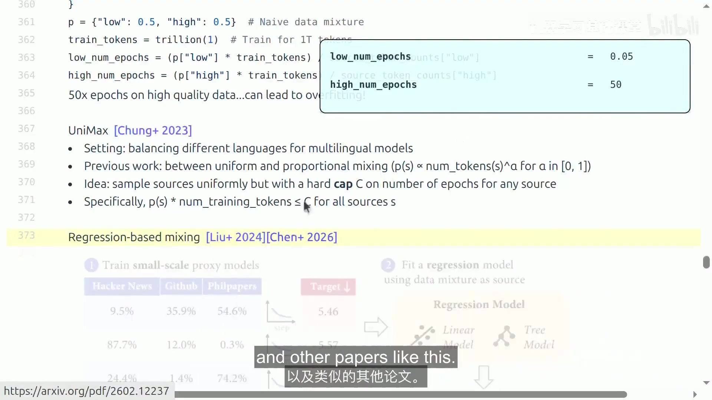

这和 scaling laws 的思路相似，但有两个强假设：regression model 在 minimizer 附近要足够准确；小规模最优 mixture 要能迁移到大规模。第二个假设尤其容易被 epoching 破坏。

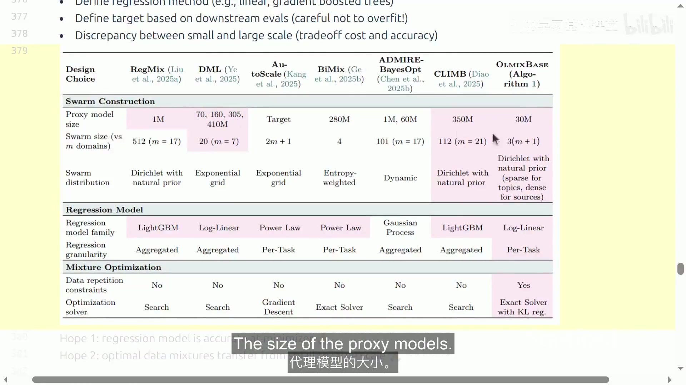

### 4.4 Simulated epoching：让小实验提前暴露大规模的重复问题

如果小实验只训练很少 tokens，小 source 看起来不会重复太多，因此它可能得到过高权重；直接把这个 mixture 放大到 1T-token run 时，才发现小 source 被 epoch 数十次。

Simulated epoching 的做法是让 small-scale experiment 在数据可用量上模拟 large-scale run。课堂例子：small run 10B tokens、large run 1T tokens，比例为

$$
\frac{10\text{B}}{1\text{T}}=0.01.
$$

把所有 source 的可用 token 数也按 0.01 下采样，某个 mixture 如果在大训练中会严重 epoch 小 source，那么在小实验中同样会很快重复。这样筛出来的最优 mixture 通常更平衡。

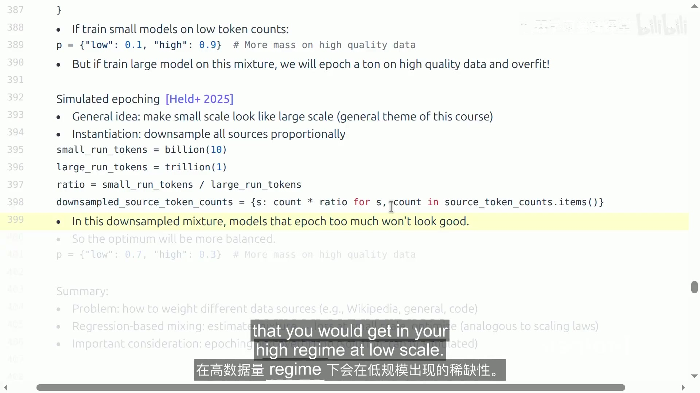

## 5. Post-training data：synthetic data 也可以看成一条数据管线

最后一部分把视角从 pretraining 扩展到 mid-training / SFT。课堂给出一个通用 recipe：

1. 定义 environments；
2. 定义 tasks / prompts；
3. 让强 teacher model 生成 responses。

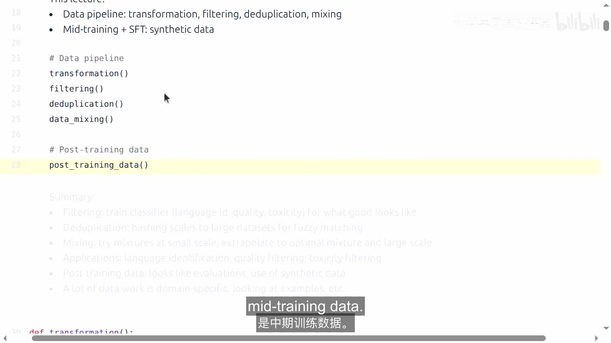

这里的“数据工程”不再只是 crawl 后清洗文本，而是设计环境、任务生成方式、teacher、采样策略和 filtering。任务越接近软件工程这类有状态环境，基础设施成本越明显。

### 5.1 OpenThoughts：teacher quality 不等于模型榜单能力

OpenThoughts 的课堂数据点：

- **1.2M** examples；
- teacher 为 **QwQ-32B**；
- questions 来自 **27** 个 human / synthetic sources，例如 StackExchange、NuminaMath、Chemistry；
- 每个 prompt 采样多次，课堂材料给出的数量是 **16 responses**；
- QwQ-32B 作为 teacher 的效果优于 DeepSeek-R1，说明“更强的 solver”不自动等于“更好的 teacher”；
- answer filtering 在这个实验里没有帮助；
- 小而高质量的数据源（如 OpenMath-2-Math）可优于更大、更杂的来源。

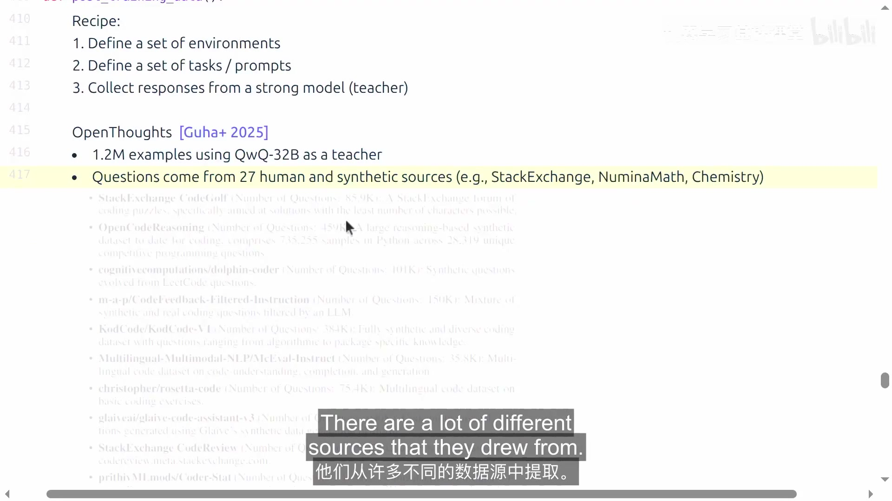

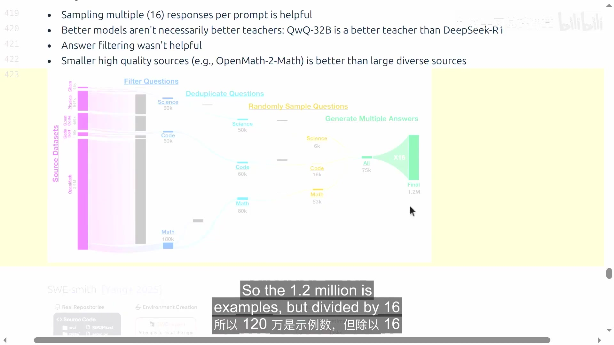

### 5.2 SWE-smith：real environment + synthetic task

SWE-smith 采用 semi-synthetic 路线：环境是真实 repository，task 由 LM 自动生成，例如引入 bug 再要求修复。课堂材料给出的规模是 **128 GitHub repositories → 50K tasks**。

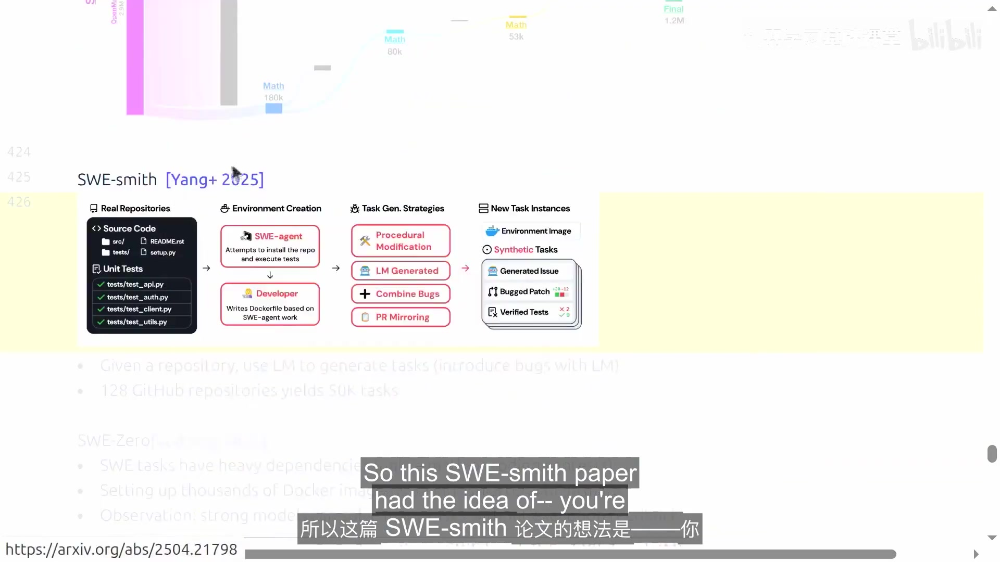

这种模式比纯数学题麻烦，因为 repository 有依赖、build system、tests 和历史状态；但真实代码环境让任务分布更接近实际软件工程。

### 5.3 SWE-Zero：用强模型的代码“world model”减少环境依赖

SWE task 的主要成本之一是执行环境。大量历史 repository 甚至无法直接安装；为每个 task 构造可复现 Docker image 会很贵。SWE-Zero 的观察是：强代码模型在没有 execution feedback 时仍能解决相当一部分任务，说明模型内部已经学到不少代码语义。

课堂材料列出：

- **300K** 不要求 repository-specific execution 的 agent trajectories；
- 基于 **150K GitHub PRs**；
- 使用 OpenHands scaffold；
- 删除未来 git commits，防止 agent 通过历史信息“git hacking”；
- 从 **Qwen3-Coder-480B** distill，并过滤仍试图执行代码的 trajectory；
- 另有 **SWE-Hero: 13K** 需要 execution feedback 的 trajectories。

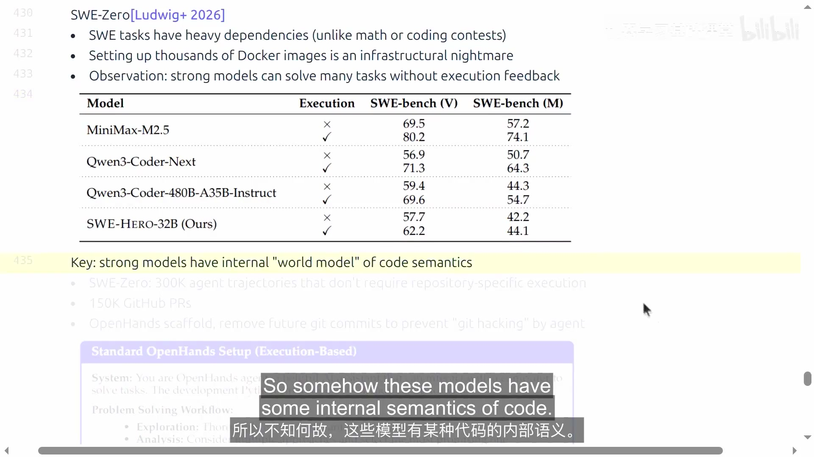

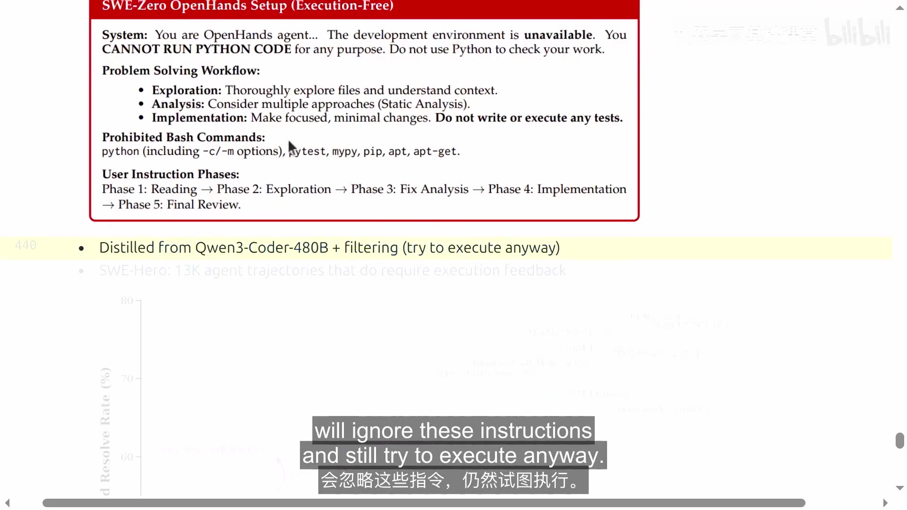

### 5.4 SWE-rebench 与 SWE-ZERO-12M：继续扩大真实 PR 驱动的数据规模

SWE-rebench 把真实仓库/PR 管线进一步规模化：

- **21K** interactive Python SWE tasks；
- 来自 **3.4K GitHub repositories**；
- 输入包含 **450K PRs**，来源包括 GitHub 与 GitHub Archive；
- 用 **Qwen 2.5-72B-Instruct** 辅助安装 dependencies、评估 PR quality。

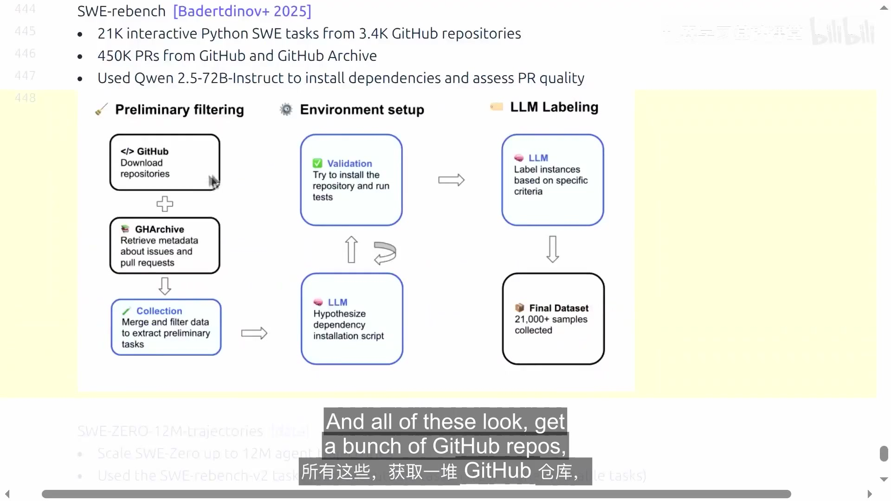

随后 SWE-ZERO-12M-trajectories 把 SWE-Zero 扩到 **12M agent trajectories**，使用 SWE-rebench-v2 tasks：**32K executable + 120K nonexecutable**。课堂材料还列出 mini-coder-1.7b，指标为 **50.4 pass@100**，配合 mini-swe-agent scaffold。

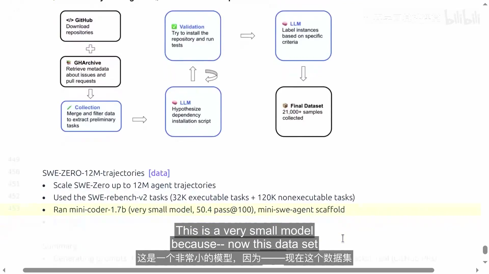

## 6. 把本讲串起来

本讲可以压缩成五个工程问题：

1. **Transformation**：原始对象怎样变成可训练的线性文本？这里先决定信息会丢掉什么。
2. **Filtering**：怎样定义“好数据”，再用足够便宜的模型把这个定义推广到 web-scale raw data？
3. **Deduplication**：怎样用 hash、MinHash、LSH 在近线性规模下控制重复暴露与 memorization？
4. **Mixing**：怎样在 quality、diversity、source size 与 epoching 之间选择训练分布？小规模最优不一定能直接放大。
5. **Synthetic post-training data**：怎样定义 environments、tasks 和 teacher response，使生成数据既可规模化又保持任务真实性？

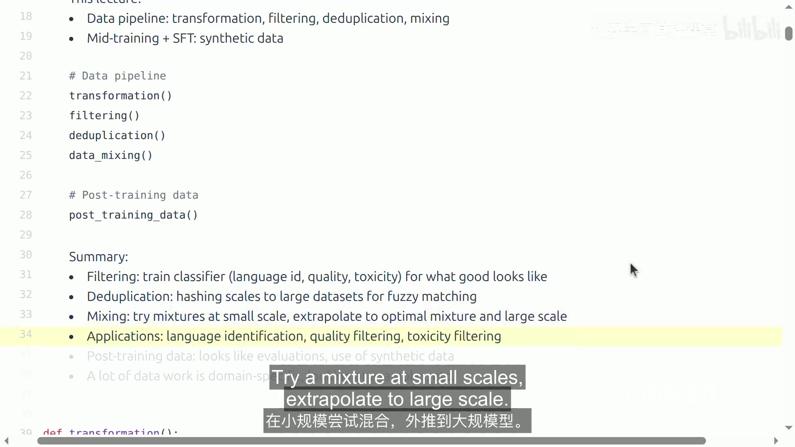

贯穿全讲的结论是：**数据质量不能脱离训练系统单独理解。** Filtering threshold 取决于训练 token budget，mixing 取决于 source size 与 epoching，synthetic data 的价值又取决于 teacher、environment、task construction 和 filtering。可扩展的数据工程需要把数据选择与后续训练行为放在同一个系统里考虑。
