---
workflow:
  name: ChatGPT-Web-Course-Note-Workflow
  version: v4.9.4
course:
  name: "CS336: Language Modeling from Scratch"
  term: Spring 2026
  instructor:
    - Tatsunori Hashimoto
    - Percy Liang
chapter:
  index: 15
  local_label: P15
  official_unit_label: Lecture
  official_unit_number: 15
  official_title: "Mid/post-training (SFT/RLHF)"
  date: 2026-05-18
  lecturer: Tatsunori Hashimoto
provenance:
  lecture_video_term: Spring 2026
  official_materials_term: Spring 2026
---

# Lecture 15：Mid/post-training（SFT / RLHF）

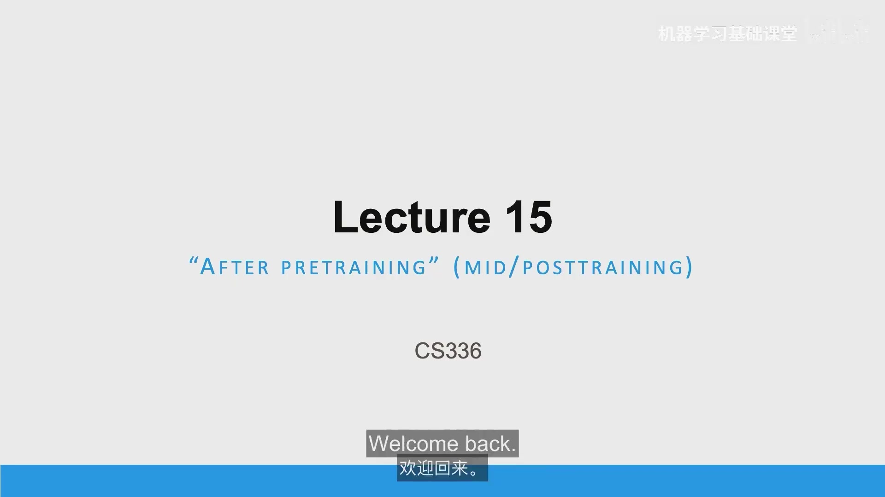

本讲讨论预训练之后如何把一个“有能力”的 base language model 变成行为更可控、能遵循指令、符合偏好与安全约束的系统。主线可以压缩为三步：先用 supervised fine-tuning（SFT）模仿目标行为，再收集偏好/奖励信号，最后用 RLHF 一类方法直接优化这些信号。课程后半进一步比较 PPO 与 DPO，并强调 post-training 本身会引入新的失真：偏好数据的偏差、长度/风格效应、reward overoptimization，以及 mode collapse 与校准退化。

## 配套资料与来源

- 课程主页与 Spring 2026 Schedule：https://cs336.stanford.edu/
- Spring 2026 官方 Lecture 15 slides：https://github.com/stanford-cs336/lectures/blob/main/lecture_15.pdf
- Spring 2026 官方 lecture materials repository：https://github.com/stanford-cs336/lectures
- Stanford Online 同版本录像：https://www.youtube.com/watch?v=2oH6PWPrYFo
- 本笔记的视频主证据来自本地 P15 Spring 2026 录像与其字幕。开场画面明确写有 `Lecture 15` 和 `"AFTER PRETRAINING" (MID/POSTTRAINING)`，并与官方 Schedule 中 2026-05-18 的 `Mid/post-training (SFT/RLHF) [Tatsu]` 对应。
- 官方 Schedule 未为 Lecture 15 单独列出 assigned paper/reading；因此本包 `papers/` 为空。Lecture 16 才进入 RLVR，并发布 Assignment 5，不并入本讲。

下文以实际课堂讲授为主。对于包含大量小字、表格或论文截图的页面，正文提取其教学结论；完整 1920×1080 原始帧保存在 `assets/coverage/`，便于回看细节。

## 1. 从 pretraining 到可控行为

前半门课的主问题是怎样把语言建模做大、做快、做对：tokenization、architecture、kernels、parallelism、scaling、inference、data 等。到这里，问题发生了变化：预训练得到的模型已经包含大量能力，但它的输出分布未必符合“用户希望它做什么”。Post-training 要解决的是控制问题。

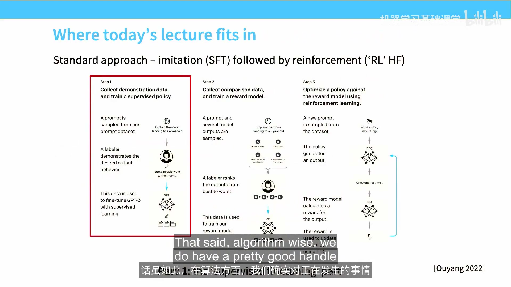

课堂把目标表述得很直接：希望对 LM 输出施加更紧、更可靠的控制。为此需要回答三个问题：

1. 想要的行为数据长什么样？
2. 应怎样利用这些数据？
3. 达到好的 post-training 效果是否需要很大的数据量和算力？

现代 post-training 的公开细节远少于 pretraining，很多关键 recipe 只能从旧论文、开源复现、模型技术报告和经验性做法中间接还原。因此，本讲侧重建立分析框架，不把公开资料归纳成一份“唯一正确”的工业配方。

## 2. SFT：先模仿我们想要的行为

SFT 的结构很简单：准备输入 $x$ 与目标输出 $y$，然后继续用 next-token likelihood 训练模型，让模型模仿目标分布。课程强调，optimizer 很常规，主要难点在训练数据。

### 2.1 SFT 数据如何演化

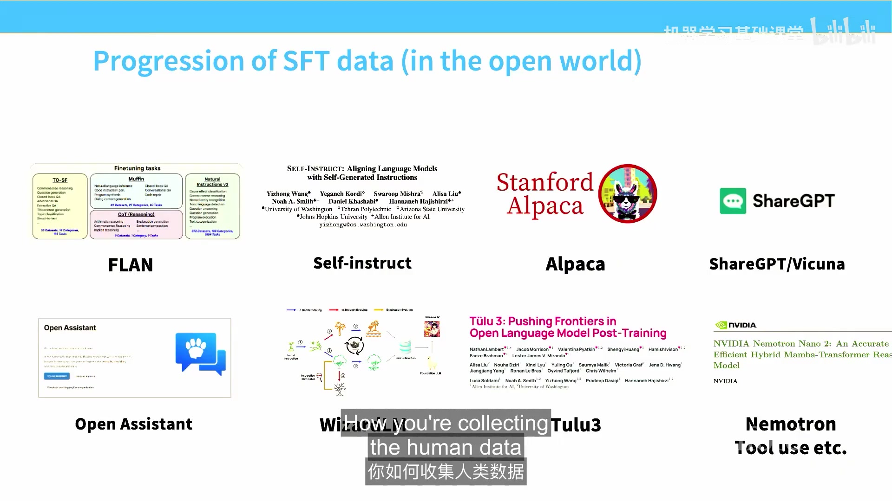

开放世界的 instruction-tuning 数据大致经历了下面的演化：

- **FLAN / task mixtures**：把大量已有 NLP task 转写成 instruction + answer 的格式，任务类型丰富，但与自然聊天式 assistant 的交互仍有明显差异。
- **Self-Instruct / Alpaca**：用模型自动生成 instruction-response 对，快速扩大 instruction 数据规模。
- **OpenAssistant / ShareGPT / Vicuna 一类数据**：更多真实或类真实的多轮对话，回答更长、更自然，也带来质量控制、隐私和来源可靠性等问题。
- **Tulu / Nemotron 等后续 recipe**：数据 mixture 更复杂，开始显式覆盖 reasoning、coding、安全、style 等维度。
- **Tool use / agent data**：数据不再只是普通自然语言问答，还需要表达函数调用、结构化参数和工具反馈。

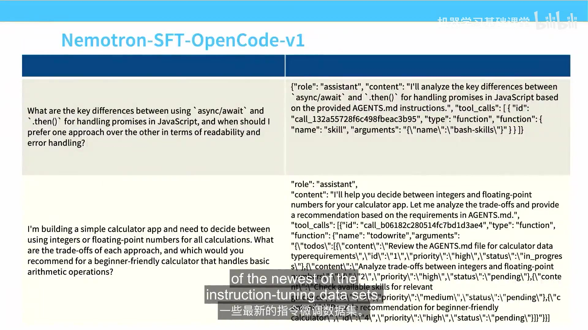

这些数据集之间变化的并不只是“质量”。课堂反复提醒要观察更具体的轴：输出长度、是否偏好列表、语气和 chattiness、是否包含复杂知识与引用、是否会使用工具、是否覆盖安全行为等。SFT 数据定义了模型在很多“软行为”上的默认值。

### 2.2 Preference evaluation 很容易被 style 影响

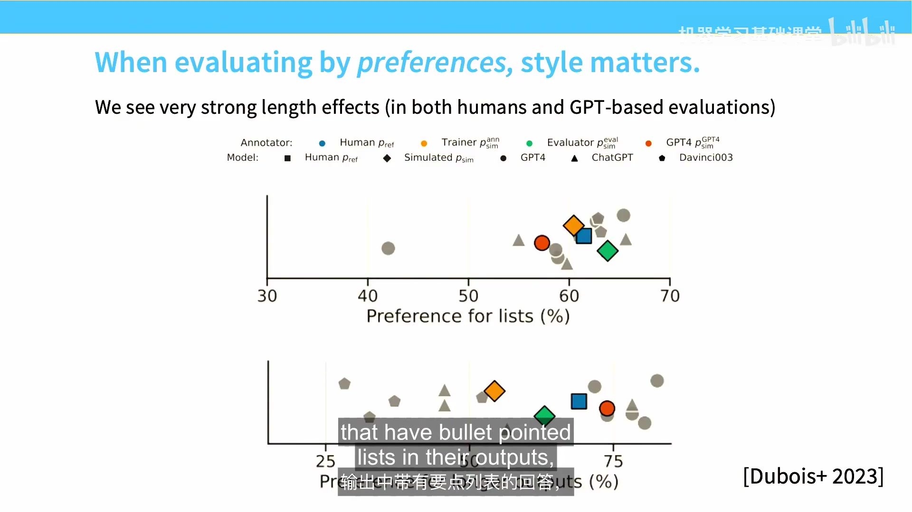

一个很容易忽略的现象是：人类偏好或 LLM-as-a-judge 的 preference score 会显著受到 style 影响。更长、更有结构、更多 bullet points 的答案，经常更容易赢得 pairwise preference；但这并不意味着它们在数学、知识、代码等独立 benchmark 上同样更强。

因此，看到“偏好胜率提高”时不能自动推断“模型能力提高”。至少要拆开两类变化：

- **capability change**：模型确实更会解题、更准确、更有知识；
- **presentation/style change**：模型更符合 evaluator 的表达偏好。

这一区分在后面的 RLHF 中会更加重要，因为 reward model 本身也可能把长度、语气和格式当作捷径。

### 2.3 SFT 不等于给模型灌入新知识

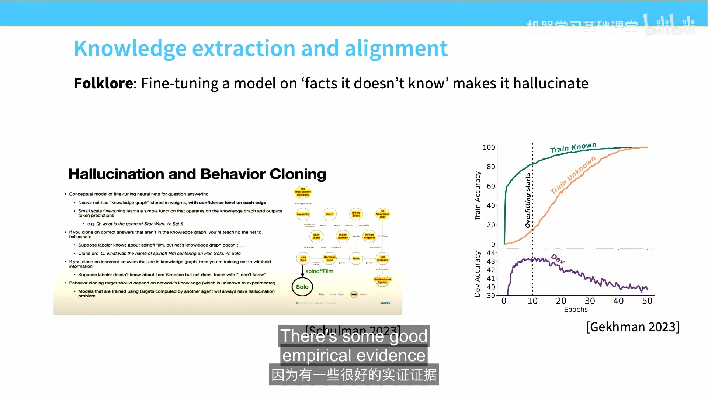

课堂用带引用、带专业知识的 instruction data 说明了一个反直觉点：fine-tuning 可以非常有效地教会模型“怎样输出某种形式”，但如果底层模型本来并不知道相关事实，强行让它复现这些形式可能只得到 behavior cloning，不能保证可靠的知识获取。

例如，训练样本可以教会模型生成像论文回答一样的引用格式，但模型未必知道这些引用是否真实、是否支持当前结论。课程给出的经验性 takeaway 是：

1. 不要默认用 SFT 去注入长尾事实知识；
2. 对“正确/错误”可验证的任务，显式 correctness feedback 可能比单纯模仿更合适；
3. LM 中知识的存储、提取与 post-training 行为之间关系复杂，不能用“把正确文本放进训练集”来简化理解。

## 3. Safety SFT：少量定向数据也能明显改变行为

安全 post-training 是 SFT 的一个直接用例：通过定向数据，让模型在诈骗、恶意请求、误导性内容等情境下采取期望行为，例如拒绝、改写或给出安全替代方案。

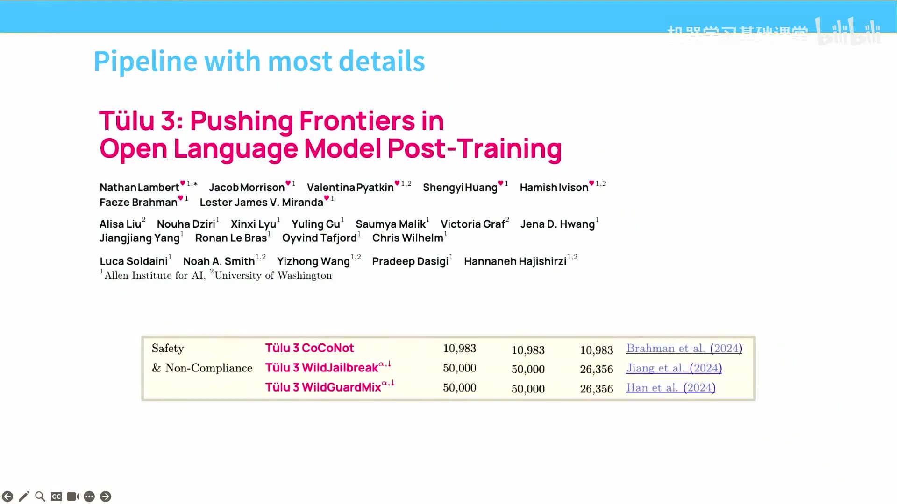

公开 recipe 的常见思路，是先从真实或接近真实的用户交互中抽取高风险/边界场景，再为这些场景构造目标行为。课堂展示的开源例子包括 Tulu 3 相关 pipeline，以及 CoCoNot、WildJailbreak、WildGuardMix 一类安全数据来源。

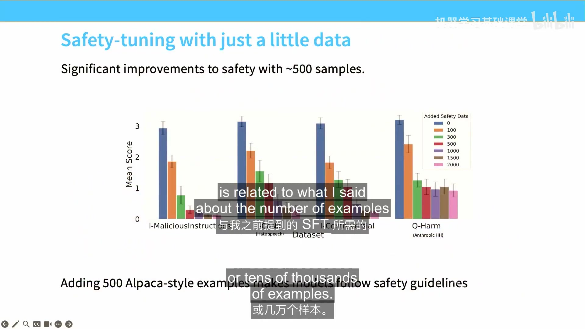

一个重要观察是：安全行为往往对少量定向数据非常敏感。课件展示的实验中，大约 **500 个** safety samples 就能产生明显改进。这与前面的总主题一致：如果目标行为已经潜伏在 pretrained model 中，SFT 的作用更像“把某类行为调出来”，所需数据可能远小于预训练阶段。

课堂对 SFT 数据的阶段性总结是：

- SFT 最擅长抽取/强化模型已有的能力与行为；对模型原本不知道的事实，可靠注入能力有限；
- 即使训练文本事实正确，加入不合适的数据也可能伤害结果；
- safety、instruction following、style 等行为只需少量高针对性数据就可能大幅变化；
- 但复杂行为仍存在长尾，更多覆盖仍然有价值。

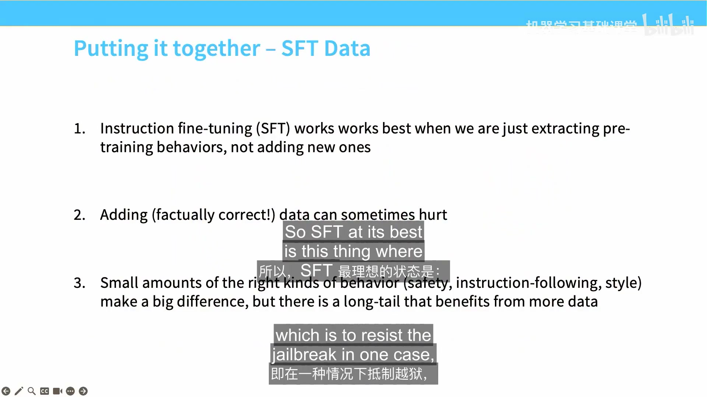

## 4. Fine-tuning 本身并不神秘

算法层面，最基本的 SFT 就是常规 gradient descent。课堂给出的代码片段几乎就是标准 PyTorch training loop：

```python
from tqdm.auto import tqdm

progress_bar = tqdm(range(num_training_steps))

model.train()
for epoch in range(num_epochs):
    for batch in train_dataloader:
        batch = {k: v.to(device) for k, v in batch.items()}
        outputs = model(**batch)
        loss = outputs.loss
        loss.backward()

        optimizer.step()
        lr_scheduler.step()
        optimizer.zero_grad()
        progress_bar.update(1)
```

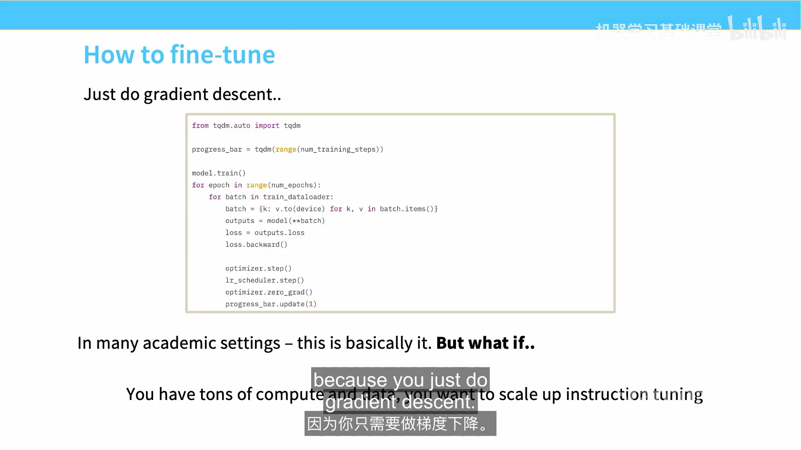

如果 instruction data 很少，这基本就足够了。进入大规模训练后，pretraining 与 post-training 的边界开始模糊：可以在预训练后段修改 data mixture，把更高质量、更多 instruction-style 数据提前混进去，最后再做一次短的 instruction tuning。

## 5. Midtraining / two-phase training：pretraining 与 post-training 的边界变模糊

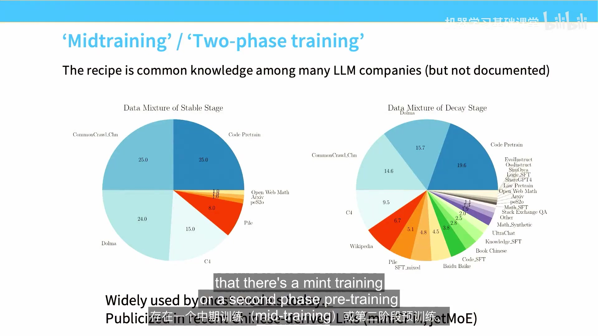

所谓 **midtraining** 或 **two-phase training**，核心操作是在训练后段改变数据分布。典型思路是：

1. 先按常规大规模 pretraining mixture 训练；
2. 在训练后段切换或显著重加权数据 mixture，引入更高质量、更接近 instruction 的数据；
3. 再做一个相对短的 SFT/post-training 阶段。

这说明“pretraining 完成 → post-training 开始”并不一定存在严格边界。工业模型的训练 pipeline 往往把 data curation、late-stage mixture、instruction data 和短 SFT 连成一个连续过程。课程也强调，这些做法公开文档有限，实际 recipe 仍高度依赖实验与经验。

## 6. 从 imitation 到 optimization：为什么需要 RLHF

SFT 属于 imitation。给定参考数据分布 $p^*(y\mid x)$，训练希望模型分布 $p_\theta(y\mid x)$ 接近它：

$$
p_\theta(y\mid x) \approx p^*(y\mid x).
$$

RLHF 则把问题改写成优化：只要我们能定义或学习出 reward $R(y,x)$，就可以直接寻找高 reward 的 policy：

$$
\max_p\; \mathbb{E}_{y\sim p(y\mid x)}[R(y,x)].
$$

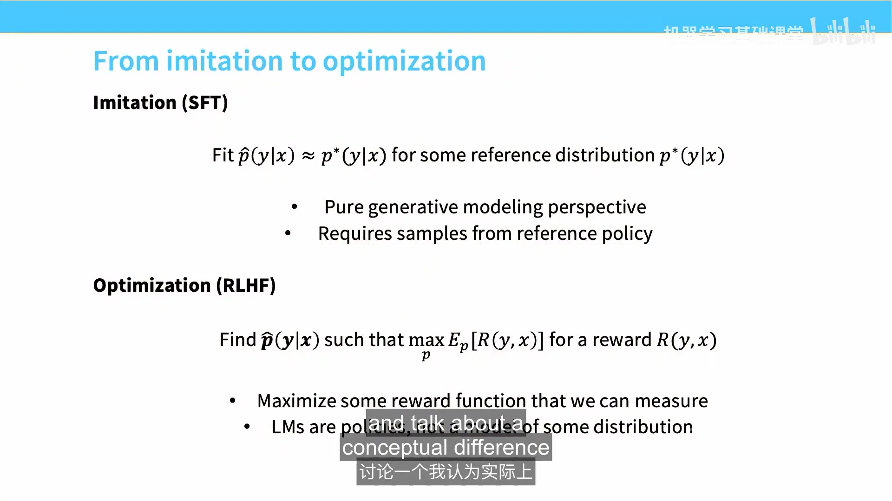

### 6.1 Generation-verification gap

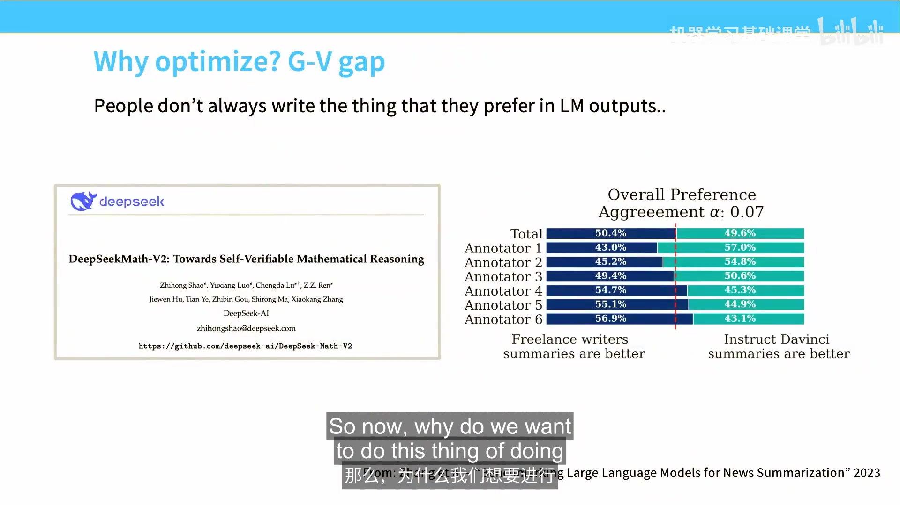

RLHF 的一个关键动机是 **generation-verification gap**：人可能很难亲自写出最好的答案，但比较两个候选答案时，却能更可靠地判断哪个更好。

这让训练信号发生变化：不必要求标注者从零生成 ideal response，而可以让模型先生成多个候选，再让人类或其他 evaluator 做 pairwise comparison。只要“判断好坏”比“自己生成最好答案”容易，就可以利用这个 gap 获得更强的优化信号。

## 7. RLHF data：偏好数据本身就是系统的一部分

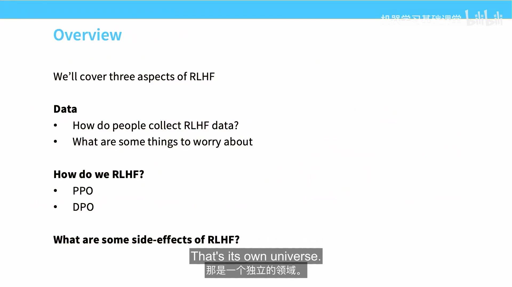

经典 RLHF pipeline 可以概括为：

1. 先得到 SFT policy；
2. 对 prompt 生成多个回答；
3. 收集 pairwise preference，例如 $y_w \succ y_l$；
4. 训练 reward model，或直接使用偏好 loss；
5. 优化 policy。

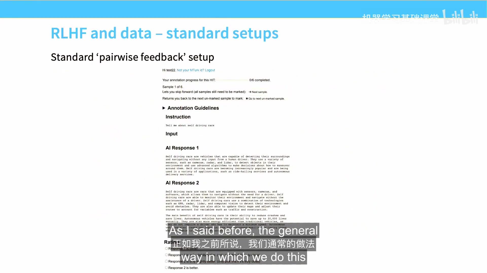

第 3 步往往最难。标注者需要理解 guideline、判断 factuality/helpfulness/safety/style 等多个维度，还要面对大量没有唯一答案的主观任务。即使 annotation guideline 写得很详细，也不能消除数据噪声与定义歧义。

### 7.1 Annotator distribution 会改变模型

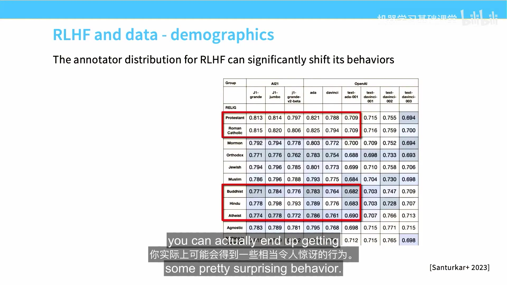

现代大规模标注平台上的 worker distribution 不能视为“所有用户”的随机样本。年龄、教育、语言、地域、专业背景、报酬和任务熟悉度都会改变 preference labels。RLHF 实际优化的是**某个采样和管理流程产生的偏好数据**。

课堂进一步指出，不同 annotator group 对错误类型、主观 style、风险偏好等维度可能有系统性差异。即使收集很多标签，也不能自动消除这种结构性差异。

Crowdsourcing 的难点也包含流程与伦理问题：高质量任务需要验证 worker 的专业性与实际检查行为；AI-assisted annotation 可能污染本应由人完成的判断；不同项目的 compensation 差异很大；大规模标注本身还涉及劳动条件与责任分配。它们都会反馈到最终数据质量。

### 7.2 AI feedback 与 self-training

当 frontier model 已经具有较好的评判能力时，feedback 也可以部分由模型生成。课堂展示的 benchmark 中，GPT-4 的 pairwise feedback 已接近所示 human inter-annotator agreement 水平。这说明 **model-based evaluator 已经足够强，可以成为 post-training data pipeline 的组成部分。**

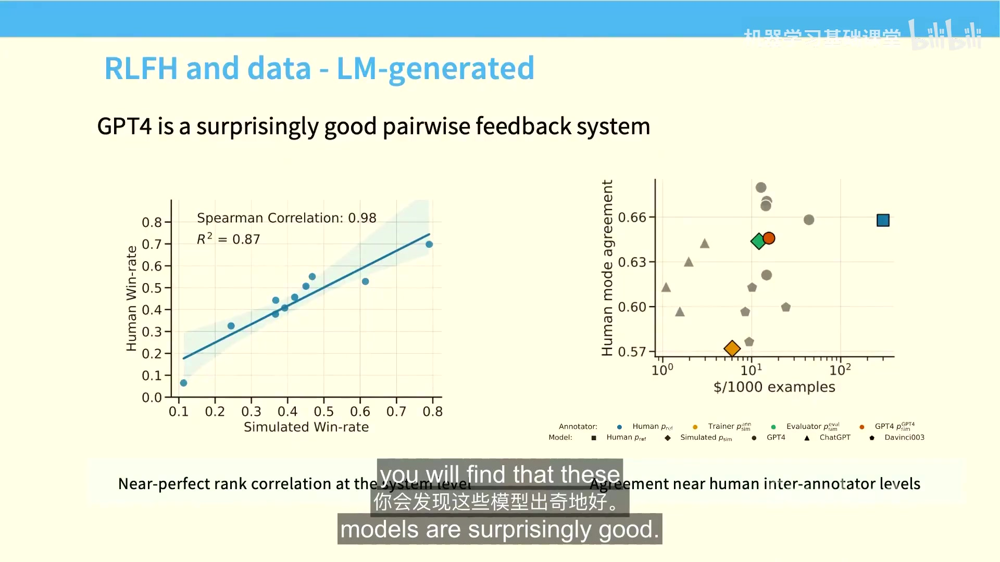

这进一步导向 self-training / Constitutional-AI-style pipeline：让模型生成回答，再 critique / revise，或者由更强模型给出 preference，再把这些结果用于下一轮 fine-tuning 或 RL。

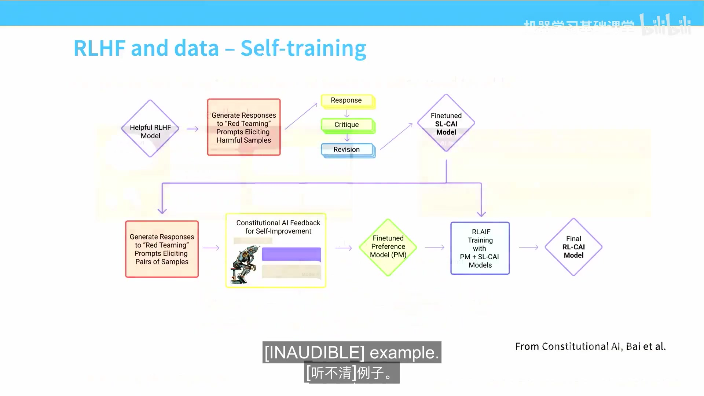

风险也同样明显：如果 evaluator 有系统性偏好，例如偏爱更长、更正式的回答，模型会把这种偏好进一步放大。RLHF 中常见的 length effect 就是这种 reward shortcut 的例子。

## 8. PPO：在 reward 与 policy drift 之间做约束优化

早期 RLHF 的主流做法是 PPO。对语言模型而言，一个典型目标是在提高 reward 的同时，用 KL penalty 限制新 policy 偏离 SFT/reference model 太远：

$$
\max_{\pi_\theta}\; \mathbb{E}_{x,y\sim\pi_\theta}[r_\phi(x,y)]
- \beta\,D_{\mathrm{KL}}\!\left[\pi_\theta(y\mid x)\,\|\,\pi_{\mathrm{ref}}(y\mid x)\right].
$$

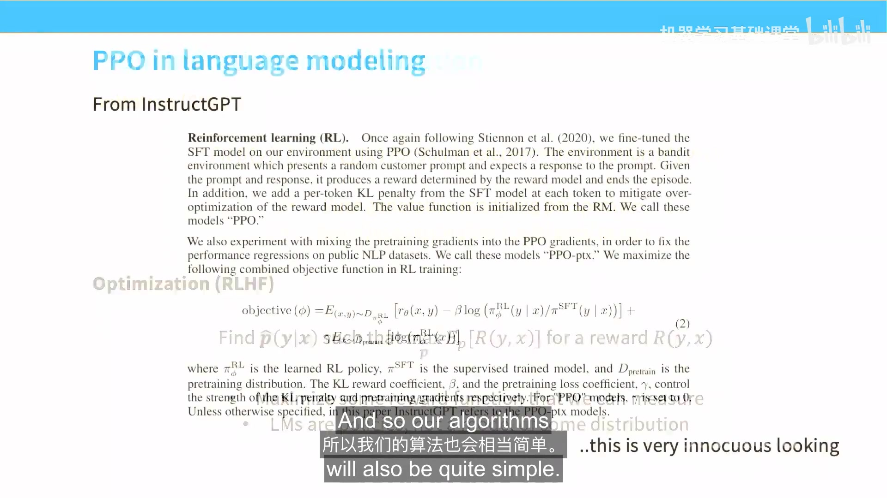

KL regularization 有两个作用：一是防止 policy 为了 reward 走到训练分布之外；二是降低 reward model 缺陷被极端利用的风险。InstructGPT 一类实现还会把 pretraining gradients 混入 RL 更新，以减轻能力退化。

### 8.1 从 policy gradient 到 PPO

基本 policy-gradient identity 是：

$$
\nabla_\theta \mathbb{E}_{z\sim p_\theta}[R(z)]
= \mathbb{E}_{z\sim p_\theta}\!\left[R(z)\nabla_\theta\log p_\theta(z)\right].
$$

问题是直接使用它方差很大，更新也可能过猛。TRPO 的思路是：在当前 policy 附近做近似优化，并显式限制 KL 距离；PPO 则进一步用 clipped probability ratio，把单次更新限制在一个较小范围内。课程把这条演化概括为：

- policy gradient：概念简单，但 variance 大；
- TRPO：通过 trust region / KL constraint 控制更新；
- PPO：用 clipping 得到更容易实现的近似。

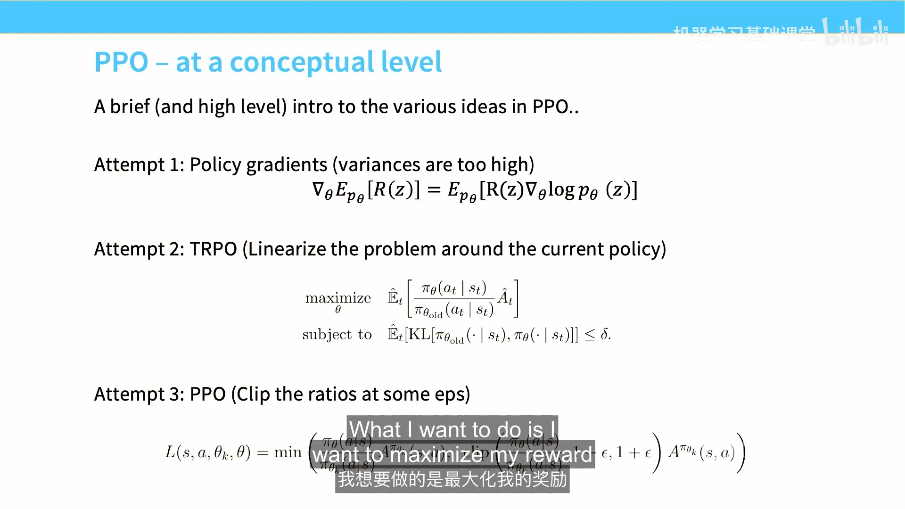

PPO 的问题是工程复杂：需要在线 rollout、reward model、value estimation、reference policy、KL 控制以及较敏感的超参数。因此自然会问：能否不用 on-policy RL？

## 9. DPO：把 preference optimization 还原成监督式 loss

DPO（Direct Preference Optimization）的出发点是避免显式 reward model + PPO rollout loop。直觉上，希望对 preferred response $y_w$ 做正向更新，对 rejected response $y_l$ 做反向更新，但权重必须与 KL-regularized RLHF 的最优 policy 一致。

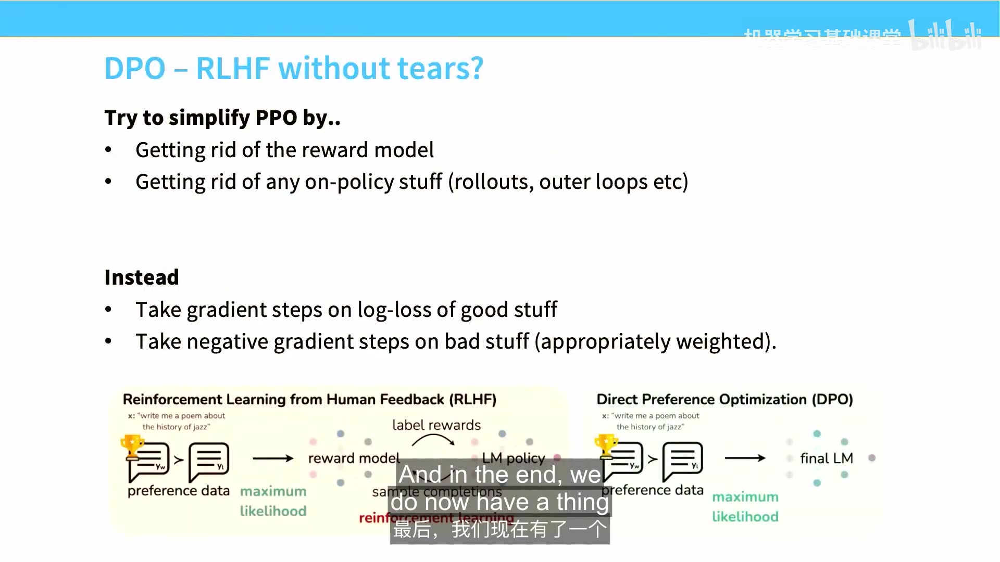

从 KL-regularized RLHF objective 出发：

$$
\max_{\pi_\theta}
\mathbb{E}_{x\sim D,\,y\sim\pi_\theta(y\mid x)}[r_\phi(x,y)]
- \beta D_{\mathrm{KL}}\!\left[\pi_\theta(y\mid x)\,\|\,\pi_{\mathrm{ref}}(y\mid x)\right].
$$

对固定 reward，非参数最优解可写成：

$$
\pi_r(y\mid x)
= \frac{1}{Z(x)}\pi_{\mathrm{ref}}(y\mid x)
\exp\!\left(\frac{1}{\beta}r(x,y)\right).
$$

因此 reward 可以反解为：

$$
r(x,y)
= \beta\log\frac{\pi_r(y\mid x)}{\pi_{\mathrm{ref}}(y\mid x)}
+ \beta\log Z(x).
$$

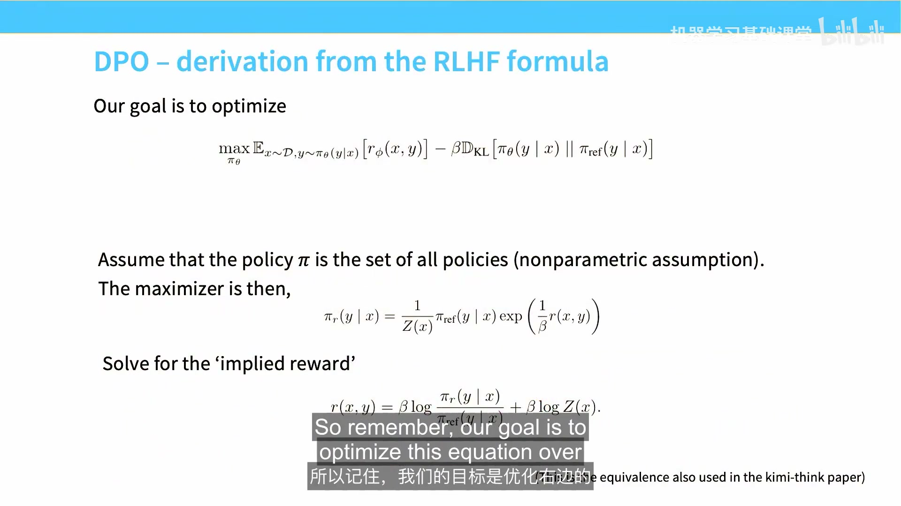

传统 pairwise reward model 可写成 logistic preference loss。将上面的 implied reward 代入后，归一化项 $Z(x)$ 在同一 prompt 的 reward difference 中抵消，得到 DPO objective：

$$
\mathcal{L}_{\mathrm{DPO}}(\pi_\theta;\pi_{\mathrm{ref}})
= -\mathbb{E}_{(x,y_w,y_l)\sim D}
\left[
\log\sigma\!\left(
\beta\log\frac{\pi_\theta(y_w\mid x)}{\pi_{\mathrm{ref}}(y_w\mid x)}
-\beta\log\frac{\pi_\theta(y_l\mid x)}{\pi_{\mathrm{ref}}(y_l\mid x)}
\right)
\right].
$$

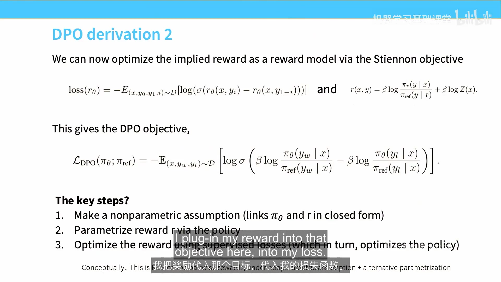

这一步的价值在于：原先需要“训练 reward model → rollout → PPO”的过程，被改写成对 preference pairs 的 supervised-style optimization。梯度直觉仍然是：

- 提高 preferred response $y_w$ 的相对概率；
- 降低 rejected response $y_l$ 的相对概率；
- 更新幅度由当前 policy 对这对 preference 的“隐式 reward prediction error”决定。

DPO 还有多种变体，课程展示了去 reference model 的 SimPO、length-normalized DPO 等形式。PPO 与 DPO 的经验结果高度依赖数据、reward、模型规模、实现与 tuning；一些设置中 PPO 仍可能更好。

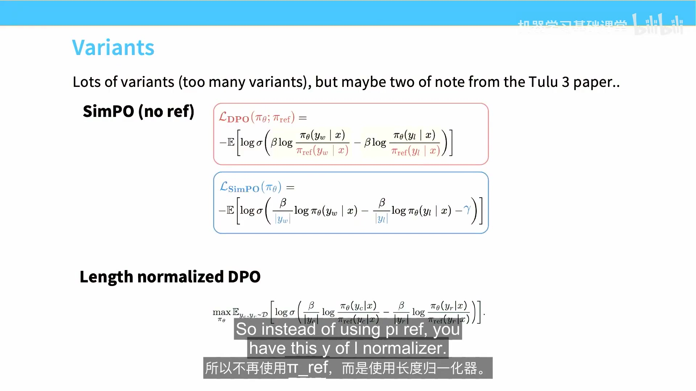

## 10. RLHF 的副作用：reward overoptimization 与 mode collapse

只要优化对象是一个不完美 proxy，就会出现 Goodhart-like 问题。RLHF 中最典型的两个风险是：

- **reward overoptimization / reward overfitting**：policy 学会利用 reward model 的缺陷，reward 上升但目标能力未必同步改善；
- **mode collapse / entropy loss**：policy 越来越集中到少数高 reward 风格，牺牲输出多样性与概率校准。

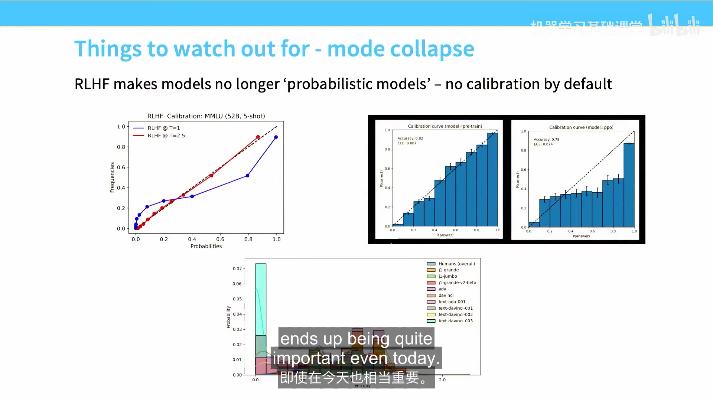

课堂特别提醒：经过强 preference optimization 后，模型不再自然地表现为“校准良好的概率模型”。如果训练只奖励一个狭窄的回答模式，概率质量可能下降，即使单次回答看起来更“像助手”。这也是后续 RLVR 等可验证 reward 训练必须继续处理的问题。

## 11. 本讲总结

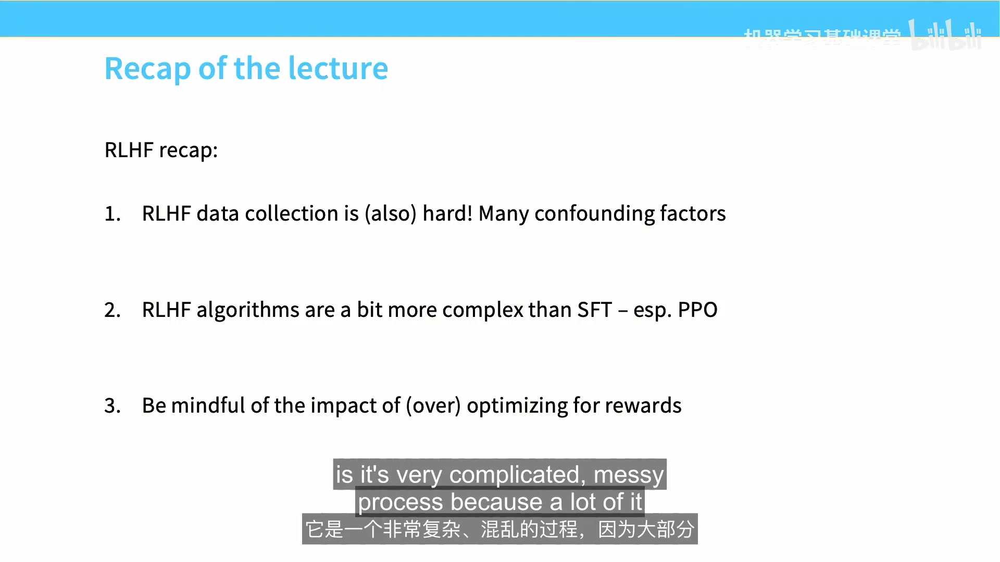

贯穿本讲的是下面这套 post-training 视角：

1. **SFT 的核心是行为抽取与行为塑形。** 数据质量、style、知识边界与安全场景往往比 optimizer 更关键。
2. **Midtraining 让 pretraining/post-training 的边界变成连续谱。** 大模型训练后段的数据 mixture 本身就是 post-training recipe 的一部分。
3. **RLHF 利用 generation-verification gap。** 如果判断答案好坏比从零生成最好答案更容易，preference feedback 就能提供比 imitation 更直接的优化信号。
4. **偏好数据由具体的数据管线产生。** Annotator population、guideline、报酬、任务设计、AI-assisted labeling、style bias 都会进入最终模型。
5. **PPO 与 DPO 是两种不同工程权衡。** PPO 更接近显式 RL；DPO 把 KL-regularized preference optimization 化成监督式 pairwise loss。两者的效果都依赖具体 setup。
6. **reward optimization 会创造新的 failure mode。** 训练必须同时观察 reward hacking、overoptimization、length/style shortcut、entropy loss 与 calibration。

下一讲转向 RLVR（reinforcement learning with verifiable rewards）：当 reward 能由程序、规则或最终答案自动验证时，可以减少主观 preference model 的一部分不确定性，但也会引入新的优化问题。

## 时间索引

| 时间 | 内容 |
|---|---|
| 00:00–05:40 | 从 pretraining 到 controllable behavior；post-training 的定位 |
| 05:40–11:30 | SFT pipeline 与 instruction-data 演化 |
| 11:30–17:50 | FLAN、Alpaca、OpenAssistant、Nemotron/tool-use examples |
| 17:50–25:05 | Style、preference evaluation、benchmark、knowledge extraction |
| 25:05–33:55 | SFT 局限、安全 SFT、少量定向安全数据 |
| 33:55–42:00 | Fine-tuning、late-stage instruction mixture、midtraining |
| 42:00–45:55 | 从 imitation 到 optimization；generation-verification gap |
| 45:55–53:20 | RLHF pairwise data 与 annotation pipeline |
| 53:20–60:10 | Annotator demographics、bias 与数据质量 |
| 60:10–65:30 | AI feedback、self-training、length effects |
| 65:30–69:00 | PPO 与 KL-regularized policy optimization |
| 69:00–74:30 | DPO motivation、推导与梯度直觉 |
| 74:30–76:45 | DPO variants 与 PPO/DPO comparison |
| 76:45–79:57 | Reward overoptimization、mode collapse、recap |
