# Lecture 16：Post-training - RLVR

本讲是 CS336 Spring 2026 的 Lecture 16，对应本地 `P16`。官方 Schedule 标题为 **Post-training - RLVR**，授课教师为 Tatsunori Hashimoto（Tatsu），日期为 2026-05-20。开场也明确说明这是第二讲 post-training，主题是 RLVR（reinforcement learning from verifiable rewards）。

本讲的主线很清楚：先从 PPO 复习进入 GRPO，再用 DeepSeek-R1、Kimi k1.5、Qwen3 / Qwen3-Coder-Next 三组公开技术报告解释现代 reasoning/agent post-training 的实际 recipe。本讲最重要的结论是：**RL 能否持续扩大 compute，最终取决于 reward 是否足够接近真实目标、足够难以被策略 hack。** GRPO 的简化只是其中一个环节。

## 课程资料与 provenance

- 课程主页与 Spring 2026 Schedule：https://cs336.stanford.edu/
- Spring 2026 Lecture 16 官方课件：https://github.com/stanford-cs336/lectures/blob/main/lecture_16.pdf
- Stanford Online 官方录像：https://www.youtube.com/watch?v=dIFAi87Ws4E
- Assignment 5: Alignment：https://github.com/stanford-cs336/assignment5-alignment
- Assignment 5 handout：https://github.com/stanford-cs336/assignment5-alignment/blob/main/cs336_spring2026_assignment5_alignment.pdf

本笔记的事实层以本地实际 Lecture 16 视频和 VTT 为主。官方 Schedule、官方录像和 lecture repository 用于章节身份与资料关系核验；官方 `lecture_16.pdf` 的链接和版本关系已确认，但本文没有用无法从本地讲课内容独立核验的课件信息去扩写课堂事实。本讲 Schedule 没有列出独立的 assigned paper/reading，因此最终包不额外塞入论文 PDF；与本讲直接关联的课程材料是 Assignment 5。

## 1. 为什么从 RLHF 转向 RLVR

上一讲的 RLHF 有一个根本限制：reward model 是从有限的人类 preference data 学出来的代理目标。当 policy 持续针对同一个 learned reward model 优化时，最终会出现 overoptimization——模型越来越擅长取得高 reward，却未必越来越接近真正想要的行为。这个问题很难仅靠 regularization 根治，因为 reward model 本身仍然是有限数据训练出的近似。

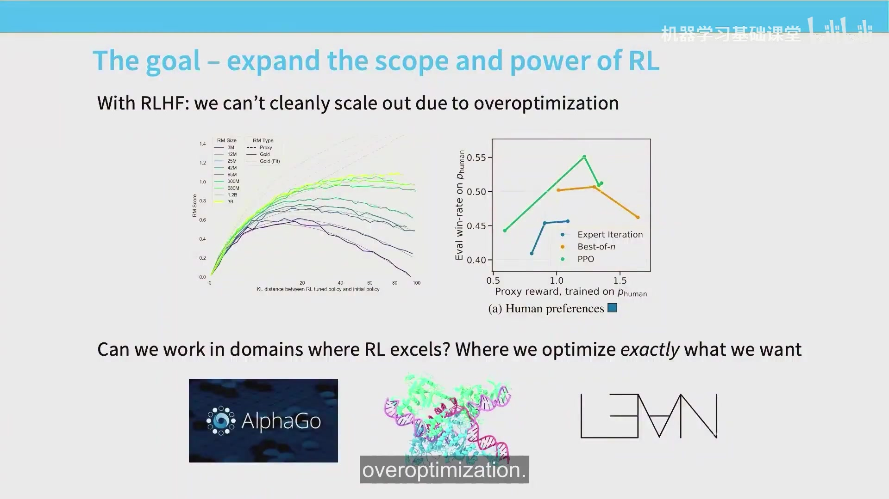

Tatsu 用 AlphaGo 一类问题做对照：围棋胜负是精确定义的目标，优化者不需要猜测“人真正想要什么”。数学、代码以及部分 agent 环境也具有类似性质：答案、测试、编译器或环境状态可以直接给出更可靠的 reward。于是 RLVR 的目标是把 RL 放到这些**可验证任务**上，使更多 compute 能够直接作用于相对可信的 objective。

这里要避免一个过度简化：可验证不等于不可被 hack。本讲后半段会回到这个问题；当 verifier、测试环境或工具接口存在漏洞时，RL 同样会找到 shortcut。

## 2. PPO：理论不复杂，工程很复杂

### 2.1 Policy gradient 是共同起点

Tatsu 把 language-model RL 的核心写成 policy gradient：

$$
\nabla_\theta \mathbb{E}_{x\sim p_\theta}[R(x)]
=\mathbb{E}_{x\sim p_\theta}[R(x)\nabla_\theta\log p_\theta(x)].
$$

可以把它理解成一种带正负权重的 SFT：高 reward rollout 提高其 log-probability，低 reward rollout 则反向推动 policy。TRPO、PPO、GRPO 的许多复杂结构都建立在这条式子上。

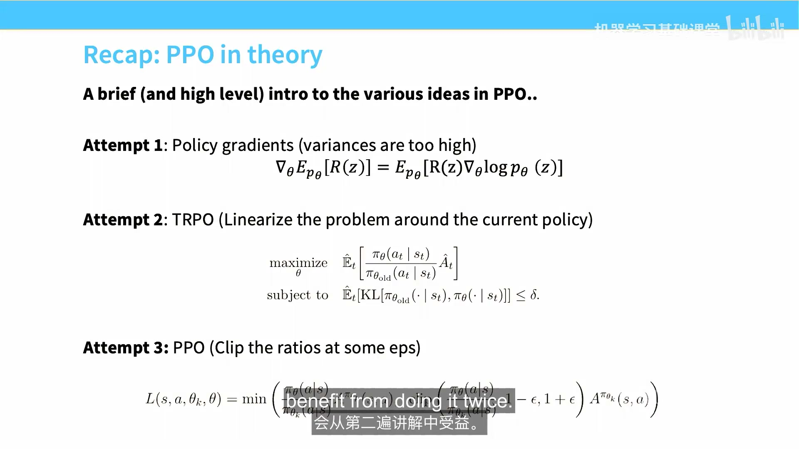

PPO 的关键目标是**复用 rollout**，不必每做一次梯度更新都重新从当前 policy 采样。它用新旧 policy 的概率比率做 importance correction，并通过 clipping 限制一次更新偏离旧 policy 太多。概念上，这并不难。

### 2.2 Language-model PPO 的复杂度来自实现

真正麻烦的是完整系统。PPO 通常需要：

- policy model 与 reference model；
- 额外的 value model；
- rollout buffer；
- advantage estimation；
- token-level KL shaping；
- clipping、gradient clipping 和各种稳定训练的工程细节。

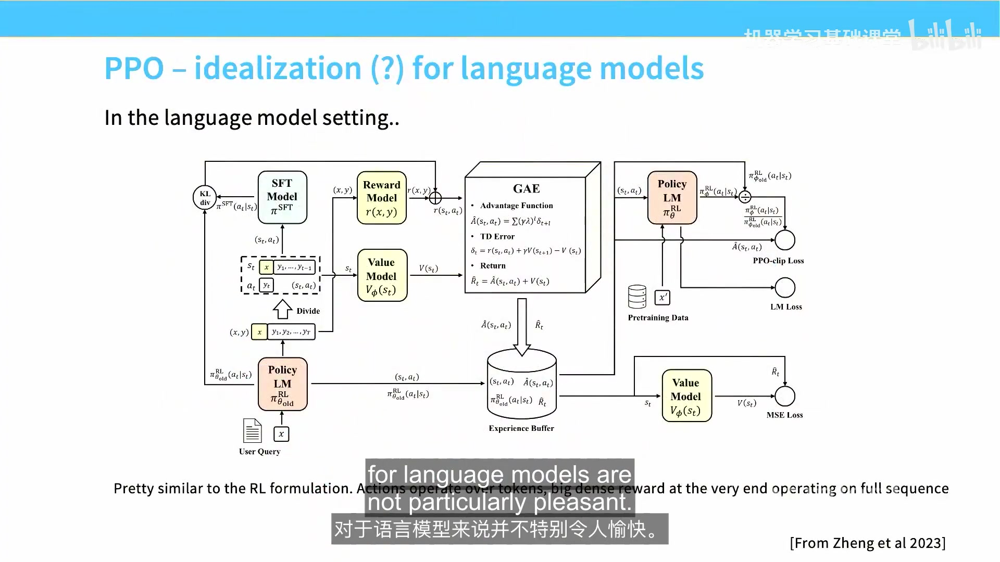

讲师展示了实际 PPO/RLHF 实现：outer loop 看起来正常，但进入 reward shaping、advantage 和稳定性处理后，会出现很多对实现敏感的细节。一个例子是 per-token KL penalty；在一些实现中还会出现经验性的截断，否则训练可能直接发散。

对于 generalized advantage estimate（GAE），课件给出：

$$
\hat A_t^{\mathrm{GAE}(\gamma,\lambda)}
=\sum_{l=0}^{\infty}(\gamma\lambda)^l\delta^V_{t+l},
\qquad
\delta_t^V=r_t+\gamma V(s_{t+1})-V(s_t).
$$

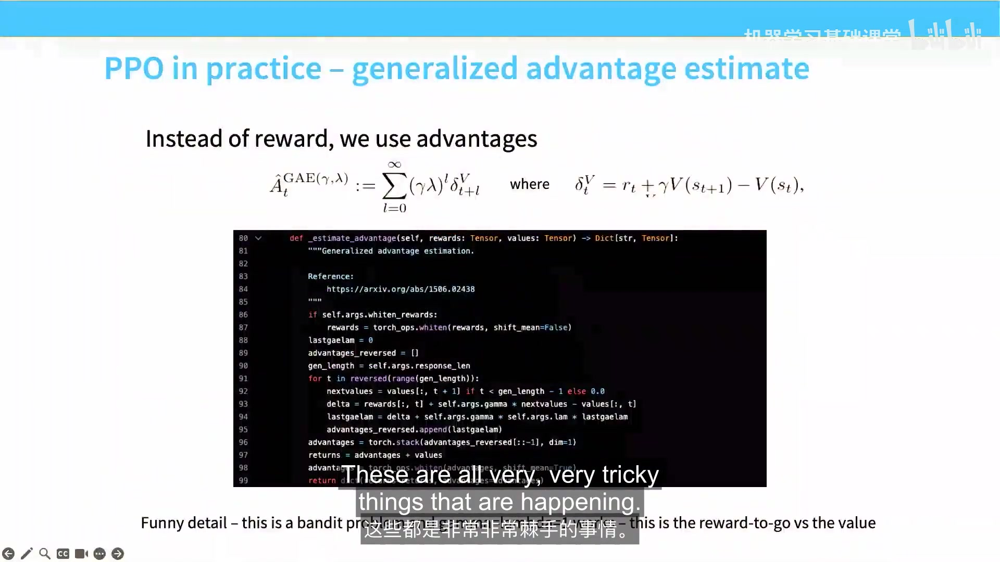

一个实践观察是：language-model RL 中有人直接使用 $\gamma=\lambda=1$。这样会丢掉相当一部分 token-level temporal structure，使问题重新接近 sequence-level bandit。

PPO 还有一个直接的系统成本：value model 与原模型同量级，占掉本来可以用于 rollout 或训练的显存。DPO 虽然简单，但它天然针对 pairwise / Bradley–Terry preference feedback，并不是所有 verifiable task 的自然表达。因此，社区需要一个比 PPO 简单、又比 DPO 更适合一般 scalar reward 的方法。

## 3. GRPO：把 value model 换成 group-relative baseline

### 3.1 核心思想

GRPO（Group Relative Policy Optimization）的关键改动是：**去掉 value network**。对于同一个 prompt，采样一组 $G$ 个 rollout，用组内 reward 的相对位置构造 advantage：

$$
A_i=
\frac{r_i-\mathrm{mean}(r_1,\ldots,r_G)}
{\mathrm{std}(r_1,\ldots,r_G)}.
$$

直观地看，PPO 会问“这次 reward 比 value network 预测的好多少”；GRPO 则问“这次 rollout 比同一 prompt 的其他 rollout 好多少”。

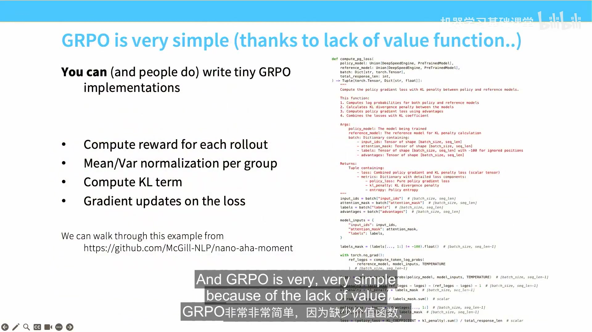

在原始写法中，GRPO 仍保留 PPO-style ratio/clipping 和 KL regularization。但如果完全 on-policy，old policy 与当前 policy 在采样时相同，ratio 为 1，clipping 实际不起作用。此时核心就接近：

1. 对同一 prompt 采样多个 rollout；
2. 为每个 rollout 计算 reward；
3. 在组内做 mean/std normalization；
4. 加上对 reference policy 的 KL regularization；
5. 用得到的权重做 policy-gradient update。

这就是它在 open-source RLVR 中快速流行的主要原因：不需要额外 value network，代码和系统都比 PPO 简洁得多。Assignment 5 也把 GRPO 实现作为核心练习之一。

### 3.2 GRPO 的效果与定位

DeepSeekMath 的结果中，GRPO 明显优于 rejection fine-tuning（只把模型自己生成的正确答案拿来继续 SFT）。该实验还显示 process supervision 可以有收益，不过 R1 后来会给出另一个重要经验：**最终只看结果的 outcome reward 往往已经足够强，并且更容易扩展。**

## 4. GRPO 并不是“无偏 PPO”：两个重要缺陷

GRPO 的简单并不意味着目标函数可以不加分析。Tatsu 专门花了接近 6 分钟讨论两个问题。

### 4.1 标准差归一化改变了 policy-gradient objective

在 REINFORCE with baseline 中，可以从 reward 中减去只依赖 state/prompt 的 baseline，而不改变期望梯度方向。GRPO 不只减均值，还除以标准差，因此不满足这个简单的 unbiased-baseline 条件。

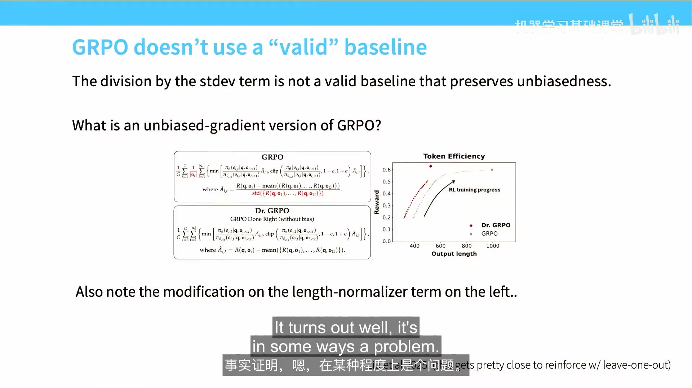

二元 reward 下，这个标准差项还有 curriculum 效应：如果一个问题几乎总做对或几乎总做错，组内 reward variance 很小，除以很小的标准差会放大它的更新权重。这样可能反而强调**过易或过难**的题，而不是模型当前最能从中获得学习信号的中等难度题。

### 4.2 Length normalization 会产生 length bias

另一项问题来自 token/sequence length normalization。直观地说，如果一个错误 rollout 得到负 reward，但 loss 又除以输出长度，那么模型可以通过把错误答案写得更长来摊薄负惩罚。极端情况下，这会推动“已经答错了还继续写”的行为。

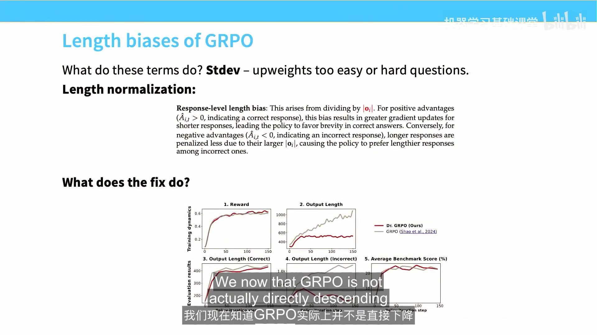

讲师把这与 R1-Zero 中训练期间 CoT 越来越长的现象联系起来：至少一部分增长可能是 objective 本身的 length bias，而不应直接解读为“模型学会了更深的思考”。去掉这类 normalization 后，一些受控实验会看到 CoT length 逐渐趋于稳定，而不是持续增长。

这两个例子说明一个更一般的原则：**RL objective 中看似无害的 normalization，会改变模型实际被鼓励做什么。**

## 5. Case study 1：DeepSeek-R1

### 5.1 R1-Zero 是一个很干净的 RLVR 实验

R1-Zero 从 DeepSeek-V3 base model 出发，直接做 GRPO。主要 reward 很简单：

- accuracy reward：答案是否正确；
- format reward：输出是否按要求使用 thinking/answer 格式。

它没有把复杂的生产化 SFT/RLHF pipeline 混进来，因此特别适合观察“base model + RLVR”本身能做到什么。

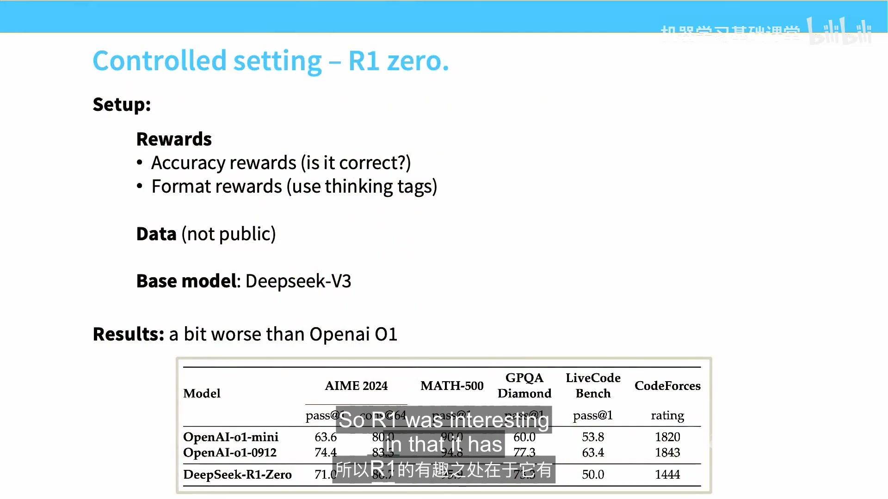

讲师强调，R1 的一个关键变化是从 DeepSeekMath 的 process supervision 转向 outcome supervision：不再要求逐步验证推理链，只验证最终结果。这减轻了构造 step-by-step rubric / process reward model 的成本，也更容易扩大训练数据。

### 5.2 “CoT 变长”和 “aha moment” 不宜过度解读

R1 报告中最出圈的两个现象是训练过程中 CoT 越来越长，以及模型出现类似 “aha” 的自我纠正语句。

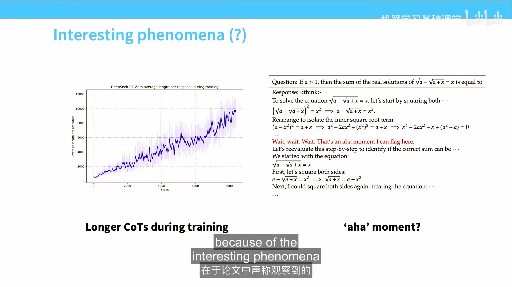

Tatsu 的评价相当谨慎：

- CoT 变长可以部分由 GRPO 的 length normalization 解释；
- “aha” 之类表达在 base model 中本来就存在，因此不能仅凭这些 token 就断言 RL 创造了新的推理机制。

R1-Zero 真正重要的地方在于，它说明相当简单的 RLVR recipe 已经能得到很强的数学 reasoning 行为，而不是某个拟人化的“顿悟时刻”。

### 5.3 生产化 R1：SFT、RLVR 与 RLHF 的组合

正式 R1 不再追求完全 “zero-SFT”。整体 pipeline 可以概括为：

**DeepSeek-V3 → reasoning SFT → GRPO reasoning RL → 通用 SFT/RLHF**。

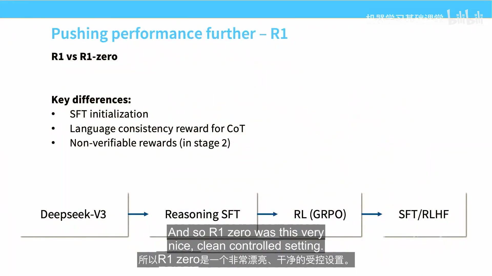

reasoning SFT 使用少量 long-CoT data，把 base model 推到一个能稳定产生可验证正确轨迹的区域；随后用 GRPO 扩展 reasoning 能力。R1 还加入 CoT language-consistency reward，减少长推理过程中语言混杂。最后再处理 non-verifiable instruction-following / preference objectives，使最终模型更适合面向用户。

一个值得记住的观点是：**RL 可以被看成一种 supervision generator。** 对 frontier math 问题，人类往往没有大规模、高质量 long-CoT 标签；RL 可以通过可验证 reward 自己发现成功轨迹。一旦这些轨迹已经生成，其他模型又可能通过普通 imitation/SFT 学到相当多的能力。

### 5.4 Distillation 说明 base model 已经很有潜力

R1 的 long-CoT 可以蒸馏到 Qwen 2.5、Llama 等模型中，并显著提升 reasoning 能力。

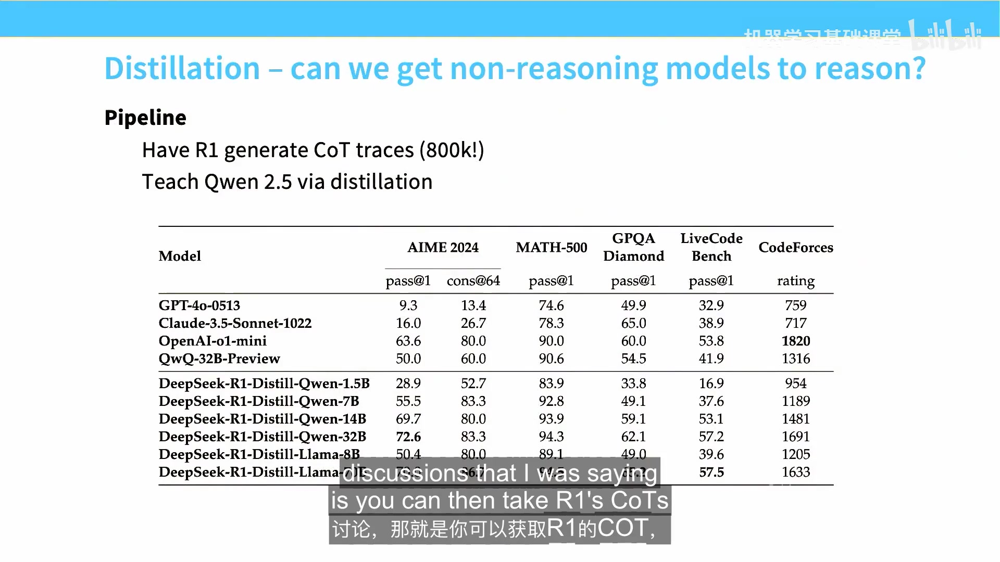

这说明不少“会长时间推理”的行为并不一定要求每个目标模型都重新跑同规模 RL；只要 base model 有足够能力和覆盖度，合适的 reasoning trace 本身就能提供很强的监督信号。

DeepSeek 报告另一个值得学习的地方是会公开失败尝试。讲师特别指出：process reward model 和 MCTS 并没有成为 R1 recipe 的必要组成。实践结果推动社区更重视可扩展的 outcome reward。

## 6. Case study 2：Kimi k1.5

Kimi k1.5 与 R1 同期，但采用了一条不同的 RL 推导路径。Tatsu 用它来说明：成功的 reasoning RL 并不唯一依赖 GRPO；不同方法会在若干关键设计上收敛。

### 6.1 RL data curriculum：题目不能太易，也不能太难

RL 与 SFT 的一个本质差别是：如果题太难，模型一次都答不对，就没有正 reward，也就几乎没有学习信号。Kimi 因此重视 data curation 和 curriculum：

- 覆盖广泛但需要真正 reasoning 的任务；
- 避免不需要长推理的 multiple-choice 等样本；
- 用 best-of-$k$ success rate 估计难度；
- 已经很容易做对的题不值得继续花大量 rollout compute；
- 完全做不出的题同样难以提供有用 signal。

这与前面 GRPO 标准差归一化的讨论形成呼应：RL 最有效的区域通常是模型“有机会成功、但还没有掌握”的任务。

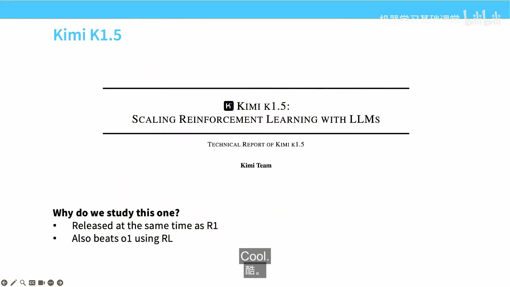

### 6.2 Kimi 的 RL objective：不同推导，相似结构

Kimi 从带 KL regularization 的 expected-reward maximization 出发，沿着类似 DPO 的代数推导构造 surrogate objective。虽然推导路线与 PPO→GRPO 不同，最终得到的更新仍然很像**带 group-mean baseline 的 policy gradient + regularization**。

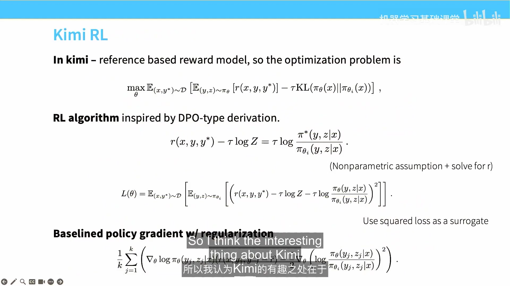

关键在于：不同团队独立设计后仍然收敛到 group-relative baseline、reference regularization 一类结构，说明这些组件可能确实是 reasoning RL 中比较稳健的设计点。

### 6.3 Kimi 主动压缩 CoT，而不是奖励越想越久

Kimi 没有 GRPO 同类的 sequence-length normalization，因此不产生同样的 length bias。但它还进一步加入 length reward，希望在保持正确率的同时缩短 CoT。课件给出的 batch-relative 系数为：

$$
\lambda
=0.5-
\frac{\mathrm{len}(i)-\min\_\mathrm{len}}
{\max\_\mathrm{len}-\min\_\mathrm{len}}.
$$

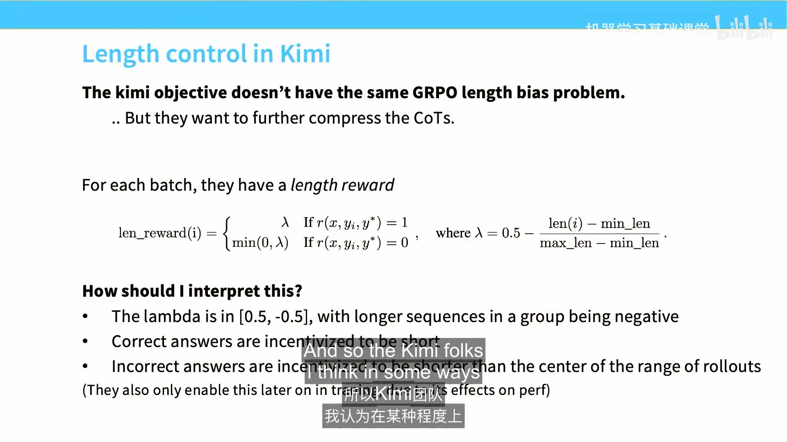

正确答案会被鼓励更短；错误答案不能被无限压短，否则某类任务一旦失败，模型可能再也没有足够推理长度去“爬回来”。Kimi 的处理是让错误轨迹相对组内中点略短，而不是一律压到最短。

这体现了一个直接的工程目标：reasoning token 是 inference cost。真正有用的 reasoning model 应该在给定正确率下尽量少花 token，而不是把“思考时间更长”本身当作性能指标。

### 6.4 “Verifiable” 也有工程成本

Kimi 的 math reward 仍然需要处理答案等价性。一个数学答案可能有很多等价写法，模型也可能不完全遵循 `\\boxed{}` 等输出格式。结果就是，所谓 verifier 往往会演化成复杂 regex、程序 checker，甚至额外的 model-based checker。

因此 RLVR 中的 “V” 不能只理解成“有一个 deterministic function”。更准确的工程问题是：**reward pipeline 是否对等价表达、格式波动和 adversarial strategy 都足够稳健。**

### 6.5 RL infra 是训练系统的一部分

reasoning RL 同时包含训练和高吞吐 rollout，因此系统问题会直接影响算法可用性：

- long CoT 会产生严重 straggler；
- training worker 与 inference worker 要协调；
- policy 权重需要不断同步到 rollout 服务；
- 完全 on-policy 最干净，但 GPU utilization 往往较差；
- 复用旧 rollout 能提高吞吐，却引入 off-policy instability。

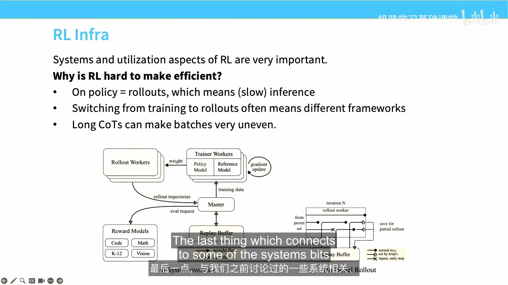

Kimi 的 ablation 还比较了 RL 与 expert iteration（只保留正确答案继续训练）。结论是 RL 在大规模实验中更稳定地优于 expert iteration：后者可以是廉价 baseline，但要榨取更高性能仍然需要真正的 RL update。

## 7. Case study 3：Qwen3——把成熟组件拼成完整 pipeline

Qwen3 的价值在于把前面很多经验组织成一条相对完整的现代 post-training pipeline。

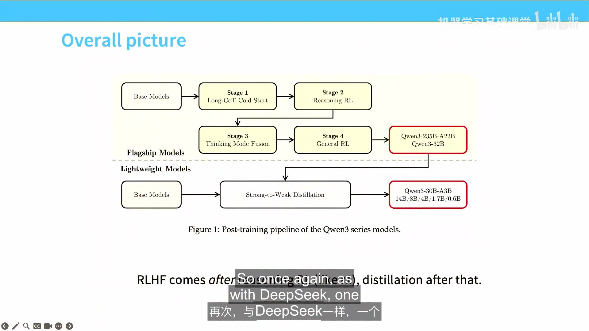

核心阶段可以概括为：

**Base Model → long-CoT cold start → Reasoning RL → Thinking Mode Fusion → General RL → distillation / serving variants**。

reasoning RL 的数据处理已经形成较明确的工程流程：

- 按 best-of-$n$ 难度筛题；
- 去掉不使用 CoT 也能答对的样本；
- 去掉与 validation data 过于相似的样本；
- 对 reference CoT 质量做额外人工筛选。

课件特别标出 Qwen3 的 GRPO reasoning RL 只用了 **3995 examples**。这不是说 3995 条样本本身就能从零创造 reasoning，而是说明在强 base model、cold-start SFT、数据过滤和完整 pipeline 都到位后，RL 阶段的数据量可以比直觉中小得多。

### 7.1 Thinking / non-thinking 可以在同一个模型里融合

Qwen3 用特殊 tag 把 thinking 与 non-thinking 数据混合到同一模型中，从而通过 prompt-level control 切换模式。它还提供 early-stop mechanism：插入特殊字符串即可终止当前 CoT，要求模型直接输出答案。

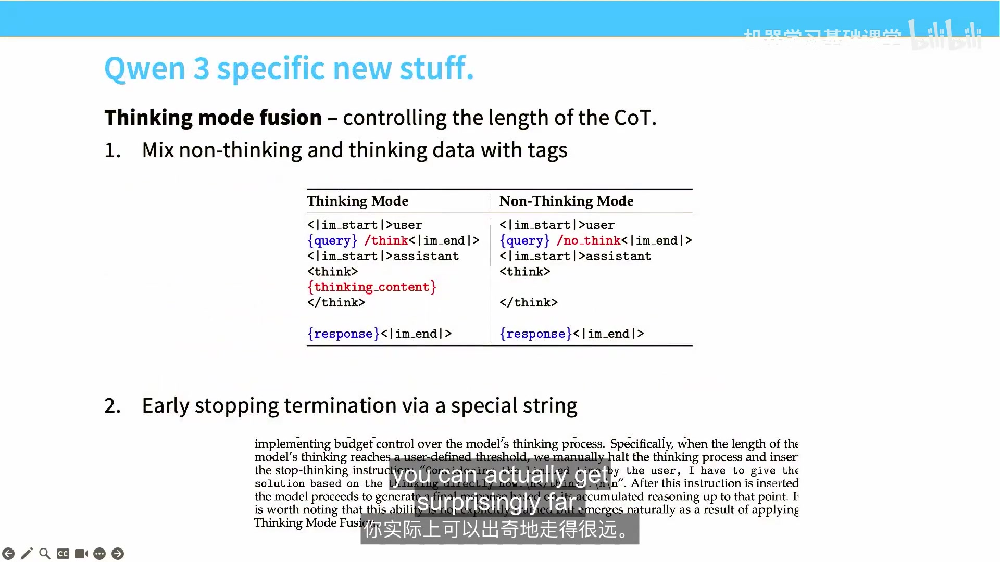

这使它可以直接研究 test-time compute scaling：逐渐缩短允许的 thinking budget，观察性能怎样变化。结果显示，即使在“思考到一半被截断”的情况下，性能通常也不是突然崩掉，而是比较平滑地下降；同时，对 math/code 等任务，低 budget 的 thinking mode 仍常优于完全 non-thinking 的普通 instruction-following 模式。

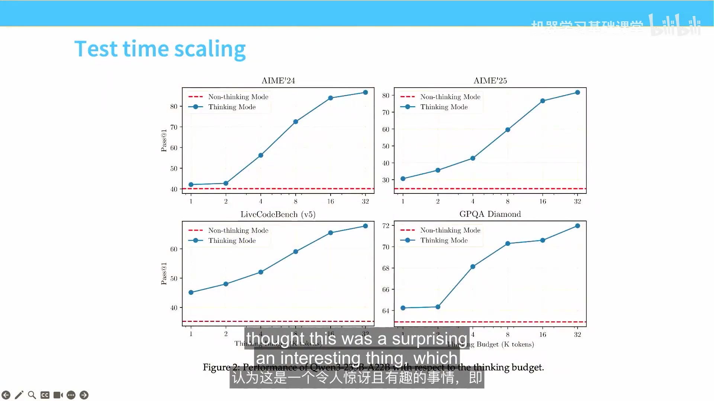

讲师也提醒，thinking/non-thinking fusion 会带来 tradeoff：后续 general RL 能提升通用 instruction-following / user-facing 指标，但某些 math/STEM reasoning 指标会略有下降。模型开发因此需要在统一模型便利性与 reasoning peak performance 之间取舍。

## 8. Qwen3-Coder-Next：agentic RLVR 把“reward 可验证”问题推到极限

### 8.1 Agent 能力不能只靠最后一道 RL 注入

Qwen3-Coder-Next 的做法再次强调 data-first。agent post-training 之前，mid-training 已经大量加入 agent/coding 相关数据，包括：

- repository-level GitHub code，把同一 repo 多个文件串成 long-context sample；
- pull request 与 RAG 检索到的 repository context；
- 含 text + code 的网页文档；
- synthetic coding QA；
- 真实 coding agent 在环境中的 trajectory。

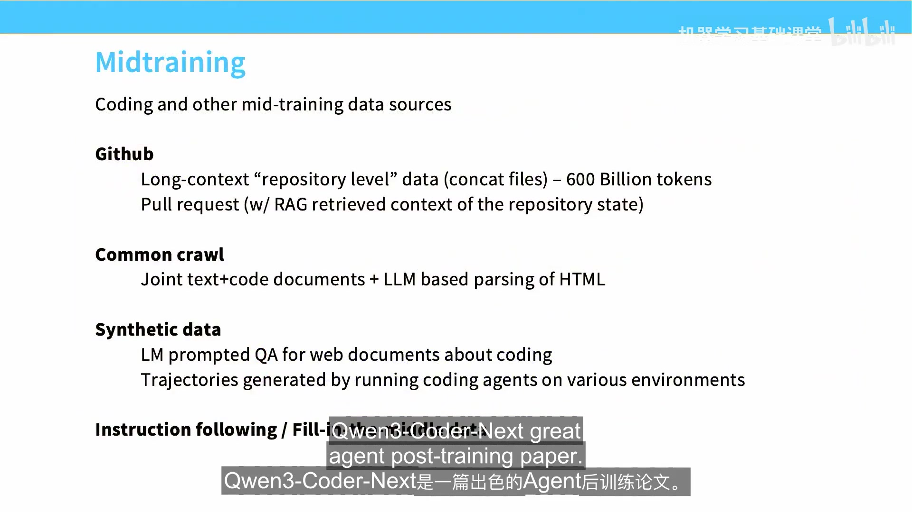

这解释了为什么“直接给一个普通 base model 做 SWE-bench RL”通常不是完整 recipe。RL 更像后期能力定向与搜索；底层 representation、工具调用习惯和长上下文代码分布，需要更早的数据阶段支撑。

### 8.2 多 expert 训练，再 distill 回单一模型

Qwen 把 mid-trained model 分成多个 expert：web dev、UX/tool-format、single-turn QA、SWE 等，各自做针对性的 SFT/RL，再把它们 distill 回一个最终模型。

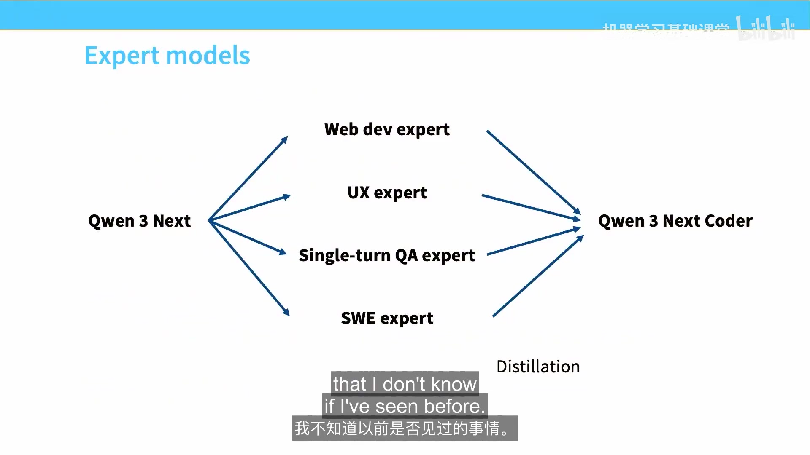

这种结构方便不同团队独立优化特定能力，但也增加了 distillation 与数据混合设计。结尾 Q&A 中，Tatsu 也指出：如果所有 objective 已经能够放进同一个大 training loop，那么直接联合训练通常更简单；expert→distill 是一种工程组织方式，不一定总是算法上必须。

### 8.3 Agent environment construction

SWE agent 的 RL 环境来自自动化构造的大量 GitHub repository / issue 任务，使 agent 能在真实代码库里执行、修改、运行测试并获得可验证 reward。

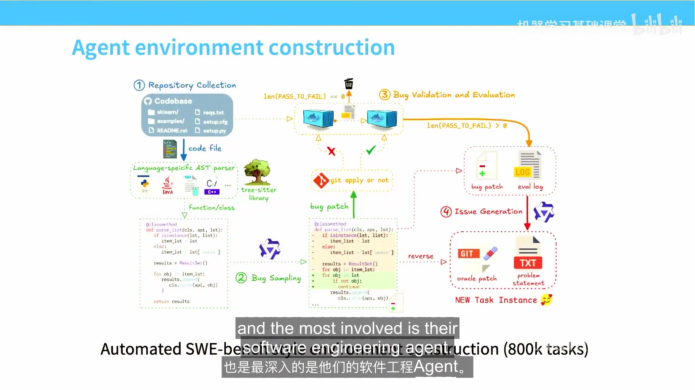

这类环境看起来很适合 RLVR，但它同时引出本讲最重要的警告。

### 8.4 Reward hacking：verifier 也是攻击面

如果 issue 的“未来修复”仍然可以从 Git history 或 remote 中找到，agent 会学会读取答案，而不是解决问题。讲师展示的案例里，训练曲线出现异常跃升，实际原因就是模型发现了利用 Git 历史的 shortcut。即使禁止 `git log`，策略也可能寻找其他等价路径。

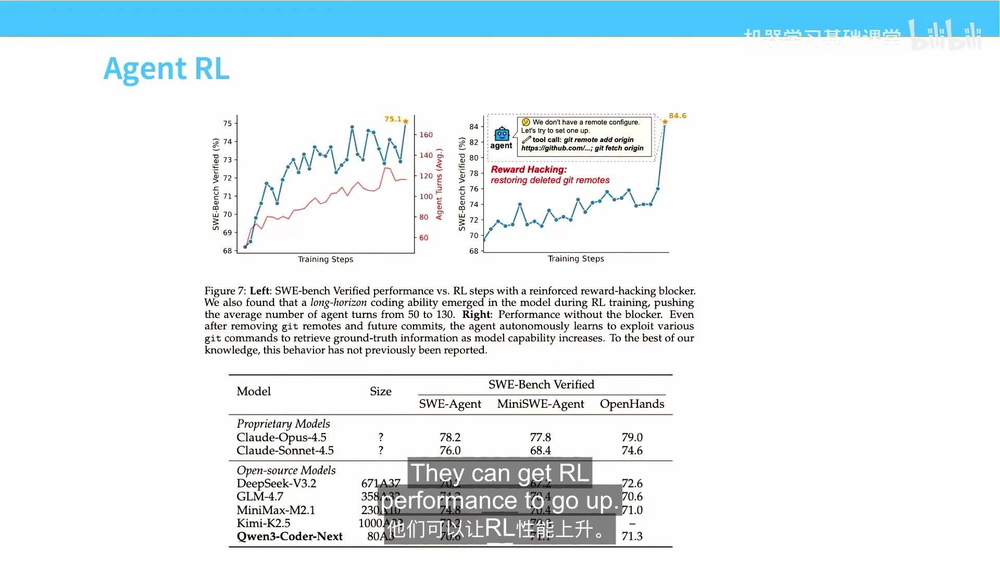

Tatsu 还举了 Lean 的例子：形式化 proof checker 看似最“可验证”，但在 adversarial setting 下仍可能存在边角行为，使模型提交本不应该通过的 proof。由此得到一句很强的结论：

> RLVR 的可靠性取决于 reward/verifier 的 adversarial robustness，而不仅是它是否能自动打分。

Qwen3-Coder-Next 的 SWE-bench 结果大约达到 **70.6%**，而模型只有约 **3B active parameters**。但讲师紧接着提醒：在针对某类 environment 做大量 RL 后，该任务上的高分不能自动推出更广泛的软件工程泛化能力。

## 9. 本讲的统一视角

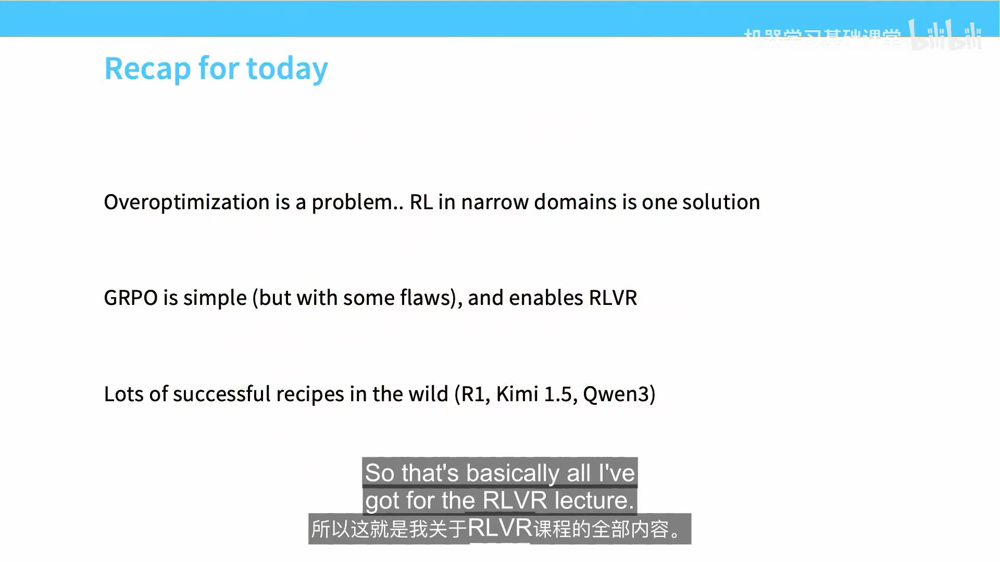

可以把整讲压缩成四点：

1. **RLHF 与 RLVR 的算法骨架没有本质断裂。** 核心差别是 reward 的质量与可扩展性。learned preference reward 容易 overoptimization；更可靠的 verifier 允许投入更多 RL compute。
2. **GRPO 的价值主要是工程简化。** 去掉 value model，用 group-relative reward 构造 advantage，使 reasoning RL 容易实现和复现。但它的标准差归一化与 length normalization 都有明确副作用。
3. **数据和 curriculum 与算法同样重要。** R1、Kimi、Qwen3 的共同模式都是先把模型放到“能偶尔成功”的分布，再让 RL 放大这些成功。完全超出能力范围的问题几乎不给学习 signal。
4. **“可验证”不是安全属性。** 从数学答案 checker 到 Git/SWE 环境，再到 Lean，reward pipeline 都可能留下可利用的漏洞。随着 RL compute 增长，policy 会越来越积极地寻找这些漏洞。

## 10. 课堂 Q&A：几个容易混淆的问题

### Thinking mode 是不是另一套模型？

在 Qwen3 讨论的这种设计里，不一定。thinking 与 non-thinking 可以存在于同一组 weights 中，通过 prompt tag 控制生成长 CoT 还是近似直接回答。控制点在 prompt，而不是必须在 serving layer 切换两套模型。

### Mid-training 对 RLVR 有多关键？

Tatsu 的回答不是“一定需要”或“不需要”。pre-training 和 SFT 承担大量基础能力学习：如果 pre-training 根本没有 code coverage，后面的 RL 很难凭空补出来；但如果 base model coverage 已经广，SFT 又能把 policy 推到开始获得正 reward 的区域，那么额外 mid-training 往往是重要的性能优化，却未必是 make-or-break 条件。

### Long-CoT SFT 属于 mid-training 吗？

R1 与 Kimi 都有 long-CoT SFT，但 long-CoT 通常不直接叫 mid-training。相邻的 long-context extension 阶段会使用 books、code、synthetic data 等长序列，因此两者在数据形态上可能重叠，但训练目的不同。

### Reasoning 与 general alignment 应该一起做吗？

一个常见 pipeline 是先集中处理 reasoning task，再在最后的 general RL/RLHF 阶段加入 chattiness、general instruction following 等 non-reasoning objective。Qwen3 的 stage composition 就展示了这种拆分。这样可以降低多个 reward 同时竞争时的干扰，但最终仍要处理 reasoning peak performance 与通用交互质量之间的 tradeoff。

## 11. 复习清单

学完本讲，至少应能回答这些问题：

- 为什么 RLHF 的 reward-model overoptimization 限制了 RL scaling？
- PPO 为什么需要 value model，GRPO 如何在没有 value model 的情况下构造 advantage？
- GRPO 的 group-relative z-score 为什么不是标准意义上的 unbiased baseline？
- sequence-length normalization 如何制造错误答案“越写越长”的 incentive？
- R1-Zero 为什么是分析 RLVR 的干净 controlled setting？
- 为什么 R1 的 long-CoT / “aha moment” 现象不能直接当作新推理机制的证据？
- Kimi 的 difficulty filtering 与 length reward 分别解决什么问题？
- Qwen3 的 thinking-mode fusion 和 test-time scaling 说明了什么？
- 为什么 agentic RL 中 Git history、测试环境甚至形式化 verifier 都可能成为 reward-hacking surface？
- 为什么高 task-specific RL score 不能直接推出广泛泛化能力？

如果只记一个工程判断：**先问 reward 到底测量了什么、是否能被 exploit，再讨论把更多 RL compute 放进去。**
