---
workflow:
  name: ChatGPT-Web-Course-Note-Workflow
  version: v4.9.4
course:
  name: "CS336: Language Modeling from Scratch"
  term: "Spring 2026"
  instructors:
    - Tatsunori Hashimoto
    - Percy Liang
chapter:
  index: 17
  local_label: P17
  official_unit_label: Lecture
  official_unit_number: 17
  official_title: "Alignment - multimodality"
  date: "2026-05-27"
  instructor: Percy Liang
provenance:
  lecture_video_term: "Spring 2026"
  official_materials_term: "Spring 2026"
  local_video_source: "Bilibili local copy; identity cross-checked against Stanford first-party sources"
  subtitle_role: "unknown_subtitle, cross-checked against video hard subtitles and official materials for high-risk details"
---

# Lecture 17 — Alignment - multimodality

本讲把 CS336 从纯文本语言模型推进到多模态模型。核心问题很集中：Transformer 仍然是主干，但 Transformer 接收的是 token，因此图像、视频等非文本模态必须先被转换为可供 Transformer 处理的表示；如果还希望生成非文本内容，又要考虑表示是否保留了足够的细粒度信息，以及输出端采用什么生成机制。

## 章节身份与配套资料

本地 `P17` 经视频开场、字幕内容、课程 Schedule 与 Stanford Online 同版本录像交叉核验，对应 Spring 2026 **Lecture 17: Alignment - multimodality**，授课教师为 **Percy Liang**，日期为 **2026-05-27**。

- 官方课程与 Schedule：https://cs336.stanford.edu/
- Spring 2026 executable lecture：https://github.com/stanford-cs336/lectures/blob/main/lecture_17.py
- Stanford Online 官方录像：https://www.youtube.com/watch?v=26FtD08ZpOU
- Spring 2026 官方播放列表：https://www.youtube.com/watch?v=JuoVZkPBiKk&list=PLoROMvodv4rMqXOcazWaTUHhq-yembLCV

Schedule 对 Lecture 17 明确关联的课程材料只有 `lecture_17.py`，没有为本讲单独指定 assigned/required paper，因此 `papers/` 不额外打包论文。下面列出的论文链接来自本讲 executable lecture，是教师讲解时引用的背景材料。

## 1. 从 language model 到 omni model

此前课程主要处理 `text → text`。现实世界包含文字、图像、音频、视频等模态，因此更一般的目标是 **omni model**：输入可以是任意模态组合，用于理解；输出也可以是任意模态组合，用于生成。

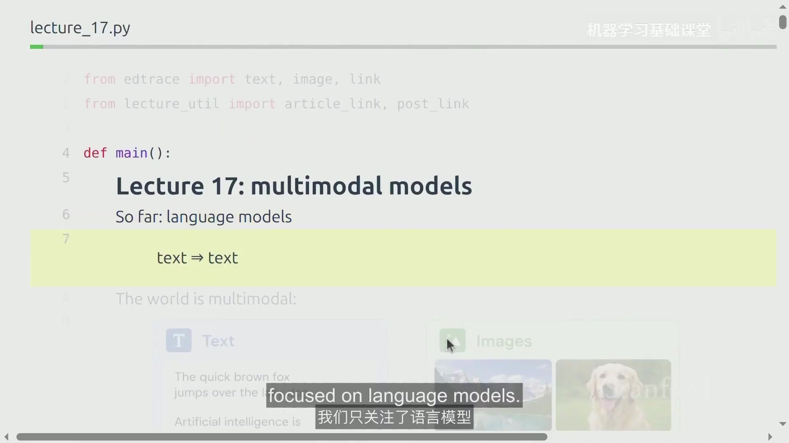

课程给出的工程出发点是：Transformer 已经非常有效，而 Transformer 的接口是 token。这里的 token 可以是离散 token，也可以是连续向量；关键在于它代表某种可供模型处理的信息单元。因此多模态建模首先要回答两个问题：

1. 如何把非文本数据输入模型，例如让模型理解图像？
2. 如何让模型输出非文本数据，例如生成图像、音频或视频？

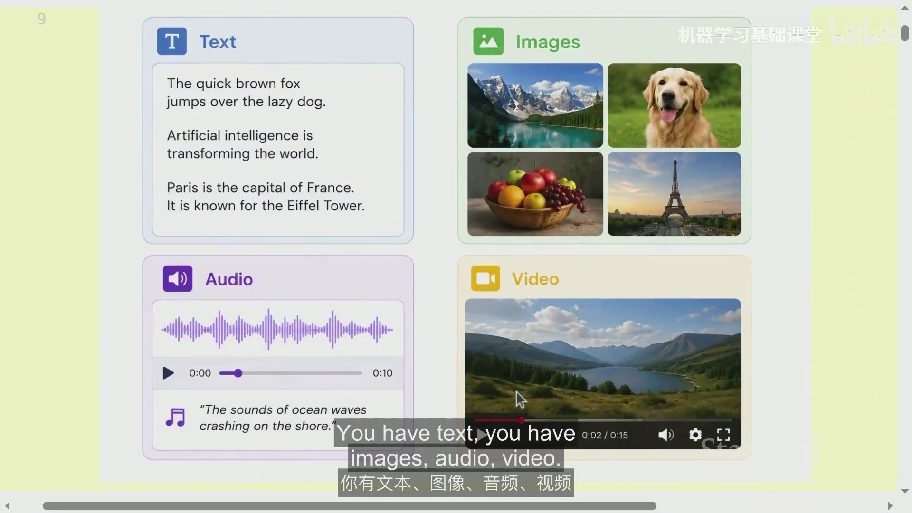

本讲的路线由浅入深：先看怎样得到图像语义表示（CLIP、SigLIP），再看怎样把这些表示接到语言模型上（LLaVA、LLaVA-OneVision、Qwen-VL 系列），最后看 Chameleon 这种“把图像也离散 token 化”的统一建模尝试。

## 2. CLIP：用图文对齐学习图像语义

### 2.1 为什么从 contrastive learning 开始

传统计算机视觉依赖人工标注的图像类别。互联网却天然存在大量 `(image, caption/text)` 配对。CLIP（Contrastive Language-Image Pretraining）的目标是利用这些弱标注图文对，使图像编码器学到与语言语义对齐的表示。

CLIP 在一个 batch 中同时编码图像和文本。若 batch 大小为 $B$，就形成一个 $B\times B$ 的图文相似度矩阵；对角线是原始配对，非对角线是该 batch 内的负例。训练同时要求：

- 对每张图像，它配对的文本应比其他文本更相似；
- 对每段文本，它配对的图像应比其他图像更相似。

课程用 batch size `32768` 作为例子。相似度可以直观理解为图像向量与文本向量的 dot product；训练把正确配对的分数推高。

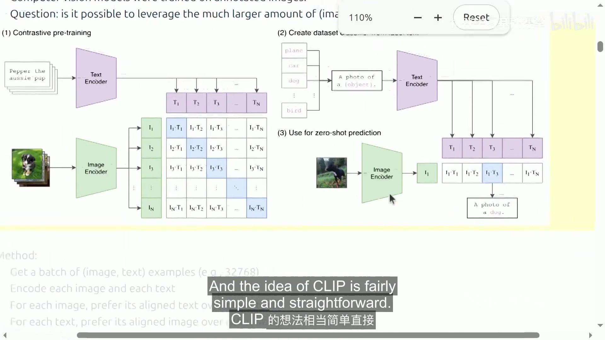

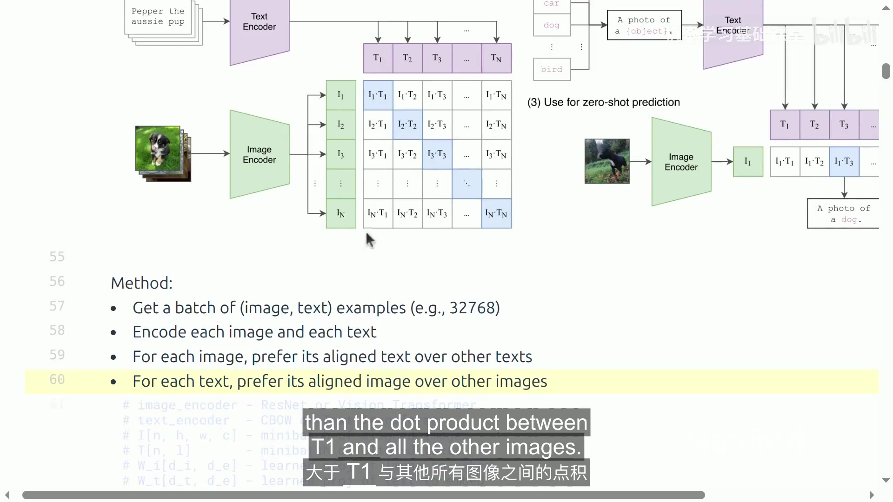

这种表示一旦与文本空间对齐，就能做 zero-shot classification：把类别名称写成文本 prompt，编码成文本向量，再比较图像向量与候选类别文本向量的相似度。

### 2.2 数据与预处理

课程材料给出的 CLIP 数据构建数字是：

- 搜索约 **500K queries**；
- 每个 query 获取约 **20K image-text pairs**；
- 最终训练集为 **400M image-text pairs**；
- 原始数据集没有公开；OpenCLIP 后来用 LAION-5B 等开放数据复现并扩展这一方向。

图像输入尺寸不统一。CLIP 的预处理把较短边用 bicubic interpolation 缩放到 `336` 像素，再 center crop 为 `336×336`。这种固定分辨率方案适合分类式语义表征，但会丢失边缘内容和高分辨率细节；后面的 LLaVA-OneVision 会直接针对这个限制引入 AnyRes。

### 2.3 视觉与文本编码器

CLIP 同时实验过 ResNet-50 与 Vision Transformer。课程重点介绍 ViT 路线：图像被切成 patch，patch token 进入 Transformer。最佳版本写作 **ViT-L/14@336px**：`L` 表示 large，patch 是 `14×14`，训练图像分辨率是 `336×336`。

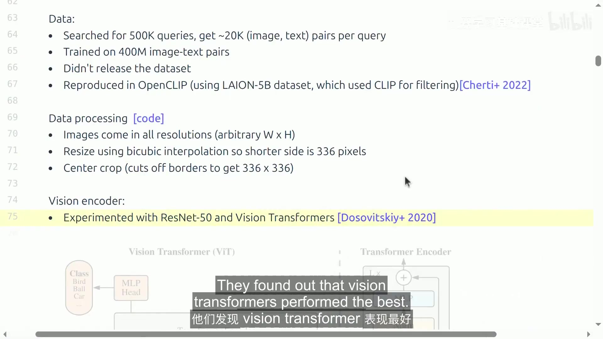

文本侧使用 GPT-2 风格 Transformer，课程材料给出的规模是 **63M parameters、12 layers**。输入形式为 `[BOS] ... [EOS]`，取最高层 `[EOS]` 激活作为文本表示。

### 2.4 为什么 contrastive ranking 有效

一个自然替代方案是“图像输入，直接生成 caption”。CLIP 论文中的 ablation 表明，这种逐 token 生成文本的目标在得到可迁移视觉语义表示时明显更耗算力；contrastive ranking 只要求从候选中把正确图文配对排到前面，因此更直接地把训练资源用于语义区分。

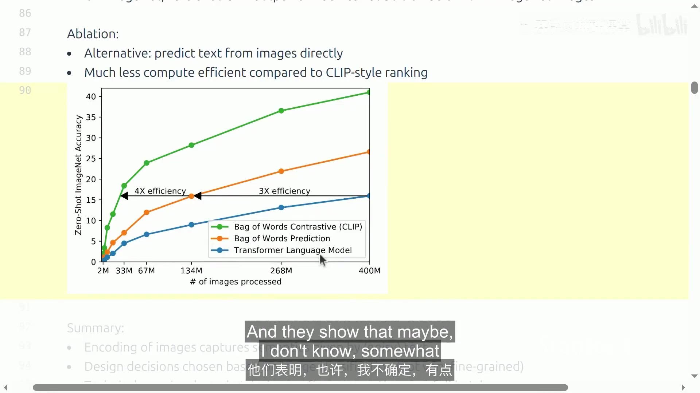

课程对 CLIP 的总结是：它通过噪声文本监督捕捉图像语义；在 ImageNet 上，zero-shot CLIP 超过了使用 **1.2M ImageNet images** 训练的 ResNet-50 基线。同时，它的设计主要面向分类/高层语义，对 OCR 等细粒度信息并不理想。技术上还依赖很大的 batch，并需要在整个 batch 上做 softmax。

## 3. SigLIP：把全 batch softmax 改成独立二分类

SigLIP（Sigmoid Loss for Language Image Pre-Training）保留图文对齐思想，但把目标改写得更局部：

- CLIP：对一个文本/图像，在整个 batch 的候选中做 multiclass classification；
- SigLIP：对每个 `(text, image)` pair 独立判断“aligned / not aligned”。

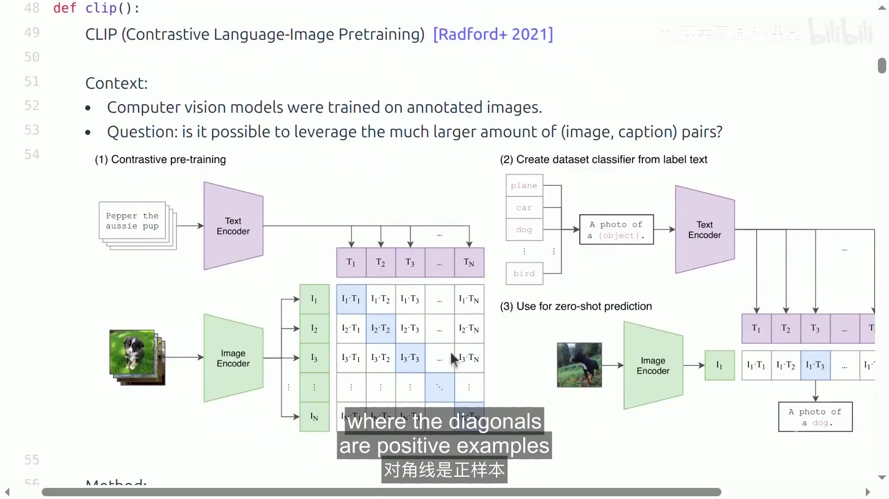

这项改变的工程意义很大。CLIP 的 loss 把 batch 中所有样本耦合在一起；SigLIP 的 pairwise binary loss 更容易跨设备并行，batch size 也不再由 loss 结构强绑定。

课程列出的数据与训练细节包括：

- WebLI 数据规模为 **O(billion)** 的 image-text pairs；
- 来自互联网抓取；
- 用自动 OCR 抽取图像中文字；
- 仅保留质量最高的 **10%**；
- 支持 **100 languages**。

课程给出的效率对比是：CLIP 约 **10 days on 256 TPUv3**，SigLIP 约 **5 days on 32 TPUv4**。讲义还指出 SigLIP 在 batch size `<16K` 时优于 CLIP；实验把 batch 做到 `1M`，但约 `32K` 已经足够。

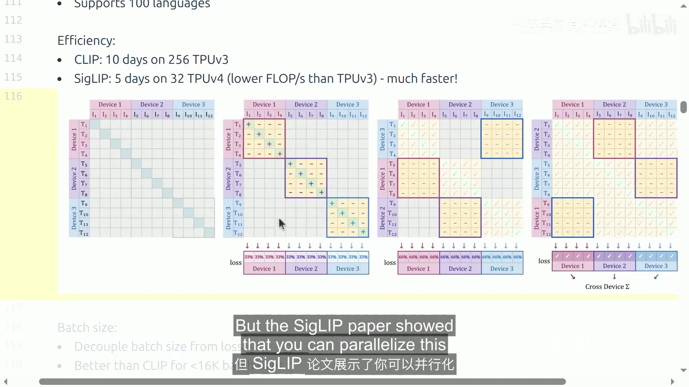

这一节的关键在于 objective 的依赖结构会直接影响系统并行方式和有效 batch size。后续 VLM 大量采用 SigLIP/SigLIP-2 作为 vision encoder，也说明这种视觉表征已经成为成熟组件。

## 4. LLaVA：vision encoder + projector + language model

LLaVA（Large Language and Vision Assistant）给出了非常清晰的 VLM 基本模板：

```text
image → vision encoder → projector → language-model embedding space → LM
```

第一版 LLaVA 使用 CLIP 作为 vision encoder，文本 decoder 是 Vicuna。它的重要贡献之一是通过 GPT-4 合成视觉 instruction data：MS COCO 提供图像、bounding boxes 和人工 caption；把 caption 或 detected objects 提供给 GPT-4，生成问题、对话等，再与原始图像配对。课程给出的规模是 **158K examples**。

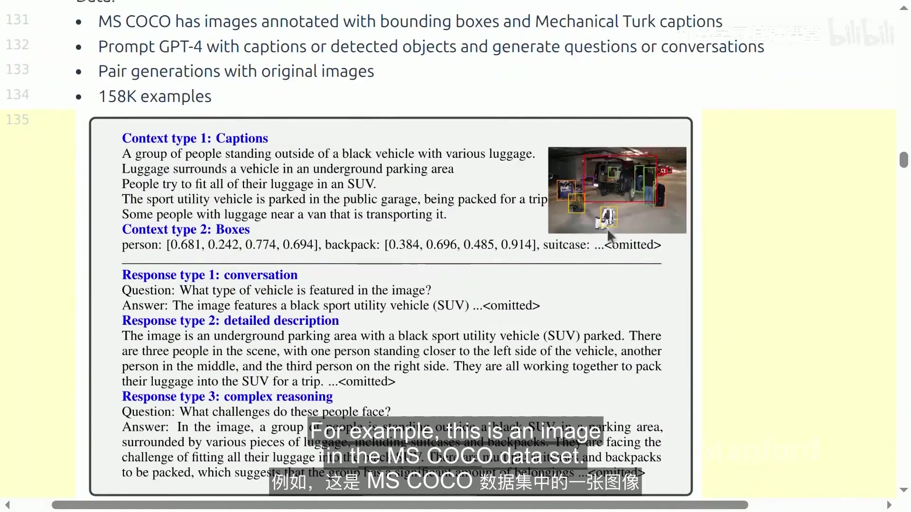

模型侧使用 CLIP `ViT-L/14` 编码图像，再用一个线性投影矩阵 $W$ 把视觉特征映射到语言模型 embedding space。Flamingo、Q-Former 等方法可以用更复杂的跨模态连接结构，而 LLaVA 强调最简单的 projector 也能工作。

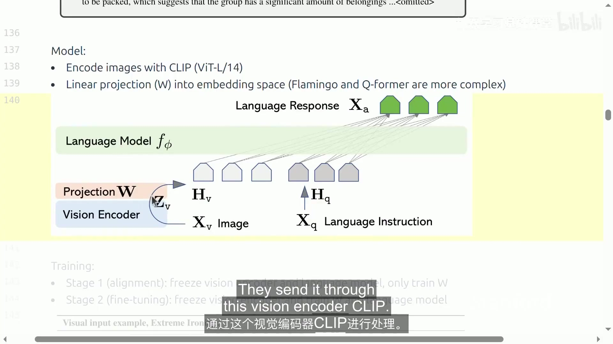

训练分两阶段：

1. **Stage 1 — alignment**：冻结 vision encoder 与 language model，只训练 $W$；
2. **Stage 2 — fine-tuning**：冻结 vision encoder，训练 $W$ 与 language model。

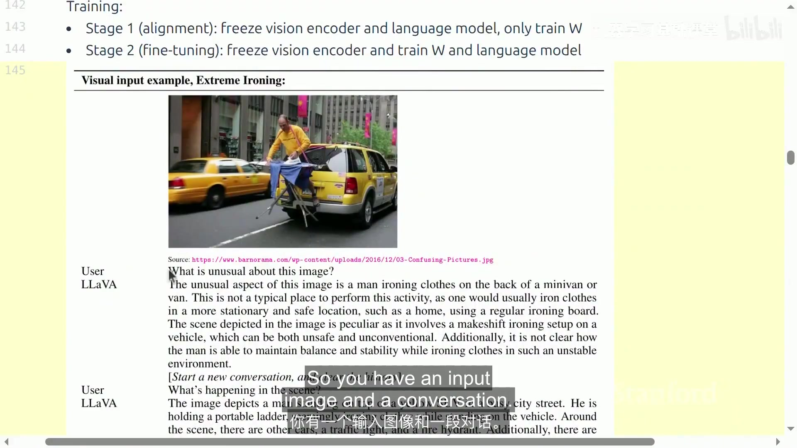

这套模板形成后，后续系统的大量工作转移到三个方向：更好的 vision encoder、更好的 projector/adapter、以及更大规模、更高质量、更合理混合的多模态数据。

## 5. LLaVA-OneVision：高分辨率、多图与视频

LLaVA-OneVision 延续标准 VLM 模板，但把目标从“单图问答”扩展到 single image、multiple images 和 video。课程材料中的配置是：

- vision encoder：**SigLIP**，使用最后 Transformer layer 前后的 grid features；
- text decoder：**Qwen-2 72B**；
- projector：**2-layer MLP**。

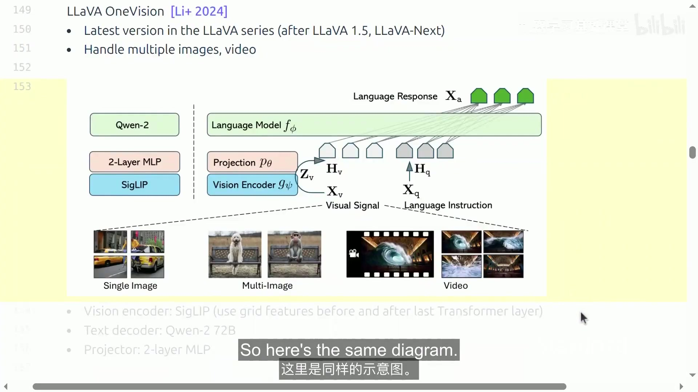

### 5.1 AnyRes：不要先把细节裁掉

OCR、文档理解等任务对分辨率非常敏感。CLIP 固定 resize/crop 到 `336×336` 会直接丢信息。AnyRes 的做法是根据原图宽高选择 $a\times b$ 个局部块，每块匹配 vision encoder 的输入分辨率，分别编码后再拼接；若产生的 token 太多，再通过 bilinear interpolation 控制长度。

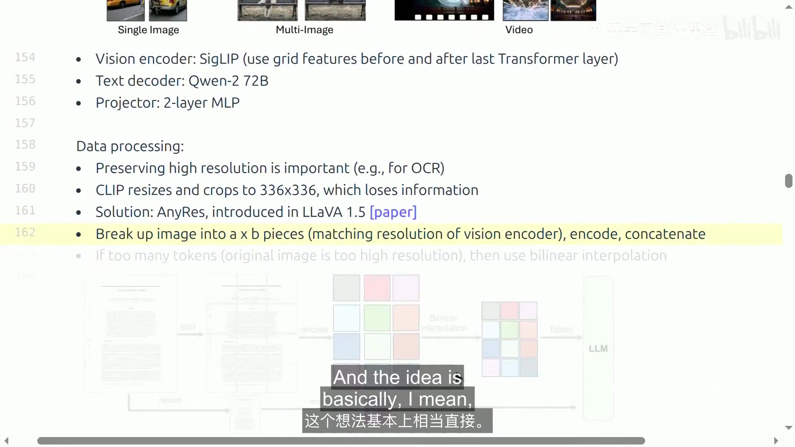

这个设计揭示了多模态建模里的一个常见矛盾：更高视觉分辨率保留更多信息，但也产生更多 visual tokens，直接增加 Transformer 上下文和计算成本。

### 5.2 让不同模态产生“可控的 token 长度”

OneVision 同时处理三类输入，并尽量让它们产生相近数量级的 token：

- single image：允许较高分辨率；
- multiple images：每张图用 base resolution；
- video：每帧使用更低分辨率。

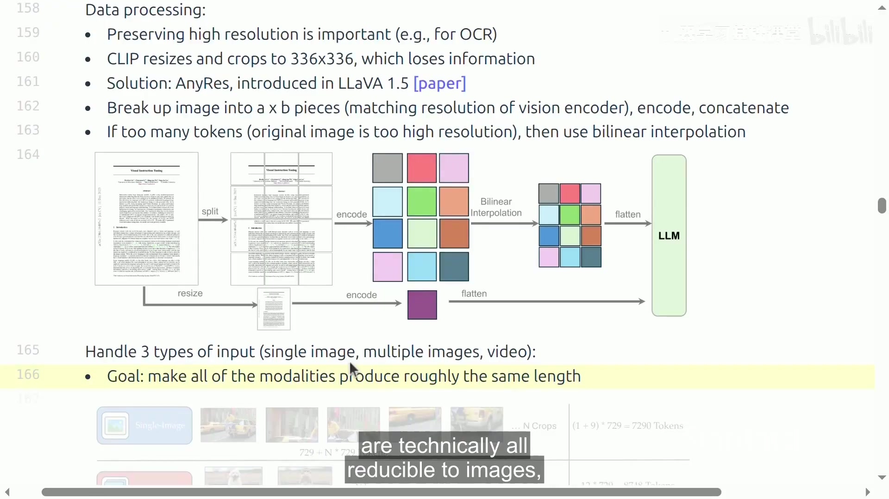

视频天然包含大量相邻、重复信息。如果给每一帧与单图同等高分辨率，视频 token 会迅速淹没文本和其他模态。这一点在 Qwen3-VL 的 loss normalization 和课程总结中再次出现。

### 5.3 数据：quality over quantity；训练：easier to harder

OneVision 对数据的表述是 **quality over quantity**。训练则按 **easier to harder** 的思路逐步加入更复杂任务与模态。

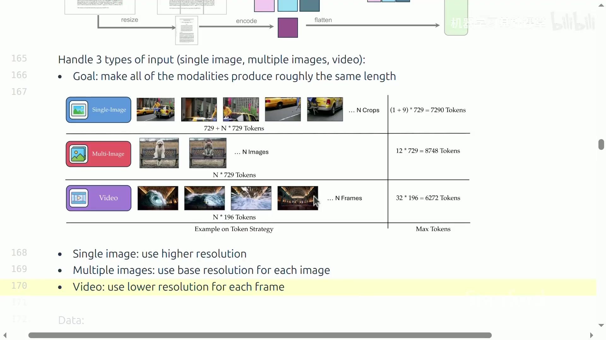

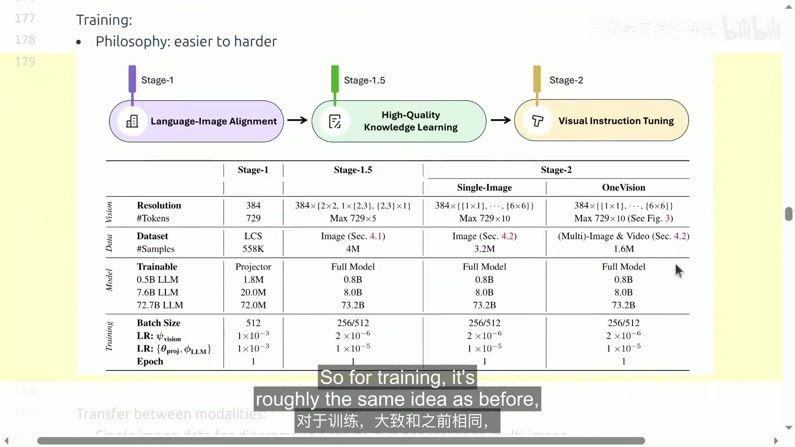

课程特别强调跨模态 transfer：

- 单图的 diagrams/charts 数据可以迁移到 multi-image 推理；
- 单图 OCR + multi-image relational reasoning 可以迁移到 GUI agent 场景；
- 单图中的 visual prompting（例如圈出区域）可以迁移到视频。

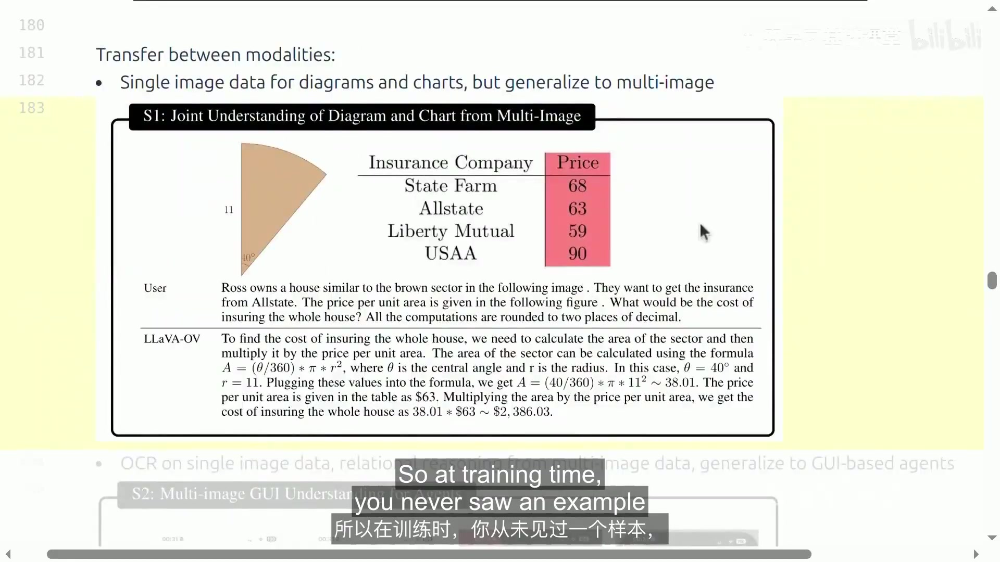

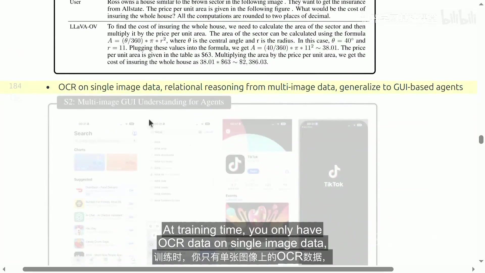

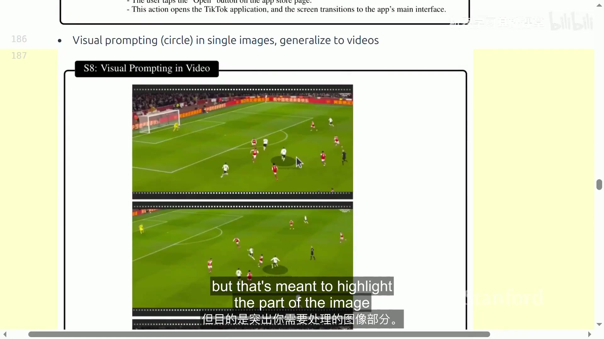

因此 OneVision 一节最值得记住的结论是：VLM 架构本身已经相当标准，真正昂贵的工作大量集中在 **data curation、合成 task-specific data、分辨率/token budget 设计以及训练 curriculum**。

## 6. Qwen-VL：跨注意力 adaptor 与三阶段训练

Qwen-VL 使用 OpenCLIP 的 ViT-bigC 作为 vision encoder。它的 adaptor 是一层 cross-attention，带 2D positional encodings，把视觉表示映射成固定长度 `256`；同时引入 ``、`<box>`、`<ref>` 等特殊 token。

训练分三阶段：

1. 大规模、较低质量数据：冻结 LM，训练 vision encoder + adaptor；
2. 更高质量、task-specific 数据，并提高图像分辨率：训练全部参数；
3. instruction tuning：冻结 visual encoder，训练 adaptor + LM。

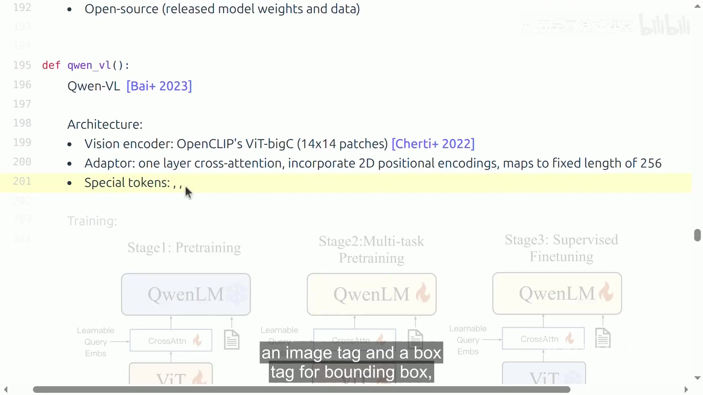

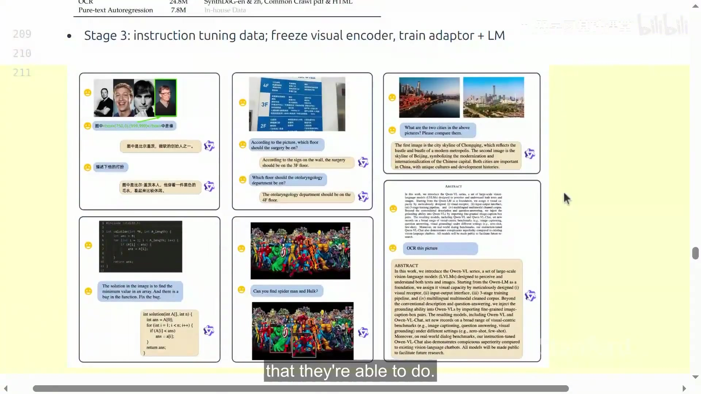

它与 LLaVA 的差别主要体现在 adapter 结构、数据与训练流程，而整体范式仍然是“视觉编码后注入语言模型”。

## 7. Qwen2-VL：dynamic resolution 与 MRoPE

Qwen2-VL 把 vision encoder 扩大到 **675M**，重点解决不同图像/视频分辨率带来的 tokenization 问题。

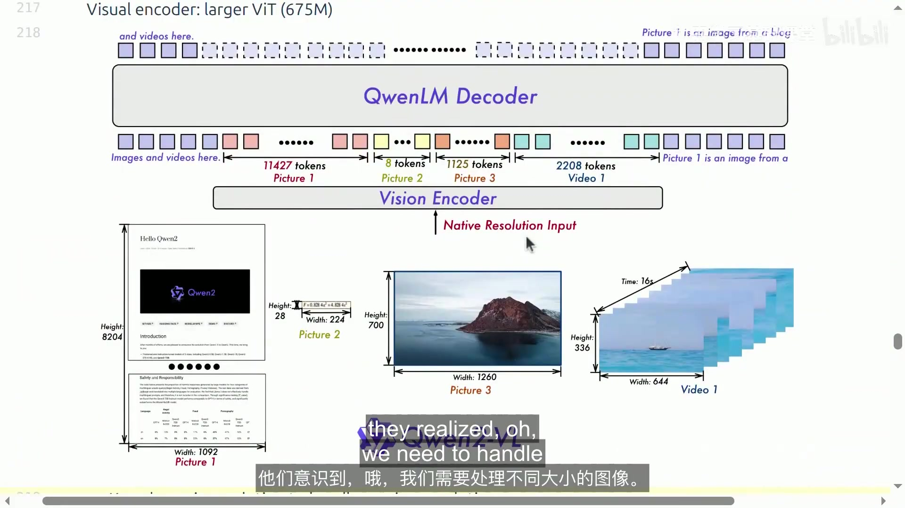

### 7.1 Dynamic resolution

课程材料给出的处理方式是：每个 `224×224` patch 用 `ViT/14` 编码，再把 `2×2` 相邻表示压缩，得到约 **66 tokens**。视频按 **2 frames/sec** 采样，并设置最多 **16384 tokens**。

这里的思想与 AnyRes 一致：视觉输入不能简单压成统一的小正方形；模型需要允许 resolution 动态变化，同时控制进入语言模型的 token 数量。

### 7.2 Multimodal Rotary Position Embedding

Qwen2-VL 引入 **MRoPE（Multimodal Rotary Position Embedding）**，把视觉/视频的空间和时间结构编码进位置表示。

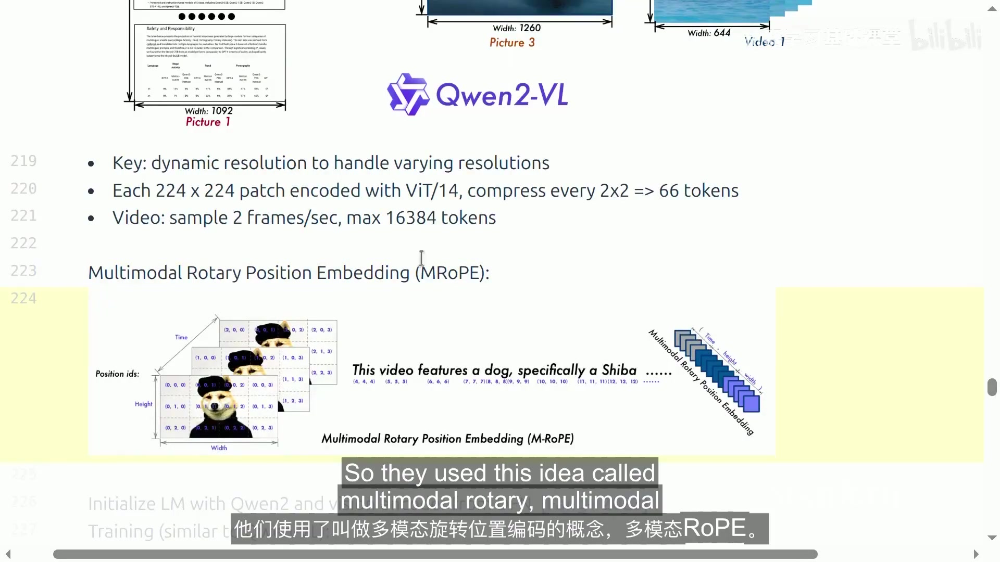

初始化时，language model 来自 Qwen2，vision encoder 来自 DFN。训练仍是熟悉的三段式：先只训练 visual encoder，再训练全部参数，最后在 instruction-following data 上训练 language model。

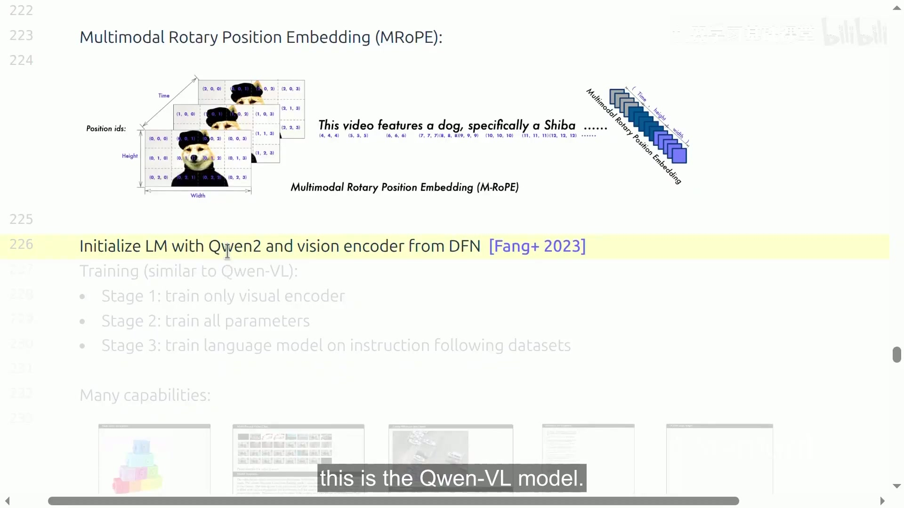

## 8. Qwen3-VL：长上下文、显式时间与更深的视觉融合

Qwen3-VL 延续 Qwen 系列的大框架，同时增加几个看似局部、实际影响很大的设计。

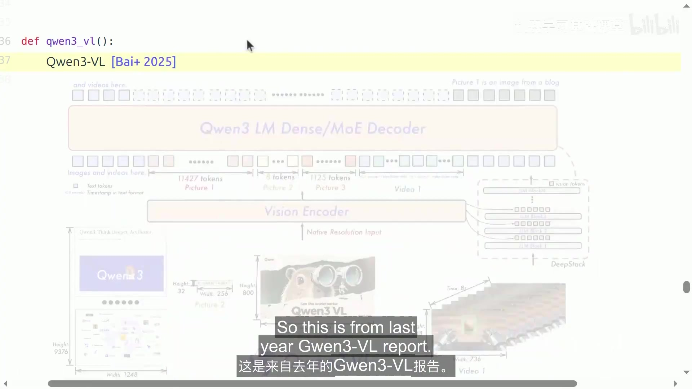

### 8.1 Language model 与 vision encoder

课程材料列出：

- Qwen-3 系列既有 dense，也有 MoE，最大示例达到 **235B-A22B**；
- long context 扩展到 **256K**，对长视频尤其重要；
- vision encoder 使用 **SigLIP-2**，架构与 SigLIP 兼容。

### 8.2 Interleaved MRoPE 与显式 video timestamp

旧式分配可以把 position dimensions 成块分给 time、width、height；问题是 RoPE 的不同维度对应不同频率，成块分配可能导致某个轴集中在某一段频率。Qwen3-VL 采用 interleaved MRoPE，使三个轴都能接触低频和高频维度：

```text
[t w h t w h t w h ...]
```

而不是：

```text
[t t t t ... w w w w ... h h h h ...]
```

此外，视频时间不只隐含在 positional encoding 中，还把 `0 seconds` 等时间戳作为显式 token 注入，方便模型直接引用“第几秒发生了什么”。

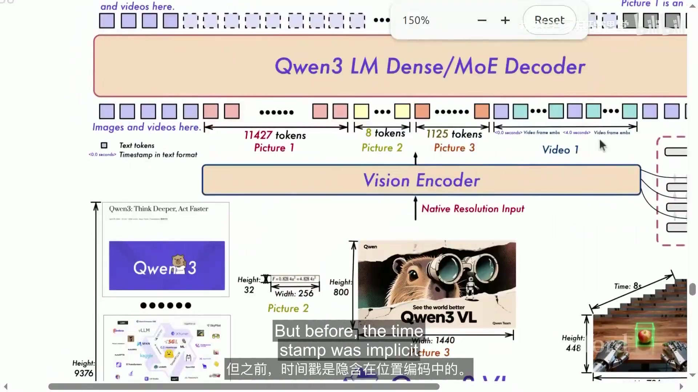

### 8.3 Square-root-normalized per-token loss

视频样本通常远长于单图样本。若每个 token 贡献相同权重，长视频样本容易在总 loss 中占据过大比例。课程材料把解决方案写作 **square-root-normalized per-token loss**；Percy 的口述解释是按样本长度的平方根做归一化/降权，避免长视频支配训练。讲义没有给出一个需要逐符号记忆的 closed-form 公式，核心是模态与长度的 loss balancing。

### 8.4 DeepStack：视觉信息进入多层 residual stream

早期 LLaVA 的 adapter 只是线性投影；后来出现 MLP、cross-attention。Qwen3-VL 使用 **DeepStack**：vision encoder 已经产生多层视觉表示，因此把这些表示注入 language model 的多个层，而不是把 vision encoder 当成只输出一串最终向量的黑盒。

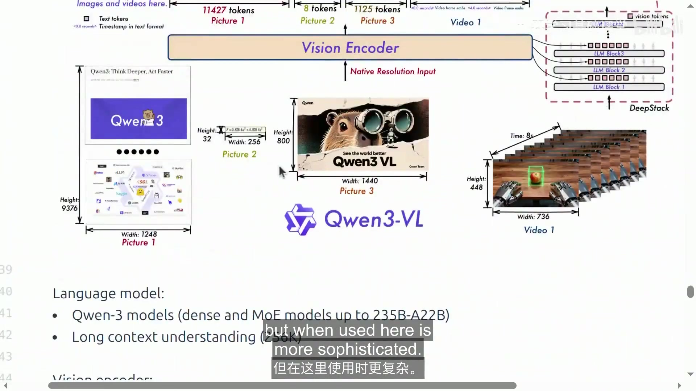

### 8.5 更复杂的训练 pipeline

Qwen3-VL 的 pre-training 有四个阶段：先训练 adapter，然后在逐步增长的上下文长度上训练全部参数，课程材料列出 `8K → 32K → 256K`。post-training 包含 long-CoT SFT、knowledge distillation 和 RL。

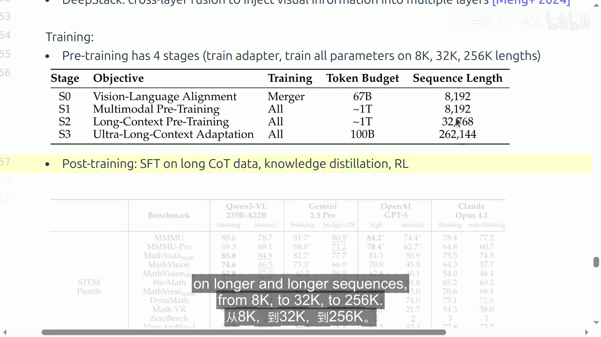

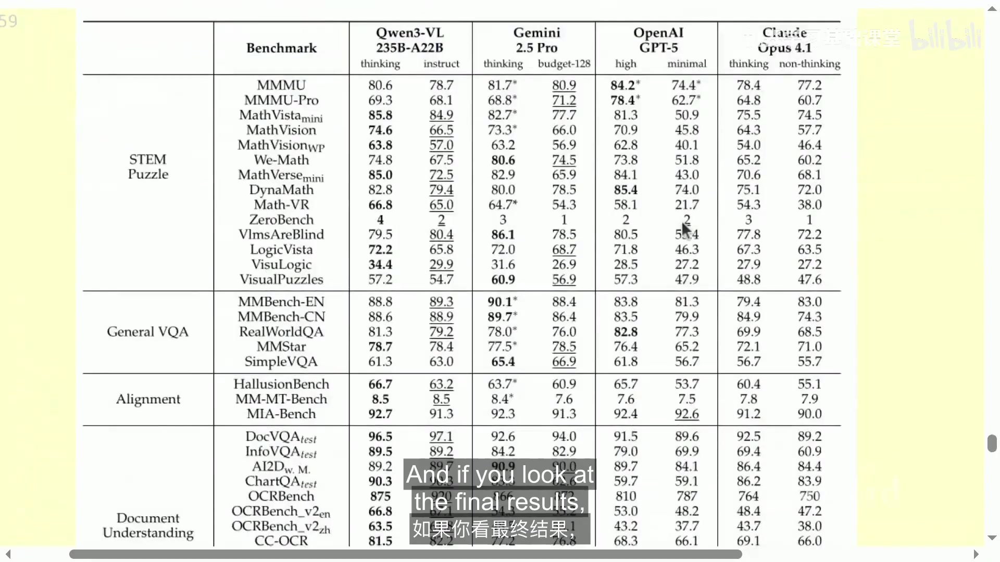

Percy 对这一代模型的评价很务实：整体 framework 没有被彻底改写，进步来自模型 scale、更细的数据策划、long-context 支持和若干架构改进；公开报告往往详细展示结果，却很少完整公开 data mixture 的细节。

## 9. 课堂问答：多模态训练中的系统与对齐问题

Qwen3-VL 后有一段约数分钟的课堂问答，补充了 executable lecture 中没有展开的工程信息。

### 9.1 这些 VLM 会生成图像或视频吗？

截至前面介绍的 CLIP/LLaVA/Qwen-VL 路线，多模态主要发生在 **input side**；模型最终仍生成 text。SFT 等阶段通常直接监督目标 token，描述质量主要由数据决定；进入 RL 后才可以设计不同 reward。真正的图像/视频生成需要 diffusion head、离散图像 token 等另一套机制，后面的 Chameleon 正好提供一个对照方案。

### 9.2 系统侧为什么更难？

视频数据本身很大，**data loading 就可能成为 bottleneck**。纯文本 LM 训练中，加载 token 往往相对便宜；视频训练必须认真处理数据吞吐，并让 I/O/data loading 与 GPU computation 异步重叠。

同时，视频会产生更多 token，因此训练时需要显式控制不同模态的权重。Qwen3-VL 的 length normalization 是一种方案，也可以在 data mixture/loss 中进一步 downweight 某些模态。

### 9.3 alignment 阶段为什么要求预训练好的 LM？

Percy 的回答是：language model 必须已经 pre-trained，alignment 的目标才有意义。典型 stage 先冻结 LM，只训练 adapter，把给定 vision encoder 的表示对齐到给定 language model 的表示空间。课堂举例使用一个固定 **67 billion tokens** 的训练 budget；这个数字同时由本地字幕与视频硬字幕核验。

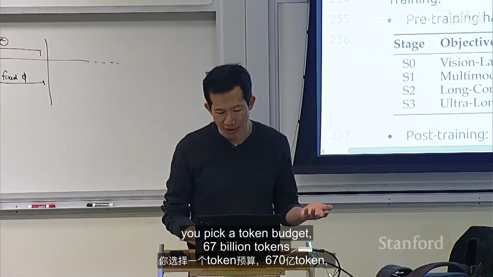

### 9.4 为什么 vision encoder 通常比 LM 小？

教师的解释是，vision encoder 很多计算是相对局部的 patch-level perception；大量知识、组合推理与最终能力仍集中在 language model。课程中举到的 ViT 通常不到 billion-parameter 量级，而 Qwen2 级别的语言模型可以达到几十 billion parameters；projector 更小。

## 10. Chameleon：把图像也变成离散 token

前面的 VLM 使用 CLIP/SigLIP 一类连续视觉表示注入 LM。这种结构天然擅长“看图后生成文本”，但 LM 本身不能直接输出图像。Chameleon 提出一个非常统一的方案：**把所有模态都映射成离散 token**，然后用一个 autoregressive model 同时建模文本和图像 token。

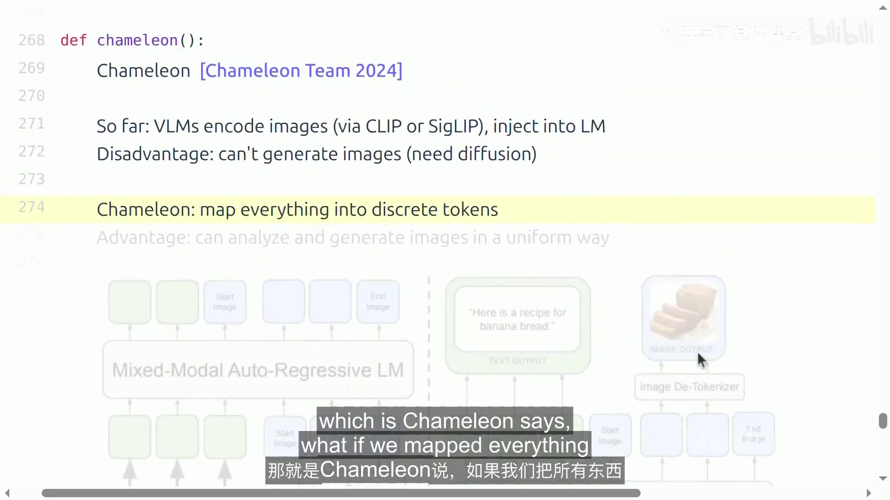

这样一来，输入和输出可以自由交错：先给文字，再生成图片，再继续生成文字。概念上很接近 omni model 的“模态都生活在同一个 token space”。

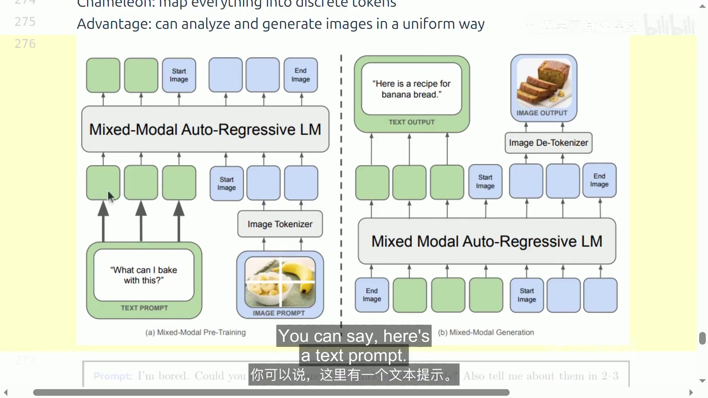

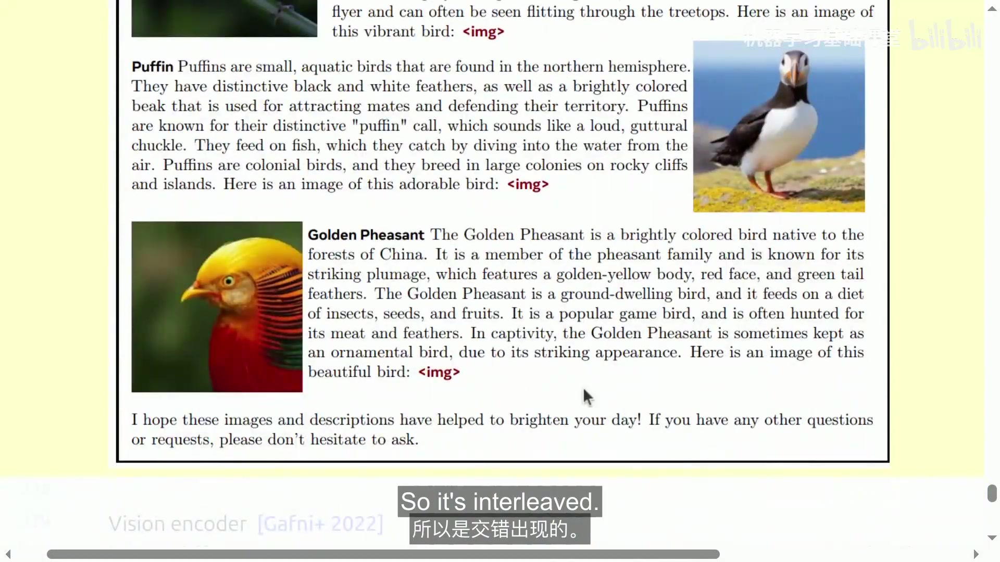

### 10.1 VQ-VAE：从连续图像到离散 codebook

Chameleon 的视觉编码器需要输出可以自回归生成的离散 token。它使用 VQ-VAE（Vector Quantized Variational Autoencoder）式思路：

1. encoder 把图像局部映射到连续向量；
2. 每个向量量化到 codebook 中最近的离散 code；
3. decoder 从这些 code 重建图像；
4. 通过 reconstruction objective 等训练编码/解码系统。

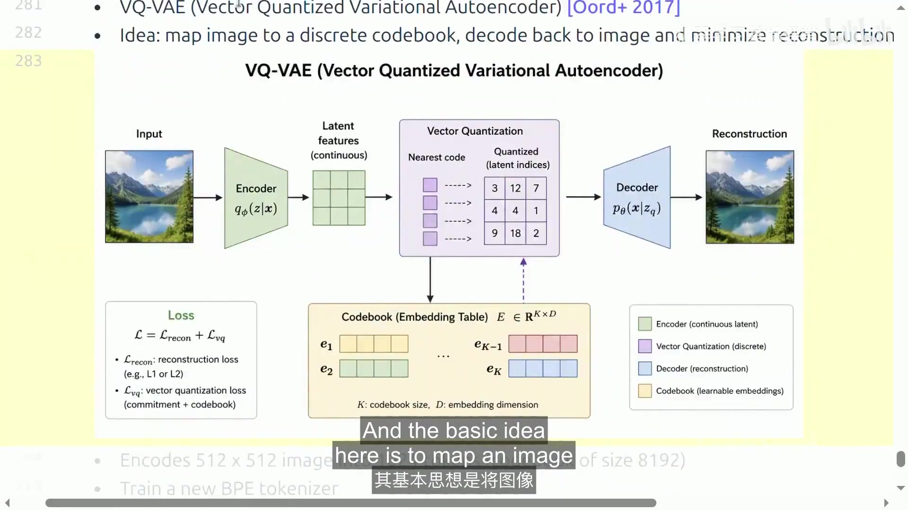

课程材料给出的 Chameleon 配置是：`512×512` 图像编码成 **1024 tokens**，codebook size 为 **8192**。Percy 口述时把它近似说成“8,000 codes”。模型还重新训练 BPE tokenizer，使文本与图像离散 token 可以一起进入序列。

### 10.2 训练数据与稳定性

Chameleon 的 stage 1 占约 **80%** 训练，使用大规模非监督混合数据：

- **2.9T text tokens**；
- **1.5T text/image tokens**；
- **400B interleaved text/image tokens**。

Stage 2 占约 **20%**，数据混合为 `50% stage-1 data + 50% high-quality data`。

统一离散 token 很优雅，但文本和图像 token 的统计性质差异很大。文本 next-token entropy 相对低，图像细节的 entropy 高得多；混合训练会导致 parameter norm growth 与 logit drift。课程列出的稳定化手段是 **QK norm** 与 **z-loss regularization**。

Chameleon 的代价也很明确：离散化会损失细粒度信息，OCR 是直观例子；多模态联合训练仍然困难。随着 diffusion models 成为高质量视觉生成的主流，把图像完全离散化再用单一 autoregressive Transformer 生成的路线不再是唯一选择。

## 11. 贯穿整讲的设计原则

Percy 最后把多模态建模收束成几条工程判断。

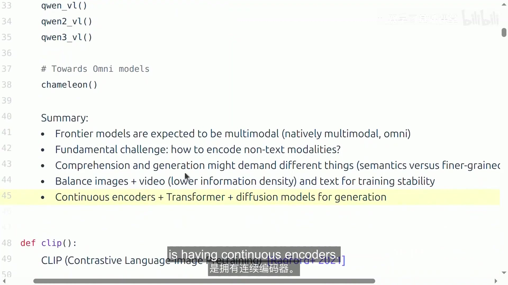

### 11.1 核心问题是如何编码非文本模态

Transformer 主干相对稳定，真正变化巨大的是：非文本数据被怎样压缩成 token/embedding、保留多少细节、产生多少 token，以及这些 token 怎样进入 LM。

### 11.2 understanding 与 generation 对信息粒度的要求不同

用于 classification/semantic understanding 时，CLIP 风格表示可以高度压缩，只保留高层语义。OCR、精细定位和图像生成需要保留高频细节，因此更依赖高分辨率编码、dynamic resolution 或 diffusion 等机制。

### 11.3 模态混合必须考虑 information density

视频中相邻帧高度冗余，单位 token 的 information density 往往低于文本。若简单按 token 数平均计权，视频容易支配优化过程。OneVision 通过分辨率/token budget 控制，Qwen3-VL 通过 loss normalization，Chameleon 则直接暴露了不同模态 entropy 的训练稳定性差异。

### 11.4 当前实用组合仍然是“连续 encoder + Transformer + diffusion generation”

课程最后明确区分了课堂事实与教师推测：公开 frontier systems 常宣称 natively multimodal/omni，但实现细节并不完全公开。Percy 的推测是，当前强系统很可能仍依赖 **continuous encoder** 保留理解端信息、**Transformer** 负责核心序列推理，再用 **diffusion** 等生成器处理高保真非文本输出。

这也解释了为什么多年之后 CLIP/SigLIP 一类连续视觉 encoder 仍然重要：它们提供稳定、强语义的视觉入口；真正困难的部分转移到高分辨率、多帧/多图数据组织、跨模态融合、数据混合和生成端。

## 12. 模型演进速查

| 模型 | 视觉表示 / encoder | 接入 LM 的方式 | 课程强调的关键点 |
| --- | --- | --- | --- |
| CLIP | ResNet / ViT，重点 ViT-L/14@336 | 不直接接 LM；学习共享图文语义空间 | contrastive ranking、zero-shot、大 batch |
| SigLIP | SigLIP vision encoder | 同样先学视觉语义空间 | pairwise binary objective、更易并行、batch 更灵活 |
| LLaVA | CLIP ViT-L/14 | linear projection $W$ | 158K 合成 instruction data；两阶段 alignment/fine-tuning |
| LLaVA-OneVision | SigLIP | 2-layer MLP → Qwen-2 72B | AnyRes、多图/视频、quality over quantity、跨模态 transfer |
| Qwen-VL | OpenCLIP ViT-bigC | cross-attention adaptor，固定 256 | 三阶段训练、`/<box>/<ref>` |
| Qwen2-VL | 675M ViT | visual tokens → Qwen2 | dynamic resolution、MRoPE、2 fps video、16384 token cap |
| Qwen3-VL | SigLIP-2 | DeepStack 多层注入 | 256K context、interleaved MRoPE、显式 timestamp、length balancing |
| Chameleon | VQ-VAE 离散视觉 token | 文本/图像统一进入 autoregressive LM | 可统一理解与生成；离散化损细节、训练稳定性困难 |

## 13. 本讲引用的主要论文与项目

这些链接来自 Spring 2026 `lecture_17.py`，用于继续阅读；课程 Schedule 没有把它们标成 Lecture 17 的 required reading。

- CLIP — https://arxiv.org/abs/2103.00020
- OpenCLIP — https://arxiv.org/abs/2212.07143
- SigLIP — https://arxiv.org/abs/2303.15343
- WebLI — https://arxiv.org/abs/2209.06794
- LLaVA — https://arxiv.org/abs/2304.08485
- LLaVA-OneVision — https://arxiv.org/abs/2408.03326
- Qwen-VL — https://arxiv.org/abs/2308.12966
- Qwen2-VL — https://arxiv.org/abs/2409.12191
- Qwen3-VL — https://arxiv.org/abs/2511.21631
- Chameleon — https://arxiv.org/abs/2405.09818
- VQ-VAE — https://arxiv.org/abs/1711.00937

## 14. 复习时应抓住什么

如果只保留一条主线，可以把本讲理解为连续的接口设计问题：

```text
raw modality
  → representation / tokens
  → token budget and positional structure
  → adapter / fusion into LM
  → data mixture and training curriculum
  → text or non-text generation
```

CLIP/SigLIP 解决“图像怎样变成语义表示”；LLaVA/Qwen 系列解决“视觉表示怎样进入强 LM，并在多图、视频、长上下文下保持可训练”；Chameleon 则追问“能否把所有模态都变成一种离散 token，然后只训练一个自回归模型”。课程最后的答案偏向组合式系统：理解端尽量保留连续、高保真信息，核心推理仍交给 Transformer，生成端则采用最适合高维连续信号的机制。

Lecture 结束时 Percy 说明本讲没有对应 homework，并鼓励有兴趣的同学实际尝试训练这些多模态模型。
