---
workflow:
  name: ChatGPT-Web-Course-Note-Workflow
  version: v4.9.4
course:
  name: "CS336: Language Modeling from Scratch"
  term: "Spring 2026"
  instructors:
    - Tatsunori Hashimoto
    - Percy Liang
chapter:
  local_chapter: 18
  local_title: "Dan Fu"
  official_unit_label: "Lecture"
  official_unit_number: 19
  official_title: "Guest lecture: Dan Fu"
  official_date: "2026-06-03"
  speaker: "Dan Fu"
lecture_talk_title: "Inference: Turning Electricity into Intelligence"
provenance:
  local_video_sha256: "e63feeec84ee22835e7ce65b30559354041f3e2d3b4c7e32b88353c60b93c468"
  local_subtitle_sha256: "931c59e9d02b3919cf26a642bc04c94193b349068b269c8f1e98d988aa84ca0c"
  official_schedule: "https://cs336.stanford.edu/"
  official_video: "https://www.youtube.com/watch?v=9EEm4iMAF5s"
---

# Lecture 19 — Guest lecture: Dan Fu

> **Talk title:** *Inference: Turning Electricity into Intelligence*  
> **Local mapping:** P18 → official Lecture 19  
> **Date:** June 3, 2026  
> **Speaker:** Dan Fu (UC San Diego / Together AI)

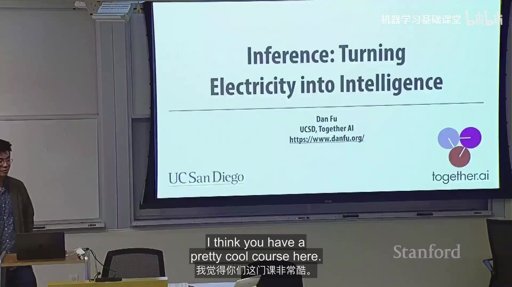

## 版本与资料说明

本地 P18 的视频与字幕经过时长、开场标题、讲者、内容和结尾交叉核验，对应 Spring 2026 官方 Schedule 的 **Lecture 19: Guest lecture: Dan Fu**，不是官方 Lecture 18。官方 Lecture 18 是 Daniel Selsam，因此从这一位置看，本地连续 P 编号与官方 Lecture 编号存在 `+1` 的偏移。

本讲在 Spring 2026 官方 Schedule 中没有独立的 lecture material 链接；官方 `stanford-cs336/lectures` 仓库也没有可明确归属于 Lecture 19 的独立课件。因而本笔记以本地同版本录像与字幕为主要生成来源，以官方 Schedule 和 Stanford Online 同版本录像确认章节身份，不把 Lecture 10 等“主题相关但不是本讲”的资料并入正文，也不把同日到期的 Assignment 5 当作本讲配套资料。

讲者在介绍 inference engine 的一组 overview slides 时明确说明，这些图是用 Nano Banana Pro 生成的：高层结构可用，但细看文字可能有错误。因此下文对这组图只提取讲者口述确认的结构与概念，不把图中难以核验的小字当作事实来源。

## 1. 核心命题：Inference 是把算力变成模型能力的“发动机”

Dan Fu 从一个宏观问题切入：今天语言模型能力的跃迁很大程度上来自 **scale**，而支撑这种规模的关键资源是 GPU。训练完成后，模型只是一个由数学算子构成的计算图；真正让它在用户请求上运行起来的，是 inference engine、GPU kernels、调度器、缓存系统与跨设备通信。

他用一个贯穿全讲的类比概括这一点：如果 GPU 像“新石油”，那么 inference 就是把能源转成有用输出的发动机。对模型系统研究者而言，理解 inference stack 的价值不只是“把已有模型跑快一点”，还在于它能反向改变模型算法本身的设计空间。

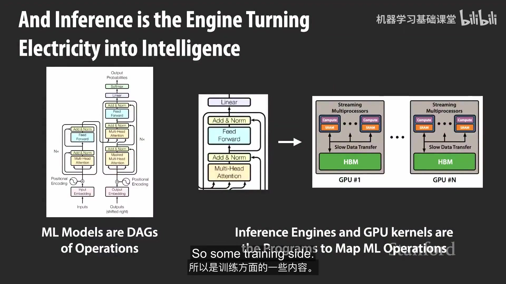

讲者给出的主线可以压缩为三层：

1. 先看一个 token 在在线服务中的完整生命周期；
2. 再深入 decode 路径，用 **Megakernel** 说明 kernel-level control 如何改变执行方式；
3. 最后回到模型结构，用 **Parcae / looped Transformer** 说明 systems constraints 如何反向影响 architecture。

## 2. 一个 token 的生命周期

一次请求进入推理服务后，并不会直接“喂给模型”。系统首先要回答一系列资源与状态问题：

- 请求属于什么 workload，输入/输出长度大致如何？
- 现在应该把它放到哪台机器、哪个 GPU、哪个 batch？
- 能否命中已有的 KV cache / prefix cache，从而跳过部分重复计算？
- prefill 和 decode 是否在同一组设备上？
- 模型是否需要 tensor parallelism、expert parallelism、context parallelism 等跨设备切分？
- 在延迟约束下，如何尽可能提高 GPU 利用率？

这也是本讲最重要的 systems 视角：**模型拓扑并不能唯一决定真实执行过程**。请求分布、SLA、缓存命中、设备拓扑和调度策略共同决定最终路径。

### 2.1 Workload 与 SLA 决定优化目标

生产流量不是固定长度的独立样本。coding assistant、summarization、chat、agentic loop 等应用会产生不同的输入长度、输出长度、到达模式和会话复用模式。系统因此需要同时考虑两类常见指标：

- **TTFT (time to first token)**：从请求到首 token 的延迟；
- **TBT (time between tokens)**：生成阶段相邻 token 的间隔，也可理解为交互式 decode 的流畅程度。

不同 workload 对两者的容忍度不同，因此“最大吞吐量”不是唯一目标。一个 serving system 往往是在延迟 SLO/SLA 约束下最大化有效利用率。

## 3. Prefill 与 Decode：同一个模型，两种很不一样的计算

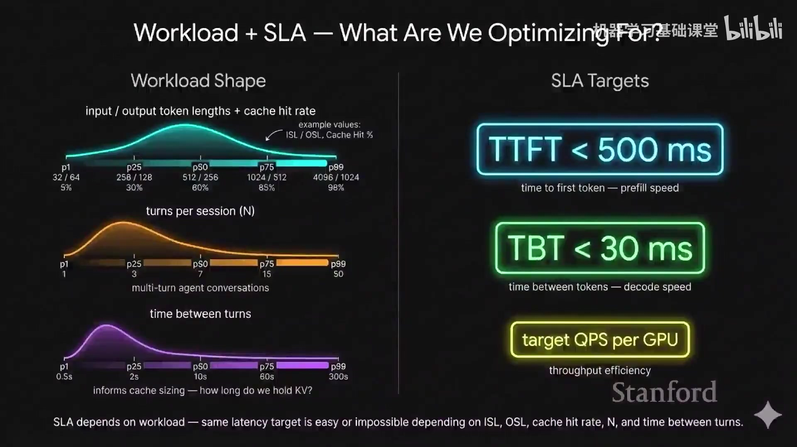

请求进入模型后，可以把主要计算分成两段：

**Prefill** 一次处理大量此前未计算过的 prompt token，矩阵规模较大、并行度较高，通常更接近训练时的 forward pass，也更偏 compute-bound。

**Decode** 则一次只生成一个新 token。每一步都要读取模型权重和已有 KV cache，单步算术强度更低，因此更容易受到 memory bandwidth 和 kernel launch/同步开销限制。

这一区分解释了后面许多系统设计：continuous batching、KV cache 管理、prefill/decode disaggregation、Megakernel，实际上都在利用 prefill 和 decode 的不同瓶颈。

### 3.1 Continuous batching

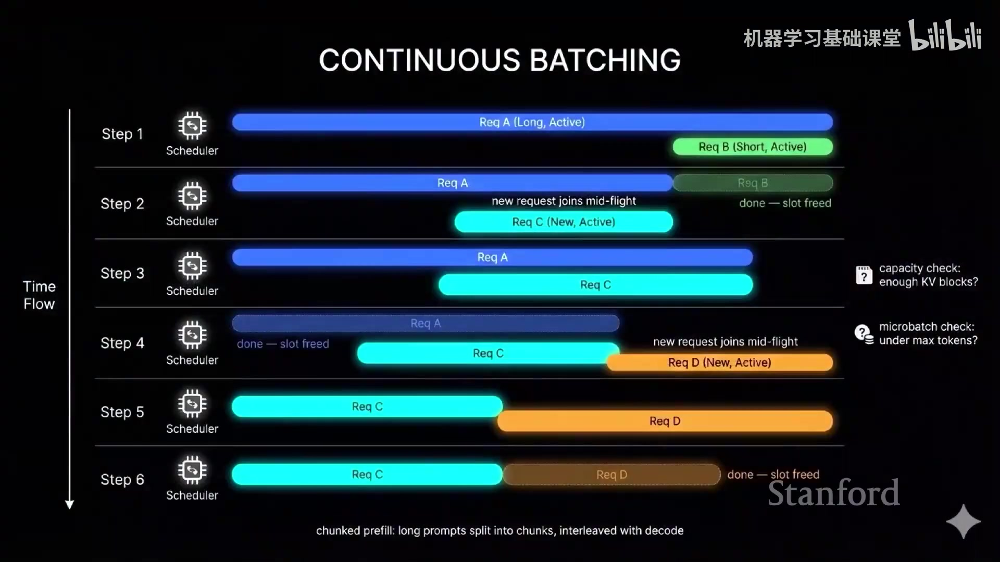

在线请求到达时间不同、长度也不同。如果像离线训练一样等待一个固定 batch 全部结束，会造成大量空洞。Continuous batching 允许：

- 已完成请求立即退出；
- 新请求动态加入；
- scheduler 在有限的算力和 KV-cache 容量下持续重组 batch。

因此调度问题不只是“有多少 FLOPs”，还包括“当前有哪些序列占用了多少 KV cache、还会生成多久、哪个请求必须先满足延迟约束”。

### 3.2 KV cache 与 prefix sharing

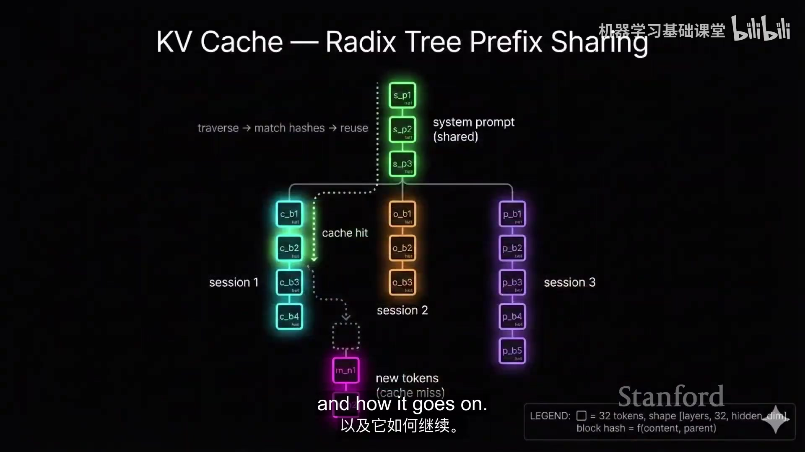

自回归生成会反复用到历史 token 的 key/value，因此缓存它们可以避免每一步重新计算历史上下文。进一步，如果多个请求共享前缀（系统 prompt、共同代码仓库、长文档模板等），系统还能共享已经算过的 prefix。

讲者用 radix-tree 风格的结构解释这件事：把 token prefix 组织成可检索的树，命中越长，就能复用越多 prefill 结果。这个机制在 agentic workload 中尤其重要，因为同一会话会反复带着大段相同上下文回来。

### 3.3 模型并行与 Prefill/Decode Disaggregation

随着模型变大，一个 request 往往跨多个 GPU 执行。讲者依次讨论了 tensor parallelism、expert parallelism，以及针对不同 token/上下文维度的切分方式。这里的共同目标是：在模型容量、通信量、batch size 和单步延迟之间找到平衡。

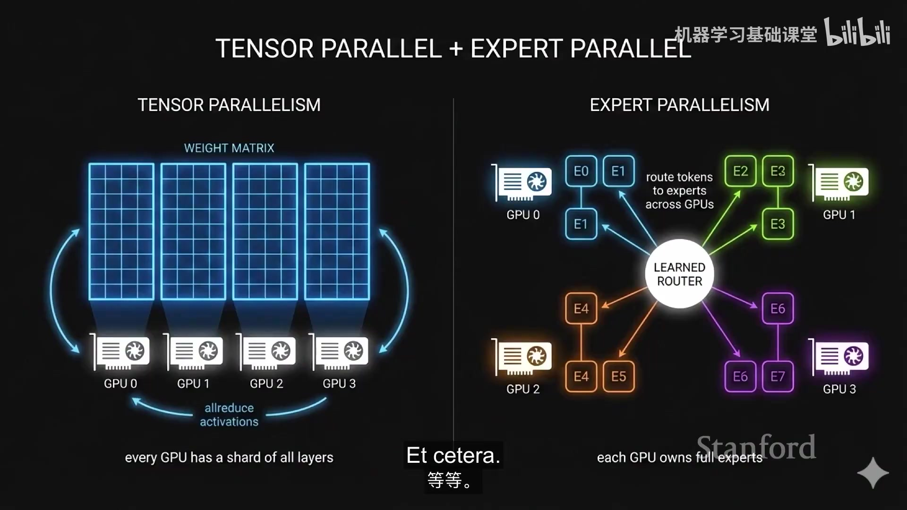

由于 prefill 更偏 compute-bound、decode 更偏 memory-bandwidth-bound，把两者分配到不同 worker pool 可以独立扩缩容，并允许使用不同硬件和调度策略。这个思路随后进一步发展为 **cache-aware prefill-decode disaggregation (CPD)**：

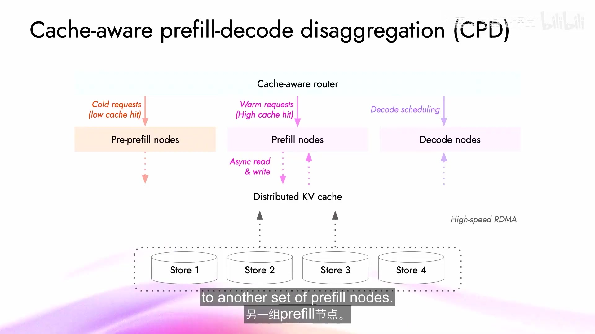

- cache hit 低的 cold request 先进入 pre-prefill 路径；
- cache hit 高的 warm request 直接路由给合适的 prefill nodes；
- distributed KV cache 通过高速互联共享状态；
- decode nodes 再按 decode workload 独立调度。

关键点不是某一个固定拓扑，而是 **把 cache state 也纳入 routing decision**。当 prefix reuse 很强时，“把请求发到最空闲的 GPU”未必是最优策略；可能应该优先发到已经拥有相关 KV state 的位置。

## 4. KV cache 也是一个存储系统

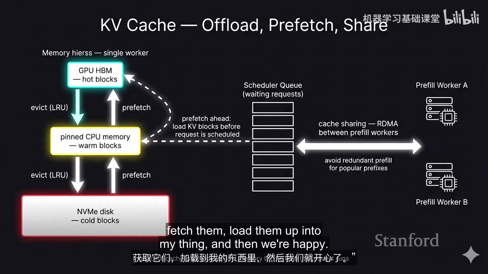

当上下文变长、并发变大后，KV cache 本身会成为显存容量瓶颈。讲者把它类比为操作系统的 memory hierarchy：

- GPU HBM 保存 hot blocks；
- pinned CPU memory 保存 warm blocks；
- NVMe / 更低层存储保存 cold blocks；
- eviction 与 prefetch 决定数据什么时候上下移动；
- scheduler 可以利用即将到来的请求提前 prefetch；
- 多个 prefill worker 之间还可以共享缓存，减少热门前缀的重复计算。

这意味着 serving engine 不只是 neural-network runtime，也越来越像一个面向 token state 的分层存储系统。

### 4.1 规模扩大后，罕见 bug 会变成日常问题

讲者用多个生产事故说明“极低概率错误 × 巨大请求量”的效果：NaN 可能导致异常重复 token，tool-call parsing 的 bug 可能让模型不断输出，kernel 的 off-by-one 也可能读取未初始化内存并产生奇怪字符。单次测试中几乎见不到的问题，到大规模 serving 时会不断出现。

因此 production inference 的正确性要求覆盖：数值稳定性、parser/protocol、kernel memory safety、cache state、跨节点失败与恢复，而不只是模型输出是否“看起来正常”。

### 4.2 Wide expert parallelism 与 fault tolerance

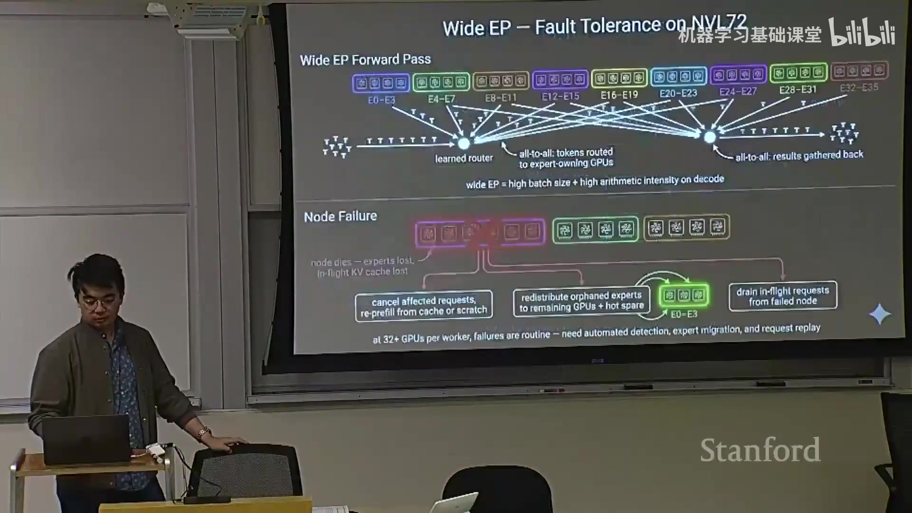

当 MoE inference 把 experts 分布到大量 GPU 上时，一个 node failure 可能同时意味着 expert 丢失、in-flight request 状态丢失、KV cache 丢失。讲者用 NVL72 的例子强调：设备数量增大后，故障会从“异常事件”变成系统必须常规处理的状态，因而需要自动检测、expert redistribution、request replay 等机制。

## 5. Megakernel：把 GPU 当作一个细粒度分布式系统

传统 eager / operator-by-operator 执行往往把一个 Transformer layer 拆成很多独立 kernel。对 decode 来说，每个 kernel 工作量可能很小，kernel launch、同步和 straggler/tail effect 就会变得显著。

讲者把 GPU 的多个 streaming multiprocessors (SMs) 看作可调度的 worker：如果能在一个更大的 kernel 内部显式编排多个依赖操作，就可以跨操作 overlap 工作，并减少反复 launch 的固定成本。

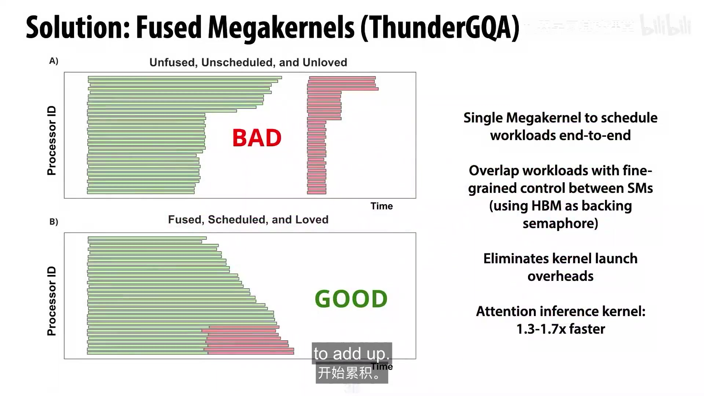

一个典型例子是把 attention、KV-cache load、projection、下一组 weight load 等阶段做细粒度 overlap。传统 kernel boundary 强迫这些阶段依次结束；Megakernel 则允许在依赖允许时让不同 SM 同时推进不同工作。

### 5.1 Whole-model 与 fine-grained overlap

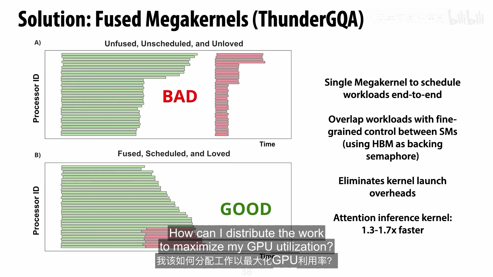

当融合范围继续扩大，可以把整个 layer 甚至更大的 decode 路径放入同一长期运行的 kernel 中。此时优化问题更像一个 scheduler：哪些任务已经 ready、哪些 SM 空闲、哪些内存传输可以提前发生。

讲者特别强调这种方式需要比 Triton 等较高层 DSL 更细粒度的控制，因此介绍了 **ThunderKittens** 一类更贴近硬件、但仍提供结构化抽象的 kernel library。收益来自控制能力，代价则是工程复杂度明显提高。

### 5.2 一个实测结果

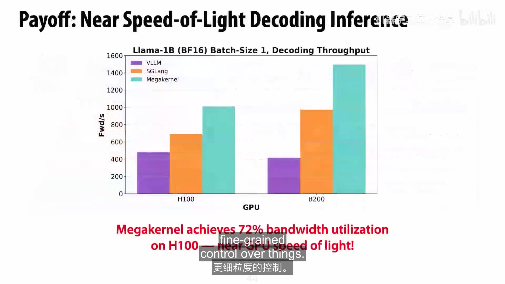

课件给出的一个结果是：在 **Llama-1B、BF16、batch size 1** 的 decode benchmark 中，Megakernel 在 H100 上达到约 **72% memory-bandwidth utilization**；图中也显示 H100 / B200 上的 forward/s 高于所列 vLLM、SGLang baseline。这里更重要的结论不是某个绝对吞吐数字，而是：当 decode 已经接近 memory-bandwidth ceiling 时，减少 launch/synchronization 并提高 overlap 可以显著逼近硬件上限。

讲者的总结是：**deep kernel control and understanding enables different compute paradigms**。也就是说，kernel optimization 在这里不只是“微调”，而是可以改变整个执行模型。

## 6. Parcae：把 systems 约束推进到模型架构

第二个研究例子从相反方向出发：如果 inference 的核心瓶颈之一是模型参数量、显存和跨 GPU 通信，那么能否用 **更少的独立参数 + 更多 recurrence** 换取类似的计算预算？

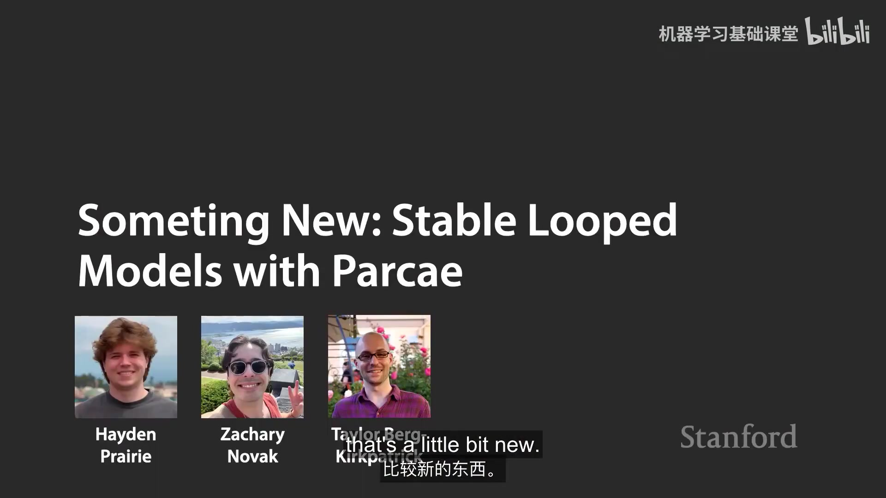

Looped Transformer 的基本想法是让一组 block 重复作用多次：参数只存一份，但推理时对 hidden state 多次迭代。这样可以在不线性增加参数量的情况下增加 FLOPs。潜在好处包括更小的 weight footprint、更大的 KV-cache 空间和更少的模型切分通信。

问题在于，朴素 recurrence 很容易训练不稳定。讲者展示的先前 looped model 对 learning rate 等超参数十分敏感，可能出现 activation 增长、loss spike 甚至 NaN。

## 7. 把 residual dynamics 写成一个动力系统

Parcae 的关键分析是把复杂 Transformer block 暂时抽象成 residual function，并显式写出线性状态部分。课件中的形式是：

$$
h_{t+1} = \bar{A}h_t + \bar{B}e + \bar{R}(h_t, e)
$$

其中：

- $h_t$ 是第 $t$ 次 recurrence 的 hidden state；
- $e$ 是输入/embedding 侧信号；
- $\bar{A}$ 和 $\bar{B}$ 控制线性 residual path；
- $\bar{R}(h_t,e)$ 把 Transformer block 中更复杂的 nonlinear computation 收进去。

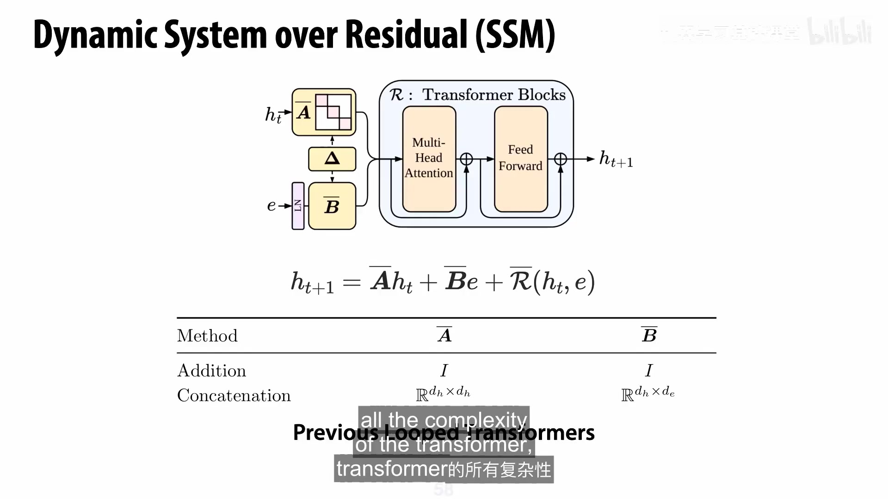

为了理解为什么反复循环会爆炸，先忽略 nonlinear residual，把系统线性化：

$$
h_{t+1} = \bar{A}h_t + \bar{B}e
$$

连续展开得到：

$$
h_{t+1}
= \bar{A}^{t}h_1
+ \left(\sum_{n=0}^{t-1}\bar{A}^{n}\right)\bar{B}e
$$

因此长期行为由 $\bar{A}^{t}$ 控制，而核心量是 $\bar{A}$ 的 **spectral radius** $\rho(\bar{A})$。

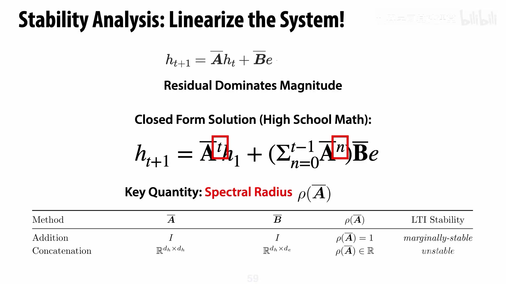

如果谱半径大于 1，某些方向会随 recurrence 指数放大；如果简单把 $\bar{A}=I$，系统又处在 marginally stable 的边界。Parcae 的思路不是希望 optimizer “自己学会稳定”，而是直接在参数化中加入稳定性结构。

### 7.1 Constrain A, B for stability

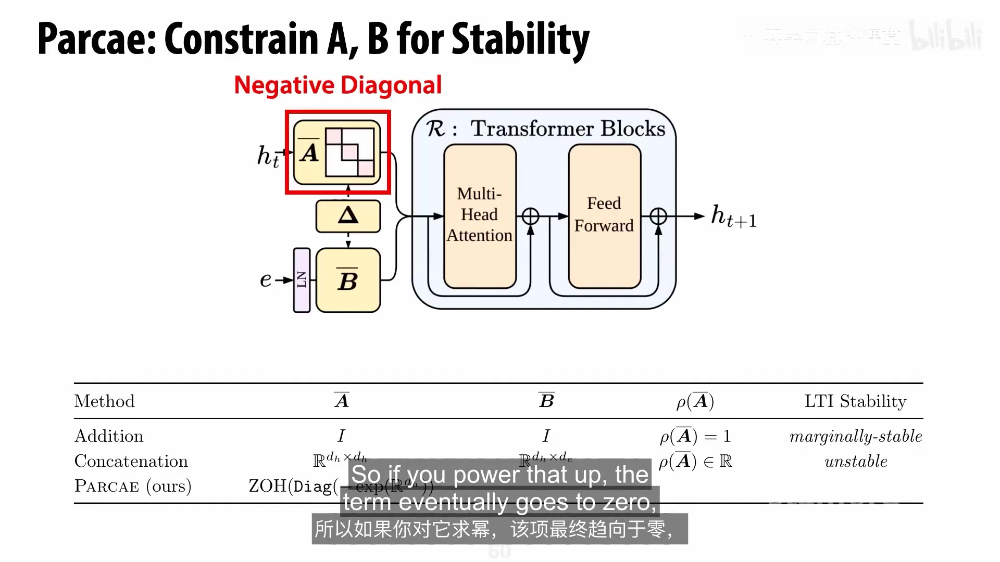

课件把 Parcae 的 $\bar{A}$ 设计为带稳定约束的 negative-diagonal 形式，并相应控制输入路径 $\bar{B}$。从动力系统角度看，这让反复迭代的 residual state 更倾向于收敛/受控，而不是任意放大。

实际训练曲线随后显示：稳定化后的系统在更大的 learning-rate 范围内不再出现此前的爆炸行为，同时最终质量也更高。这里的研究方法值得单独记住：

> 当深度被改造成 recurrence 后，训练问题可以重新解释为 dynamical-system stability 问题；一旦找到正确的状态变量和稳定性条件，就可以把约束直接写进模型参数化。

## 8. Scaling laws：什么时候应该增加 recurrence？

稳定只是第一步。真正的 architecture 问题是：给定参数量、数据量和 FLOP budget，应该增加独立层数，还是让同一组参数多 loop 几次？

讲者用 iso-parameter / iso-FLOP 实验观察最优 recurrence count 随 compute 增加的规律。课件给出的拟合显示 recurrence 本身也近似服从 power law：

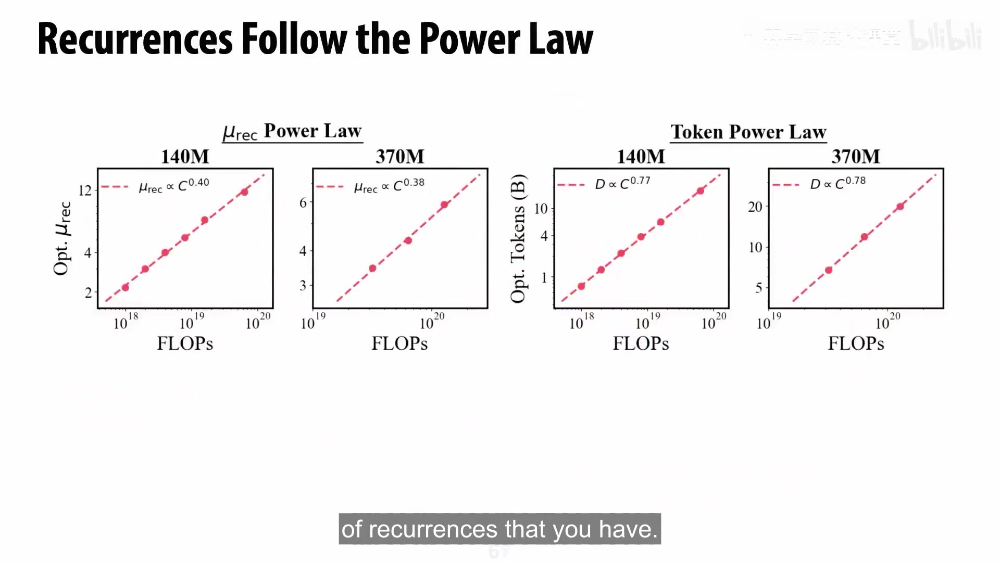

- 140M 参数设置中，最优 recurrence 均值近似 $\mu_{rec}\propto C^{0.40}$；
- 370M 参数设置中，近似 $\mu_{rec}\propto C^{0.38}$；
- 相应的最优 token 数也近似遵循 $D\propto C^{0.77}$ 与 $D\propto C^{0.78}$。

这里的解释不是“所有模型都应该无限循环”，而是：**在固定参数量的条件下，数据和计算预算增加时，最优 recurrence 也会系统性增加**。也就是说，传统“只增加独立层数/参数”的 scaling 不是唯一可行轴。

在讲者展示的固定 FLOP 比较里，适当 recurrence 可以把同样的计算预算转化成更低 validation loss。对 deployment 而言，这提供了一个额外自由度：有时我们希望模型参数更小，以换取更好的显存占用、通信成本或端侧可部署性，然后用更多循环补回计算量。

## 9. Q&A：模型与 serving 硬件应共同设计

最后十多分钟主要是问答，没有新的完整技术主线，但补充了几条很重要的设计原则。

### 9.1 能否给 pretrained model 直接加 loop？

讲者提到有人尝试在已有模型中重复少数层，在某些数学任务上观察到质量提升；他把这一现象描述为有趣但尚未充分理解的结果。这里应把它视作研究线索，而不是稳定可复现的通用方法。

### 9.2 Loop model 的 inference 好处首先来自 memory

如果参数更少：

- 权重占用更小，能腾出更多显存给 KV cache；
- 模型可能不需要跨那么多 GPU 切分，从而减少通信；
- 如果 recurrent block 足够小，理论上还能把整个循环放进非常紧凑的 kernel 执行路径。

因此“recurrence vs. parameters”并不只是训练侧的 compute-optimal 问题，也直接影响 serving topology。

### 9.3 Megakernel 的主要代价是工程复杂度

讲者直言，whole-model Megakernel 极其 labor-intensive。硬件、模型结构、batch-size 范围变化都可能要求重新调优，因此它更像极限性能工程，而不是可无成本推广的默认方案。更现实的趋势可能是在最关键的局部——例如 MoE layer 或特定 decode path——使用 Megakernel，而不是强行把整个模型融合成一个 kernel。

### 9.4 Hardware–model co-design

如果已知最终 serving hardware，模型设计应从 memory budget 开始：权重、KV cache 和中间状态能否放得下，会直接影响参数规模、attention 形式、量化格式和并行策略。讲者还把 workload 带回这一讨论：

- agentic loop 会重复访问长上下文，因此更看重 KV cache compression / reuse；
- 一次性 batch processing 对 KV cache 的敏感度低得多；
- 纯表示抽取任务甚至不一定需要 causal autoregressive decode。

所以“最优架构”必须连同部署硬件和请求分布一起定义。

## 10. 全讲总结

这堂 guest lecture 的主线可以归结为一句话：**要让语言模型真正高效地工作，需要把 model architecture、inference runtime、GPU kernel 和 hardware topology 看成一个共同优化问题。**

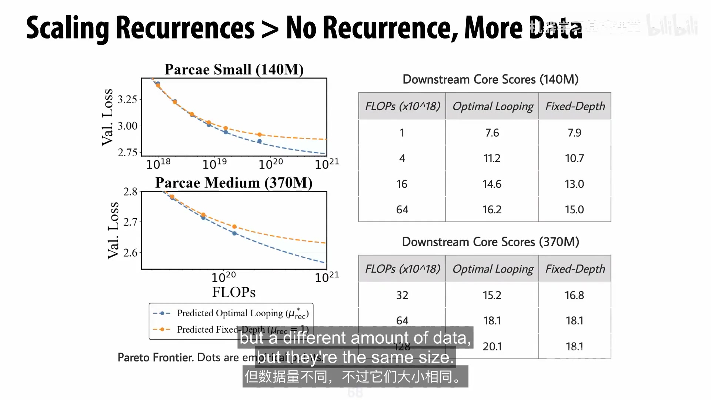

可以把全讲的因果链整理成：

1. 在线请求的 workload 与 SLA 决定 serving objective；
2. prefill/decode 的计算特征差异决定 batching、disaggregation 与硬件分工；
3. KV cache 让 inference engine 同时变成一个状态管理与存储系统；
4. 大规模部署把 fault tolerance 与极低概率 bug 提升为一等问题；
5. Megakernel 表明更深的 GPU 控制可以改变 decode 的执行范式；
6. Parcae 再进一步，把 serving 的 memory/communication 约束反馈到模型架构，用 recurrence 换取更高的 parameter efficiency；
7. 一旦引入 recurrence，训练稳定性又可以用 dynamical systems 的语言重新分析，并由 spectral radius 等结构化条件指导设计。

这也是 Dan Fu 开头所说“full-stack innovation”的具体含义：系统优化和模型算法并不是两条独立路线；理解底层执行约束，可能直接打开新的模型设计空间。

## 参考与 provenance

- CS336 Spring 2026 official course / Schedule: https://cs336.stanford.edu/
- Spring 2026 official lecture materials repository: https://github.com/stanford-cs336/lectures
- Stanford Online, *Stanford CS336 Language Modeling from Scratch | Spring 2026 | Guest Lecture: Dan Fu*: https://www.youtube.com/watch?v=9EEm4iMAF5s
- 本地视频来源说明：Bilibili 合集 `BV1msTD6CE6j`；本笔记使用本地 P18 视频及其 VTT 字幕生成。
- 本讲官方 Schedule 未提供独立 lecture-material 链接，因此 `papers/` 为空；未使用其他学期资料补写本讲内容。
